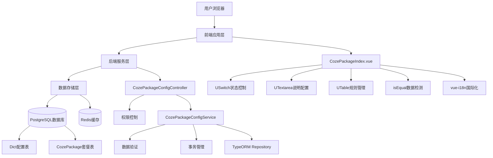
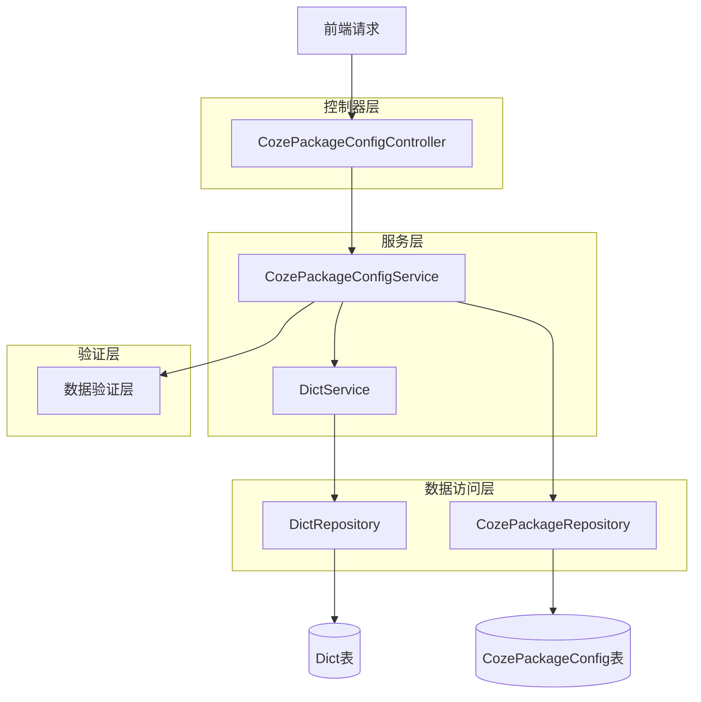
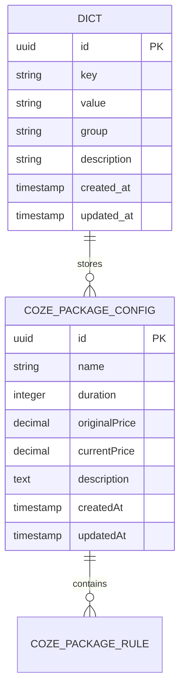

# BuildingAI Coze套餐管理技术架构文档

## 1. 架构设计



## 2. 技术栈描述

### 2.1 前端技术栈
- **核心框架**: Nuxt3 + Vue3 + TypeScript
- **UI组件库**: @nuxt/ui (USwitch, UTextarea, UTable, UInput, UButton)
- **图标库**: Heroicons (heroicons:plus, heroicons:trash)
- **样式框架**: Tailwind CSS
- **国际化**: vue-i18n (支持中文、英文、日文)
- **状态管理**: Vue3 Composition API (ref, reactive, computed, watch)
- **数据比较**: lodash.isEqual (用于检测数据变更)
- **构建工具**: Vite + Turbo
- **代码规范**: ESLint + Prettier

### 2.2 后端技术栈
- **核心框架**: NestJS + TypeScript
- **ORM框架**: TypeORM
- **数据验证**: class-validator + class-transformer
- **权限控制**: 自定义 @Permissions 装饰器
- **事务管理**: @Transactional 装饰器
- **数据库**: PostgreSQL
- **缓存系统**: Redis
- **构建工具**: Turbo + TypeScript Compiler

### 2.3 开发工具
- **包管理**: pnpm
- **代码格式**: Prettier
- **代码检查**: ESLint
- **类型检查**: TypeScript
- **构建系统**: Turbo (monorepo)

## 3. 路由定义

| 路由                          | 用途                      |
| --------------------------- | ----------------------- |
| /console/user/coze-package | Coze套餐管理页面，管理员配置Coze套餐功能和套餐规则 |

## 4. API定义

### 4.1 核心API

#### 获取Coze套餐配置

```
GET /api/console/coze-package-config
```

**权限要求**: `coze-package:getConfig`

**响应示例**:

```json
{
  "cozePackageStatus": true,
  "cozePackageExplain": "1.购买成功后不支持退款或反向兑换为人民币；\n2.套餐时长从购买成功时开始计算，到期后自动失效；",
  "cozePackageRule": [
    {
      "id": "uuid-1",
      "name": "Coze基础套餐",
      "duration": 30,
      "originalPrice": 99.00,
      "currentPrice": 79.00,
      "description": "适合个人用户的基础套餐"
    },
    {
      "id": "uuid-2", 
      "name": "Coze专业套餐",
      "duration": 90,
      "originalPrice": 299.00,
      "currentPrice": 199.00,
      "description": "适合专业用户的高级套餐"
    }
  ]
}
```

#### 保存Coze套餐配置

```
POST /api/console/coze-package-config
```

**权限要求**: `coze-package:setConfig`

**请求参数**:

| 参数名称               | 参数类型                  | 是否必填  | 描述           |
| ------------------ | --------------------- | ----- | ------------ |
| cozePackageStatus  | boolean               | true  | Coze套餐功能开启状态 |
| cozePackageExplain | string                | false | Coze套餐说明文案   |
| cozePackageRule    | CozePackageRuleDto\[] | true  | 套餐规则列表       |

**CozePackageRuleDto结构**:

| 参数名称          | 参数类型   | 是否必填  | 验证规则       | 描述              |
| ------------- | ------ | ----- | ---------- | --------------- |
| id            | string | false | UUID格式     | 套餐ID（新增时为空）    |
| name          | string | true  | 不能为空，最大100字符 | 套餐名称            |
| duration      | number | true  | 必须大于0      | 套餐时长（天）         |
| originalPrice | number | true  | 必须大于0      | 套餐原价（元）         |
| currentPrice  | number | true  | 必须大于0，不能大于原价 | 套餐现价（元）         |
| description   | string | false | 可选         | 套餐说明            |

**响应示例**:

```json
{
  "success": true,
  "message": "保存成功"
}
```

## 5. 服务架构图



## 6. 数据模型

### 6.1 数据模型定义



### 6.2 数据定义语言

#### Dict表（配置存储）

```sql
-- Coze套餐功能状态配置
INSERT INTO dict (key, value, "group", description) 
VALUES ('coze_package_status', 'true', 'coze_package_config', 'Coze套餐功能状态');

-- Coze套餐说明配置
INSERT INTO dict (key, value, "group", description) 
VALUES ('coze_package_explain', 'Coze套餐说明文案内容', 'coze_package_config', 'Coze套餐说明');
```

#### CozePackageConfig表（套餐规则）

```sql
-- 创建Coze套餐配置表
CREATE TABLE coze_package_config (
    id UUID PRIMARY KEY DEFAULT gen_random_uuid(),
    name VARCHAR(100) NOT NULL COMMENT '套餐名称',
    duration INTEGER NOT NULL COMMENT '套餐时长（天）', 
    "originalPrice" DECIMAL(10,2) NOT NULL COMMENT '套餐原价（元）',
    "currentPrice" DECIMAL(10,2) NOT NULL COMMENT '套餐现价（元）',
    description TEXT COMMENT '套餐说明',
    "createdAt" TIMESTAMP WITH TIME ZONE DEFAULT NOW(),
    "updatedAt" TIMESTAMP WITH TIME ZONE DEFAULT NOW(),
    
    -- 业务约束：现价不能大于原价
    CONSTRAINT chk_price_valid CHECK ("currentPrice" <= "originalPrice"),
    -- 业务约束：时长必须大于0
    CONSTRAINT chk_duration_positive CHECK (duration > 0),
    -- 业务约束：价格必须大于0
    CONSTRAINT chk_prices_positive CHECK ("originalPrice" > 0 AND "currentPrice" > 0)
);

-- 创建索引
CREATE INDEX idx_coze_package_config_name ON coze_package_config(name);
CREATE INDEX idx_coze_package_config_duration ON coze_package_config(duration);
CREATE INDEX idx_coze_package_config_price ON coze_package_config("currentPrice");

-- 初始化数据
INSERT INTO coze_package_config (name, duration, "originalPrice", "currentPrice", description) VALUES
('Coze基础套餐', 30, 99.00, 79.00, '适合个人用户的基础套餐，包含基础功能'),
('Coze专业套餐', 90, 299.00, 199.00, '适合专业用户的高级套餐，包含所有高级功能'),
('Coze企业套餐', 365, 999.00, 699.00, '适合企业用户的年度套餐，享受最优惠价格'),
('Coze体验套餐', 7, 29.00, 19.00, '新用户体验套餐，限时优惠价格');
```

## 7. 前端组件架构

### 7.1 组件层次结构

```
CozePackageIndex.vue (主页面)
├── StatusControl (功能状态控制)
├── ExplainConfig (套餐说明配置)
└── RuleManagement (套餐规则管理)
    ├── RuleTable (规则表格)
    ├── AddButton (新增按钮)
    └── SaveButton (保存按钮)
```

### 7.2 状态管理

```typescript
// 页面状态定义
interface PageState {
  cozePackageStatus: boolean;      // Coze套餐功能状态
  cozePackageExplain: string;      // Coze套餐说明
  cozePackageRules: CozePackageRule[]; // 套餐规则列表
  changeValue: boolean;            // 数据变更标识
  oldData: CozePackageConfigData;  // 原始数据
}

// Coze套餐规则接口
interface CozePackageRule {
  id?: string;
  name: string;
  duration: number;
  originalPrice: number;
  currentPrice: number;
  description?: string;
}

// 数据变更检测
const detectChanges = () => {
  const statusChanged = cozePackageStatus.value !== oldData.value?.cozePackageStatus;
  const explainChanged = cozePackageExplain.value !== oldData.value?.cozePackageExplain;
  const rulesChanged = !isEqual(cozePackageRules.value, oldData.value?.cozePackageRule);
  
  changeValue.value = statusChanged || explainChanged || rulesChanged;
};
```

### 7.3 数据验证

```typescript
// 前端验证规则
const validateRule = (rule: CozePackageRule, index: number) => {
  const errors: string[] = [];
  
  if (!rule.name?.trim()) {
    errors.push(`第${index + 1}行套餐名称不能为空`);
  }
  
  if (rule.name && rule.name.length > 100) {
    errors.push(`第${index + 1}行套餐名称不能超过100个字符`);
  }
  
  if (!rule.duration || rule.duration <= 0) {
    errors.push(`第${index + 1}行套餐时长必须大于0`);
  }
  
  if (!rule.originalPrice || rule.originalPrice <= 0) {
    errors.push(`第${index + 1}行套餐原价必须大于0`);
  }
  
  if (!rule.currentPrice || rule.currentPrice <= 0) {
    errors.push(`第${index + 1}行套餐现价必须大于0`);
  }
  
  if (rule.currentPrice > rule.originalPrice) {
    errors.push(`第${index + 1}行套餐现价不能大于原价`);
  }
  
  return errors;
};

// 价格格式化
const formatPrice = (price: number) => {
  return price.toFixed(2);
};

// 时长显示格式化
const formatDuration = (duration: number) => {
  return `${duration}天`;
};
```

## 8. 后端服务实现

### 8.1 控制器实现

```typescript
@ConsoleController("coze-package-config", "Coze套餐配置")
export class CozePackageConfigController extends BaseController {
    constructor(private readonly cozePackageConfigService: CozePackageConfigService) {
        super();
    }

    @Get()
    @Permissions({
        code: "getConfig",
        name: "获取Coze套餐配置",
        description: "获取Coze套餐配置",
    })
    async getConfig() {
        return await this.cozePackageConfigService.getConfig();
    }

    @Post()
    @Permissions({
        code: "setConfig", 
        name: "设置Coze套餐配置",
        description: "设置Coze套餐配置",
    })
    async setConfig(@Body() updateCozePackageConfigDto: UpdateCozePackageConfigDto) {
        return await this.cozePackageConfigService.setConfig(updateCozePackageConfigDto);
    }
}
```

### 8.2 服务层实现

```typescript
@Injectable()
export class CozePackageConfigService extends BaseService<CozePackageConfig> {
    constructor(
        @InjectRepository(CozePackageConfig)
        private readonly cozePackageRepository: Repository<CozePackageConfig>,
        private readonly dictService: DictService,
    ) {
        super(cozePackageRepository);
    }

    async getConfig(): Promise<CozePackageConfigResponseDto> {
        try {
            // 从字典服务获取配置状态和说明
            const cozePackageStatus = await this.dictService.get<boolean>(
                "coze_package_status",
                false,
                "coze_package_config",
            );

            const cozePackageExplain = await this.dictService.get<string>(
                "coze_package_explain",
                "",
                "coze_package_config",
            );

            // 获取套餐规则
            const packageRules = await this.cozePackageRepository.find({
                order: { createdAt: "ASC" },
            });

            const cozePackageRule: CozePackageRuleDto[] = packageRules.map((rule) => ({
                id: rule.id,
                name: rule.name,
                duration: rule.duration,
                originalPrice: Number(rule.originalPrice),
                currentPrice: Number(rule.currentPrice),
                description: rule.description,
            }));

            return {
                cozePackageStatus,
                cozePackageExplain,
                cozePackageRule,
            };
        } catch (error) {
            this.logger.error("获取Coze套餐配置失败", error);
            throw HttpExceptionFactory.internal("获取配置失败");
        }
    }

    async setConfig(dto: UpdateCozePackageConfigDto): Promise<void> {
        await this.entityManager.transaction(async (manager) => {
            try {
                // 验证套餐规则
                if (dto.cozePackageRule && dto.cozePackageRule.length > 0) {
                    this.validatePackageRules(dto.cozePackageRule);
                }

                // 更新字典配置
                await this.dictService.set(
                    "coze_package_status",
                    dto.cozePackageStatus,
                    "coze_package_config",
                );

                await this.dictService.set(
                    "coze_package_explain",
                    dto.cozePackageExplain,
                    "coze_package_config",
                );

                // 更新套餐规则
                await this.updatePackageRules(dto.cozePackageRule, manager);

                this.logger.log("Coze套餐配置更新成功");
            } catch (error) {
                this.logger.error("更新Coze套餐配置失败", error);
                throw error;
            }
        });
    }

    /**
     * 验证套餐规则
     */
    private validatePackageRules(rules: CozePackageRuleDto[]): void {
        const nameSet = new Set<string>();
        
        for (const rule of rules) {
            // 检查套餐名称是否重复
            if (nameSet.has(rule.name)) {
                throw HttpExceptionFactory.badRequest(`套餐名称"${rule.name}"重复`);
            }
            nameSet.add(rule.name);

            // 检查价格关系
            if (rule.currentPrice > rule.originalPrice) {
                throw HttpExceptionFactory.badRequest(
                    `套餐"${rule.name}"的现价不能大于原价`
                );
            }

            // 检查时长
            if (rule.duration <= 0) {
                throw HttpExceptionFactory.badRequest(
                    `套餐"${rule.name}"的时长必须大于0`
                );
            }
        }
    }

    /**
     * 批量更新套餐规则
     */
    private async updatePackageRules(
        rules: CozePackageRuleDto[],
        manager: EntityManager,
    ): Promise<void> {
        const repository = manager.getRepository(CozePackageConfig);

        // 删除现有规则
        await repository.delete({});

        if (rules && rules.length > 0) {
            // 创建新规则
            const entities = rules.map((rule) =>
                repository.create({
                    id: rule.id,
                    name: rule.name,
                    duration: rule.duration,
                    originalPrice: rule.originalPrice,
                    currentPrice: rule.currentPrice,
                    description: rule.description,
                })
            );

            // 批量保存
            await repository.save(entities);
        }
    }
}
```

### 8.3 数据传输对象

```typescript
export class UpdateCozePackageConfigDto {
    @IsBoolean({ message: "Coze套餐状态必须是布尔值" })
    cozePackageStatus: boolean;

    @IsOptional()
    @IsString({ message: "Coze套餐说明必须是字符串" })
    cozePackageExplain?: string;

    @IsArray({ message: "Coze套餐规则必须是数组格式" })
    @ValidateNested({ each: true })
    @Type(() => CozePackageRuleDto)
    cozePackageRule: CozePackageRuleDto[];
}

export class CozePackageRuleDto {
    @IsOptional()
    @IsUUID()
    id?: string;
    
    @IsString({ message: "套餐名称必须是字符串" })
    @IsNotEmpty({ message: "套餐名称不能为空" })
    @MaxLength(100, { message: "套餐名称不能超过100个字符" })
    name: string;
    
    @IsNumber({}, { message: "套餐时长必须是数字" })
    @Min(1, { message: "套餐时长必须大于0" })
    @IsInt({ message: "套餐时长必须是整数" })
    duration: number;
    
    @IsNumber({}, { message: "套餐原价必须是数字" })
    @Min(0.01, { message: "套餐原价必须大于0" })
    originalPrice: number;
    
    @IsNumber({}, { message: "套餐现价必须是数字" })
    @Min(0.01, { message: "套餐现价必须大于0" })
    currentPrice: number;
    
    @IsOptional()
    @IsString({ message: "套餐说明必须是字符串" })
    description?: string;

    // 自定义验证：现价不能大于原价
    @ValidateIf(o => o.currentPrice && o.originalPrice)
    @IsTrue({ message: "套餐现价不能大于原价" })
    get isPriceValid(): boolean {
        return this.currentPrice <= this.originalPrice;
    }
}
```

### 8.4 实体定义

```typescript
@AppEntity({ name: "coze_package_config", comment: "Coze套餐配置" })
export class CozePackageConfig {
    @PrimaryGeneratedColumn('uuid')
    id: string;

    @Column({ type: 'varchar', length: 100, comment: '套餐名称' })
    name: string;

    @Column({ type: 'integer', comment: '套餐时长（天）' })
    duration: number;

    @Column({ type: 'decimal', precision: 10, scale: 2, comment: '原价' })
    originalPrice: number;

    @Column({ type: 'decimal', precision: 10, scale: 2, comment: '现价' })
    currentPrice: number;

    @Column({ type: 'text', nullable: true, comment: '套餐说明' })
    description?: string;

    @CreateDateColumn({ type: 'timestamp with time zone', comment: '创建时间' })
    createdAt: Date;

    @UpdateDateColumn({ type: 'timestamp with time zone', comment: '更新时间' })
    updatedAt: Date;
}
```

## 9. 安全考虑

### 9.1 权限控制

* 基于角色的访问控制（RBAC）
* API级别的权限验证：`coze-package:getConfig` 和 `coze-package:setConfig`
* 前端路由守卫和组件级权限控制

### 9.2 数据验证

* 前后端双重验证
* 业务逻辑验证：现价不能大于原价
* 数据类型和范围验证
* SQL注入防护
* XSS攻击防护

### 9.3 操作审计

* 配置变更日志记录
* 用户操作追踪
* 异常操作告警
* 价格变更敏感操作监控

## 10. 性能优化

### 10.1 前端优化

* 组件懒加载
* 数据变更检测优化（使用lodash.isEqual）
* 防抖处理用户输入
* 表格虚拟滚动（大量数据时）

### 10.2 后端优化

* 数据库查询优化
* Redis缓存策略
* 事务处理优化
* 批量操作优化

### 10.3 数据库优化

* 合理的索引设计（name, duration, current_price）
* 查询语句优化
* 连接池配置
* 数据库约束优化（CHECK约束确保数据完整性）

### 10.4 业务优化

* 价格计算缓存
* 套餐规则缓存
* 配置变更通知机制
* 定时任务清理过期数据

## 11. 部署考虑

### 11.1 环境配置

* 数据库迁移脚本
* 初始化数据脚本
* 权限配置脚本
* 菜单配置更新

### 11.2 监控告警

* 套餐配置变更监控
* 价格异常监控
* 系统性能监控
* 用户操作异常监控

### 11.3 备份恢复

* 配置数据备份策略
* 套餐规则备份
* 灾难恢复方案
* 数据一致性检查

## 12. 国际化支持

### 12.1 国际化架构

Coze套餐管理功能支持完整的多语言国际化，基于 `@nuxtjs/i18n` 实现，支持中文、英文、日文三种语言。

### 12.2 国际化文件结构

国际化文件分为两类：菜单文件和页面内容文件，按语言和功能模块组织：

```
apps/web/core/i18n/
├── zh/                          # 中文
│   ├── console-menu.json        # 菜单国际化
│   └── console-marketing.json   # 页面内容国际化
├── en/                          # 英文
│   ├── console-menu.json        # 菜单国际化
│   └── console-marketing.json   # 页面内容国际化
└── jp/                          # 日文
    ├── console-menu.json        # 菜单国际化
    └── console-marketing.json   # 页面内容国际化
```

### 12.3 菜单国际化配置

菜单国际化文件 `console-menu.json` 中的Coze套餐配置：

```json
{
  "cozePackage": {
    "zh": "Coze套餐",
    "en": "Coze Package",
    "jp": "Cozeパッケージ"
  }
}
```

### 12.4 页面内容国际化配置

页面内容国际化文件 `console-marketing.json` 包含67行完整配置：

```json
{
  "cozePackage": {
    "title": "Coze套餐管理",
    "subtitle": "配置和管理Coze套餐规则",
    "status": {
      "label": "功能状态",
      "enabled": "启用",
      "disabled": "禁用",
      "description": "控制Coze套餐功能的开启状态"
    },
    "explain": {
      "label": "套餐说明",
      "placeholder": "请输入套餐说明文本",
      "description": "向用户展示的套餐介绍信息"
    },
    "rules": {
      "title": "套餐规则",
      "add": "添加套餐",
      "edit": "编辑套餐",
      "delete": "删除套餐",
      "name": {
        "label": "套餐名称",
        "placeholder": "请输入套餐名称",
        "required": "套餐名称不能为空",
        "maxLength": "套餐名称不能超过100个字符",
        "duplicate": "套餐名称已存在"
      },
      "duration": {
        "label": "套餐时长",
        "placeholder": "请输入套餐时长",
        "unit": "天",
        "required": "套餐时长不能为空",
        "min": "套餐时长必须大于0",
        "invalid": "请输入有效的套餐时长"
      },
      "originalPrice": {
        "label": "原价",
        "placeholder": "请输入原价",
        "unit": "元",
        "required": "原价不能为空",
        "min": "原价必须大于0",
        "invalid": "请输入有效的原价"
      },
      "currentPrice": {
        "label": "现价",
        "placeholder": "请输入现价",
        "unit": "元",
        "required": "现价不能为空",
        "min": "现价必须大于0",
        "invalid": "请输入有效的现价",
        "maxOriginal": "现价不能大于原价"
      },
      "description": {
        "label": "套餐说明",
        "placeholder": "请输入套餐说明",
        "maxLength": "套餐说明不能超过500个字符"
      }
    },
    "actions": {
      "save": "保存",
      "cancel": "取消",
      "confirm": "确认",
      "reset": "重置"
    },
    "messages": {
      "saveSuccess": "保存成功",
      "saveFailed": "保存失败",
      "deleteConfirm": "确定要删除这个套餐吗？",
      "deleteSuccess": "删除成功",
      "deleteFailed": "删除失败",
      "dataChanged": "数据已修改，是否保存？",
      "validationFailed": "数据验证失败，请检查输入",
      "networkError": "网络错误，请稍后重试"
    }
  }
}
```

### 12.5 国际化实现技术

#### 12.5.1 前端国际化

```typescript
// 组件中使用国际化
const { t } = useI18n();

// 获取翻译文本
const title = t('cozePackage.title');
const saveButton = t('cozePackage.actions.save');

// 动态翻译（带参数）
const errorMessage = t('cozePackage.rules.name.duplicate', { name: packageName });
```

#### 12.5.2 验证消息国际化

```typescript
// 表单验证规则中的国际化
const validationRules = {
  name: [
    {
      required: true,
      message: t('cozePackage.rules.name.required'),
      trigger: 'blur'
    },
    {
      max: 100,
      message: t('cozePackage.rules.name.maxLength'),
      trigger: 'blur'
    }
  ]
};
```

#### 12.5.3 API错误消息国际化

```typescript
// API服务中的错误处理
try {
  await cozePackageService.saveConfig(data);
  ElMessage.success(t('cozePackage.messages.saveSuccess'));
} catch (error) {
  ElMessage.error(t('cozePackage.messages.saveFailed'));
}
```

### 12.6 国际化特点

1. **完整性**：覆盖所有用户界面文本，包括标签、按钮、提示信息、错误消息
2. **一致性**：统一的翻译术语和风格，确保用户体验一致
3. **可维护性**：结构化的文件组织，便于翻译更新和维护
4. **动态切换**：支持运行时语言切换，无需刷新页面
5. **类型安全**：TypeScript类型定义确保翻译键的正确性

### 12.7 国际化最佳实践

1. **翻译键命名**：使用层级结构，语义清晰
2. **文本复用**：通用文本提取到公共区域
3. **参数化翻译**：支持动态内容插值
4. **文化适配**：考虑不同语言的文化差异
5. **测试覆盖**：确保所有语言版本的功能正常