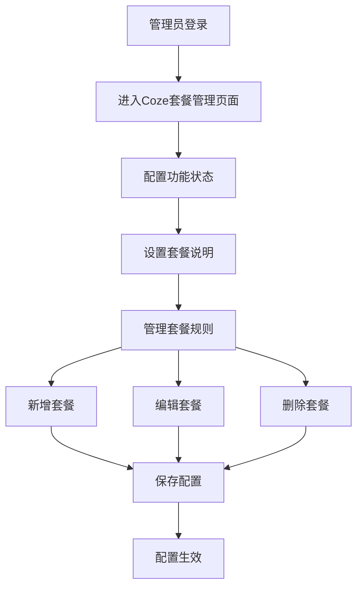

# BuildingAI Coze套餐管理页面PRD

## 1. 产品概述

BuildingAI Coze套餐管理页面是面向平台管理员的后台管理功能，基于Vue3 + Nuxt3 + TypeScript技术栈开发，使用@nuxt/ui组件库构建现代化管理界面。该页面用于配置和管理用户Coze套餐的相关参数，通过Dict字典表和CozePackageConfig实体表实现数据存储，支持中文、英文、日文多语言环境。

管理员可以通过该页面控制Coze套餐功能的开启状态、设置套餐说明文案，以及管理不同Coze套餐的名称、时长、原价、现价和说明等核心参数。系统采用NestJS + TypeORM后端架构，提供完整的权限控制和数据验证机制。

该功能旨在为平台提供灵活的Coze套餐配置能力，支持根据业务需求动态调整套餐规则，通过事务性操作确保数据一致性，提升用户购买体验和平台运营效率。

## 2. 核心功能

### 2.1 用户角色
| 角色 | 权限代码 | 权限说明 | 核心权限 |
|------|----------|----------|----------|
| 系统管理员 | coze-package:getConfig | 查看Coze套餐配置权限 | 获取套餐配置、查看套餐规则 |
| 系统管理员 | coze-package:setConfig | 设置Coze套餐配置权限 | 保存配置、新增套餐、编辑套餐、删除套餐 |

### 2.2 功能模块
Coze套餐管理页面包含以下核心模块：
1. **功能状态控制**：基于Dict字典表的Coze套餐功能全局开关控制
2. **套餐说明配置**：基于Dict字典表的Coze套餐相关用户说明文案设置
3. **套餐规则管理**：基于CozePackageConfig数据表的Coze套餐增删改查操作
4. **数据变更检测**：实时监控配置变更状态，智能启用保存按钮
5. **事务安全保障**：使用数据库事务确保配置保存的原子性

### 2.3 页面详情

| 页面名称 | 模块名称 | 功能描述 |
|----------|----------|----------|
| Coze套餐管理页面 | 功能状态控制 | 使用USwitch组件控制Coze套餐功能启用状态，数据存储在Dict表(key: coze_package_status, group: coze_package_config) |
| Coze套餐管理页面 | 套餐说明配置 | 使用UTextarea组件设置套餐说明文案，支持6行多行文本输入，数据存储在Dict表(key: coze_package_explain, group: coze_package_config) |
| Coze套餐管理页面 | 套餐规则表格 | 使用UTable组件展示套餐规则，包含序号、套餐名称、套餐时长(天)、套餐原价(元)、套餐现价(元)、套餐说明、操作列，数据存储在coze_package_config表 |
| Coze套餐管理页面 | 套餐新增功能 | 点击"新增套餐"按钮添加新规则，使用Tabler图标库的plus图标，支持实时编辑 |
| Coze套餐管理页面 | 套餐编辑功能 | 表格内嵌UInput组件直接编辑，支持数字类型验证和小数点后2位价格设置 |
| Coze套餐管理页面 | 套餐删除功能 | 使用trash图标的删除按钮，支持实时移除套餐规则 |
| Coze套餐管理页面 | 智能保存功能 | 实时检测数据变更(watch监听)，变更时启用保存按钮，支持事务性批量保存 |

## 3. 核心流程

管理员操作流程：
1. 管理员登录后台系统
2. 进入Coze套餐管理页面
3. 根据需要开启/关闭Coze套餐功能
4. 设置套餐说明文案
5. 配置套餐规则（新增、编辑、删除）
6. 保存配置
7. 用户端即可看到更新后的Coze套餐选项



## 4. 用户界面设计

### 4.1 设计风格
- **主色调**：蓝色系（primary color）作为主色，灰色系作为辅助色
- **按钮样式**：圆角按钮，主要操作使用实心按钮（color="primary"），次要操作使用轮廓按钮（variant="outline"）
- **字体**：系统默认字体，标题使用font-bold，正文使用常规字重
- **设计风格**：基于@nuxt/ui组件库的现代化设计，使用flex布局和gap间距
- **图标风格**：使用Heroicons图标库（heroicons:plus、heroicons:trash），简洁线性风格，通过Icon组件渲染
- **组件库**：基于@nuxt/ui统一组件库，确保设计一致性

### 4.2 页面设计概览

| 页面名称 | 模块名称 | UI元素 |
|----------|----------|--------|
| Coze套餐管理页面 | 功能状态控制 | USwitch组件，标题"功能状态"(text-md font-bold)，描述文字"启用后用户可以访问Coze套餐功能"(text-xs text-muted-foreground) |
| Coze套餐管理页面 | 套餐说明配置 | UTextarea组件(6行)，标题"套餐说明"，占位符"请输入Coze套餐说明..."，仅在套餐状态开启时显示 |
| Coze套餐管理页面 | 套餐规则管理 | UTable组件，固定表格布局(table-fixed)，包含序号、套餐名称、套餐时长(带"天"后缀)、套餐原价(带"元"后缀)、套餐现价(带"元"后缀)、套餐说明、操作列 |
| Coze套餐管理页面 | 表格内编辑 | UInput组件，支持type="number"，价格支持min="0" step="0.01"，时长支持min="1"，实时双向绑定，使用TableColumn类型定义 |
| Coze套餐管理页面 | 操作按钮区 | 新增按钮（蓝色轮廓，heroicons:plus图标）、保存按钮（蓝色实心，智能启用/禁用状态）、删除按钮（红色，heroicons:trash图标） |

### 4.3 响应式设计
- 桌面优先设计，基于Tailwind CSS响应式类
- 表格使用border-separate border-spacing-0样式，支持横向滚动
- 按钮使用固定宽度(w-16)和居中对齐，移动端友好
- 使用AccessControl组件进行权限控制显示
- 页面布局使用flex和gap-4间距，确保各组件间距一致
- 表格列宽使用固定布局(table-fixed)，确保内容对齐

## 5. 功能需求

### 5.1 功能状态管理
- **需求描述**：管理员可以通过USwitch组件控制Coze套餐功能的全局启用状态
- **技术实现**：
  - 数据存储：Dict表，key="coze_package_status"，group="coze_package_config"
  - 组件绑定：v-model="cozePackageStatus"，支持双向数据绑定
  - 状态监听：watch监听状态变更，实时更新changeValue标识
- **业务规则**：
  - 关闭状态下，用户端Coze套餐功能不可访问，隐藏套餐说明配置区域
  - 开启状态下，显示套餐说明配置和套餐规则管理
- **验证规则**：@IsBoolean装饰器验证，状态变更需要保存后生效

### 5.2 套餐说明配置
- **需求描述**：设置向用户展示的Coze套餐说明文案
- **技术实现**：
  - 数据存储：Dict表，key="coze_package_explain"，group="coze_package_config"
  - 组件实现：UTextarea组件，rows="6"，支持多行文本输入
  - 条件渲染：v-if="cozePackageStatus"，仅在套餐功能开启时显示
- **业务规则**：
  - 支持多行文本输入，占位符"请输入Coze套餐说明..."
  - 文案内容在用户套餐购买页面展示
  - 可以为空，但建议填写完整的套餐规则说明
- **验证规则**：@IsOptional + @IsString装饰器验证

### 5.3 套餐规则管理
- **需求描述**：管理Coze套餐的各项参数
- **技术实现**：
  - 数据存储：CozePackageConfig表，包含id、name、duration、originalPrice、currentPrice、description、createdAt、updatedAt字段
  - 组件实现：UTable + UInput组件，支持表格内直接编辑
  - 数据类型：id(uuid主键)、name(varchar 100)、duration(integer)、originalPrice(decimal 10,2)、currentPrice(decimal 10,2)、description(text)、createdAt(timestamp)、updatedAt(timestamp)
- **业务规则**：
  - 套餐名称(name)：不能为空，最大长度100字符，自动trim处理，同一配置中不能重复
  - 套餐时长(duration)：必须大于0的整数，单位为天
  - 套餐原价(originalPrice)：必须大于0的数值，支持小数点后2位，带"元"单位显示
  - 套餐现价(currentPrice)：必须大于0的数值，支持小数点后2位，带"元"单位显示，不能大于原价
  - 套餐说明(description)：可选，支持多行文本
  - 套餐ID(id)：UUID格式，新增时由系统自动生成
- **验证规则**：
  - 前端：type="number"、min="0"、step="0.01"验证，实时输入验证
  - 后端：CozePackageRuleDto数据传输对象验证，包含业务逻辑验证
  - 业务验证：validatePackageRules方法验证名称重复、价格逻辑、数值范围
  - 实时数据变更检测：deep watch监听数组变化，智能启用保存按钮

### 5.4 数据持久化
- **需求描述**：配置数据的保存和加载
- **技术实现**：
  - 变更检测：watch监听cozePackageStatus、cozePackageExplain、cozePackageRules三个数据源
  - 保存逻辑：使用数据库事务(entityManager.transaction)确保原子性操作
  - 成功提示：使用useMessage().success()显示保存成功消息
  - 错误处理：事务失败时自动回滚，显示具体错误信息
- **业务规则**：
  - 智能检测数据变更，变更时启用保存按钮(:disabled="!changeValue")
  - 保存成功后显示成功提示，重新获取最新配置
  - 页面加载时自动获取当前配置(onMounted)
  - 支持批量操作：updatePackageRules方法处理增删改操作
- **验证规则**：
  - 保存前进行完整的数据验证，包含数值范围和必填项检查
  - 支持批量操作：新增、更新、删除套餐规则的事务性处理
  - 业务逻辑验证：validatePackageRules确保数据一致性和业务规则

## 6. API设计

### 6.1 获取Coze套餐配置
```
GET /api/console/coze-package-config
```

**权限要求**：@Permissions('coze-package:getConfig')
**技术实现**：
- 查询Dict表获取coze_package_status和coze_package_explain
- 查询CozePackageConfig表获取所有套餐规则，按createdAt排序
- 数据转换：Dict.value转换为对应类型，UUID字段处理

**响应数据**：
```json
{
  "cozePackageStatus": true,
  "cozePackageExplain": "Coze套餐说明文案",
  "cozePackageRule": [
    {
      "id": "550e8400-e29b-41d4-a716-446655440000",
      "name": "基础套餐",
      "duration": 30,
      "originalPrice": 99.00,
      "currentPrice": 79.00,
      "description": "适合个人用户的基础套餐"
    }
  ]
}
```

### 6.2 保存Coze套餐配置
```
POST /api/console/coze-package-config
```

**权限要求**：@Permissions('coze-package:setConfig')
**技术实现**：
- 使用UpdateCozePackageConfigDto进行数据验证
- 数据库事务操作：先更新Dict表，再批量处理CozePackageConfig表
- 支持新增、更新、删除套餐规则的原子性操作
- 包含套餐名称重复验证、价格逻辑验证等业务规则检查

**请求参数**：
```json
{
  "cozePackageStatus": true,
  "cozePackageExplain": "Coze套餐说明文案",
  "cozePackageRule": [
    {
      "id": "550e8400-e29b-41d4-a716-446655440000",
      "name": "基础套餐",
      "duration": 30,
      "originalPrice": 99.00,
      "currentPrice": 79.00,
      "description": "适合个人用户的基础套餐"
    }
  ]
}
```

**UpdateCozePackageConfigDto验证规则**：
| 字段名 | 类型 | 验证规则 | 说明 |
|--------|------|----------|------|
| cozePackageStatus | boolean | @IsBoolean | Coze套餐功能开关状态 |
| cozePackageExplain | string | @IsOptional @IsString | 套餐说明，可选 |
| cozePackageRule | CozePackageRuleDto[] | @IsArray @ValidateNested | 套餐规则数组 |

**CozePackageRuleDto验证规则**：
| 字段名 | 类型 | 验证规则 | 说明 |
|--------|------|----------|------|
| id | string | @IsOptional @IsUUID | 套餐ID，UUID格式，新增时不传 |
| name | string | @IsString @IsNotEmpty @MaxLength(100) | 套餐名称，不能为空，最大100字符，自动trim处理 |
| duration | number | @IsNumber @Min(1) | 套餐时长，必须大于0的整数，单位天 |
| originalPrice | number | @IsNumber @Min(0.01) | 套餐原价，必须大于0，支持2位小数 |
| currentPrice | number | @IsNumber @Min(0.01) | 套餐现价，必须大于0，支持2位小数，不能大于原价 |
| description | string | @IsOptional @IsString | 套餐说明，可选 |

## 7. 国际化支持

### 7.1 支持语言
Coze套餐管理页面支持以下三种语言：
- **中文(zh)**：简体中文，默认语言
- **英文(en)**：英语
- **日文(jp)**：日语

### 7.2 国际化文件结构
国际化文件分为两类：菜单文件和页面内容文件

#### 7.2.1 菜单国际化文件
| 语言 | 文件路径 | 主要内容 |
|------|----------|----------|
| 中文 | `locales/zh/console-menu.json` | `"cozePackage": "Coze套餐"` |
| 英文 | `locales/en/console-menu.json` | `"cozePackage": "Coze Package"` |
| 日文 | `locales/jp/console-menu.json` | `"cozePackage": "Cozeパッケージ"` |

#### 7.2.2 页面内容国际化文件
每种语言的页面内容文件包含67行配置，涵盖以下8个主要部分：

| 语言 | 文件路径 | 配置行数 | 主要内容 |
|------|----------|----------|----------|
| 中文 | `locales/zh/console-coze-package.json` | 67行 | 功能状态、套餐说明、规则管理、表格、按钮、消息、确认、验证 |
| 英文 | `locales/en/console-coze-package.json` | 67行 | 功能状态、套餐说明、规则管理、表格、按钮、消息、确认、验证 |
| 日文 | `locales/jp/console-coze-package.json` | 67行 | 功能状态、套餐说明、规则管理、表格、按钮、消息、确认、验证 |

### 7.3 国际化实现技术
- **框架**：基于vue-i18n实现多语言切换
- **使用方式**：通过`$t('key')`函数获取对应语言的文本
- **动态切换**：支持运行时语言切换，无需刷新页面
- **回退机制**：当某个语言缺少翻译时，自动回退到中文

### 7.4 国际化特点
1. **完整性**：所有用户界面文本都有对应的翻译
2. **一致性**：相同功能在不同语言中保持一致的表达
3. **扩展性**：易于添加新语言支持
4. **动态切换**：支持实时语言切换功能

## 8. 验收标准

### 8.1 功能验收
- [ ] Coze套餐状态开关(USwitch)正常工作，能够控制功能模块显示/隐藏
- [ ] 套餐说明配置(UTextarea)保存和显示正确，支持多行文本
- [ ] 套餐规则的增删改查功能完整，支持表格内直接编辑
- [ ] 数据验证规则生效：name非空、duration>0、originalPrice>0、currentPrice>0且≤originalPrice
- [ ] 保存功能正常，数据持久化成功，支持事务回滚
- [ ] 实时变更检测正常，changeValue状态准确反映数据变化
- [ ] 权限控制：getConfig和setConfig权限验证有效

### 8.2 界面验收
- [ ] 页面布局符合@nuxt/ui设计规范
- [ ] USwitch、UTextarea、UTable、UInput组件样式一致
- [ ] 响应式设计在不同设备上正常显示，使用Tailwind CSS
- [ ] 交互反馈及时：保存按钮状态、成功提示、加载状态
- [ ] 多语言显示正确：中文、英文、日文通过vue-i18n切换
- [ ] Heroicons图标显示正确：heroicons:plus、heroicons:trash等

### 8.3 权限验收
- [ ] 只有具备coze-package:getConfig权限的用户可以查看配置
- [ ] 只有具备coze-package:setConfig权限的用户可以修改配置
- [ ] AccessControl组件正确控制按钮和操作的显示
- [ ] 权限控制粒度正确，功能隔离有效

### 8.4 性能验收
- [ ] 页面加载时间在可接受范围内(<2秒)
- [ ] 数据保存响应及时(<1秒)，使用数据库事务确保一致性
- [ ] 大量套餐规则时性能稳定(>100条记录)
- [ ] 实时数据监听不影响页面性能

### 8.5 兼容性验收
- [ ] 主流浏览器兼容性良好(Chrome、Firefox、Safari、Edge)
- [ ] 移动端适配正确，触摸操作友好
- [ ] 不同分辨率下显示正常(1920x1080、1366x768、移动端)
- [ ] Vue3 + Nuxt3 + TypeScript技术栈稳定运行

### 8.6 数据验证验收
- [ ] 前端验证：input type="number"、min、step属性生效
- [ ] 后端验证：UpdateCozePackageConfigDto和CozePackageRuleDto验证规则生效
- [ ] 数据类型验证：uuid、varchar(100)、integer、decimal(10,2)、text约束有效
- [ ] 边界值测试：最小值、最大值、空值、特殊字符处理正确
- [ ] 价格逻辑验证：现价不能大于原价的业务规则验证有效
- [ ] 套餐名称重复验证：同一配置中套餐名称不能重复

### 8.7 国际化验收
- [ ] 中文、英文、日文三种语言完整支持
- [ ] 菜单国际化文件正确配置cozePackage翻译
- [ ] 页面内容国际化文件包含67行完整配置
- [ ] vue-i18n框架正常工作，$t()函数正确获取翻译
- [ ] 语言切换功能正常，无需刷新页面
- [ ] 翻译回退机制正常，缺失翻译时回退到中文