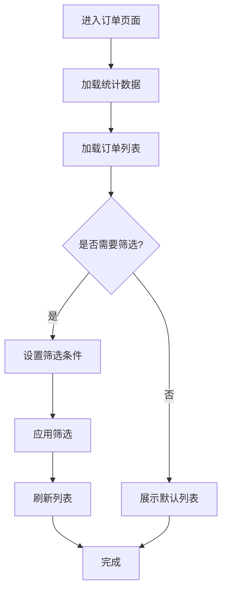
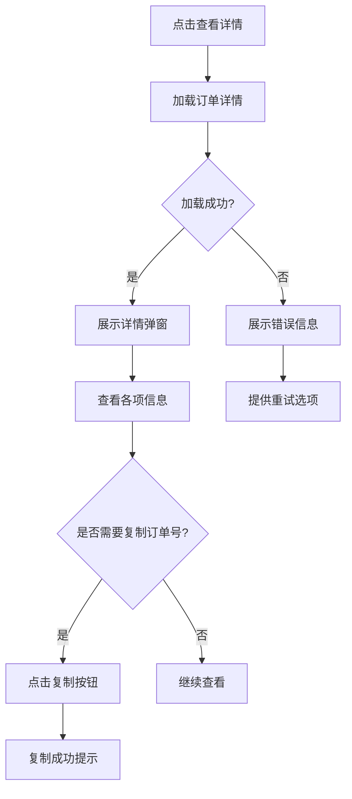
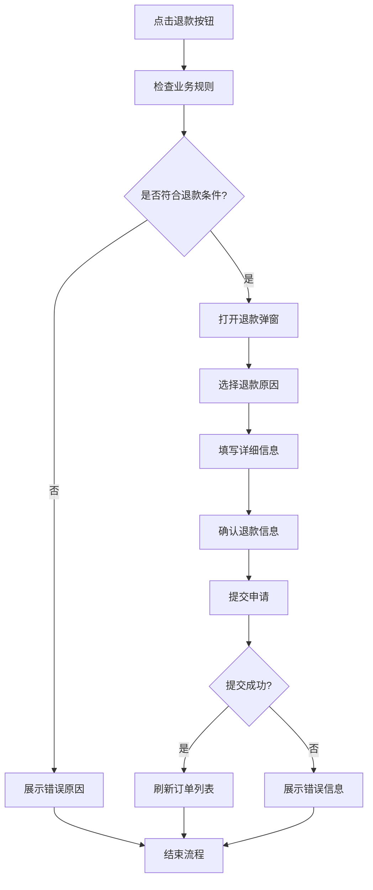
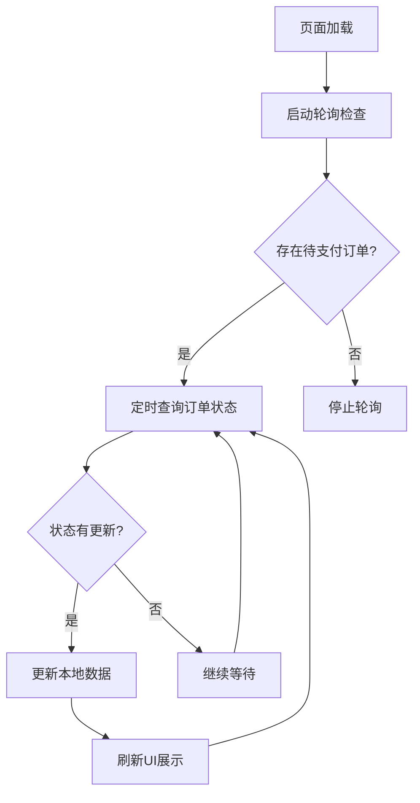

## 1. 产品概述

Coze套餐订单页面是BuildingAI平台中用于管理Coze套餐订单的核心功能模块，为管理员提供订单查询、详情查看、退款处理等完整的订单管理能力。该页面支持多维度筛选、实时数据统计、订单状态轮询等功能，确保管理员能够高效处理订单相关业务。

主要解决的问题：
- 提供直观的订单数据展示和统计分析
- 支持复杂的订单查询和筛选需求
- 实现订单详情查看和退款申请处理
- 确保订单状态实时更新和同步

目标用户：平台管理员、财务人员、客服人员

## 2. 核心功能

### 2.1 用户角色

| 角色 | 权限范围 | 核心功能 |
|------|----------|----------|
| 超级管理员 | 全部权限 | 查看所有订单、处理退款、导出数据 |
| 财务人员 | 订单查看、退款处理 | 查看订单详情、处理退款申请 |
| 客服人员 | 订单查看 | 查看订单列表、查看订单详情 |

### 2.2 功能模块

**数据统计概览**
- 订单总数统计卡片
- 订单总金额统计卡片  
- 退款订单数统计卡片
- 退款总金额统计卡片
- 净收入统计卡片

**订单列表管理**
- 订单列表展示（订单号、用户信息、套餐信息、金额、状态等）
- 表格列排序功能（支持交替排序）
- 分页导航控制
- 操作菜单（查看详情、申请退款）

**高级搜索筛选**
- 关键词搜索（订单号、用户ID、昵称、手机号）
- 日期范围筛选
- 支付方式筛选（微信支付、支付宝支付）
- 支付状态筛选（已支付、未支付）
- 退款状态筛选（已退款、未退款）
- 套餐名称筛选
- 订单金额范围筛选

**订单详情查看**
- 基本信息展示（订单号、金额、状态等）
- 用户信息展示（用户名、邮箱、用户ID）
- 套餐信息展示（套餐名称、时长、价格）
- 支付信息展示（支付方式、交易流水号、时间等）
- 订单号一键复制功能

**退款申请处理**
- 退款原因选择（用户主动申请、服务质量问题、技术故障等）
- 自定义退款原因输入
- 退款金额确认
- 业务规则验证（支付状态、退款状态、时间限制等）
- 退款条款确认

### 2.3 页面详情

| 页面名称 | 模块名称 | 功能描述 |
|----------|----------|----------|
| 主页面 | 统计卡片 | 展示订单总数、总金额、退款订单数、退款总金额、净收入等关键指标 |
| 主页面 | 搜索筛选 | 提供关键词搜索、日期筛选、支付方式筛选、状态筛选等多维度筛选功能 |
| 主页面 | 订单列表 | 展示订单列表，支持排序、分页、操作菜单等功能 |
| 主页面 | 快捷筛选 | 提供今日订单、本周订单、本月订单、已支付订单、已退款订单等快捷筛选 |
| 详情弹窗 | 基本信息 | 展示订单编号、金额、支付状态、退款状态等基本信息 |
| 详情弹窗 | 用户信息 | 展示用户名、邮箱、用户ID等信息 |
| 详情弹窗 | 套餐信息 | 展示套餐名称、时长、价格等套餐详情 |
| 详情弹窗 | 支付信息 | 展示支付方式、交易流水号、支付时间等支付相关信息 |
| 退款弹窗 | 退款原因 | 提供标准化的退款原因选择和自定义原因输入 |
| 退款弹窗 | 业务验证 | 验证订单是否符合退款条件（支付状态、退款状态、时间限制等） |
| 退款弹窗 | 确认提交 | 确认退款信息并提交申请 |

## 3. 核心流程

### 3.1 订单查询流程



### 3.2 订单详情查看流程



### 3.3 退款申请流程



### 3.4 状态轮询流程



## 4. 用户界面设计

### 4.1 设计规范

**色彩方案**
- 主色调：蓝色系（#3B82F6）用于主要操作和品牌标识
- 成功色：绿色系（#10B981）用于支付成功、完成状态
- 警告色：橙色系（#F59E0B）用于待支付、处理中状态
- 错误色：红色系（#EF4444）用于退款、错误状态
- 中性色：灰色系用于文字、边框、背景

**字体规范**
- 主要字体：系统默认字体栈
- 标题：16px-20px，font-weight: 600
- 正文：14px，font-weight: 400
- 小字：12px，font-weight: 400

**组件样式**
- 按钮：圆角设计，hover效果，禁用状态明确
- 卡片：轻微阴影，圆角边框，清晰的分隔线
- 表格：斑马纹背景，hover高亮，排序图标清晰
- 弹窗：模态设计，遮罩层，合理的尺寸适配

**图标风格**
- 使用Lucide图标库，保持风格统一
- 状态图标：明确的颜色和形状区分
- 操作图标：简洁明了，符合用户认知

### 4.2 页面布局

**主页面布局**
- 顶部：页面标题和描述
- 上部：统计卡片区域（5个卡片网格布局）
- 中部：搜索筛选区域（可展开折叠）
- 下部：订单列表表格（全宽布局）

**详情弹窗布局**
- 头部：弹窗标题和关闭按钮
- 主体：分模块信息展示（基本信息、用户信息、套餐信息、支付信息）
- 底部：操作按钮（退款、关闭）

**退款弹窗布局**
- 头部：退款申请标题
- 主体：订单信息确认、退款原因选择、详细信息填写
- 底部：确认提交按钮

### 4.3 响应式设计

**桌面端（>1024px）**
- 完整功能展示
- 多列表格布局
- 侧边详情弹窗

**平板端（768px-1024px）**
- 统计卡片2列布局
- 表格横向滚动
- 适配弹窗尺寸

**移动端（<768px）**
- 统计卡片单列布局
- 简化筛选选项
- 全屏弹窗展示
- 触摸友好的操作区域

## 5. 数据模型

### 5.1 核心数据类型

```typescript
// 订单列表项接口
interface CozePackageOrderListItem {
  id: string;                    // 订单ID
  orderNo: string;              // 订单编号
  user: CozePackageOrderUser;   // 用户信息
  packageName: string;          // 套餐名称
  packageDuration: number;      // 套餐时长（天）
  packagePrice: number;         // 套餐价格
  orderAmount: number;          // 订单金额
  payType: number;              // 支付方式
  payTypeDesc: string;          // 支付方式描述
  payStatus: number;            // 支付状态
  payStatusDesc: string;          // 支付状态描述
  refundStatus: number;         // 退款状态
  refundStatusDesc: string;       // 退款状态描述
  payTime?: string;             // 支付时间
  createdAt: string;            // 创建时间
  updatedAt: string;            // 更新时间
}

// 订单详情接口
interface CozePackageOrderDetail {
  id: string;                    // 订单ID
  orderNo: string;                // 订单编号
  orderSource: string;            // 订单来源
  orderType: string;              // 订单类型
  userInfo: CozePackageOrderUserInfo;  // 用户信息
  packageInfo: CozePackageInfo;   // 套餐信息
  quantity: number;               // 购买数量
  totalAmount: number;            // 订单总金额
  discountAmount: number;           // 优惠金额
  actualAmount: number;             // 实付金额
  paymentMethod: PaymentMethod;     // 支付方式
  orderStatus: OrderStatus;       // 订单状态
  paymentStatus: PaymentStatus;     // 支付状态
  refundStatus: RefundStatus;     // 退款状态
  transactionId?: string;         // 交易流水号
  createdAt: string;              // 创建时间
  updatedAt: string;                // 更新时间
  paymentTime?: string;             // 支付时间
  expirationTime?: string;          // 过期时间
  refundAmount?: number;            // 退款金额
  refundNo?: string;                // 退款单号
  refundTime?: string;              // 退款时间
}

// 统计数据接口
interface CozePackageOrderStatistics {
  totalOrder: number;           // 总订单数
  totalAmount: number;          // 总金额
  totalRefundOrder: number;     // 退款订单数
  totalRefundAmount: number;      // 退款金额
  totalIncome: number;          // 净收入
}
```

### 5.2 状态枚举定义

```typescript
// 支付状态
enum PaymentStatus {
  UNPAID = 'unpaid',      // 未支付
  PAID = 'paid',          // 已支付
  REFUNDED = 'refunded',    // 已退款
  PARTIAL_REFUND = 'partialRefund'  // 部分退款
}

// 退款状态
enum RefundStatus {
  NONE = 'none',          // 无退款
  PENDING = 'pending',      // 退款中
  APPROVED = 'approved',    // 退款成功
  REJECTED = 'rejected',    // 退款失败
  PROCESSING = 'processing'  // 处理中
}

// 支付方式
enum PaymentMethod {
  WECHAT = 'wechat',      // 微信支付
  ALIPAY = 'alipay',      // 支付宝支付
  BANK = 'bank',          // 银行卡支付
  BALANCE = 'balance',    // 余额支付
  OTHER = 'other'         // 其他支付
}
```

## 6. 技术实现

### 6.1 前端架构

**技术栈**
- 框架：Vue 3 + TypeScript
- UI库：Nuxt UI + Tailwind CSS
- 状态管理：Vue Composition API
- 国际化：Vue I18n
- 工具库：VueUse（响应式、工具函数）

**组件结构**
```
coze-package-order/
├── index.vue                    # 主页面组件
├── components/
│   ├── coze-package-order-detail.vue    # 订单详情弹窗
│   └── refund-application.vue          # 退款申请弹窗
```

**核心功能实现**

1. **交替排序实现**
```typescript
// 排序状态管理
const sortClickCount = ref<Record<string, number>>({});

// 排序处理函数
const handleSort = (column: any) => {
  const key = column.id;
  sortClickCount.value[key] = (sortClickCount.value[key] || 0) + 1;
  const isAsc = sortClickCount.value[key] % 2 === 0;
  column.toggleSorting(isAsc);
};
```

2. **状态轮询机制**
```typescript
// 轮询检查函数
const checkPollingOrders = async () => {
  if (pollingOrders.value.size === 0) return;
  
  try {
    const completedOrders = [];
    for (const orderId of pollingOrders.value) {
      const order = orders.value.find(o => o.id === orderId);
      if (order && order.payStatus === 1) {
        completedOrders.push(orderId);
        pollingOrders.value.delete(orderId);
      }
    }
    
    if (completedOrders.length > 0) {
      getOrderList(false); // 静默刷新
    }
  } catch (error) {
    console.error("Check order status error:", error);
  }
};
```

3. **响应式布局处理**
```typescript
// 响应式断点检测
const breakpoints = useBreakpoints({
  sm: 640,
  md: 768,
  lg: 1024,
  xl: 1280,
});

const isMobile = breakpoints.smaller('md');
const isTablet = breakpoints.between('md', 'lg');
```

### 6.2 API接口定义

**订单相关API**
```typescript
// 获取订单列表
GET /coze-package-order?params

// 获取订单详情
GET /coze-package-order/:id

// 申请订单退款
POST /coze-package-order/refund
{
  orderId: string
}
```

### 6.3 国际化实现

**多语言支持**
- 中文：`console-coze-package-order.json`
- 英文：`en/console-coze-package-order.json`
- 日文：`jp/console-coze-package-order.json`

**关键文案**
```json
{
  "pageTitle": "Coze套餐订单",
  "statistics": {
    "totalOrders": "订单总数",
    "totalAmount": "订单总金额"
  },
  "list": {
    "orderNo": "订单号",
    "viewDetails": "查看详情",
    "refund": "退款"
  }
}
```

## 7. 性能优化

### 7.1 列表性能优化
- **虚拟滚动**：大数据量列表采用虚拟滚动技术
- **分页加载**：默认50条/页，支持自定义分页大小
- **防抖处理**：搜索输入使用防抖技术，减少API调用
- **条件缓存**：筛选条件变化时智能判断是否重新加载

### 7.2 状态管理优化
- **局部刷新**：订单状态更新时只刷新变更的数据
- **轮询控制**：智能启停轮询，避免不必要的网络请求
- **错误重试**：网络错误时提供重试机制

### 7.3 用户体验优化
- **加载状态**：明确的加载动画和进度提示
- **错误处理**：友好的错误提示和解决方案
- **操作反馈**：成功/失败的操作都有相应的反馈提示

## 8. 错误处理

### 8.1 网络错误处理
```typescript
try {
  const data = await apiGetCozePackageOrderList(params);
  // 处理成功响应
} catch (error) {
  if (error.response?.status === 401) {
    // 未授权，跳转登录
  } else if (error.response?.status === 403) {
    // 权限不足，显示权限错误
  } else if (error.response?.status >= 500) {
    // 服务器错误，显示服务不可用
  } else {
    // 其他错误，显示通用错误信息
  }
}
```

### 8.2 业务错误处理
- **权限验证**：操作前检查用户权限
- **状态验证**：退款前验证订单状态是否符合条件
- **数据验证**：表单提交前进行客户端验证
- **金额验证**：确保金额计算正确，避免精度问题

### 8.3 用户友好提示
- **加载失败**：提供重试按钮和错误详情
- **网络超时**：自动重试机制
- **权限不足**：明确的权限提示和联系建议
- **操作失败**：具体的失败原因和解决建议

## 9. 与之前PRD的差异说明

### 9.1 功能增强
1. **交替排序功能**：新增订单金额和创建时间的交替排序，提升用户体验
2. **智能轮询机制**：实现订单状态自动检查和更新，确保数据实时性
3. **响应式布局优化**：完善的移动端适配，支持各种设备访问
4. **业务规则验证**：退款申请时进行完整的业务规则检查

### 9.2 性能改进
1. **防抖搜索**：搜索输入防抖处理，减少不必要的API调用
2. **条件缓存**：智能判断筛选条件变化，避免重复加载
3. **局部刷新**：订单状态更新时只刷新必要的数据
4. **分页优化**：支持更大的分页大小，提升大数据量处理效率

### 9.3 用户体验提升
1. **加载状态优化**：更明确的加载动画和状态提示
2. **错误处理完善**：详细的错误信息和重试机制
3. **操作反馈改进**：成功/失败操作都有相应的反馈提示
4. **国际化支持**：完整的中英日三语支持

### 9.4 技术架构优化
1. **TypeScript类型安全**：完整的类型定义和接口规范
2. **组件化设计**：清晰的组件结构和职责分离
3. **状态管理优化**：更合理的状态管理和数据流设计
4. **代码质量提升**：更好的错误处理和边界情况处理

## 10. 后续优化建议

### 10.1 功能扩展
1. **批量操作**：支持批量退款、批量导出等功能
2. **数据导出**：支持订单数据Excel导出
3. **图表分析**：增加订单趋势图表和数据分析
4. **消息通知**：订单状态变化时发送通知

### 10.2 性能优化
1. **服务端渲染**：考虑使用SSR提升首屏加载速度
2. **图片懒加载**：优化图片资源的加载策略
3. **缓存策略**：实现更智能的数据缓存机制
4. **CDN加速**：静态资源使用CDN分发

### 10.3 用户体验
1. **快捷键支持**：为常用操作添加快捷键
2. **个性化设置**：允许用户自定义列表显示字段
3. **搜索历史**：保存和展示用户的搜索历史
4. **操作日志**：记录用户的操作行为便于追踪