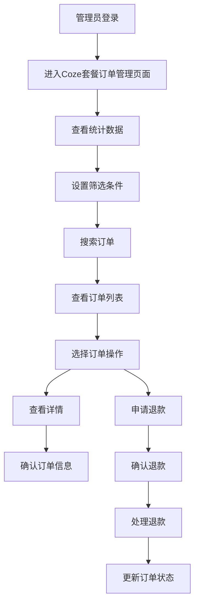

## 1. 产品概述

BuildingAI Coze套餐订单页面是面向平台管理员的后台管理功能，基于Vue3 + Nuxt3 + TypeScript技术栈开发，使用@fastbuildai/ui组件库构建现代化管理界面。该页面用于管理和监控用户Coze套餐订单的全生命周期，通过coze_package_order数据表实现订单数据存储，关联user表、coze_package_config表和payconfig表提供完整的订单信息展示。

管理员可以通过该页面查看Coze套餐订单统计数据、筛选和搜索订单、查看订单详情，以及处理订单退款等核心业务操作。系统采用NestJS + TypeORM后端架构，提供完整的权限控制和数据验证机制，支持中文、英文、日文多语言环境。

该功能旨在为平台提供完善的Coze套餐订单管理能力，支持实时监控套餐销售业务数据，通过统计分析帮助运营决策，提升订单处理效率和用户服务质量。

## 2. 核心功能

### 2.1 用户角色
| 角色 | 权限代码 | 权限说明 | 核心权限 |
|------|----------|----------|----------|
| 系统管理员 | coze-package-order:list | 查看Coze套餐订单列表权限 | 获取订单列表、查看统计数据、筛选搜索订单 |
| 系统管理员 | coze-package-order:detail | 查看Coze套餐订单详情权限 | 查看订单详细信息、订单状态、支付信息 |
| 系统管理员 | coze-package-order:refund | 处理Coze套餐订单退款权限 | 发起退款申请、处理退款流程 |

### 2.2 功能模块
Coze套餐订单页面包含以下核心模块：
1. **统计数据展示**：基于coze_package_order表的订单统计卡片，展示关键业务指标
2. **订单列表管理**：基于UTable组件的订单数据展示和操作功能
3. **高级筛选搜索**：支持多维度订单筛选和实时搜索功能
4. **订单详情查看**：基于ProModal组件的订单详细信息展示
5. **退款流程处理**：集成退款确认和API调用的完整退款流程
6. **分页导航控制**：支持灵活的分页大小设置和页面跳转功能

### 2.3 页面详情

| 页面名称 | 模块名称 | 功能描述 |
|----------|----------|----------|
| Coze套餐订单页面 | 统计数据卡片 | 使用UCard组件展示5个核心指标：套餐订单数、累计销售金额、退款订单数、累计退款金额、净收入 |
| Coze套餐订单页面 | 订单搜索功能 | 使用UInput组件支持订单号搜索和用户搜索(ID/昵称/手机号)，带搜索图标，实时触发查询 |
| Coze套餐订单页面 | 筛选下拉选择 | 使用USelect组件提供支付方式(微信/支付宝)、支付状态(已支付/未支付)、退款状态(已退款/未退款)筛选 |
| Coze套餐订单页面 | 订单数据表格 | 使用UTable组件展示订单列表，包含9个核心列：订单号、用户、套餐名称、套餐时长、套餐价格、实付金额、支付方式、支付状态、下单时间、操作 |
| Coze套餐订单页面 | 表格操作列 | 使用UDropdownMenu组件提供查看详情和申请退款操作，支持权限控制和条件显示 |
| Coze套餐订单页面 | 分页控制组件 | 使用ProPaginaction组件支持页面导航，USelect组件支持每页条数设置(10/20/50/100)，UInput组件支持直接跳转页面 |
| 订单详情弹窗 | 详情信息展示 | 使用ProModal组件展示订单完整信息，包含订单号、订单来源、用户信息、订单类型、套餐信息、支付状态、支付方式、时间信息、退款状态等 |
| 订单详情弹窗 | 套餐数据表格 | 使用UTable组件展示订单核心数据：套餐名称、套餐时长、原价、现价、实付金额(格式化货币显示) |
| 订单详情弹窗 | 退款操作功能 | 条件显示退款按钮(已支付且未退款)，集成useModal确认弹窗和apiRefund退款API调用 |

## 3. 核心流程

管理员操作流程：
1. 管理员登录后台系统
2. 进入Coze套餐订单管理页面
3. 查看套餐订单统计数据概览
4. 使用筛选条件查找目标订单
5. 查看订单详情信息
6. 根据需要处理退款申请
7. 监控订单状态变化



## 4. 用户界面设计

### 4.1 设计风格
- **主色调**：蓝色系（primary color）作为主色，灰色系作为辅助色
- **按钮样式**：圆角按钮，主要操作使用实心按钮（color="primary"），次要操作使用轮廓按钮（variant="ghost"）
- **字体**：系统默认字体，统计数据使用text-2xl font-bold，标题使用text-sm，描述使用text-xs
- **布局风格**：基于@fastbuildai/ui组件库的现代化设计，使用grid和flex布局，gap间距统一
- **图标风格**：使用Heroicons图标库（i-heroicons-magnifying-glass、i-heroicons-user）和Lucide图标库（i-lucide-eye、i-lucide-ellipsis-vertical），简洁线性风格
- **组件库**：基于@fastbuildai/ui统一组件库，确保设计一致性

### 4.2 页面设计概览

| 页面名称 | 模块名称 | UI元素 |
|----------|----------|--------|
| Coze套餐订单页面 | 统计数据卡片 | 5列网格布局(grid-cols-5)，UCard组件，数值使用text-2xl font-bold，单位使用text-xs text-muted-foreground |
| Coze套餐订单页面 | 搜索筛选区域 | 水平布局(flex items-center space-x-2)，UInput搜索框带图标，USelect下拉选择器，支持实时查询 |
| Coze套餐订单页面 | 订单数据表格 | UTable组件，固定表格布局(table-fixed)，操作列固定右侧(columnPinning)，支持排序和粘性表头 |
| Coze套餐订单页面 | 用户信息列 | UAvatar组件显示用户头像，支持默认图标(i-heroicons-user)和用户名显示 |
| Coze套餐订单页面 | 支付状态列 | UBadge组件，颜色映射(success/error/warning)，支持退款状态叠加显示 |
| Coze套餐订单页面 | 分页控制区域 | 底部边框分隔(border-t)，左侧总数显示，右侧ProPaginaction组件和跳转输入框 |
| 订单详情弹窗 | 信息展示网格 | 2列网格布局(md:grid-cols-2)，标题使用text-muted-foreground text-sm，内容使用text-secondary-foreground |
| 订单详情弹窗 | 时间显示组件 | TimeDisplay组件，mode="datetime"，支持创建时间和支付时间格式化显示 |

### 4.3 响应式设计
- 桌面优先设计，基于Tailwind CSS响应式类
- 统计卡片支持响应式网格：grid-cols-2 md:grid-cols-3 lg:grid-cols-4 xl:grid-cols-5
- 表格使用border-separate border-spacing-0样式，支持横向滚动
- 详情弹窗支持移动端适配：grid-cols-1 md:grid-cols-2
- 使用AccessControl组件进行权限控制显示

## 5. 功能需求

### 5.1 统计数据展示
- **需求描述**：在页面顶部展示Coze套餐订单的关键业务指标
- **技术实现**：
  - 数据来源：apiGetPackageOrderList接口返回的statistics字段
  - 组件实现：UCard组件网格布局，支持响应式显示
  - 数据类型：totalOrder(订单数)、totalAmount(销售金额)、totalRefundOrder(退款订单数)、totalRefundAmount(退款金额)、totalIncome(净收入)
- **业务规则**：
  - 实时更新：每次查询订单列表时同步更新统计数据
  - 货币格式：金额类数据显示"元"单位，数量类数据显示"单"单位
  - 净收入计算：累计销售金额减去累计退款金额
- **验证规则**：数值类型验证，支持小数点后2位精度

### 5.2 订单搜索筛选
- **需求描述**：提供多维度的订单搜索和筛选功能
- **技术实现**：
  - 搜索组件：UInput组件，支持订单号(orderNo)和用户关键字(keyword)搜索
  - 筛选组件：USelect组件，支持支付方式(payType)、支付状态(payStatus)、退款状态(refundStatus)筛选
  - 实时查询：@update:modelValue事件触发getPackageOrderList()方法
- **业务规则**：
  - 订单号搜索：支持完整或部分订单号匹配
  - 用户搜索：支持用户ID、昵称、手机号模糊匹配
  - 支付方式：微信支付(1)、支付宝支付(2)、全部(all)
  - 支付状态：已支付(1)、未支付(0)、全部(all)
  - 退款状态：已退款(1)、未退款(0)、全部(all)
- **验证规则**：搜索关键字长度限制，特殊字符过滤

### 5.3 订单列表管理
- **需求描述**：展示订单数据并提供操作功能
- **技术实现**：
  - 数据表格：UTable组件，支持固定布局和粘性表头
  - 列定义：9个核心列，包含数据格式化和自定义渲染
  - 操作列：UDropdownMenu组件，支持权限控制和条件显示
- **业务规则**：
  - 排序功能：支持按下单时间排序(createdAt列)
  - 货币格式：实付金额使用Intl.NumberFormat格式化为人民币显示
  - 用户信息：显示用户头像和用户名，支持默认头像
  - 支付状态：使用UBadge组件，颜色区分不同状态
  - 操作权限：查看详情需要coze-package-order:detail权限，退款需要coze-package-order:refund权限
- **验证规则**：
  - 退款条件：已支付(payStatus=1)且未退款(refundStatus=0)的订单才显示退款操作
  - 数据完整性：必填字段验证，异常数据处理

### 5.4 订单详情查看
- **需求描述**：在弹窗中展示订单的完整详细信息
- **技术实现**：
  - 弹窗组件：ProModal组件，支持自定义内容区域
  - 数据获取：apiGetPackageOrderDetail接口，根据订单ID获取详情
  - 信息展示：网格布局展示订单各项信息
- **业务规则**：
  - 信息完整性：展示订单号、订单来源、用户信息、订单类型、套餐信息、支付信息、时间信息、退款信息
  - 时间格式：使用TimeDisplay组件格式化显示创建时间和支付时间
  - 条件显示：退款相关信息仅在有退款时显示
  - 数据表格：展示套餐名称、套餐时长、原价、现价、实付金额的汇总信息
- **验证规则**：订单ID有效性验证，数据获取异常处理

### 5.5 退款流程处理
- **需求描述**：提供安全可靠的订单退款处理功能
- **技术实现**：
  - 确认弹窗：useModal组件，二次确认退款操作
  - 退款API：apiPackageRefund接口，传入订单ID处理退款
  - 状态更新：退款成功后刷新订单列表和关闭详情弹窗
- **业务规则**：
  - 退款条件：仅支持已支付且未退款的订单
  - 确认机制：必须通过确认弹窗才能执行退款
  - 成功反馈：退款成功后显示成功提示信息
  - 数据同步：退款后立即刷新订单列表数据
  - 套餐回收：退款后需要回收用户的套餐权限
- **验证规则**：
  - 权限验证：需要coze-package-order:refund权限
  - 状态验证：payStatus=1且refundStatus=0
  - 异常处理：API调用失败的错误处理

### 5.6 分页导航控制
- **需求描述**：提供灵活的分页浏览和导航功能
- **技术实现**：
  - 分页组件：ProPaginaction组件，支持页码导航
  - 页面大小：USelect组件，支持10/20/50/100条每页设置
  - 直接跳转：UInput组件，支持输入页码直接跳转
- **业务规则**：
  - 分页信息：显示总条数、当前页、总页数
  - 页面大小：支持动态调整每页显示条数
  - 跳转功能：支持输入页码直接跳转到指定页面
  - 边界处理：首页、末页、无效页码的处理
- **验证规则**：
  - 页码范围：1到最大页数之间
  - 页面大小：仅支持预设的选项值
  - 数值验证：页码输入的数字类型验证

## 6. API设计

### 6.1 获取套餐订单列表
```
GET /api/console/coze-package-order
```

**权限要求**：@Permissions('list')
**技术实现**：
- 查询coze_package_order表获取订单数据，关联user表获取用户信息，关联coze_package_config表获取套餐信息
- 支持分页查询、条件筛选、关键字搜索
- 计算统计数据：订单数量、金额汇总、退款统计

**请求参数**：
| 参数名 | 类型 | 必填 | 说明 |
|--------|------|------|------|
| page | number | 是 | 页码，从1开始 |
| pageSize | number | 是 | 每页条数，支持10/20/50/100 |
| keyword | string | 否 | 用户搜索关键字(ID/昵称/手机号) |
| orderNo | string | 否 | 订单号搜索 |
| payType | string | 否 | 支付方式：1-微信，2-支付宝 |
| payStatus | string | 否 | 支付状态：1-已支付，0-未支付 |
| refundStatus | string | 否 | 退款状态：1-已退款，0-未退款 |

**响应数据**：
```json
{
  "items": [
    {
      "id": "order_id",
      "orderNo": "202312010001",
      "user": {
        "username": "用户名",
        "avatar": "头像URL"
      },
      "packageName": "Coze基础套餐",
      "packageDuration": 30,
      "packagePrice": "99.00",
      "originalPrice": "129.00",
      "orderAmount": "99.00",
      "payTypeDesc": "微信支付",
      "payStatus": 1,
      "refundStatus": 0,
      "createdAt": "2023-12-01T10:00:00Z"
    }
  ],
  "page": 1,
  "pageSize": 10,
  "total": 100,
  "statistics": {
    "totalOrder": 100,
    "totalAmount": 9900.00,
    "totalRefundOrder": 5,
    "totalRefundAmount": 495.00,
    "totalIncome": 9405.00
  }
}
```

### 6.2 获取套餐订单详情
```
GET /api/console/coze-package-order/:id
```

**权限要求**：@Permissions('detail')
**技术实现**：
- 根据订单ID查询coze_package_order表详细信息
- 关联user表获取用户信息，关联coze_package_config表获取套餐详情，关联payconfig表获取支付方式描述
- 处理退款状态和退款单号信息

**路径参数**：
| 参数名 | 类型 | 必填 | 说明 |
|--------|------|------|------|
| id | string | 是 | 订单ID |

**响应数据**：
```json
{
  "id": "order_id",
  "orderNo": "202312010001",
  "orderType": "Coze套餐订单",
  "terminalDesc": "Web端",
  "user": {
    "username": "用户名"
  },
  "packageName": "Coze基础套餐",
  "packageDuration": 30,
  "packageDescription": "适合个人用户的基础套餐",
  "originalPrice": "129.00",
  "packagePrice": "99.00",
  "orderAmount": "99.00",
  "payTypeDesc": "微信支付",
  "payStatus": 1,
  "payTime": "2023-12-01T10:05:00Z",
  "refundStatus": 0,
  "refundStatusDesc": "未退款",
  "refundNo": null,
  "createdAt": "2023-12-01T10:00:00Z"
}
```

### 6.3 申请套餐订单退款
```
POST /api/console/coze-package-order/refund
```

**权限要求**：@Permissions('refund')
**技术实现**：
- 验证订单状态：已支付且未退款
- 调用退款服务处理退款逻辑
- 更新订单退款状态，回收用户套餐权限，记录账户日志

**请求参数**：
```json
{
  "id": "order_id"
}
```

**RefundDto验证规则**：
| 字段名 | 类型 | 验证规则 | 说明 |
|--------|------|----------|------|
| id | string | @IsString @IsNotEmpty | 订单ID，不能为空 |

**响应数据**：
```json
{
  "success": true,
  "message": "退款成功"
}
```

## 7. 验收标准

### 7.1 功能验收
- [ ] 统计数据卡片正常显示，数值准确反映套餐订单业务指标
- [ ] 订单搜索功能正常，支持订单号和用户关键字模糊搜索
- [ ] 筛选功能完整，支付方式、支付状态、退款状态生效
- [ ] 订单列表正常展示，分页、排序、数据格式化功能正常
- [ ] 订单详情弹窗正常显示，套餐信息完整准确
- [ ] 退款功能正常，包含确认弹窗、API调用、状态更新、套餐权限回收
- [ ] 权限控制：list、detail、refund权限验证有效

### 7.2 界面验收
- [ ] 页面布局符合@fastbuildai/ui设计规范
- [ ] UCard、UTable、UInput、USelect、ProModal组件样式一致
- [ ] 响应式设计在不同设备上正常显示，使用Tailwind CSS
- [ ] 交互反馈及时：搜索响应、操作确认、成功提示、加载状态
- [ ] 多语言显示正确：中文、英文、日文通过vue-i18n切换
- [ ] 图标显示正确：Heroicons、Lucide、Tabler图标库

### 7.3 权限验收
- [ ] 只有具备coze-package-order:list权限的用户可以查看订单列表
- [ ] 只有具备coze-package-order:detail权限的用户可以查看订单详情
- [ ] 只有具备coze-package-order:refund权限的用户可以申请退款
- [ ] AccessControl组件正确控制操作按钮的显示
- [ ] 权限控制粒度正确，功能隔离有效

### 7.4 性能验收
- [ ] 页面加载时间在可接受范围内(<2秒)
- [ ] 订单列表查询响应及时(<1秒)，支持大数据量分页
- [ ] 搜索和筛选响应及时，实时查询不影响用户体验
- [ ] 订单详情加载快速(<500ms)
- [ ] 退款操作响应及时(<2秒)

### 7.5 兼容性验收
- [ ] 主流浏览器兼容性良好(Chrome、Firefox、Safari、Edge)
- [ ] 移动端适配正确，触摸操作友好
- [ ] 不同分辨率下显示正常(1920x1080、1366x768、移动端)
- [ ] Vue3 + Nuxt3 + TypeScript技术栈稳定运行

### 7.6 数据验证验收
- [ ] 前端验证：搜索关键字、页码输入、筛选条件验证生效
- [ ] 后端验证：PackageOrderListParams和RefundDto验证规则生效
- [ ] 数据格式化：货币格式、时间格式、用户信息、套餐信息显示正确
- [ ] 边界值测试：空数据、大数据量、异常状态处理正确
- [ ] 退款条件验证：只有已支付且未退款的订单可以退款
- [ ] 套餐权限验证：退款后正确回收用户套餐使用权限