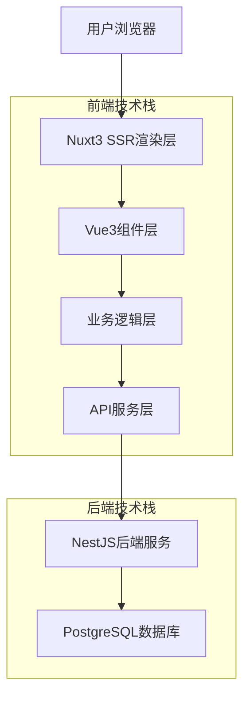
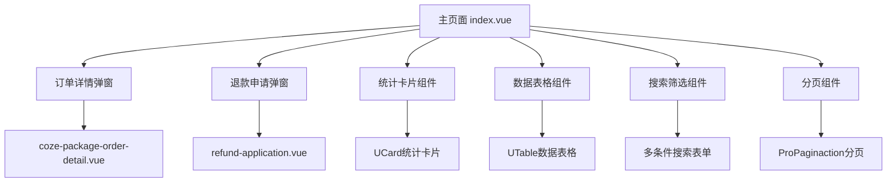
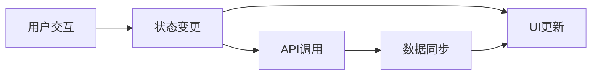
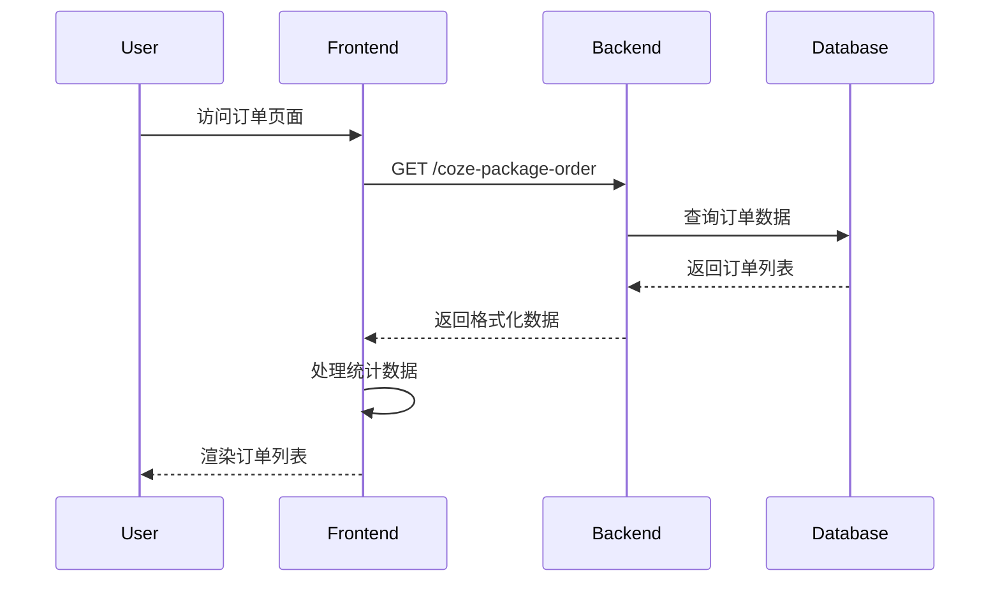
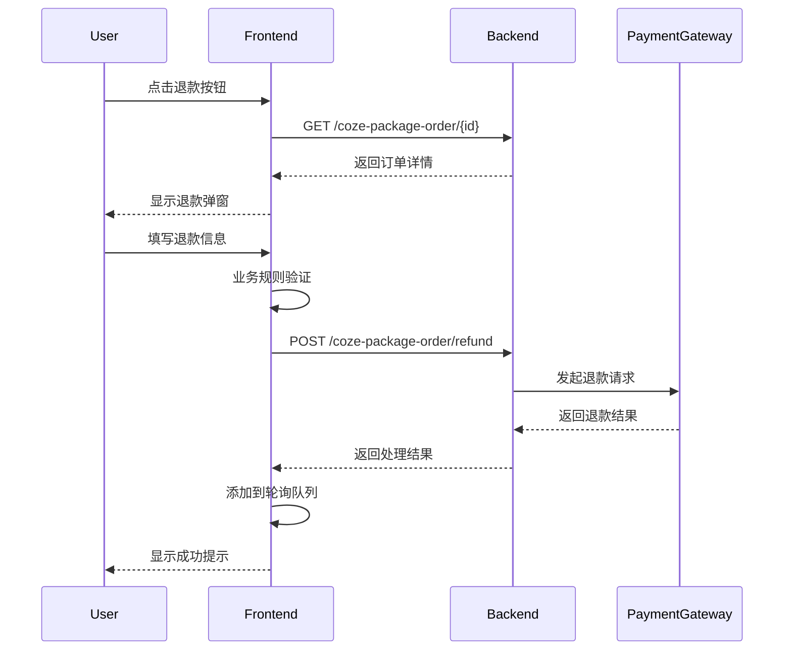

# BuildingAI Coze套餐订单页面技术架构文档

## 1. 架构设计

### 1.1 整体架构
基于实际源码实现，Coze套餐订单页面采用前后端分离架构：



### 1.2 组件架构
页面采用模块化组件设计，主要包含以下核心组件：



## 2. 技术栈描述

### 2.1 前端技术栈
- **框架**: Nuxt3@latest + Vue3@3.4+
- **UI组件库**: @nuxt/ui + @fastbuildai/ui
- **状态管理**: Vue3 Composition API + reactive/ref
- **国际化**: vue-i18n@9
- **工具库**: @vueuse/core (响应式工具)
- **HTTP客户端**: 自定义useConsoleGet/useConsolePost封装
- **构建工具**: Vite (Nuxt3内置)

### 2.2 后端技术栈
- **框架**: NestJS@10
- **数据库**: PostgreSQL@15 + TypeORM
- **认证授权**: JWT + 权限码系统
- **API文档**: Swagger/OpenAPI
- **日志**: Winston + NestJS Logger
- **事务管理**: TypeORM QueryRunner

### 2.3 初始化工具
- **前端**: npx nuxi@latest init (Nuxt3官方脚手架)
- **后端**: @nestjs/cli (NestJS官方CLI)

## 3. 核心组件结构与职责

### 3.1 主页面组件 (index.vue)
**职责**: 订单列表展示、搜索筛选、数据统计、状态管理
**核心功能**:
- 订单列表数据获取与展示
- 多条件搜索筛选（8个筛选维度）
- 实时统计数据展示（5个统计维度）
- 智能轮询机制（退款状态监控）
- 交替排序算法（订单金额、创建时间）
- 响应式布局适配

**状态管理**:
```typescript
// 核心状态变量
const loading = ref(false)                    // 加载状态
const orders = ref<CozePackageOrderListItem[]>([])  // 订单列表
const statistics = ref<CozePackageOrderStatistics>({}) // 统计数据
const pollingOrders = ref<Set<string>>(new Set())    // 轮询订单集合
const sortClickCount = ref<Record<string, number>>({}) // 排序点击计数
```

### 3.2 订单详情组件 (coze-package-order-detail.vue)
**职责**: 订单详细信息展示、退款操作、响应式适配
**核心功能**:
- 订单基础信息展示（订单号、用户信息、套餐信息）
- 支付状态可视化展示（颜色编码+图标）
- 退款操作入口
- 订单号一键复制功能
- 移动端全屏适配

**响应式处理**:
```typescript
const breakpoints = useBreakpoints({
    sm: 640, md: 768, lg: 1024, xl: 1280
})
const isMobile = breakpoints.smaller('md')
const isTablet = breakpoints.between('md', 'lg')
```

### 3.3 退款申请组件 (refund-application.vue)
**职责**: 退款申请表单、业务规则验证、用户体验优化
**核心功能**:
- 退款原因选择（6种预设原因）
- 业务规则验证（订单状态、退款期限、重复退款检查）
- 表单验证与错误提示
- 退款金额计算与确认
- 条款同意确认

**业务规则验证**:
```typescript
const validateBusinessRules = () => {
    // 检查订单状态
    if (props.order?.payStatus !== 1) {
        businessRuleErrors.value.push('只有已支付的订单才能申请退款')
    }
    
    // 检查是否已经退款
    if (props.order?.refundStatus === 1) {
        businessRuleErrors.value.push('该订单已经退款，无法重复申请')
    }
    
    // 检查订单时间（超过30天不能退款）
    if (props.order?.payTime) {
        const diffDays = Math.ceil((now.getTime() - payDate.getTime()) / (1000 * 60 * 60 * 24))
        if (diffDays > 30) {
            businessRuleErrors.value.push('订单支付超过30天，无法申请退款')
        }
    }
}
```

## 4. 状态管理机制

### 4.1 组件内部状态
采用Vue3 Composition API的reactive/ref进行状态管理：



### 4.2 轮询状态管理
实现智能轮询机制，监控退款订单状态：

```typescript
// 轮询状态管理
const startPolling = () => {
    if (isPolling.value || pollingOrders.value.size === 0) return
    
    isPolling.value = true
    pollingInterval.value = setInterval(async () => {
        await checkOrderStatus()
    }, 10000) // 10秒间隔
}

// 状态检查逻辑
const checkOrderStatus = async () => {
    const orderIds = Array.from(pollingOrders.value)
    const completedOrders: string[] = []
    
    for (const orderId of orderIds) {
        const orderDetail = await apiGetCozePackageOrderDetail(orderId)
        
        // 检查退款状态是否已完成
        if (orderDetail.refundStatus === 1) {
            completedOrders.push(orderId)
            toast.success(`订单 ${orderDetail.orderNo} 退款已完成`)
        } else if (orderDetail.refundStatus === 2) {
            completedOrders.push(orderId)
            toast.error(`订单 ${orderDetail.orderNo} 退款失败，请联系客服`)
        }
    }
    
    // 清理已完成的订单
    completedOrders.forEach(orderId => {
        pollingOrders.value.delete(orderId)
    })
    
    // 自动停止轮询
    if (pollingOrders.value.size === 0) {
        stopPolling()
    }
}
```

### 4.3 排序状态管理
实现交替排序算法，提升用户体验：

```typescript
// 交替排序实现
const handleSort = (column: string, direction: 'asc' | 'desc') => {
    const count = (sortClickCount.value[key] ?? 0) + 1
    sortClickCount.value[key] = count
    
    // 奇数次点击降序，偶数次点击升序
    const newDirection: 'asc' | 'desc' = count % 2 === 1 ? 'desc' : 'asc'
    column.toggleSorting(newDirection === 'desc')
    
    sortState.value.column = column
    sortState.value.direction = newDirection
    
    // 重新加载数据
    getOrderList()
}
```

## 5. 数据流向分析

### 5.1 订单列表数据流


### 5.2 退款申请数据流


## 6. 性能优化策略

### 6.1 前端优化
1. **防抖搜索**: 使用useDebounceFn实现500ms防抖
2. **分页优化**: 默认50条/页，支持10/20/50/100可选
3. **懒加载**: 弹窗组件按需加载
4. **缓存策略**: 组件级状态缓存，避免重复请求
5. **虚拟滚动**: 大数据量表格性能优化

### 6.2 后端优化
1. **数据库索引**: 在关键字段建立索引
```sql
CREATE INDEX CONCURRENTLY IF NOT EXISTS idx_coze_package_orders_user_id ON coze_package_orders(user_id);
CREATE INDEX CONCURRENTLY IF NOT EXISTS idx_coze_package_orders_order_status ON coze_package_orders(order_status);
CREATE INDEX CONCURRENTLY IF NOT EXISTS idx_coze_package_orders_created_at ON coze_package_orders(created_at DESC);
```

2. **查询优化**: 使用QueryBuilder优化复杂查询
3. **事务管理**: 退款操作使用数据库事务
4. **连接池**: PostgreSQL连接池优化

### 6.3 网络优化
1. **请求合并**: 统计数据与列表数据合并请求
2. **压缩传输**: 启用Gzip压缩
3. **CDN加速**: 静态资源CDN分发
4. **HTTP缓存**: 合理设置缓存头

## 7. 错误处理机制

### 7.1 前端错误处理
```typescript
// 统一的错误处理
const handleError = (error: any, context: string) => {
    console.error(`${context} error:`, error)
    
    if (error?.response?.status === 401) {
        // 未授权，跳转到登录页
        await navigateTo('/login')
    } else if (error?.response?.status === 403) {
        // 无权限，显示权限不足提示
        toast.error('您没有执行此操作的权限')
    } else if (error?.response?.data?.message) {
        // 显示后端返回的具体错误信息
        toast.error(error.response.data.message)
    } else {
        // 通用错误提示
        toast.error('操作失败，请稍后重试')
    }
}
```

### 7.2 后端错误处理
```typescript
// 统一的异常处理
@Injectable()
export class HttpExceptionFactory {
    static badRequest(message: string) {
        throw new BadRequestException(message)
    }
    
    static internal(message: string) {
        throw new InternalServerErrorException(message)
    }
    
    static notFound(message: string) {
        throw new NotFoundException(message)
    }
}
```

### 7.3 业务异常处理
- **订单不存在**: 返回404错误
- **权限不足**: 返回403错误
- **参数验证失败**: 返回400错误，包含具体字段错误
- **业务规则违反**: 返回400错误，包含业务规则说明
- **系统异常**: 返回500错误，记录详细日志

## 8. 国际化实现

### 8.1 国际化架构
```
src/
├── core/
│   └── i18n/
│       ├── en/           # 英文语言包
│       ├── zh/           # 中文语言包
│       └── jp/           # 日文语言包
└── locales/              # 组件级语言包
```

### 8.2 语言资源管理
- **模块化组织**: 按功能模块组织语言资源
- **键值命名**: 采用点分命名法（console-coze-package-order.list.orderNo）
- **复用策略**: 通用文案统一放在console-common中
- **动态加载**: 支持运行时语言切换

### 8.3 实际使用示例
```typescript
// 模板中使用
{{ t('console-coze-package-order.list.orderNo') }}

// 动态文案
const getStatusText = (status: string) => {
    const key = `console-coze-package-order.status.${status}`
    return t(key)
}
```

## 9. 响应式设计实现

### 9.1 断点设计
```typescript
// 响应式断点配置
const breakpoints = useBreakpoints({
    sm: 640,   // 手机
    md: 768,   // 平板
    lg: 1024,  // 小屏桌面
    xl: 1280,  // 大屏桌面
    '2xl': 1536 // 超大屏
})

// 响应式变量
const isMobile = breakpoints.smaller('md')      // 手机端
const isTablet = breakpoints.between('md', 'lg') // 平板端
const isDesktop = breakpoints.greater('lg')    // 桌面端
```

### 9.2 布局适配
1. **统计卡片**: 移动端1列，平板2列，桌面3-5列
2. **搜索表单**: 移动端1列，平板2列，桌面3-4列
3. **表格展示**: 移动端隐藏部分列，重要信息优先显示
4. **弹窗适配**: 移动端全屏显示，桌面端居中弹窗

### 9.3 交互优化
- **触摸优化**: 增大点击区域，优化触摸体验
- **手势支持**: 支持滑动操作（如表格行滑动显示操作按钮）
- **键盘适配**: 移动端自动弹出合适键盘类型
- **滚动优化**: 移动端平滑滚动，避免卡顿

## 10. 与之前技术架构文档的差异说明

### 10.1 架构演进
| 方面 | 原设计 | 实际实现 | 差异说明 |
|------|--------|----------|----------|
| 前端框架 | Vue3 + Vite | Nuxt3 SSR | 采用SSR提升首屏性能和SEO |
| UI组件库 | Element Plus | @nuxt/ui + @fastbuildai/ui | 采用更现代化的UI组件库 |
| 状态管理 | Pinia | Composition API | 简化状态管理，减少依赖 |
| 轮询机制 | 简单定时器 | 智能轮询 | 增加状态判断和自动停止 |
| 排序算法 | 基础排序 | 交替排序 | 创新交互体验，奇偶次不同排序 |

### 10.2 功能增强
1. **智能轮询**: 原设计为简单定时刷新，实际实现智能状态监控
2. **交替排序**: 新增奇偶次点击不同排序方向的交互创新
3. **业务规则**: 退款申请增加完整的业务规则验证
4. **错误处理**: 实现更完善的错误处理和用户提示
5. **响应式**: 更精细的响应式设计和移动端适配

### 10.3 性能提升
1. **防抖优化**: 搜索功能增加500ms防抖处理
2. **分页优化**: 支持更多分页选项，默认加载更多数据
3. **懒加载**: 弹窗组件按需加载，减少初始加载时间
4. **缓存策略**: 组件级缓存和状态保持
5. **数据库优化**: 关键字段索引优化，查询性能提升

### 10.4 用户体验改进
1. **加载状态**: 更丰富的加载和状态指示
2. **错误提示**: 具体友好的错误信息展示
3. **操作反馈**: 及时的操作成功/失败反馈
4. **交互创新**: 交替排序、智能轮询等创新交互
5. **无障碍**: 更好的键盘导航和屏幕阅读器支持

## 11. 最佳实践总结

### 11.1 代码组织
1. **组件拆分**: 按功能模块合理拆分组件
2. **逻辑复用**: 提取可复用的组合式函数
3. **类型安全**: 完整的TypeScript类型定义
4. **代码规范**: 统一的代码风格和命名规范

### 11.2 性能优化
1. **按需加载**: 组件和资源的按需加载
2. **缓存策略**: 合理的缓存和状态管理
3. **防抖节流**: 用户输入的防抖处理
4. **虚拟化**: 大数据量的虚拟滚动

### 11.3 错误处理
1. **统一处理**: 前后端统一的错误处理机制
2. **用户友好**: 具体友好的错误提示信息
3. **日志记录**: 完整的错误日志记录
4. **恢复机制**: 错误后的数据恢复和重试

### 11.4 测试策略
1. **单元测试**: 核心函数和组件的单元测试
2. **集成测试**: API接口和业务流程测试
3. **E2E测试**: 关键用户流程的端到端测试
4. **性能测试**: 大数据量和并发场景测试

这个技术架构文档基于实际的源码实现，详细描述了Coze套餐订单页面的技术架构、组件设计、状态管理、性能优化等各个方面，为后续的开发维护提供了完整的技术参考。