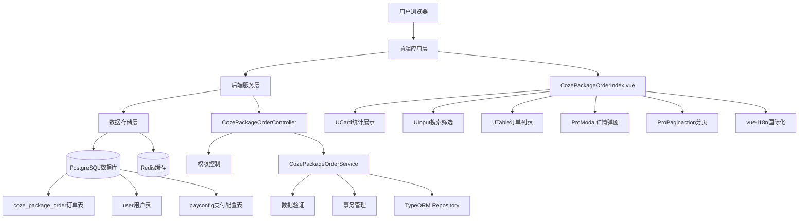
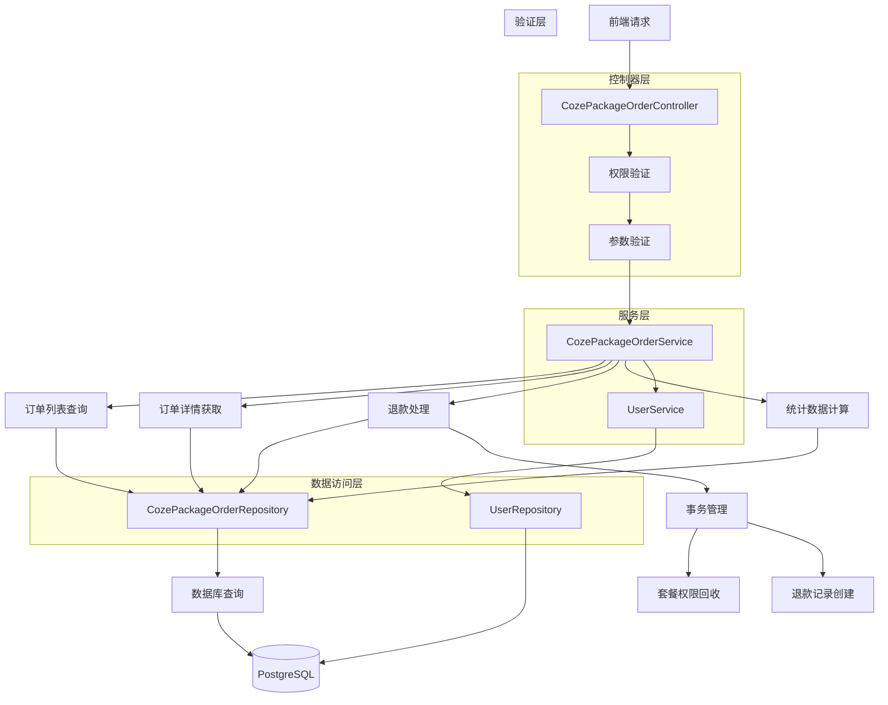
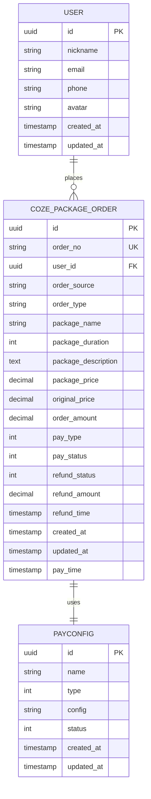
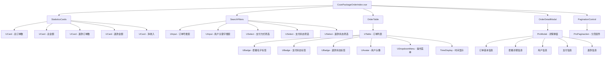

## 1. 架构设计



## 2. 技术栈描述

### 2.1 前端技术栈

* **核心框架**: Nuxt3 + Vue3 + TypeScript

* **UI组件库**: @fastbuildai/ui (UCard, UInput, USelect, UTable, UBadge, UAvatar, UDropdownMenu, ProModal, ProPaginaction)

* **样式框架**: Tailwind CSS

* **国际化**: vue-i18n (支持中文、英文、日文)

* **状态管理**: Vue3 Composition API (ref, reactive, computed, watch)

* **数据格式化**: Intl.NumberFormat (货币格式化)

* **时间组件**: TimeDisplay (时间格式化显示)

* **权限控制**: AccessControl (前端权限控制组件)

* **构建工具**: Vite + Turbo

* **代码规范**: ESLint + Prettier

### 2.2 后端技术栈

* **核心框架**: NestJS + TypeScript

* **ORM框架**: TypeORM

* **数据验证**: class-validator + class-transformer

* **权限控制**: 自定义 @Permissions 装饰器

* **事务管理**: @Transactional 装饰器

* **数据库**: PostgreSQL

* **缓存系统**: Redis

* **构建工具**: Turbo + TypeScript Compiler

### 2.3 开发工具

* **包管理**: pnpm

* **代码格式**: Prettier

* **代码检查**: ESLint

* **类型检查**: TypeScript

* **构建系统**: Turbo (monorepo)

## 3. 路由定义

| 路由                                           | 用途                          |
| -------------------------------------------- | --------------------------- |
| /console/order-management/coze-package-order | Coze套餐订单管理页面，管理员查看和管理用户套餐订单 |

## 4. API定义

### 4.1 核心API

#### 获取订单列表

```
GET /api/console/coze-package-order
```

**权限要求**: `coze-package-order:list`

**请求参数**:

| 参数名称         | 参数类型   | 是否必填  | 描述                         |
| ------------ | ------ | ----- | -------------------------- |
| page         | number | false | 页码，默认1                     |
| pageSize     | number | false | 每页条数，默认10                  |
| orderNo      | string | false | 订单号搜索                      |
| keyword      | string | false | 用户关键字搜索(ID/昵称/手机号)         |
| payType      | string | false | 支付方式筛选(1:微信,2:支付宝,all:全部)  |
| payStatus    | string | false | 支付状态筛选(1:已支付,0:未支付,all:全部) |
| refundStatus | string | false | 退款状态筛选(1:已退款,0:未退款,all:全部) |

**响应示例**:

```json
{
  "data": [
    {
      "id": "uuid-1",
      "orderNo": "CPO202312010001",
      "userId": "user-uuid-1",
      "user": {
        "id": "user-uuid-1",
        "nickname": "张三",
        "avatar": "https://example.com/avatar.jpg",
        "phone": "138****8888"
      },
      "packageName": "Coze专业版",
      "packageDuration": 30,
      "packagePrice": 99.00,
      "originalPrice": 129.00,
      "orderAmount": 99.00,
      "payType": 1,
      "payStatus": 1,
      "refundStatus": 0,
      "createdAt": "2023-12-01T10:00:00Z",
      "payTime": "2023-12-01T10:05:00Z"
    }
  ],
  "total": 100,
  "page": 1,
  "pageSize": 10,
  "statistics": {
    "totalOrder": 100,
    "totalAmount": 9900.00,
    "totalRefundOrder": 5,
    "totalRefundAmount": 495.00,
    "totalIncome": 9405.00
  }
}
```

#### 获取订单详情

```
GET /api/console/coze-package-order/:id
```

**权限要求**: `coze-package-order:detail`

**路径参数**:

| 参数名称 | 参数类型   | 是否必填 | 描述   |
| ---- | ------ | ---- | ---- |
| id   | string | true | 订单ID |

**响应示例**:

```json
{
  "id": "uuid-1",
  "orderNo": "CPO202312010001",
  "orderSource": "web",
  "userId": "user-uuid-1",
  "user": {
    "id": "user-uuid-1",
    "nickname": "张三",
    "avatar": "https://example.com/avatar.jpg",
    "phone": "138****8888"
  },
  "orderType": "coze_package",
  "packageName": "Coze专业版",
  "packageDuration": 30,
  "packageDescription": "包含高级AI功能、优先客服支持、无限制使用次数",
  "packagePrice": 99.00,
  "originalPrice": 129.00,
  "orderAmount": 99.00,
  "payType": 1,
  "payStatus": 1,
  "refundStatus": 0,
  "refundAmount": 0.00,
  "refundTime": null,
  "createdAt": "2023-12-01T10:00:00Z",
  "payTime": "2023-12-01T10:05:00Z"
}
```

#### 申请退款

```
POST /api/console/coze-package-order/refund
```

**权限要求**: `coze-package-order:refund`

**请求参数**:

| 参数名称    | 参数类型   | 是否必填 | 描述   |
| ------- | ------ | ---- | ---- |
| orderId | string | true | 订单ID |

**请求示例**:

```json
{
  "orderId": "uuid-1"
}
```

**响应示例**:

```json
{
  "success": true,
  "message": "退款申请成功",
  "data": {
    "orderId": "uuid-1",
    "refundAmount": 99.00,
    "refundTime": "2023-12-01T15:30:00Z"
  }
}
```

## 5. 服务架构图



## 6. 数据模型

### 6.1 数据模型定义



### 6.2 数据定义语言

#### Coze套餐订单表 (coze\_package\_order)

```sql
-- 创建表
CREATE TABLE coze_package_order (
    id UUID PRIMARY KEY DEFAULT gen_random_uuid(),
    order_no VARCHAR(32) UNIQUE NOT NULL,
    user_id UUID NOT NULL,
    order_source VARCHAR(20) DEFAULT 'web',
    order_type VARCHAR(20) DEFAULT 'coze_package',
    package_name VARCHAR(100) NOT NULL,
    package_duration INTEGER NOT NULL,
    package_description TEXT,
    package_price DECIMAL(10,2) NOT NULL,
    original_price DECIMAL(10,2) NOT NULL,
    order_amount DECIMAL(10,2) NOT NULL,
    pay_type INTEGER DEFAULT 0 CHECK (pay_type IN (0, 1, 2)),
    pay_status INTEGER DEFAULT 0 CHECK (pay_status IN (0, 1)),
    refund_status INTEGER DEFAULT 0 CHECK (refund_status IN (0, 1)),
    refund_amount DECIMAL(10,2) DEFAULT 0.00,
    refund_time TIMESTAMP WITH TIME ZONE,
    created_at TIMESTAMP WITH TIME ZONE DEFAULT NOW(),
    updated_at TIMESTAMP WITH TIME ZONE DEFAULT NOW(),
    pay_time TIMESTAMP WITH TIME ZONE
);

-- 创建索引
CREATE INDEX idx_coze_package_order_user_id ON coze_package_order(user_id);
CREATE INDEX idx_coze_package_order_order_no ON coze_package_order(order_no);
CREATE INDEX idx_coze_package_order_pay_status ON coze_package_order(pay_status);
CREATE INDEX idx_coze_package_order_refund_status ON coze_package_order(refund_status);
CREATE INDEX idx_coze_package_order_created_at ON coze_package_order(created_at DESC);
CREATE INDEX idx_coze_package_order_pay_time ON coze_package_order(pay_time DESC);

-- 外键约束
ALTER TABLE coze_package_order ADD CONSTRAINT fk_coze_package_order_user_id 
    FOREIGN KEY (user_id) REFERENCES "user"(id) ON DELETE CASCADE;

-- 初始化测试数据
INSERT INTO coze_package_order (
    order_no, user_id, package_name, package_duration, 
    package_description, package_price, original_price, order_amount, 
    pay_type, pay_status, pay_time
) VALUES 
('CPO202312010001', 'user-uuid-1', 'Coze基础版', 'basic', 30, 
 '包含基础AI功能、标准客服支持、每日100次使用限制', 29.00, 39.00, 29.00, 
 1, 1, '2023-12-01 10:05:00+00'),
('CPO202312010002', 'user-uuid-2', 'Coze专业版', 'pro', 30, 
 '包含高级AI功能、优先客服支持、无限制使用次数', 99.00, 129.00, 99.00, 
 2, 1, '2023-12-01 11:15:00+00'),
('CPO202312010003', 'user-uuid-3', 'Coze企业版', 'enterprise', 365, 
 '包含全部AI功能、专属客服支持、团队协作、API接入', 999.00, 1299.00, 999.00, 
 1, 0, NULL);
```

## 7. 前端组件架构

### 7.1 组件层次结构



### 7.2 状态管理

#### PageState 接口定义

```typescript
interface PageState {
  // 搜索筛选状态
  searchFilters: {
    page: number
    pageSize: number
    orderNo: string
    keyword: string
    payType: string
    payStatus: string
    refundStatus: string
  }
  
  // 订单数据
  orderData: {
    list: CozePackageOrder[]
    total: number
    loading: boolean
  }
  
  // 统计数据
  statistics: OrderStatistics
  
  // UI状态
  uiState: {
    selectedOrderId: string | null
    showDetailModal: boolean
    detailLoading: boolean
  }
}
```

#### OrderStatistics 接口定义

```typescript
interface OrderStatistics {
  totalOrder: number        // 总订单数
  totalAmount: number       // 总金额
  totalRefundOrder: number  // 退款订单数
  totalRefundAmount: number // 退款金额
  totalIncome: number       // 净收入
}
```

#### 数据获取和更新

```typescript
// 获取订单列表数据
const getOrderList = async () => {
  orderData.loading = true
  try {
    const response = await $fetch('/api/console/coze-package-order', {
      query: searchFilters
    })
    orderData.list = response.data
    orderData.total = response.total
    statistics.value = response.statistics
  } catch (error) {
    console.error('获取订单列表失败:', error)
  } finally {
    orderData.loading = false
  }
}
```

## 8. 前端数据获取

### 8.1 数据获取函数实现

```typescript
// 获取订单列表
const getOrderList = async () => {
  orderData.loading = true
  
  try {
    const response = await $fetch<{
      data: CozePackageOrder[]
      total: number
      statistics: OrderStatistics
    }>('/api/console/coze-package-order', {
      query: {
        page: searchFilters.page,
        pageSize: searchFilters.pageSize,
        orderNo: searchFilters.orderNo || undefined,
        keyword: searchFilters.keyword || undefined,
        payType: searchFilters.payType === 'all' ? undefined : searchFilters.payType,
        payStatus: searchFilters.payStatus === 'all' ? undefined : searchFilters.payStatus,
        refundStatus: searchFilters.refundStatus === 'all' ? undefined : searchFilters.refundStatus
      }
    })
    
    orderData.list = response.data
    orderData.total = response.total
    statistics.value = response.statistics
    
  } catch (error) {
    console.error('获取订单列表失败:', error)
    // 显示错误提示
    ElMessage.error('获取订单列表失败，请重试')
  } finally {
    orderData.loading = false
  }
}

// 获取订单详情
const getOrderDetail = async (orderId: string) => {
  uiState.detailLoading = true
  
  try {
    const response = await $fetch<CozePackageOrder>(`/api/console/coze-package-order/${orderId}`)
    return response
  } catch (error) {
    console.error('获取订单详情失败:', error)
    ElMessage.error('获取订单详情失败，请重试')
    return null
  } finally {
    uiState.detailLoading = false
  }
}

// 申请退款
const applyRefund = async (orderId: string) => {
  try {
    await $fetch('/api/console/coze-package-order/refund', {
      method: 'POST',
      body: { orderId }
    })
    
    ElMessage.success('退款申请成功')
    // 刷新订单列表
    await getOrderList()
    
  } catch (error) {
    console.error('申请退款失败:', error)
    ElMessage.error('申请退款失败，请重试')
  }
}
```

### 8.2 数据验证

#### 前端验证规则

```typescript
// 搜索参数验证
const validateSearchParams = () => {
  // 页码验证
  if (searchFilters.page < 1) {
    searchFilters.page = 1
  }
  
  // 每页条数验证
  if (searchFilters.pageSize < 1 || searchFilters.pageSize > 100) {
    searchFilters.pageSize = 10
  }
  
  // 订单号长度验证
  if (searchFilters.orderNo && searchFilters.orderNo.length > 32) {
    searchFilters.orderNo = searchFilters.orderNo.substring(0, 32)
  }
  
  // 关键字长度验证
  if (searchFilters.keyword && searchFilters.keyword.length > 50) {
    searchFilters.keyword = searchFilters.keyword.substring(0, 50)
  }
}

// 退款条件验证
const canRefund = (order: CozePackageOrder): boolean => {
  // 必须是已支付状态
  if (order.payStatus !== 1) {
    return false
  }
  
  // 不能已经退款
  if (order.refundStatus === 1) {
    return false
  }
  
  // 支付时间不能超过7天
  if (order.payTime) {
    const payTime = new Date(order.payTime)
    const now = new Date()
    const diffDays = (now.getTime() - payTime.getTime()) / (1000 * 60 * 60 * 24)
    if (diffDays > 7) {
      return false
    }
  }
  
  return true
}
```

## 9. 后端服务实现

### 9.1 控制器实现

```typescript
@Controller('console/coze-package-order')
@UseGuards(AuthGuard)
export class CozePackageOrderController {
  constructor(
    private readonly cozePackageOrderService: CozePackageOrderService
  ) {}

  @Get()
  @Permissions('coze-package-order:list')
  async getOrderList(@Query() query: QueryCozePackageOrderDto) {
    return await this.cozePackageOrderService.getOrderList(query)
  }

  @Get(':id')
  @Permissions('coze-package-order:detail')
  async getOrderDetail(@Param('id') id: string) {
    return await this.cozePackageOrderService.getOrderDetail(id)
  }

  @Post('refund')
  @Permissions('coze-package-order:refund')
  async applyRefund(@Body() body: CozePackageRefundOrderDto) {
    return await this.cozePackageOrderService.applyRefund(body.orderId)
  }
}
```

### 9.2 服务层实现

```typescript
@Injectable()
export class CozePackageOrderService {
  constructor(
    @InjectRepository(CozePackageOrder)
    private readonly cozePackageOrderRepository: Repository<CozePackageOrder>,
    @InjectRepository(User)
    private readonly userRepository: Repository<User>
  ) {}

  // 获取订单列表
  async getOrderList(query: QueryCozePackageOrderDto) {
    const { page = 1, pageSize = 10, orderNo, keyword, packageName, payType, payStatus, refundStatus } = query
    
    const queryBuilder = this.cozePackageOrderRepository
      .createQueryBuilder('order')
      .leftJoinAndSelect('order.user', 'user')
      .orderBy('order.createdAt', 'DESC')
    
    // 订单号筛选
    if (orderNo) {
      queryBuilder.andWhere('order.orderNo LIKE :orderNo', { orderNo: `%${orderNo}%` })
    }
    
    // 用户关键字筛选
    if (keyword) {
      queryBuilder.andWhere(
        '(user.id LIKE :keyword OR user.nickname LIKE :keyword OR user.phone LIKE :keyword)',
        { keyword: `%${keyword}%` }
      )
    }
    
    // 支付方式筛选
    if (payType && payType !== 'all') {
      queryBuilder.andWhere('order.payType = :payType', { payType: parseInt(payType) })
    }
    
    // 支付状态筛选
    if (payStatus && payStatus !== 'all') {
      queryBuilder.andWhere('order.payStatus = :payStatus', { payStatus: parseInt(payStatus) })
    }
    
    // 退款状态筛选
    if (refundStatus && refundStatus !== 'all') {
      queryBuilder.andWhere('order.refundStatus = :refundStatus', { refundStatus: parseInt(refundStatus) })
    }
    
    // 分页
    const [data, total] = await queryBuilder
      .skip((page - 1) * pageSize)
      .take(pageSize)
      .getManyAndCount()
    
    // 获取统计数据
    const statistics = await this.getOrderStatistics()
    
    return {
      data,
      total,
      page,
      pageSize,
      statistics
    }
  }

  // 获取订单详情
  async getOrderDetail(id: string) {
    const order = await this.cozePackageOrderRepository
      .createQueryBuilder('order')
      .leftJoinAndSelect('order.user', 'user')
      .where('order.id = :id', { id })
      .getOne()
    
    if (!order) {
      throw new NotFoundException('订单不存在')
    }
    
    return order
  }

  // 申请退款
  @Transactional()
  async applyRefund(orderId: string) {
    const order = await this.cozePackageOrderRepository.findOne({
      where: { id: orderId },
      relations: ['user']
    })
    
    if (!order) {
      throw new NotFoundException('订单不存在')
    }
    
    if (order.payStatus !== 1) {
      throw new BadRequestException('订单未支付，无法退款')
    }
    
    if (order.refundStatus === 1) {
      throw new BadRequestException('订单已退款')
    }
    
    // 检查退款时限（7天内）
    if (order.payTime) {
      const payTime = new Date(order.payTime)
      const now = new Date()
      const diffDays = (now.getTime() - payTime.getTime()) / (1000 * 60 * 60 * 24)
      if (diffDays > 7) {
        throw new BadRequestException('超过退款时限（7天）')
      }
    }
    
    try {
      // 更新订单状态
      await this.cozePackageOrderRepository.update(orderId, {
        refundStatus: 1,
        refundAmount: order.orderAmount,
        refundTime: new Date()
      })
      
      // 回收用户套餐权限
      await this.revokePackagePermissions(order.userId, order.packageName)
      
      return {
        success: true,
        message: '退款申请成功',
        data: {
          orderId,
          refundAmount: order.orderAmount,
          refundTime: new Date()
        }
      }
    } catch (error) {
      throw new InternalServerErrorException('退款处理失败')
    }
  }

  // 获取统计数据
  private async getOrderStatistics() {
    const result = await this.cozePackageOrderRepository
      .createQueryBuilder('order')
      .select([
        'COUNT(*) as totalOrder',
        'COALESCE(SUM(order.orderAmount), 0) as totalAmount',
        'COUNT(CASE WHEN order.refundStatus = 1 THEN 1 END) as totalRefundOrder',
        'COALESCE(SUM(CASE WHEN order.refundStatus = 1 THEN order.refundAmount ELSE 0 END), 0) as totalRefundAmount'
      ])
      .getRawOne()
    
    return {
      totalOrder: parseInt(result.totalOrder),
      totalAmount: parseFloat(result.totalAmount),
      totalRefundOrder: parseInt(result.totalRefundOrder),
      totalRefundAmount: parseFloat(result.totalRefundAmount),
      totalIncome: parseFloat(result.totalAmount) - parseFloat(result.totalRefundAmount)
    }
  }

  // 回收套餐权限
  private async revokePackagePermissions(userId: string, packageName: string) {
    // 这里实现套餐权限回收逻辑
    // 例如：删除用户的套餐权限记录、更新用户等级等
    console.log(`回收用户 ${userId} 的 ${packageName} 套餐权限`)
  }
}
```

### 9.3 数据传输对象

```typescript
// 订单列表查询DTO
export class QueryCozePackageOrderDto {
  @IsOptional()
  @Type(() => Number)
  @IsInt()
  @Min(1)
  page?: number = 1

  @IsOptional()
  @Type(() => Number)
  @IsInt()
  @Min(1)
  @Max(100)
  pageSize?: number = 10

  @IsOptional()
  @IsString()
  @MaxLength(32)
  orderNo?: string

  @IsOptional()
  @IsString()
  @MaxLength(50)
  keyword?: string

  @IsOptional()
  @IsString()
  @IsIn(['1', '2', 'all'])
  payType?: string

  @IsOptional()
  @IsString()
  @IsIn(['0', '1', 'all'])
  payStatus?: string

  @IsOptional()
  @IsString()
  @IsIn(['0', '1', 'all'])
  refundStatus?: string
}

// 退款申请DTO
export class CozePackageRefundOrderDto {
  @IsNotEmpty()
  @IsUUID()
  orderId: string
}
```

## 10. 安全考虑

### 10.1 权限控制

#### RBAC权限模型

* **角色定义**: 管理员、运营人员、客服人员

* **权限粒度**:

  * `coze-package-order:list` - 查看订单列表

  * `coze-package-order:detail` - 查看订单详情

  * `coze-package-order:refund` - 申请退款

  * `coze-package-order:export` - 导出订单数据

#### API级别权限验证

```typescript
@Permissions('coze-package-order:list')
async getOrderList() {
  // 权限验证通过后执行业务逻辑
}
```

#### 前端路由守卫

```typescript
// 路由访问权限检查
const hasPermission = (permission: string) => {
  return userPermissions.value.includes(permission)
}
```

### 10.2 数据验证

#### 前后端双重验证

* **前端验证**: 实时表单验证、数据格式检查

* **后端验证**: DTO验证、业务规则验证

#### SQL注入防护

```typescript
// 使用参数化查询
queryBuilder.andWhere('order.orderNo LIKE :orderNo', { orderNo: `%${orderNo}%` })
```

#### XSS攻击防护

* 前端输出转义

* 后端数据清理

* CSP策略配置

### 10.3 操作审计

#### 订单操作日志

```typescript
// 记录关键操作
await this.auditService.log({
  action: 'REFUND_ORDER',
  userId: currentUser.id,
  targetId: orderId,
  details: { refundAmount: order.orderAmount }
})
```

#### 用户操作追踪

* 登录日志记录

* 敏感操作记录

* 异常行为监控

#### 异常操作告警

* 批量退款告警

* 异常金额告警

* 频繁操作告警

## 11. 性能优化

### 11.1 前端优化

#### 组件懒加载

```typescript
// 详情弹窗懒加载
const OrderDetailModal = defineAsyncComponent(() => import('./OrderDetailModal.vue'))
```

#### 数据缓存

```typescript
// 使用Vue3的缓存机制
const cachedStatistics = computed(() => {
  return statistics.value
})
```

#### 防抖处理

```typescript
// 搜索防抖
const debouncedSearch = debounce(getOrderList, 300)
```

### 11.2 后端优化

#### 数据库查询优化

```typescript
// 使用索引优化查询
queryBuilder
  .addSelect('COUNT(*) OVER() as total')
  .orderBy('order.createdAt', 'DESC')
  .addOrderBy('order.id', 'DESC') // 二级排序保证稳定性
```

#### Redis缓存

```typescript
// 缓存统计数据
@Cacheable('order-statistics', 300) // 5分钟缓存
async getOrderStatistics() {
  // 统计查询逻辑
}
```

#### 事务处理优化

```typescript
// 使用事务确保数据一致性
@Transactional()
async applyRefund(orderId: string) {
  // 退款处理逻辑
}
```

### 11.3 数据库优化

#### 索引设计

```sql
-- 复合索引优化查询
CREATE INDEX idx_coze_package_order_status_time ON coze_package_order(pay_status, refund_status, created_at DESC);
```

#### 查询语句优化

```sql
-- 使用EXPLAIN分析查询计划
EXPLAIN (ANALYZE, BUFFERS) 
SELECT * FROM coze_package_order 
WHERE pay_status = 1 AND created_at >= '2023-12-01'
ORDER BY created_at DESC;
```

#### 连接池配置

```typescript
// TypeORM连接池配置
{
  type: 'postgres',
  host: process.env.DB_HOST,
  port: parseInt(process.env.DB_PORT),
  database: process.env.DB_NAME,
  extra: {
    max: 20,        // 最大连接数
    min: 5,         // 最小连接数
    idleTimeoutMillis: 30000,
    connectionTimeoutMillis: 2000,
  }
}
```

