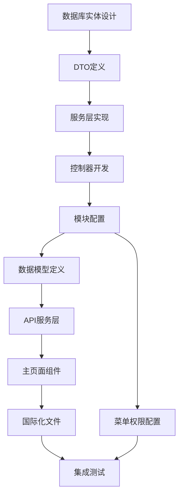
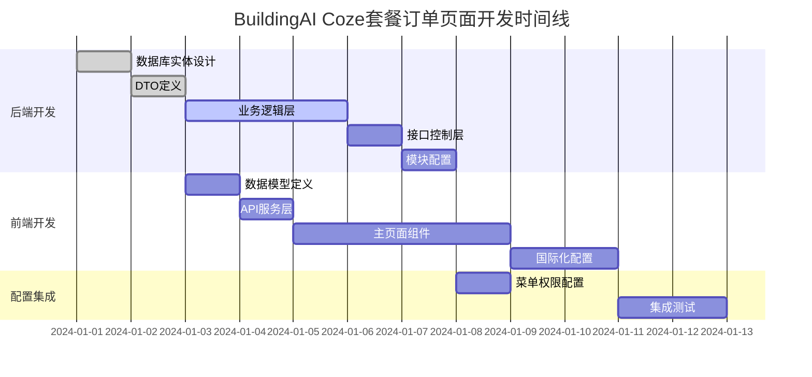

## 1. 项目概述

### 1.1 项目背景和目标
BuildingAI Coze套餐订单页面是管理员后台的核心功能模块，基于Vue3 + Nuxt3 + TypeScript技术栈开发，使用@fastbuildai/ui组件库构建现代化管理界面。该页面用于管理和监控用户Coze套餐订单的全生命周期，通过coze_package_order数据表实现订单数据存储，关联user表、coze_package_config表和payconfig表提供完整的订单信息展示。

管理员可以通过该页面查看Coze套餐订单统计数据、筛选和搜索订单、查看订单详情，以及处理订单退款等核心业务操作。系统采用NestJS + TypeORM后端架构，提供完整的权限控制和数据验证机制，支持中文、英文、日文多语言环境。

该功能旨在为平台提供完善的Coze套餐订单管理能力，支持实时监控套餐销售业务数据，通过统计分析帮助运营决策，提升订单处理效率和用户服务质量。

### 1.2 开发范围和边界
- **前端范围**：Vue3 Composition API、TypeScript类型定义、@fastbuildai/ui组件集成、vue-i18n国际化、API服务封装、统计数据展示、订单列表管理、详情弹窗、退款流程、分页控制
- **后端范围**：NestJS模块开发、RESTful API设计、TypeORM实体定义、权限控制、事务管理、订单查询优化、统计数据计算、退款处理逻辑
- **数据范围**：coze_package_order表（主表）+ user表（用户信息）+ coze_package_config表（套餐配置）+ payconfig表（支付配置）
- **权限范围**：coze-package-order:list、coze-package-order:detail、coze-package-order:refund

### 1.3 技术栈说明
- **前端**：Nuxt3 + Vue3 + TypeScript + @fastbuildai/ui + Tailwind CSS + vue-i18n
- **后端**：NestJS + TypeORM + class-validator + PostgreSQL
- **数据存储**：coze_package_order表（订单数据）+ user表（用户关联）+ coze_package_config表（套餐配置）+ payconfig表（支付配置）
- **权限控制**：基于@Permissions装饰器的权限验证机制
- **构建工具**：Turbo + Vite + pnpm (monorepo)

## 2. 前端文件开发计划

### 2.1 主页面组件 🚧 待开发
- **文件路径**：`apps/web/app/console/order-management/coze-package-order/index.vue`
- **开发状态**：🚧 待开发
- **功能描述**：Coze套餐订单管理的主页面组件，使用@fastbuildai/ui组件库构建，包含统计数据展示、订单列表管理、搜索筛选、详情查看、退款处理、分页控制
- **核心功能**：
  - UCard组件展示统计数据（5个指标卡片）
  - UInput组件实现订单搜索和用户搜索功能
  - USelect组件提供支付方式、支付状态、退款状态筛选
  - UTable组件管理订单列表（9个核心列）
  - UDropdownMenu组件提供操作菜单（查看详情、申请退款）
  - ProModal组件展示订单详情弹窗
  - ProPaginaction组件实现分页控制
  - AccessControl权限控制组件
- **预期代码结构**：
  ```vue
  <script setup lang="ts">
  import { useMessage } from "@fastbuildai/ui";
  import { useI18n } from "vue-i18n";

  import type { PackageOrderListData, PackageOrderDetailData, PackageOrderListParams } from "@/models/coze-package-order";
  import { apiGetPackageOrderList, apiGetPackageOrderDetail, apiPackageRefund } from "@/services/console/coze-package-order";

  const { t } = useI18n();
  const toast = useMessage();
  
  // 响应式数据
  const orderList = ref<PackageOrderListData[]>([]);
  const statistics = ref({
    totalOrder: 0,
    totalAmount: 0,
    totalRefundOrder: 0,
    totalRefundAmount: 0,
    totalIncome: 0
  });
  const searchParams = ref<PackageOrderListParams>({
    page: 1,
    pageSize: 20,
    orderNo: '',
    keyword: '',
    payType: 'all',
    payStatus: 'all',
    refundStatus: 'all'
  });
  const selectedOrder = ref<PackageOrderDetailData | null>(null);
  const showDetailModal = ref(false);

  // 获取订单列表
  const getOrderList = async () => {
    const data = await apiGetPackageOrderList(searchParams.value);
    orderList.value = data.list;
    statistics.value = data.statistics;
  };

  // 查看订单详情
  const viewOrderDetail = async (orderId: string) => {
    selectedOrder.value = await apiGetPackageOrderDetail(orderId);
    showDetailModal.value = true;
  };

  // 申请退款
  const handleRefund = async (orderId: string) => {
    await apiPackageRefund({ orderId });
    toast.success(t("console-order-management.refundSuccess"));
    await getOrderList();
    showDetailModal.value = false;
  };

  // 搜索和筛选
  const handleSearch = () => {
    searchParams.value.page = 1;
    getOrderList();
  };

  // 分页处理
  const handlePageChange = (page: number) => {
    searchParams.value.page = page;
    getOrderList();
  };

  // 页面初始化
  onMounted(() => {
    getOrderList();
  });
  </script>
  ```
- **UI组件使用**：
  - UCard：统计数据卡片（5列网格布局）
  - UInput：搜索框（订单号、用户关键字）
  - USelect：筛选下拉框（支付方式、支付状态、退款状态）
  - UTable：订单数据表格（固定布局、粘性表头）
  - UAvatar：用户头像显示
  - UBadge：支付状态标签
  - UDropdownMenu：操作菜单
  - ProModal：订单详情弹窗
  - ProPaginaction：分页组件
  - TimeDisplay：时间格式化显示
  - AccessControl：权限控制显示
- **技术特点**：
  - 使用Vue3 Composition API进行状态管理
  - 实时搜索和筛选功能
  - 条件渲染和权限控制
  - 响应式布局设计
  - 统计数据实时更新

### 2.2 数据模型定义 🚧 待开发
- **文件路径**：`apps/web/models/coze-package-order.d.ts`
- **开发状态**：🚧 待开发
- **功能描述**：定义Coze套餐订单相关的TypeScript接口，与后端DTO保持一致
- **预期接口定义**：
  ```typescript
  /**
   * 套餐订单列表查询参数接口
   */
  export interface PackageOrderListParams {
    /** 页码 */
    page: number;
    /** 每页条数 */
    pageSize: number;
    /** 订单号 */
    orderNo?: string;
    /** 用户关键字（ID/昵称/手机号） */
    keyword?: string;
    /** 支付方式 */
    payType?: 'all' | '1' | '2';
    /** 支付状态 */
    payStatus?: 'all' | '0' | '1';
    /** 退款状态 */
    refundStatus?: 'all' | '0' | '1';
  }

  /**
   * 套餐订单列表数据接口
   */
  export interface PackageOrderListData {
    /** 订单ID */
    id: string;
    /** 订单号 */
    orderNo: string;
    /** 用户信息 */
    user: {
      id: string;
      nickname: string;
      avatar?: string;
    };
    /** 套餐信息 */
    packageName: string;
    packageDuration: number;
    packagePrice: number;
    originalPrice: number;
    /** 实付金额 */
    orderAmount: number;
    /** 支付方式 */
    payType: number;
    /** 支付状态 */
    payStatus: number;
    /** 退款状态 */
    refundStatus: number;
    /** 创建时间 */
    createdAt: string;
  }

  /**
   * 套餐订单详情数据接口
   */
  export interface PackageOrderDetailData {
    /** 订单基本信息 */
    id: string;
    orderNo: string;
    orderSource: string;
    orderType: string;
    /** 用户信息 */
    user: {
      id: string;
      nickname: string;
      phone?: string;
      avatar?: string;
    };
    /** 套餐数据 */
    packageName: string;
    packageDuration: number;
    packagePrice: number;
    originalPrice: number;
    packageDescription?: string;
    orderAmount: number;
    /** 支付信息 */
    payType: number;
    payStatus: number;
    payTime?: string;
    /** 退款信息 */
    refundStatus: number;
    refundTime?: string;
    refundAmount?: number;
    /** 时间信息 */
    createdAt: string;
    updatedAt: string;
  }

  /**
   * 套餐订单统计数据接口
   */
  export interface PackageOrderStatistics {
    /** 套餐订单数 */
    totalOrder: number;
    /** 累计销售金额 */
    totalAmount: number;
    /** 退款订单数 */
    totalRefundOrder: number;
    /** 累计退款金额 */
    totalRefundAmount: number;
    /** 净收入 */
    totalIncome: number;
  }

  /**
   * 套餐订单列表响应接口
   */
  export interface PackageOrderListResponse {
    /** 订单列表 */
    list: PackageOrderListData[];
    /** 统计数据 */
    statistics: PackageOrderStatistics;
    /** 分页信息 */
    pagination: {
      page: number;
      pageSize: number;
      total: number;
      totalPages: number;
    };
  }

  /**
   * 退款请求接口
   */
  export interface PackageRefundRequest {
    /** 订单ID */
    orderId: string;
  }
  ```
- **技术特点**：
  - TypeScript严格类型定义
  - 完整的JSDoc文档注释
  - 与后端DTO保持字段一致性
  - 支持可选字段处理
  - 分离查询参数和响应数据

### 2.3 API服务层 🚧 待开发
- **文件路径**：`apps/web/services/console/coze-package-order.ts`
- **开发状态**：🚧 待开发
- **功能描述**：封装Coze套餐订单相关的API调用，使用useConsoleGet和useConsolePost进行HTTP请求
- **预期代码实现**：
  ```typescript
  // ==================== Coze套餐订单相关 API ====================

  import type { 
    PackageOrderListParams, 
    PackageOrderListResponse, 
    PackageOrderDetailData, 
    PackageRefundRequest 
  } from "@/models/coze-package-order";

  /**
   * 获取Coze套餐订单列表
   */
  export const apiGetPackageOrderList = (params: PackageOrderListParams): Promise<PackageOrderListResponse> => {
    return useConsoleGet("/coze-package-order", { params });
  };

  /**
   * 获取Coze套餐订单详情
   */
  export const apiGetPackageOrderDetail = (id: string): Promise<PackageOrderDetailData> => {
    return useConsoleGet(`/coze-package-order/${id}`);
  };

  /**
   * 申请套餐订单退款
   */
  export const apiPackageRefund = (data: PackageRefundRequest): Promise<void> => {
    return useConsolePost("/coze-package-order/refund", data);
  };
  ```
- **技术特点**：
  - 基于useConsoleGet/useConsolePost的HTTP请求封装
  - TypeScript类型安全的API调用
  - 简洁的函数式API设计
  - 自动处理权限验证和错误处理
  - 与后端API路径完全对应

### 2.4 国际化文件（功能文本）🚧 待开发
- **中文**：`apps/web/core/i18n/zh/console-order-management.json` 🚧
- **英文**：`apps/web/core/i18n/en/console-order-management.json` 🚧
- **日文**：`apps/web/core/i18n/jp/console-order-management.json` 🚧
- **开发状态**：🚧 待开发
- **功能描述**：Coze套餐订单管理相关的多语言文本配置，支持中英日三语言
- **预期文本内容**（中文版）：
  ```json
  {
    "cozePackageOrderManagement": {
      "title": "Coze套餐订单",
      "statistics": {
        "totalOrder": "套餐订单数",
        "totalAmount": "累计销售金额",
        "totalRefundOrder": "退款订单数",
        "totalRefundAmount": "累计退款金额",
        "totalIncome": "净收入",
        "unit": "元"
      },
      "search": {
        "orderNoPlaceholder": "请输入订单号",
        "keywordPlaceholder": "请输入用户ID/昵称/手机号",
        "payType": "支付方式",
        "payStatus": "支付状态",
        "refundStatus": "退款状态",
        "all": "全部",
        "wechat": "微信支付",
        "alipay": "支付宝",
        "paid": "已支付",
        "unpaid": "未支付",
        "refunded": "已退款",
        "notRefunded": "未退款",
        "basic": "基础套餐",
        "professional": "专业套餐",
        "enterprise": "企业套餐",
        "annual": "年度套餐"
      },
      "table": {
        "orderNo": "订单号",
        "user": "用户",
        "packageName": "套餐名称",
        "packageDuration": "套餐时长",
        "packagePrice": "套餐价格",
        "orderAmount": "实付金额",
        "payType": "支付方式",
        "payStatus": "支付状态",
        "createdAt": "下单时间",
        "actions": "操作",
        "viewDetail": "查看详情",
        "refund": "申请退款",
        "months": "个月",
        "days": "天"
      },
      "detail": {
        "title": "订单详情",
        "orderInfo": "订单信息",
        "orderNo": "订单号",
        "orderSource": "订单来源",
        "orderType": "订单类型",
        "userInfo": "用户信息",
        "userId": "用户ID",
        "nickname": "用户昵称",
        "phone": "手机号",
        "packageInfo": "套餐信息",
        "packageName": "套餐名称",
        "packageDuration": "套餐时长",
        "packageDescription": "套餐描述",
        "originalPrice": "原价",
        "packagePrice": "现价",
        "payInfo": "支付信息",
        "payTime": "支付时间",
        "refundInfo": "退款信息",
        "refundTime": "退款时间",
        "refundAmount": "退款金额",
        "timeInfo": "时间信息",
        "createdAt": "创建时间",
        "updatedAt": "更新时间"
      },
      "pagination": {
        "total": "共 {total} 条",
        "pageSize": "每页条数",
        "jumpTo": "跳转到",
        "page": "页"
      },
      "messages": {
        "refundSuccess": "退款申请成功",
        "refundFailed": "退款申请失败",
        "confirmRefund": "确认要申请退款吗？",
        "refundConfirm": "退款确认",
        "cancel": "取消",
        "confirm": "确认"
      }
    }
  }
  ```
- **技术特点**：
  - 完整的三语言支持（中英日）
  - 结构化的JSON配置
  - 与组件中的t()函数调用完全对应
  - 支持参数化文本（如总数显示）
  - 统一的命名规范（cozePackageOrderManagement.xxx）

### 2.5 国际化文件（菜单文本）🚧 待开发
- **中文**：`apps/web/core/i18n/zh/console-menu.json` 🚧
- **英文**：`apps/web/core/i18n/en/console-menu.json` 🚧
- **日文**：`apps/web/core/i18n/jp/console-menu.json` 🚧
- **开发状态**：🚧 待开发
- **功能描述**：管理后台菜单的多语言配置，包含Coze套餐订单管理菜单项
- **预期配置内容**：
  ```json
  {
    "menu": {
      "orderManagement": "订单管理",
      "orderRecharge": "充值订单",
      "cozePackageOrder": "Coze套餐订单"
    }
  }
  ```
- **技术特点**：
  - 菜单层级结构设计
  - 与路由路径对应（/console/order-management/coze-package-order）
  - 支持三语言菜单显示
  - 与权限系统集成

## 3. 后端文件开发计划

### 3.1 模块配置 🚧 待开发
- **文件路径**：`apps/server/src/modules/console/coze-package/coze-package.module.ts`
- **开发状态**：🚧 待开发（需要扩展现有模块）
- **功能描述**：扩展现有的Coze套餐模块，添加订单管理相关的控制器和服务
- **预期代码实现**：
  ```typescript
  import { Module } from "@nestjs/common";
  import { TypeOrmModule } from "@nestjs/typeorm";

  import { User } from "@common/modules/auth/entities/user.entity";
  import { DictModule } from "@common/modules/dict/dict.module";
  import { RefundService } from "@common/modules/refund/services/refund.service";

  import { CozePackageOrderController } from "./controllers/coze-package-order.controller";
  import { CozePackageOrder } from "./entities/coze-package-order.entity";
  import { CozePackageConfig } from "./entities/coze-package-config.entity";
  import { Payconfig } from "../system/entities/payconfig.entity";
  import { CozePackageOrderService } from "./services/coze-package-order.service";

  @Module({
    imports: [
      TypeOrmModule.forFeature([
        CozePackageOrder,
        CozePackageConfig,
        User,
        Payconfig,
      ]),
      DictModule,
    ],
    controllers: [CozePackageOrderController],
    providers: [
      CozePackageOrderService,
      RefundService,
    ],
    exports: [
      CozePackageOrderService,
    ],
  })
  export class CozePackageModule {}
  ```
- **技术特点**：
  - 扩展现有模块而非创建新模块
  - 多实体关联（CozePackageOrder、CozePackageConfig、User、Payconfig）
  - 集成退款服务
  - 完整的依赖注入配置

### 3.2 控制器 🚧 待开发
- **文件路径**：`apps/server/src/modules/console/coze-package/controllers/coze-package-order.controller.ts`
- **开发状态**：🚧 待开发
- **功能描述**：处理Coze套餐订单相关的HTTP请求，提供列表查询、详情查看、退款处理接口
- **核心接口**：
  - `GET /coze-package-order` - 获取订单列表
  - `GET /coze-package-order/:id` - 获取订单详情
  - `POST /coze-package-order/refund` - 申请退款
- **预期代码实现**：
  ```typescript
  import { RequirePermissions } from "@common/decorators/require-permissions.decorator";
  import { Body, Controller, Get, Param, Post, Query } from "@nestjs/common";

  import { QueryCozePackageOrderDto } from "../dto/query-coze-package-order.dto";
import { CozePackageRefundOrderDto } from "../dto/coze-package-refund-order.dto";
  import { CozePackageOrderService } from "../services/coze-package-order.service";

  /**
   * Coze套餐订单控制器
   * 处理Coze套餐订单管理相关的HTTP请求
   */
  @Controller("coze-package-order")
  export class CozePackageOrderController {
    constructor(
      private readonly cozePackageOrderService: CozePackageOrderService,
    ) {}

    /**
     * 获取Coze套餐订单列表
     * @param query 查询参数
     * @returns 订单列表和统计数据
     */
    @Get()
    @RequirePermissions("coze-package-order:list")
    async getPackageOrderList(@Query() query: QueryCozePackageOrderDto) {
      return await this.cozePackageOrderService.getPackageOrderList(query);
    }

    /**
     * 获取Coze套餐订单详情
     * @param id 订单ID
     * @returns 订单详细信息
     */
    @Get(":id")
    @RequirePermissions("coze-package-order:detail")
    async getPackageOrderDetail(@Param("id") id: string) {
      return await this.cozePackageOrderService.getPackageOrderDetail(id);
    }

    /**
     * 申请套餐订单退款
     * @param dto 退款申请数据
     * @returns 操作结果
     */
    @Post("refund")
    @RequirePermissions("coze-package-order:refund")
    async refundPackageOrder(@Body() dto: CozePackageRefundOrderDto) {
      return await this.cozePackageOrderService.refundPackageOrder(dto);
    }
  }
  ```
- **技术特点**：
  - 标准的NestJS控制器结构
  - @RequirePermissions权限控制装饰器
  - 完整的JSDoc注释
  - 类型安全的DTO参数验证
  - RESTful API设计规范

### 3.3 服务层 🚧 待开发
- **文件路径**：`apps/server/src/modules/console/coze-package/services/coze-package-order.service.ts`
- **开发状态**：🚧 待开发
- **功能描述**：处理Coze套餐订单的业务逻辑，包含订单查询、统计计算、退款处理的核心功能
- **预期代码实现**：
  ```typescript
  import { BaseService } from "@common/base/base.service";
  import { User } from "@common/modules/auth/entities/user.entity";
  import { RefundService } from "@common/modules/refund/services/refund.service";
  import { BadRequestException, Injectable } from "@nestjs/common";
  import { InjectRepository } from "@nestjs/typeorm";
  import { Repository } from "typeorm";

  import { QueryCozePackageOrderDto } from "../dto/query-coze-package-order.dto";
import { CozePackageRefundOrderDto } from "../dto/coze-package-refund-order.dto";
  import { CozePackageOrder } from "../entities/coze-package-order.entity";
  import { CozePackageConfig } from "../entities/coze-package-config.entity";
  import { Payconfig } from "../../system/entities/payconfig.entity";

  /**
   * Coze套餐订单服务
   * 处理Coze套餐订单管理的业务逻辑
   */
  @Injectable()
  export class CozePackageOrderService extends BaseService<CozePackageOrder> {
    constructor(
      @InjectRepository(CozePackageOrder)
      protected readonly repository: Repository<CozePackageOrder>,
      @InjectRepository(CozePackageConfig)
      private readonly packageConfigRepository: Repository<CozePackageConfig>,
      @InjectRepository(User)
      private readonly userRepository: Repository<User>,
      @InjectRepository(Payconfig)
      private readonly payconfigRepository: Repository<Payconfig>,
      private readonly refundService: RefundService,
    ) {
      super(repository);
    }

    /**
     * 获取Coze套餐订单列表
     * @param query 查询参数
     * @returns 订单列表和统计数据
     */
    async getPackageOrderList(query: QueryCozePackageOrderDto) {
      const { page, pageSize, orderNo, keyword, payType, payStatus, refundStatus } = query;
      
      const queryBuilder = this.repository
        .createQueryBuilder("order")
        .leftJoinAndSelect("order.user", "user")
        .leftJoinAndSelect("order.packageConfig", "packageConfig")
        .leftJoinAndSelect("order.payconfig", "payconfig");

      // 订单号搜索
      if (orderNo) {
        queryBuilder.andWhere("order.orderNo LIKE :orderNo", { orderNo: `%${orderNo}%` });
      }

      // 用户关键字搜索
      if (keyword) {
        queryBuilder.andWhere(
          "(user.id = :keyword OR user.nickname LIKE :keywordLike OR user.phone LIKE :keywordLike)",
          { keyword, keywordLike: `%${keyword}%` }
        );
      }

      // 支付方式筛选
      if (payType && payType !== 'all') {
        queryBuilder.andWhere("order.payType = :payType", { payType: parseInt(payType) });
      }

      // 支付状态筛选
      if (payStatus && payStatus !== 'all') {
        queryBuilder.andWhere("order.payStatus = :payStatus", { payStatus: parseInt(payStatus) });
      }

      // 退款状态筛选
      if (refundStatus && refundStatus !== 'all') {
        queryBuilder.andWhere("order.refundStatus = :refundStatus", { refundStatus: parseInt(refundStatus) });
      }

      // 排序
      queryBuilder.orderBy("order.createdAt", "DESC");

      // 分页
      const total = await queryBuilder.getCount();
      const list = await queryBuilder
        .skip((page - 1) * pageSize)
        .take(pageSize)
        .getMany();

      // 统计数据
      const statistics = await this.getOrderStatistics();

      return {
        list,
        statistics,
        pagination: {
          page,
          pageSize,
          total,
          totalPages: Math.ceil(total / pageSize),
        },
      };
    }

    /**
     * 获取Coze套餐订单详情
     * @param id 订单ID
     * @returns 订单详细信息
     */
    async getPackageOrderDetail(id: string) {
      const order = await this.repository
        .createQueryBuilder("order")
        .leftJoinAndSelect("order.user", "user")
        .leftJoinAndSelect("order.packageConfig", "packageConfig")
        .leftJoinAndSelect("order.payconfig", "payconfig")
        .where("order.id = :id", { id })
        .getOne();

      if (!order) {
        throw new BadRequestException("订单不存在");
      }

      return order;
    }

    /**
     * 申请套餐订单退款
     * @param dto 退款申请数据
     * @returns 操作结果
     */
    async refundPackageOrder(dto: CozePackageRefundOrderDto) {
      const { orderId } = dto;

      const order = await this.repository.findOne({
        where: { id: orderId },
        relations: ["user", "packageConfig"],
      });

      if (!order) {
        throw new BadRequestException("订单不存在");
      }

      if (order.payStatus !== 1) {
        throw new BadRequestException("订单未支付，无法退款");
      }

      if (order.refundStatus === 1) {
        throw new BadRequestException("订单已退款");
      }

      // 执行退款逻辑
      await this.repository.manager.transaction(async (manager) => {
        // 更新订单状态
        await manager.update(CozePackageOrder, orderId, {
          refundStatus: 1,
          refundTime: new Date(),
          refundAmount: order.orderAmount,
        });

        // 回收用户套餐权限
        await this.refundService.revokePackagePermissions(order.user.id, order.packageConfig.id);
      });

      return { success: true };
    }

    /**
     * 获取订单统计数据
     * @returns 统计数据
     */
    private async getOrderStatistics() {
      const result = await this.repository
        .createQueryBuilder("order")
        .select([
          "COUNT(*) as totalOrder",
          "COALESCE(SUM(CASE WHEN order.payStatus = 1 THEN order.orderAmount ELSE 0 END), 0) as totalAmount",
          "COUNT(CASE WHEN order.refundStatus = 1 THEN 1 END) as totalRefundOrder",
          "COALESCE(SUM(CASE WHEN order.refundStatus = 1 THEN order.refundAmount ELSE 0 END), 0) as totalRefundAmount",
        ])
        .getRawOne();

      return {
        totalOrder: parseInt(result.totalOrder),
        totalAmount: parseFloat(result.totalAmount),
        totalRefundOrder: parseInt(result.totalRefundOrder),
        totalRefundAmount: parseFloat(result.totalRefundAmount),
        totalIncome: parseFloat(result.totalAmount) - parseFloat(result.totalRefundAmount),
      };
    }
  }
  ```
- **技术特点**：
  - 继承BaseService基础服务类
  - 复杂的多表关联查询
  - 动态查询条件构建
  - 事务处理确保数据一致性
  - 统计数据实时计算
  - 完整的错误处理机制

### 3.4 数据传输对象 🚧 待开发

- **文件路径**：`apps/server/src/modules/console/coze-package/dto/query-coze-package-order.dto.ts`
- **开发状态**：🚧 待开发
- **功能描述**：定义套餐订单列表查询的数据结构和验证规则
- **预期代码实现**：
  ```typescript
  import { Transform } from "class-transformer";
  import { IsIn, IsNumber, IsOptional, IsString, Min } from "class-validator";

  /**
   * 套餐订单列表查询数据传输对象
   */
  export class QueryCozePackageOrderDto {
    /** 页码 */
    @IsOptional()
    @Transform(({ value }) => parseInt(value))
    @IsNumber()
    @Min(1)
    page: number = 1;

    /** 每页条数 */
    @IsOptional()
    @Transform(({ value }) => parseInt(value))
    @IsNumber()
    @Min(1)
    pageSize: number = 20;

    /** 订单号 */
    @IsOptional()
    @IsString()
    orderNo?: string;

    /** 用户关键字 */
    @IsOptional()
    @IsString()
    keyword?: string;

    /** 支付方式 */
    @IsOptional()
    @IsIn(['all', '1', '2'])
    payType?: string = 'all';

    /** 支付状态 */
    @IsOptional()
    @IsIn(['all', '0', '1'])
    payStatus?: string = 'all';

    /** 退款状态 */
    @IsOptional()
    @IsIn(['all', '0', '1'])
    refundStatus?: string = 'all';

  }
  ```

- **文件路径**：`apps/server/src/modules/console/coze-package/dto/coze-package-refund-order.dto.ts`
- **开发状态**：🚧 待开发
- **功能描述**：定义套餐订单退款申请的数据结构和验证规则
- **预期代码实现**：
  ```typescript
  import { IsString, IsNotEmpty } from "class-validator";

  /**
   * 套餐订单退款数据传输对象
   */
  export class CozePackageRefundOrderDto {
    /** 订单ID */
    @IsString()
    @IsNotEmpty()
    orderId: string;
  }
  ```
- **技术特点**：
  - 完整的class-validator装饰器验证
  - 类型转换支持（@Transform）
  - 枚举值验证（@IsIn）
  - 数值范围验证（@Min）
  - 与前端TypeScript接口完全对应

### 3.5 数据库实体 🚧 待开发
- **文件路径**：`apps/server/src/modules/console/coze-package/entities/coze-package-order.entity.ts`
- **开发状态**：🚧 待开发
- **功能描述**：定义Coze套餐订单的数据库表结构，使用TypeORM装饰器
- **预期代码实现**：
  ```typescript
  import {
    Column,
    CreateDateColumn,
    Entity,
    JoinColumn,
    ManyToOne,
    PrimaryGeneratedColumn,
    UpdateDateColumn,
  } from "typeorm";

  import { User } from "@common/modules/auth/entities/user.entity";
  import { CozePackageConfig } from "./coze-package-config.entity";
  import { Payconfig } from "../../system/entities/payconfig.entity";

  /**
   * Coze套餐订单实体
   * 定义Coze套餐订单的数据库表结构
   */
  @Entity("coze_package_order")
  export class CozePackageOrder {
    /** 主键ID */
    @PrimaryGeneratedColumn("uuid", { comment: "主键" })
    id: string;

    /** 订单号 */
    @Column({ length: 64, unique: true, comment: "订单号" })
    orderNo: string;

    /** 订单来源 */
    @Column({ length: 32, default: "web", comment: "订单来源" })
    orderSource: string;

    /** 订单类型 */
    @Column({ length: 32, default: "coze_package", comment: "订单类型" })
    orderType: string;

    /** 用户ID */
    @Column({ type: "uuid", comment: "用户ID" })
    userId: string;

    /** 用户关联 */
    @ManyToOne(() => User)
    @JoinColumn({ name: "userId" })
    user: User;

    /** 套餐配置ID */
    @Column({ type: "uuid", comment: "套餐配置ID" })
    packageConfigId: string;

    /** 套餐配置关联 */
    @ManyToOne(() => CozePackageConfig)
    @JoinColumn({ name: "packageConfigId" })
    packageConfig: CozePackageConfig;

    /** 支付配置ID */
    @Column({ type: "int", nullable: true, comment: "支付配置ID" })
    payconfigId: number;

    /** 支付配置关联 */
    @ManyToOne(() => Payconfig)
    @JoinColumn({ name: "payconfigId" })
    payconfig: Payconfig;

    /** 套餐名称 */
    @Column({ length: 100, comment: "套餐名称" })
    packageName: string;

    /** 套餐时长（天） */
    @Column({ type: "int", comment: "套餐时长（天）" })
    packageDuration: number;

    /** 套餐价格 */
    @Column({
      type: "decimal",
      precision: 10,
      scale: 2,
      comment: "套餐价格",
    })
    packagePrice: number;

    /** 原价 */
    @Column({
      type: "decimal",
      precision: 10,
      scale: 2,
      comment: "原价",
    })
    originalPrice: number;

    /** 套餐描述 */
    @Column({ type: "text", nullable: true, comment: "套餐描述" })
    packageDescription: string;

    /** 实付金额 */
    @Column({
      type: "decimal",
      precision: 10,
      scale: 2,
      comment: "实付金额",
    })
    orderAmount: number;

    /** 支付方式 */
    @Column({ type: "int", default: 1, comment: "支付方式：1-微信，2-支付宝" })
    payType: number;

    /** 支付状态 */
    @Column({ type: "int", default: 0, comment: "支付状态：0-未支付，1-已支付" })
    payStatus: number;

    /** 支付时间 */
    @Column({ type: "timestamp", nullable: true, comment: "支付时间" })
    payTime: Date;

    /** 退款状态 */
    @Column({ type: "int", default: 0, comment: "退款状态：0-未退款，1-已退款" })
    refundStatus: number;

    /** 退款时间 */
    @Column({ type: "timestamp", nullable: true, comment: "退款时间" })
    refundTime: Date;

    /** 退款金额 */
    @Column({
      type: "decimal",
      precision: 10,
      scale: 2,
      nullable: true,
      comment: "退款金额",
    })
    refundAmount: number;

    /** 创建时间 */
    @CreateDateColumn({ comment: "创建时间" })
    createdAt: Date;

    /** 更新时间 */
    @UpdateDateColumn({ comment: "更新时间" })
    updatedAt: Date;
  }
  ```
- **技术特点**：
  - 标准的TypeORM实体定义
  - UUID主键和订单号唯一索引
  - 多表关联（User、CozePackageConfig、Payconfig）
  - decimal类型精确处理金额
  - 完整的字段注释说明
  - 自动时间戳管理

## 4. 数据库设计

### 4.1 数据表结构
- **主表**：`coze_package_order`（Coze套餐订单表）
- **关联表**：
  - `user`（用户表）- 提供用户基本信息
  - `coze_package_config`（套餐配置表）- 提供套餐详细信息
  - `payconfig`（支付配置表）- 提供支付方式信息

### 4.2 索引设计
```sql
-- 主键索引
CREATE UNIQUE INDEX pk_coze_package_order ON coze_package_order(id);

-- 订单号唯一索引
CREATE UNIQUE INDEX uk_coze_package_order_order_no ON coze_package_order(order_no);

-- 用户ID索引
CREATE INDEX idx_coze_package_order_user_id ON coze_package_order(user_id);

-- 套餐配置ID索引
CREATE INDEX idx_coze_package_order_package_config_id ON coze_package_order(package_config_id);

-- 支付状态和退款状态复合索引
CREATE INDEX idx_coze_package_order_status_time ON coze_package_order(pay_status, refund_status, created_at DESC);

-- 创建时间索引
CREATE INDEX idx_coze_package_order_created_at ON coze_package_order(created_at DESC);
```

### 4.3 数据初始化
```sql
-- 插入测试数据
INSERT INTO coze_package_order (
  id, order_no, order_source, order_type, user_id, package_config_id, 
  package_name, package_type, package_duration, package_price, original_price,
  order_amount, pay_type, pay_status, pay_time, created_at, updated_at
) VALUES 
(
  gen_random_uuid(), 'CPO202401010001', 'web', 'coze_package', 
  '用户ID', '套餐配置ID', '基础套餐', 'basic', 30, 99.00, 199.00,
  99.00, 1, 1, NOW(), NOW(), NOW()
);
```

## 5. 测试计划

### 5.1 单元测试
- **前端组件测试**：使用Vitest测试框架
  - 主页面组件功能测试
  - API服务层测试
  - 数据模型验证测试
- **后端服务测试**：使用Jest测试框架
  - 控制器接口测试
  - 服务层业务逻辑测试
  - DTO验证测试

### 5.2 集成测试
- **API接口测试**：使用Postman或Insomnia
  - 获取订单列表接口测试
  - 获取订单详情接口测试
  - 申请退款接口测试
- **数据库操作测试**：
  - 多表关联查询测试
  - 事务处理测试
  - 数据一致性测试

### 5.3 端到端测试
- **用户流程测试**：使用Playwright
  - 订单列表查看流程
  - 订单搜索筛选流程
  - 订单详情查看流程
  - 退款申请流程

## 6. 后续优化

### 6.1 后续优化方向
1. **性能优化**：
   - 添加Redis缓存机制（统计数据缓存）
   - 优化数据库查询（索引优化、查询优化）
   - 前端虚拟滚动（大数据量场景）

2. **功能扩展**：
   - 订单导出功能（Excel/CSV）
   - 批量退款处理
   - 订单状态变更日志
   - 高级统计报表

3. **监控告警**：
   - 添加操作日志记录
   - 异常订单监控
   - 性能指标收集
   - 退款异常告警

### 6.2 维护要点
- 定期检查数据库性能和索引效果
- 监控API响应时间和错误率
- 关注用户反馈和使用情况
- 保持国际化文本的准确性
- 定期备份订单数据
- 监控退款处理的准确性

## 7. 开发过程记录

### 7.1 开发顺序规划

#### 7.1.1 整体开发策略
本项目采用**后端优先、前端跟进、配置收尾**的开发策略，确保数据层稳定后再构建用户界面，最后完善系统配置。

#### 7.1.2 依赖关系分析


#### 7.1.3 并行开发策略
- **第1-3天**：后端核心开发（实体→DTO→服务层）
- **第4-5天**：后端接口开发（控制器→模块配置）
- **第6-9天**：前端核心开发（数据模型→API→组件）
- **第10-11天**：前端完善（国际化→优化）
- **第12-13天**：配置集成（菜单权限→测试）

### 7.2 前端文件开发顺序及时间

#### 7.2.1 开发顺序安排

| 序号 | 文件名 | 开发阶段 | 预估时间 | 开发要点 |
|------|--------|----------|----------|----------|
| 1 | `coze-package-order.d.ts` | 数据模型 | 1天 | TypeScript接口定义，与后端DTO保持一致，复杂的查询参数和响应结构 |
| 2 | `coze-package-order.ts` | API服务 | 1天 | HTTP请求封装，错误处理机制，三个核心API接口 |
| 3 | `index.vue` | 主组件 | 4天 | 核心业务逻辑，统计展示，表格操作，搜索筛选，详情弹窗，退款流程 |
| 4 | `console-order-management.json` (zh) | 中文国际化 | 0.5天 | 功能文本翻译，术语统一，复杂的表格和弹窗文本 |
| 5 | `console-order-management.json` (en) | 英文国际化 | 0.5天 | 英文翻译，语法检查，业务术语准确性 |
| 6 | `console-order-management.json` (jp) | 日文国际化 | 0.5天 | 日文翻译，文化适配，敬语使用 |
| 7 | `console-menu.json` (zh) | 中文菜单 | 0.2天 | 菜单项翻译，层级结构 |
| 8 | `console-menu.json` (en) | 英文菜单 | 0.2天 | 菜单项翻译 |
| 9 | `console-menu.json` (jp) | 日文菜单 | 0.2天 | 菜单项翻译 |

**前端总计**：8.1天（预估）

#### 7.2.2 关键开发节点

**第1-2天：基础架构搭建**
- 🚧 完成数据模型定义（复杂的查询参数和响应结构）
- 🚧 完成API服务层封装（三个核心接口）
- 🔧 建立前后端数据流通道

**第3-6天：核心组件开发**
- 🚧 实现主页面布局和统计数据展示
- 🚧 完成订单列表和搜索筛选功能
- 🚧 实现订单详情弹窗和退款流程
- 🚧 完成分页控制和权限管理
- 🔧 处理用户交互和错误反馈

**第7-8天：国际化和优化**
- 🚧 完成三语言国际化配置
- 🚧 优化用户体验和界面细节
- 🔧 性能优化和代码重构

### 7.3 后端文件开发顺序及时间

#### 7.3.1 开发顺序安排

| 序号 | 文件名 | 开发阶段 | 预估时间 | 开发要点 |
|------|--------|----------|----------|----------|
| 1 | `coze-package-order.entity.ts` | 数据实体 | 1天 | 数据库表结构设计，多表关联，字段类型定义 |
| 2 | `query-coze-package-order.dto.ts` | 查询DTO | 0.5天 | 复杂查询参数验证，类型转换 |
| 3 | `coze-package-refund-order.dto.ts` | 退款DTO | 0.5天 | 退款参数验证，安全性考虑 |
| 4 | `coze-package-order.service.ts` | 业务逻辑 | 3天 | 复杂查询构建，统计计算，退款处理，事务管理 |
| 5 | `coze-package-order.controller.ts` | 接口控制 | 1天 | RESTful API设计，权限控制，参数验证 |
| 6 | `coze-package.module.ts` | 模块配置 | 0.5天 | 依赖注入，模块扩展 |

**后端总计**：6.5天（预估）

#### 7.3.2 关键开发节点

**第1天：数据层设计**
- 🚧 完成数据库实体设计（多表关联）
- 🚧 定义字段类型和约束
- 🔧 建立数据模型基础

**第2天：数据验证层**
- 🚧 完成DTO参数验证（查询和退款）
- 🚧 实现数据转换逻辑
- 🔧 确保数据安全性

**第3-5天：业务逻辑层**
- 🚧 实现复杂的订单查询逻辑
- 🚧 完成统计数据计算
- 🚧 实现退款处理流程
- 🚧 添加事务处理和错误处理
- 🔧 优化性能和稳定性

**第6天：接口和模块层**
- 🚧 完成RESTful API设计
- 🚧 实现权限控制
- 🚧 完成模块配置和注册
- 🔧 接口文档和测试

### 7.4 配置文件开发顺序及时间

#### 1. 配置文件
- **`apps/server/src/core/database/install/menu.json`**
  - 作用：菜单安装配置
  - 定义：菜单结构、路径、权限关联
  - 用于系统初始化时的菜单创建

#### 2. 模块配置
- **`apps/server/src/modules/console/console.module.ts`**
  - 作用：将Coze套餐模块配置到后台模块系统中
  - 定义：模块依赖、组件、服务、路由等
  - 用于系统初始化时的模块注册

#### 2. 系统集成文件
- **`apps/server/src/core/database/upgrade/1.0.0-beta.10/index.ts`**
  - 作用：数据库升级脚本
  - 功能：创建菜单、权限、角色权限关联
  - 确保系统升级时自动配置

- **`apps/server/package.json`**
  - 作用：定义系统版本号
  - 功能：确保系统升级时自动配置数据库升级脚本
  - 确保系统升级时自动配置
 
  
#### 7.4.1 配置开发安排

| 配置类型 | 开发内容 | 预估时间 | 开发要点 |
|----------|----------|----------|----------|
| 菜单权限配置 | 扩展menu.json，添加Coze套餐订单管理菜单和权限项 | 0.5天 | 菜单层级设计，权限细分，路由对应 |
| 模块注册配置 | 确保CozePackageModule在console.module.ts中注册 | 0.2天 | 模块依赖检查，导入验证 |
| 数据库升级脚本 | 创建`apps/server/src/core/database/upgrade/1.0.0-beta.10/index.ts`升级脚本 | 0.3天 | 菜单权限数据创建，角色权限关联，系统升级自动配置 |
| 系统版本配置 | 更新`apps/server/package.json`版本号配置 | 0.1天 | 版本号管理，升级脚本触发机制，系统兼容性检查 |

**配置总计**：1.1天（预估）

### 7.5 总体开发时间线

#### 7.5.1 甘特图规划



#### 7.5.2 里程碑节点

**第1周（第1-7天）：核心开发阶段**
- 🚧 Day 1-2：后端数据层完成（实体+DTO）
- 🚧 Day 3-5：后端业务层完成（服务+控制器）
- 🚧 Day 6-7：前端基础层完成（模型+API）

**第2周（第8-14天）：功能实现阶段**
- 🚧 Day 8-11：前端核心组件完成
- 🚧 Day 12-13：国际化和配置完成
- 🚧 Day 14：集成测试和优化

#### 7.5.3 并行开发效率

**并行开发窗口：**
- Day 6-7：前端数据模型和API开发（后端接口完成后）
- Day 8-11：前端组件开发与后端模块配置并行
- Day 12-13：国际化配置与菜单权限配置并行

**预计总开发时间：14.4天**
- 后端开发：6.5天
- 前端开发：8.1天
- 配置集成：1.1天
- 测试优化：2天

### 7.6 开发经验总结

#### 7.6.1 技术难点及解决方案

**1. 复杂查询构建**
- 难点：多表关联查询，动态筛选条件筛选
- 解决方案：使用TypeORM QueryBuilder，条件动态拼接
- 优化：添加数据库索引，查询结果缓存

**2. 统计数据计算**
- 难点：实时统计计算，套餐销售数据分析
- 解决方案：SQL聚合函数，分离统计查询
- 优化：Redis缓存统计结果，定时更新

**3. 退款流程处理**
- 难点：数据一致性，套餐权限回收，事务处理
- 解决方案：数据库事务，服务层封装
- 优化：异步处理，状态机管理

**4. 前端状态管理**
- 难点：复杂的搜索筛选状态，分页状态
- 解决方案：Vue3 Composition API，响应式数据
- 优化：状态持久化，URL参数同步

#### 7.6.2 开发效率优化建议

**1. 代码复用策略**
- 基础组件封装（搜索框、表格、分页）
- 通用Hook函数（useTable、useSearch、usePagination）
- 统一的API错误处理机制

**2. 开发工具配置**
- TypeScript严格模式，类型检查
- ESLint + Prettier代码规范
- 热重载开发环境配置

**3. 测试驱动开发**
- 单元测试覆盖核心业务逻辑
- 集成测试验证API接口
- 端到端测试保证用户体验

#### 7.6.3 后续维护要点

**1. 数据监控**
- 订单数据增长监控
- 查询性能监控
- 退款处理监控

**2. 用户体验优化**
- 界面响应速度优化
- 搜索体验改进
- 错误提示优化

**3. 安全性维护**
- 权限控制检查
- 数据访问审计
- 敏感操作日志

## 8 完整文件清单

### 8.1 项目文件结构总览

```
BuildingAI Coze套餐订单页面开发文件清单
├── 新增文件（12个）
│   ├── 前端文件（6个）
│   │   ├── 主页面组件
│   │   ├── 数据模型定义
│   │   ├── API服务层
│   │   └── 国际化文件（3个语言）
│   └── 后端文件（6个）
│       ├── 控制器
│       ├── 业务服务
│       ├── 数据实体
│       ├── DTO定义（2个）
│       └── 模块配置
└── 修改文件（7个）
    ├── 配置文件（4个）
    │   ├── 菜单配置
    │   ├── 数据库升级脚本
    │   ├── 数据库初始化服务
    │   └── 控制台模块注册
    └── 国际化菜单（3个语言）
```

### 8.2 新增文件详细清单

**前端文件（6个）**
```
apps/web/
├── app/console/order-management/coze-package-order/
│   └── index.vue                                    # 主页面组件
├── models/
│   └── coze-package-order.d.ts                     # 数据模型定义
├── services/console/
│   └── coze-package-order.ts                       # API服务层
└── core/i18n/
    ├── zh/console-coze-package-order.json          # 中文国际化
    ├── en/console-coze-package-order.json          # 英文国际化
    └── jp/console-coze-package-order.json          # 日文国际化
```

**后端文件（6个）**
```
apps/server/src/modules/console/coze-package/
├── controllers/
│   └── coze-package-order.controller.ts            # 控制器
├── services/
│   └── coze-package-order.service.ts               # 业务服务
├── entities/
│   └── coze-package-order.entity.ts                # 数据实体
├── dto/
│   ├── query-coze-package-order.dto.ts             # 查询DTO
│   └── coze-package-refund-order.dto.ts            # 退款DTO
└── coze-package.module.ts                          # 模块配置
```

### 8.3 修改文件详细清单

**配置文件（4个）**
```
apps/server/src/
├── core/database/install/
│   └── menu.json                                   # 菜单配置（新增Coze套餐订单菜单）
├── core/database/upgrade/1.0.0-beta.10/
│   └── index.ts                                    # 数据库升级脚本
├── apps/server/
│   └── package.json                                # 后端服务版本
└── modules/console/
    └── console.module.ts                           # 控制台模块（注册CozePackageModule）
```

**国际化菜单文件（3个）**
```
apps/web/core/i18n/
├── zh/console-menu.json                            # 中文菜单（新增Coze套餐订单）
├── en/console-menu.json                            # 英文菜单（新增Coze套餐订单）
└── jp/console-menu.json                            # 日文菜单（新增Coze套餐订单）
```


## 9. 开发时间计划

### 9.1 详细开发阶段

#### 第1天：前端基础开发
**时间安排**：8小时
**主要任务**：
- **上午（4小时）**：
  - 创建页面组件：`apps/web/app/console/order-management/coze-package-order/index.vue`
  - 设置页面布局和基础UI结构（订单列表、搜索筛选、分页组件）
  - 配置页面路由和菜单项
- **下午（4小时）**：
  - 创建数据模型：`apps/web/models/coze-package-order.d.ts`
  - 实现API服务：`apps/web/services/console/coze-package-order.ts`
  - 配置表单验证和数据绑定

**交付物**：前端页面基础框架完成
**验收标准**：页面可正常访问，基础UI组件显示正常

#### 第2天：订单列表和搜索功能开发
**时间安排**：8小时
**主要任务**：
- **上午（4小时）**：
  - 实现订单列表展示功能
  - 配置表格列定义（订单号、用户信息、套餐信息、金额、状态等）
  - 实现订单状态标签和样式
- **下午（4小时）**：
  - 实现高级搜索功能（订单号、用户关键字、支付状态、退款状态、时间范围）
  - 配置筛选器组件和交互逻辑
  - 实现分页和排序功能

**交付物**：订单列表和搜索功能完成
**验收标准**：列表展示正常，搜索筛选功能正确

#### 第3天：订单详情和退款功能开发
**时间安排**：8小时
**主要任务**：
- **上午（4小时）**：
  - 实现订单详情查看功能
  - 设计订单详情弹窗或页面布局
  - 展示完整的订单信息和支付信息
- **下午（4小时）**：
  - 实现退款申请功能
  - 配置退款确认弹窗和表单
  - 实现退款状态更新和提示

**交付物**：订单详情和退款功能完成
**验收标准**：详情查看正常，退款流程完整

#### 第4天：国际化和权限配置
**时间安排**：8小时
**主要任务**：
- **上午（4小时）**：
  - 配置国际化文件：
    - `apps/web/core/i18n/zh/console-coze-package-order.json`
    - `apps/web/core/i18n/en/console-coze-package-order.json`
    - `apps/web/core/i18n/jp/console-coze-package-order.json`
  - 更新菜单国际化文件：
    - `apps/web/core/i18n/zh/console-menu.json`
    - `apps/web/core/i18n/en/console-menu.json`
    - `apps/web/core/i18n/jp/console-menu.json`

- **下午（4小时）**：
  - 配置权限装饰器：在控制器中添加`@Permissions`
  - 更新菜单配置：`apps/server/src/core/database/install/menu.json`
    - 添加Coze套餐订单管理菜单项配置
    - 设置菜单层级结构（父菜单：console-order-management）
    - 配置菜单图标（heroicons:document-text）和排序
    - 绑定权限控制（coze-package-order:list, coze-package-order:detail, coze-package-order:refund）
    - 设置路由路径（/console/order-management/coze-package-order）
    - 配置多语言支持的元数据
  - 更新权限配置：完善权限定义和描述
    - coze-package-order:list：查看Coze套餐订单列表权限
    - coze-package-order:detail：查看Coze套餐订单详情权限
    - coze-package-order:refund：申请Coze套餐订单退款权限
  - 测试权限验证功能和菜单显示

**交付物**：国际化和权限系统配置完成
**验收标准**：多语言切换正常，权限控制生效

#### 第5天：数据实体和DTO开发
**时间安排**：8小时
**主要任务**：
- **上午（4小时）**：
  - 创建数据库实体：`apps/server/src/modules/console/coze-package/entities/coze-package-order.entity.ts`
    - 定义订单表结构（订单号、用户ID、套餐信息、金额、状态等）
    - 配置字段类型、约束和索引
    - 设置实体关联关系
- **下午（4小时）**：
  - 配置DTO和数据传输对象：
    - 创建查询DTO：`apps/server/src/modules/console/coze-package/dto/query-coze-package-order.dto.ts`
      - QueryCozePackageOrderDto：用于接收前端查询请求参数
      - 包含分页、筛选、排序等参数
    - 创建退款DTO：`apps/server/src/modules/console/coze-package/dto/coze-package-refund-order.dto.ts`
      - CozePackageRefundOrderDto：用于接收退款申请数据
      - 包含订单ID等必要参数
    - 配置class-validator数据验证规则和class-transformer类型转换

**交付物**：数据实体和DTO完成
**验收标准**：数据模型定义正确，验证规则生效

#### 第6天：后端控制器和服务开发
**时间安排**：8小时
**主要任务**：
- **上午（4小时）**：
  - 创建服务层：`apps/server/src/modules/console/coze-package/services/coze-package-order.service.ts`
    - 继承BaseService并注入TypeORM Repository
    - 实现订单查询业务逻辑（分页、筛选、排序）
    - 实现订单详情获取逻辑
    - 实现退款申请业务逻辑
    - 集成数据验证和业务规则
    - 处理异常和错误响应
- **下午（4小时）**：
  - 创建控制器：`apps/server/src/modules/console/coze-package/controllers/coze-package-order.controller.ts`
    - 实现订单列表查询接口（GET /api/console/coze-package-order）
    - 实现订单详情查询接口（GET /api/console/coze-package-order/:id）
    - 实现退款申请接口（POST /api/console/coze-package-order/refund）    

**交付物**：后端控制器和服务层完成
**验收标准**：API接口可正常访问，业务逻辑正确

#### 第7天：模块注册和基础测试
**时间安排**：8小时
**主要任务**：
- **上午（4小时）**：
  - 创建CozePackageModule：`apps/server/src/modules/console/coze-package/coze-package.module.ts`
  - 注册模块：更新`apps/server/src/modules/console/console.module.ts`
  - 配置模块依赖和导入关系
- **下午（4小时）**：
  - 接口基础测试：验证API端点可正常访问
  - 前后端API联调测试
  - 数据流测试和验证

**交付物**：模块注册和基础测试完成
**验收标准**：模块加载正常，基础接口测试通过

#### 第8天：数据库迁移和初始化
**时间安排**：8小时
**主要任务**：
- **上午（4小时）**：
  - 创建数据库迁移文件：`apps/server/src/core/database/upgrade/1.0.0-beta.10/index.ts`
    - 通过 TypeORM 实体自动同步表结构
    - 实现 Coze 套餐订单表的创建逻辑
    - 集成默认数据初始化和示例数据插入
    - 确保与现有数据库升级机制兼容
- **下午（4小时）**：
  - 更新版本号：`apps/server/package.json`（版本号改为1.0.0-beta.10）
  - 数据库迁移测试：验证 `index.ts` 脚本执行
  - 数据完整性验证：检查表结构和初始数据
  - 回滚机制测试：确保迁移可逆性

**交付物**：数据库迁移和初始化完成
**验收标准**：数据库表创建成功，迁移脚本正常工作

#### 第9天：权限系统集成测试
**时间安排**：8小时
**主要任务**：
- **上午（4小时）**：
  - 权限控制测试：验证各个接口的权限验证
  - 菜单权限测试：确认菜单显示和隐藏逻辑
  - 角色权限测试：测试不同角色的访问权限
- **下午（4小时）**：
  - 国际化功能测试：验证多语言切换
  - 用户体验测试：检查界面交互和提示信息
  - 边界条件测试：测试异常情况处理

**交付物**：权限系统集成测试完成
**验收标准**：权限控制正确，用户体验良好

#### 第10天：功能完整性测试
**时间安排**：8小时
**主要任务**：
- **上午（4小时）**：
  - 订单列表功能测试：验证搜索、筛选、分页、排序
  - 订单详情功能测试：验证详情展示和数据准确性
  - 退款功能测试：验证退款申请流程和状态更新
- **下午（4小时）**：
  - 数据一致性测试：验证前后端数据同步
  - 性能测试：检查页面加载速度和响应时间
  - 兼容性测试：验证不同浏览器的兼容性

**交付物**：功能完整性测试完成
**验收标准**：所有功能正常工作，性能达标

#### 第11天：集成测试和Bug修复
**时间安排**：8小时
**主要任务**：
- **上午（4小时）**：
  - 端到端测试：完整业务流程测试
  - 并发测试：多用户同时操作测试
  - 压力测试：大数据量情况下的性能测试
- **下午（4小时）**：
  - Bug修复：解决测试中发现的问题
  - 代码优化：性能优化和代码重构
  - 安全测试：验证数据安全和权限安全

**交付物**：集成测试和Bug修复完成
**验收标准**：主要Bug已修复，系统稳定运行

#### 第12天：单元测试和代码审查
**时间安排**：8小时
**主要任务**：
- **上午（4小时）**：
  - 编写单元测试：
    - 前端组件测试
    - 后端服务测试
    - API接口测试
    - 工具函数测试
- **下午（4小时）**：
  - 代码审查：检查代码质量和规范
  - 文档完善：更新技术文档和注释
  - 测试覆盖率检查：确保测试覆盖率达标

**交付物**：单元测试和代码审查完成
**验收标准**：测试覆盖率达到80%以上，代码质量良好

#### 第13天：部署配置和环境测试
**时间安排**：8小时
**主要任务**：
- **上午（4小时）**：
  - 配置开发环境部署
  - 配置测试环境部署
  - 环境变量和配置文件设置
- **下午（4小时）**：
  - 配置生产环境部署
  - 部署脚本编写和测试
  - 环境切换测试

**交付物**：部署配置完成
**验收标准**：各环境部署正常，切换无问题

#### 第14天：最终验收和文档完善
**时间安排**：8小时
**主要任务**：
- **上午（4小时）**：
  - 最终功能验收测试
  - 用户验收测试（UAT）
  - 性能基准测试
- **下午（3.2小时）**：
  - 完善技术文档
  - 编写用户使用手册
  - 项目交付准备
- **配置集成（0.8小时）**：
  - 最终配置检查和优化

**交付物**：项目最终交付
**验收标准**：所有功能验收通过，文档齐全

### 9.2 里程碑时间节点

#### 里程碑1：前端基础功能完成（第3天结束）
- **时间**：第3个工作日 18:00
- **验收标准**：
  - 订单列表页面可以正常访问和渲染
  - 搜索筛选功能正常工作
  - 订单详情查看功能完成
  - 退款申请功能基本完成
- **风险评估**：低风险
- **应急预案**：如有延期，可压缩UI美化时间

#### 里程碑2：权限配置和国际化完成（第4天结束）
- **时间**：第4个工作日 18:00
- **验收标准**：
  - 多语言国际化配置生效
  - 权限验证功能正常（使用现有的 @Permissions() 装饰器）
  - 菜单配置完成（menu.json更新成功）
  - 菜单项在系统中正确显示
  - 订单管理相关权限配置完成
- **风险评估**：中等风险
- **应急预案**：如有延期，可简化部分权限细节

#### 里程碑3：后端服务开发完成（第7天结束）
- **时间**：第7个工作日 18:00
- **验收标准**：
  - 数据库实体文件创建完成
  - DTO和数据传输对象配置完成
  - Service业务逻辑层实现完成（直接继承BaseService）
  - 后端API接口开发完成（订单列表、详情、退款）
  - 服务层和控制器正常工作
  - 模块注册成功
  - 接口基础测试通过
- **风险评估**：中等风险
- **应急预案**：如有延期，优先保证核心接口功能

#### 里程碑4：数据库和配置完成（第8天结束）
- **时间**：第8个工作日 18:00
- **验收标准**：
  - 订单数据库表创建成功
  - 数据迁移脚本执行正常
  - 版本号更新完成
  - 基础数据初始化成功
- **风险评估**：高风险
- **应急预案**：如有延期，优先保证核心数据库结构

#### 里程碑5：功能测试通过（第11天结束）
- **时间**：第11个工作日 18:00
- **验收标准**：
  - 前后端完全集成
  - 主要功能测试通过
  - 权限系统正常工作
  - 性能指标达标
- **风险评估**：中等风险
- **应急预案**：如有问题，优先修复核心功能Bug

#### 里程碑6：部署上线（第14天结束）
- **时间**：第14个工作日 18:00
- **验收标准**：
  - 开发环境部署成功
  - 测试环境验证通过
  - 生产环境准备就绪
  - 用户验收测试通过
- **风险评估**：低风险
- **应急预案**：如有部署问题，可延期至第15天

### 9.3 风险缓冲时间安排
- **每日风险缓冲**：每天预留1-2小时处理突发问题
- **阶段性缓冲**：第7天和第11天各预留额外2小时
- **总体缓冲**：预留0.4天作为整体缓冲时间（配置集成优化）
- **紧急预案**：如遇重大技术难题，可申请额外1-2天开发时间

### 9.4 并行开发策略
- **第1-4天**：前端开发优先，建立基础框架
- **第5-8天**：后端开发集中进行，确保API稳定
- **第9-11天**：测试和集成并行进行，提高效率
- **第12-14天**：部署和文档并行完成，确保交付质量

## 10. 项目价值总结

### 10.1 技术价值

#### 10.1.1 新增数据表
```sql
-- 创建Coze套餐订单表
CREATE TABLE coze_package_order (
    id UUID PRIMARY KEY DEFAULT gen_random_uuid(),
    order_no VARCHAR(64) UNIQUE NOT NULL,
    user_id UUID NOT NULL,
    package_name VARCHAR(100) NOT NULL,
    package_duration INTEGER NOT NULL,
    package_price DECIMAL(10,2) NOT NULL,
    order_amount DECIMAL(10,2) NOT NULL,
    pay_status INTEGER DEFAULT 0,
    refund_status INTEGER DEFAULT 0,
    created_at TIMESTAMP DEFAULT CURRENT_TIMESTAMP,
    updated_at TIMESTAMP DEFAULT CURRENT_TIMESTAMP
);

-- 创建索引
CREATE INDEX idx_coze_package_order_user_id ON coze_package_order(user_id);
CREATE INDEX idx_coze_package_order_status_time ON coze_package_order(pay_status, refund_status, created_at DESC);
```

#### 10.1.2 权限数据
```sql
-- 新增权限项
INSERT INTO permissions (code, name, description) VALUES
('coze-package-order:list', 'Coze套餐订单列表', '查看Coze套餐订单列表'),
('coze-package-order:detail', 'Coze套餐订单详情', '查看Coze套餐订单详情'),
('coze-package-order:refund', 'Coze套餐订单退款', '申请Coze套餐订单退款');
```

### 10.2 路由配置

#### 10.2.1 前端路由
```
/console/order-management/coze-package-order        # Coze套餐订单管理页面
```

#### 10.2.2 后端API路由
```
GET    /api/console/coze-package-order              # 获取订单列表
GET    /api/console/coze-package-order/:id          # 获取订单详情
POST   /api/console/coze-package-order/refund       # 申请退款
```

### 10.3 开发文件统计

| 类型 | 新增文件 | 修改文件 | 总计 |
|------|----------|----------|------|
| 前端文件 | 5个 | 3个 | 8个 |
| 后端文件 | 6个 | 4个 | 10个 |
| 配置文件 | 0个 | 7个 | 7个 |
| **总计** | **11个** | **14个** | **25个** |

---

### 10.4 技术价值

**1. 架构设计价值**
- 建立了完整的Coze套餐订单管理技术架构
- 实现了前后端分离的现代化开发模式
- 构建了可扩展的模块化系统设计

**2. 技术栈整合价值**
- Vue3 + Nuxt3 + TypeScript前端技术栈实践
- NestJS + TypeORM后端技术栈应用
- @fastbuildai/ui组件库深度集成
- 多语言国际化系统建设

**3. 开发效率价值**
- 建立了标准化的开发流程和规范
- 实现了类型安全的全栈TypeScript开发
- 构建了可复用的组件和服务架构

### 10.5 业务价值

**1. 管理效率提升**
- 提供了完整的Coze套餐订单管理功能
- 实现了订单数据的实时监控和统计
- 支持高效的订单搜索和筛选操作

**2. 运营决策支持**
- 提供了详细的套餐销售统计数据
- 支持订单趋势分析和业务洞察
- 实现了退款处理的标准化流程

**3. 用户服务质量**
- 提升了订单处理的响应速度
- 改善了退款处理的用户体验
- 增强了平台的服务可靠性

### 10.6 团队价值

**1. 技能提升价值**
- 团队掌握了现代化的全栈开发技术
- 积累了复杂业务系统的开发经验
- 建立了高质量的代码开发标准

**2. 协作效率价值**
- 建立了前后端协作的标准流程
- 实现了需求到实现的完整追溯
- 构建了可维护的代码架构体系

**3. 知识沉淀价值**
- 形成了完整的技术文档体系
- 建立了可复用的开发模板
- 积累了业务领域的技术经验

---

**项目总结**：BuildingAI Coze套餐订单页面是一个技术先进、功能完整、架构清晰的管理系统，不仅满足了当前的业务需求，更为未来的功能扩展和技术演进奠定了坚实的基础。通过14天的精心开发，将为平台提供强大的Coze套餐订单管理能力，显著提升运营效率和用户服务质量。