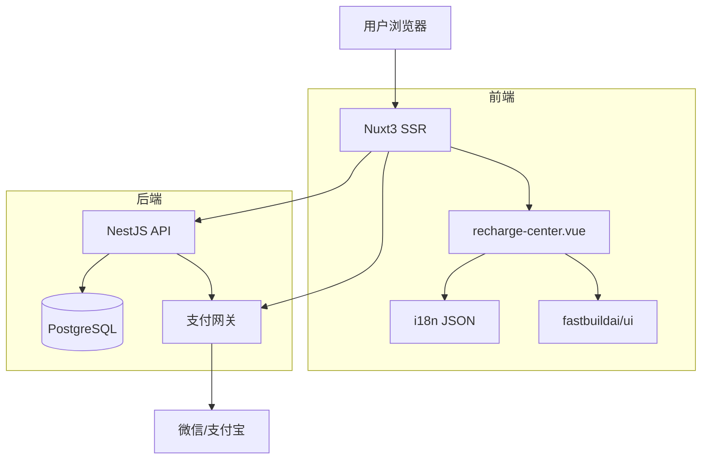
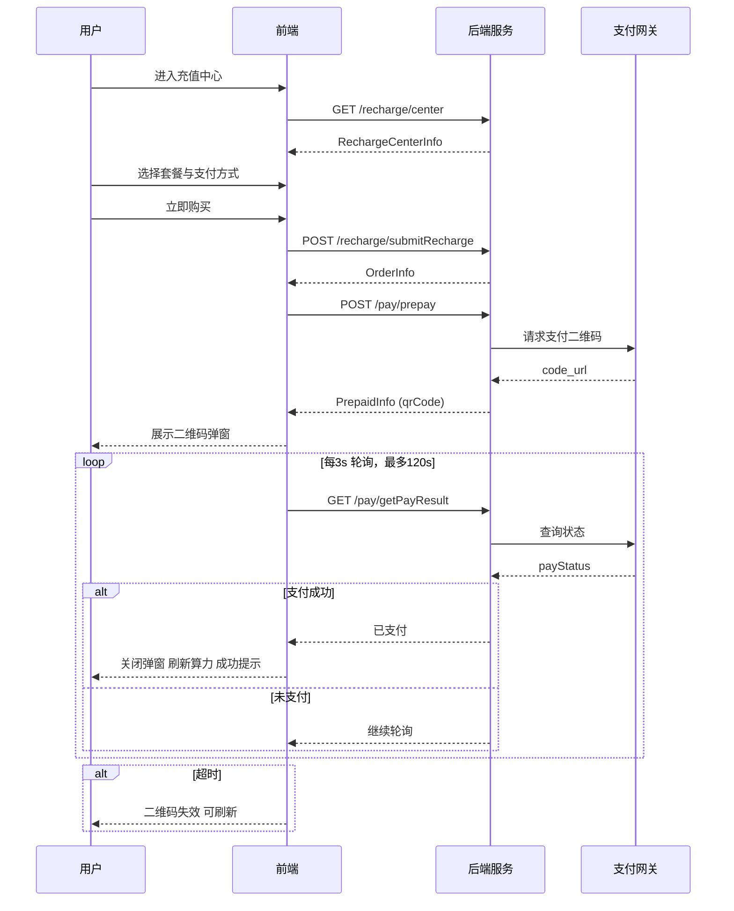
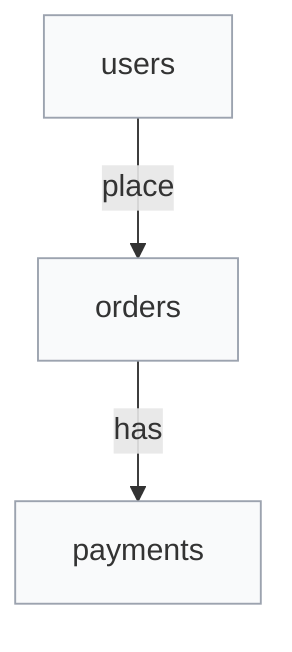

# BuildingAI 充值中心页面技术架构
## 1 总体架构


- 前端：Nuxt3 + Vue3 + TypeScript + Tailwind + @fastbuildai/ui  
- 后端：NestJS + TypeORM + PostgreSQL  
- 支付：统一封装 `/pay/prepay` 与 `/pay/getPayResult`，支持微信/支付宝 Native 扫码  
- 国际化：locales 按 namespace 拆分，运行时切换  
- 组件库：ProModal、URadioGroup、UButton、UAvatar 等  

---

## 2 前端架构
### 2.1 页面组件结构
```
app/profile/personal-rights/recharge-center.vue
├─ `<script setup>`
│  ├─ 接口调用：getRechargeCenterInfo / recharge / prepaid / getPayResult
│  ├─ 状态：selectedOptionIndex、selectedPaymentMethod、prepaidData、orderInfo...
│  ├─ 轮询：startPolling() / clearInterval
│  └─ 国际化：useI18n()
├─ `<template>`
│  ├─ 用户信息卡片（头像、昵称、算力余额）
│  ├─ 套餐选择（v-for RechargeRule）
│  ├─ 支付方式（URadioGroup）
│  ├─ 充值说明（v-html）
│  ├─ 立即购买 → ProModal（二维码/刷新/超时）
│  └─ 成功弹窗（继续充值 / 查看记录）
└─ `<style>` 纯 Tailwind，无 scoped
```

### 2.2 状态管理
- 全局：useUserStore() 存放 user.power，支付成功后主动刷新  
- 页面级：ref / computed，无 Pinia 模块（轻量）  
- 轮询定时器：页面卸载 onUnmounted 统一 clear  

### 2.3 路由与权限
```ts
definePageMeta({
  layout: 'setting',
  title: 'menu.rechargeCenter',
  inSystem: true,
  inLinkSelector: true
})
```
- 依赖登录态：middleware 已全局鉴权  
- 功能开关：rechargeStatus=false 时展示「暂未开放」锁屏  

### 2.4 数据流与生命周期
1. `onMounted → getRechargeCenterInfo()` → 渲染套餐/支付列表  
2. 点击「立即购买」→ `recharge()` 得 orderInfo → `prepaid()` 得 qrCode → 弹窗  
3. `startPolling()` 3 s 间隔 `getPayResult()`  
   - payStatus=1 → 停止轮询 → toast + 刷新 user.power → 展示成功弹窗  
   - 120 s 超时 → 二维码失效 → 可刷新重试  
4. 关闭弹窗 → 清除定时器 & 重置状态  

### 2.5 异常与超时处理
- 接口报错：统一 catch → useMessage() toast 提示  
- 二维码 120 s 过期：前端硬编码，支持手动刷新  
- 轮询网络失败：仅 console.error，继续下一次（容错）  

---

## 3 后端接口与模型
### 3.1 接口列表
| Method | Path | 描述 |
|--------|------|------|
| GET | `/recharge/center` | 获取充值中心信息 |
| POST | `/recharge/submitRecharge` | 提交订单 |
| POST | `/pay/prepay` | 获取付款码 |
| GET | `/pay/getPayResult` | 查询支付结果 |
| GET | `/recharge-config` | 运营后台-读取配置 |
| POST | `/recharge-config` | 运营后台-保存配置 |

### 3.2 核心模型（TypeScript）
```ts
interface RechargeCenterInfo {
  rechargeStatus: boolean
  rechargeRule: RechargeRule[]
  payWayList: { payType: number; name: string; logo: string }[]
  rechargeExplain: string
  user: { id: string; username: string; avatar: string; power: number }
}
interface OrderParams { id: string; payType: number }
interface OrderInfo { orderId: string; orderNo: string; orderAmount: string }
interface PrepaidParams { orderId: string; payType: number; from: 'recharge' }
interface PrepaidInfo { payType: number; qrCode: { code_url: string } }
interface PayResult { id: string; orderNo: string; payStatus: 0 | 1 }
```

### 3.3 错误码约定
- 200：业务成功  
- 4xx：参数/权限问题，前端直接 toast  
- 5xx：服务端异常，提示「系统繁忙，请稍后再试」  

### 3.4 幂等与重试
- 订单提交：orderNo 全局唯一，幂等  
- 预付款：orderId+payType 幂等，返回相同 qrCode  
- 轮询：只读，无副作用  

---

## 4 支付流程时序图


---

## 5 运营配置端架构
- 页面：`app/console/user/user-recharge/index.vue`  
- 权限：console 角色，通过 RLS & Auth 守卫  
- 配置模型：`RechargeConfigData { rechargeStatus, rechargeRule[], rechargeExplain }`  
- 保存：点击「保存」→ `saveRechargeRules()` → 实时生效（无灰度）  
- 实时预览：保存后立即影响 C 端展示  

---

## 6 国际化方案
- 文件结构：`core/i18n/{zh,en,jp}/web-personal-rights.json`  
- 命名：`rechargeCenter.*` 层级，例：`rechargeCenter.paymentMethod`  
- 运行时切换：`useI18n().locale.value = lang`  
- 新增文案：在对应 namespace 添加 key → 自动类型推导（已生成类型声明）  

---

## 7 安全与合规
- 支付条款：文案可配置，链接固定 `/agreement?type=agreement&item=payment`  
- CSRF：Nuxt3 SSR 自带 SameSite + Origin 校验  
- XSS：二维码 url 仅作 `` 输出，不注入 html  
- 敏感信息：订单金额/用户手机号中间位脱敏（后端统一）  
- 退款与对账：仅后台控制台可操作，接口鉴权 & 操作日志落表  

---

## 8 性能与监控
- 接口缓存：`/recharge/center` 可缓存 60 s（Edge Functions 层）  
- 二维码：有效期 120 s，前端倒计时刷新  
- 埋点：关键事件（见 PRD 埋点建议）→ 上报 PostHog  
- 前端性能：LCP < 2.5 s，CLS < 0.1，TTFB 由 Supabase 边缘节点保障  
- 后端告警：支付成功率 < 95% 或平均响应 > 500 ms 触发飞书机器人  

---

## 9 部署与回滚
- 前端：GitHub Actions → pnpm build → 静态推送至 Vercel（边缘缓存）  
- 后端：Edge Functions Git 集成，push 即部署，零停机  
- 配置灰度：当前无灰度，后续可接 Supabase Preview Branch  
- 回滚：前端 Vercel 一键回滚；后端 git revert & force push  

---

## 10 扩展与后续规划
| 能力 | 方案概要 |
|------|----------|
| 更多支付方式 | payType 枚举扩展，配置端动态读取 |
| 发票 | 订单完成后调用开票接口，用户端可下载 pdf |
| 订阅制 | 新增 `/subscription` 模块，与充值并存 |
| 优惠券 | 下单时传入 couponCode，后端校验 |
| 用户端退款 | 新增 `/refund` 申请入口，走审批流 |

---

## 11 附录
### 11.1 核心代码片段
```ts
// 轮询支付结果
const startPolling = () => {
  const timer = setInterval(async () => {
    const res = await getPayResult({ orderId: orderInfo.value!.orderId, from: 'recharge' })
    if (res.payStatus === 1) { clearInterval(timer); /* 成功处理 */ }
  }, 3000)
  setTimeout(() => { clearInterval(timer); isQrCodeExpired.value = true }, 120000)
}
```

### 11.2 数据库 ER（核心字段）


### 11.3 接口变更记录
| 日期 | 版本 | 变更内容 |
|------|------|----------|
| 2025-06 | v1.0 | 初始版本，支持微信/支付宝扫码 |

### 11.4 常见坑与排查
- 二维码不显示：确认 `code_url` 为 base64 或有效 https  
- 轮询 404：orderId 未落库，检查 Edge Functions 日志  
- 支付成功未刷新余额：未触发 `userStore.getUser()`，查看网络是否命中缓存  

---

> 本架构随业务迭代持续更新，任何调整请同步修订本文档并在 MR 中关联。