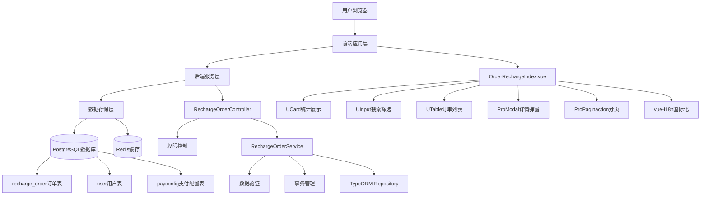
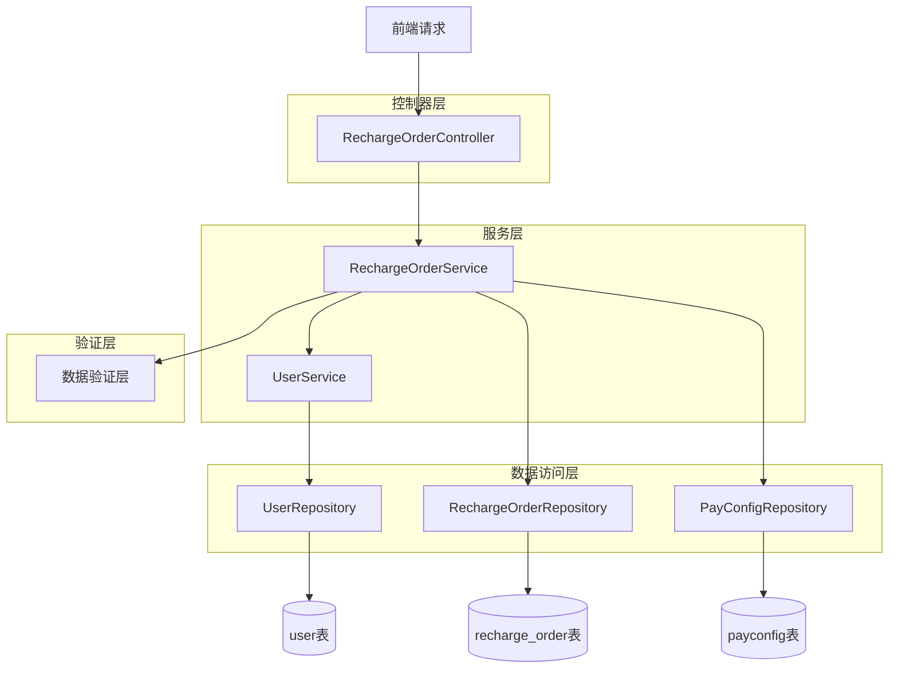
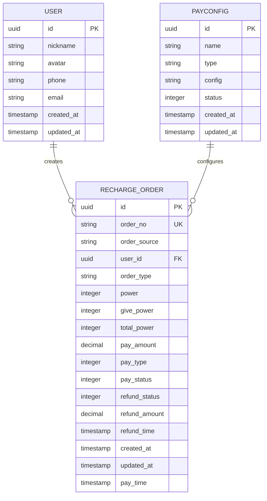

# BuildingAI充值订单页面技术架构文档

## 1. 架构设计



## 2. 技术栈描述

### 2.1 前端技术栈
- **核心框架**: Nuxt3 + Vue3 + TypeScript
- **UI组件库**: @fastbuildai/ui (UCard, UInput, USelect, UTable, UBadge, UAvatar, UDropdownMenu, ProModal, ProPaginaction)
- **样式框架**: Tailwind CSS
- **国际化**: vue-i18n (支持中文、英文、日文)
- **状态管理**: Vue3 Composition API (ref, reactive, computed, watch)
- **数据格式化**: Intl.NumberFormat (货币格式化)
- **时间组件**: TimeDisplay (时间格式化显示)
- **权限控制**: AccessControl (前端权限控制组件)
- **构建工具**: Vite + Turbo
- **代码规范**: ESLint + Prettier

### 2.2 后端技术栈
- **核心框架**: NestJS + TypeScript
- **ORM框架**: TypeORM
- **数据验证**: class-validator + class-transformer
- **权限控制**: 自定义 @Permissions 装饰器
- **事务管理**: @Transactional 装饰器
- **数据库**: PostgreSQL
- **缓存系统**: Redis
- **构建工具**: Turbo + TypeScript Compiler

### 2.3 开发工具
- **包管理**: pnpm
- **代码格式**: Prettier
- **代码检查**: ESLint
- **类型检查**: TypeScript
- **构建系统**: Turbo (monorepo)

## 3. 路由定义

| 路由                                        | 用途                      |
| ----------------------------------------- | ----------------------- |
| /console/order-management/order-recharge | 充值订单管理页面，管理员查看和管理用户充值订单 |

## 4. API定义

### 4.1 核心API

#### 获取订单列表

```
GET /api/console/recharge-order
```

**权限要求**: `recharge-order:list`

**请求参数**:

| 参数名称       | 参数类型   | 是否必填  | 描述                           |
| ---------- | ------ | ----- | ---------------------------- |
| page       | number | false | 页码，默认1                       |
| pageSize   | number | false | 每页条数，默认10                    |
| orderNo    | string | false | 订单号搜索                        |
| keyword    | string | false | 用户关键字搜索(ID/昵称/手机号)           |
| payType    | string | false | 支付方式筛选(1:微信,2:支付宝,all:全部)    |
| payStatus  | string | false | 支付状态筛选(1:已支付,0:未支付,all:全部)   |
| refundStatus | string | false | 退款状态筛选(1:已退款,0:未退款,all:全部) |

**响应示例**:

```json
{
  "data": [
    {
      "id": "uuid-1",
      "orderNo": "RO202312010001",
      "userId": "user-uuid-1",
      "user": {
        "id": "user-uuid-1",
        "nickname": "张三",
        "avatar": "https://example.com/avatar.jpg",
        "phone": "138****8888"
      },
      "power": 1000,
      "givePower": 100,
      "totalPower": 1100,
      "payAmount": 10.00,
      "payType": 1,
      "payStatus": 1,
      "refundStatus": 0,
      "createdAt": "2023-12-01T10:00:00Z",
      "payTime": "2023-12-01T10:05:00Z"
    }
  ],
  "total": 100,
  "page": 1,
  "pageSize": 10,
  "statistics": {
    "totalOrder": 100,
    "totalAmount": 1000.00,
    "totalRefundOrder": 5,
    "totalRefundAmount": 50.00,
    "totalIncome": 950.00
  }
}
```

#### 获取订单详情

```
GET /api/console/recharge-order/:id
```

**权限要求**: `recharge-order:detail`

**路径参数**:

| 参数名称 | 参数类型   | 是否必填 | 描述   |
| ---- | ------ | ---- | ---- |
| id   | string | true | 订单ID |

**响应示例**:

```json
{
  "id": "uuid-1",
  "orderNo": "RO202312010001",
  "orderSource": "web",
  "userId": "user-uuid-1",
  "user": {
    "id": "user-uuid-1",
    "nickname": "张三",
    "avatar": "https://example.com/avatar.jpg",
    "phone": "138****8888"
  },
  "orderType": "recharge",
  "power": 1000,
  "givePower": 100,
  "totalPower": 1100,
  "payAmount": 10.00,
  "payType": 1,
  "payStatus": 1,
  "refundStatus": 0,
  "refundAmount": 0.00,
  "refundTime": null,
  "createdAt": "2023-12-01T10:00:00Z",
  "payTime": "2023-12-01T10:05:00Z"
}
```

#### 申请退款

```
POST /api/console/recharge-order/refund
```

**权限要求**: `recharge-order:refund`

**请求参数**:

| 参数名称    | 参数类型   | 是否必填 | 描述   |
| ------- | ------ | ---- | ---- |
| orderId | string | true | 订单ID |

**请求示例**:

```json
{
  "orderId": "uuid-1"
}
```

**响应示例**:

```json
{
  "success": true,
  "message": "退款申请提交成功"
}
```

## 5. 服务架构图



## 6. 数据模型

### 6.1 数据模型定义



### 6.2 数据定义语言

#### recharge_order表（充值订单）

```sql
-- 创建充值订单表
CREATE TABLE recharge_order (
    id UUID PRIMARY KEY DEFAULT gen_random_uuid(),
    order_no VARCHAR(32) UNIQUE NOT NULL COMMENT '订单号',
    order_source VARCHAR(16) DEFAULT 'web' COMMENT '订单来源',
    user_id UUID NOT NULL COMMENT '用户ID',
    order_type VARCHAR(16) DEFAULT 'recharge' COMMENT '订单类型',
    power INTEGER NOT NULL COMMENT '充值数量',
    give_power INTEGER NOT NULL DEFAULT 0 COMMENT '赠送数量',
    total_power INTEGER NOT NULL COMMENT '到账数量',
    pay_amount DECIMAL(10,2) NOT NULL COMMENT '实付金额',
    pay_type INTEGER NOT NULL COMMENT '支付方式(1:微信,2:支付宝)',
    pay_status INTEGER DEFAULT 0 COMMENT '支付状态(0:未支付,1:已支付)',
    refund_status INTEGER DEFAULT 0 COMMENT '退款状态(0:未退款,1:已退款)',
    refund_amount DECIMAL(10,2) DEFAULT 0.00 COMMENT '退款金额',
    refund_time TIMESTAMP WITH TIME ZONE COMMENT '退款时间',
    created_at TIMESTAMP WITH TIME ZONE DEFAULT NOW(),
    updated_at TIMESTAMP WITH TIME ZONE DEFAULT NOW(),
    pay_time TIMESTAMP WITH TIME ZONE COMMENT '支付时间'
);

-- 创建索引
CREATE INDEX idx_recharge_order_user_id ON recharge_order(user_id);
CREATE INDEX idx_recharge_order_order_no ON recharge_order(order_no);
CREATE INDEX idx_recharge_order_pay_status ON recharge_order(pay_status);
CREATE INDEX idx_recharge_order_refund_status ON recharge_order(refund_status);
CREATE INDEX idx_recharge_order_created_at ON recharge_order(created_at DESC);

-- 创建外键约束
ALTER TABLE recharge_order ADD CONSTRAINT fk_recharge_order_user_id 
FOREIGN KEY (user_id) REFERENCES "user"(id);

-- 初始化测试数据
INSERT INTO recharge_order (order_no, user_id, power, give_power, total_power, pay_amount, pay_type, pay_status) VALUES
('RO202312010001', 'user-uuid-1', 1000, 100, 1100, 10.00, 1, 1),
('RO202312010002', 'user-uuid-2', 5000, 1000, 6000, 45.00, 2, 1),
('RO202312010003', 'user-uuid-3', 3000, 500, 3500, 28.00, 1, 0);
```

## 7. 前端组件架构

### 7.1 组件层次结构

```
OrderRechargeIndex.vue (主页面)
├── StatisticsCards (统计数据卡片)
├── SearchFilters (搜索筛选区域)
│   ├── OrderSearch (订单搜索)
│   ├── UserSearch (用户搜索)
│   ├── PayTypeFilter (支付方式筛选)
│   ├── PayStatusFilter (支付状态筛选)
│   └── RefundStatusFilter (退款状态筛选)
├── OrderTable (订单数据表格)
│   ├── UserColumn (用户信息列)
│   ├── PayStatusColumn (支付状态列)
│   └── ActionColumn (操作列)
├── OrderDetailModal (订单详情弹窗)
│   ├── OrderInfo (订单信息)
│   ├── UserInfo (用户信息)
│   ├── PaymentInfo (支付信息)
│   └── RefundAction (退款操作)
└── PaginationControl (分页控制)
```

### 7.2 状态管理

```typescript
// 页面状态定义
interface PageState {
  // 搜索筛选状态
  searchParams: {
    page: number;
    pageSize: number;
    orderNo: string;
    keyword: string;
    payType: string;
    payStatus: string;
    refundStatus: string;
  };
  
  // 订单数据状态
  orderList: OrderListItem[];
  total: number;
  statistics: OrderStatistics;
  
  // UI状态
  loading: boolean;
  detailModalVisible: boolean;
  selectedOrder: OrderDetailData | null;
}

// 统计数据类型
interface OrderStatistics {
  totalOrder: number;        // 总订单数
  totalAmount: number;       // 累计充值金额
  totalRefundOrder: number;  // 退款订单数
  totalRefundAmount: number; // 累计退款金额
  totalIncome: number;       // 净收入
}

// 数据获取和更新
const getOrderList = async () => {
  loading.value = true;
  try {
    const response = await apiGetOrderList(searchParams.value);
    orderList.value = response.data;
    total.value = response.total;
    statistics.value = response.statistics;
  } catch (error) {
    console.error('获取订单列表失败:', error);
  } finally {
    loading.value = false;
  }
};
```

### 7.3 数据验证

```typescript
// 前端验证规则
const validateSearchParams = (params: SearchParams) => {
  const errors: string[] = [];
  
  if (params.page < 1) {
    errors.push('页码必须大于0');
  }
  
  if (params.pageSize < 1 || params.pageSize > 100) {
    errors.push('每页条数必须在1-100之间');
  }
  
  if (params.orderNo && params.orderNo.length > 32) {
    errors.push('订单号长度不能超过32个字符');
  }
  
  if (params.keyword && params.keyword.length > 50) {
    errors.push('搜索关键字长度不能超过50个字符');
  }
  
  return errors;
};

// 退款条件验证
const canRefund = (order: OrderListItem) => {
  return order.payStatus === 1 && order.refundStatus === 0;
};
```

## 8. 后端服务实现

### 8.1 控制器实现

```typescript
@ConsoleController("recharge-order", "充值订单")
export class RechargeOrderController extends BaseController {
    constructor(private readonly rechargeOrderService: RechargeOrderService) {
        super();
    }

    @Get()
    @Permissions({
        code: "list",
        name: "获取充值订单列表",
        description: "获取充值订单列表",
    })
    async getOrderList(@Query() query: OrderListQueryDto) {
        return await this.rechargeOrderService.getOrderList(query);
    }

    @Get(":id")
    @Permissions({
        code: "detail",
        name: "获取充值订单详情",
        description: "获取充值订单详情",
    })
    async getOrderDetail(@Param("id") id: string) {
        return await this.rechargeOrderService.getOrderDetail(id);
    }

    @Post("refund")
    @Permissions({
        code: "refund",
        name: "申请充值订单退款",
        description: "申请充值订单退款",
    })
    async refundOrder(@Body() refundDto: RefundOrderDto) {
        return await this.rechargeOrderService.refundOrder(refundDto);
    }
}
```

### 8.2 服务层实现

```typescript
@Injectable()
export class RechargeOrderService extends BaseService<RechargeOrder> {
    constructor(
        @InjectRepository(RechargeOrder)
        private readonly rechargeOrderRepository: Repository<RechargeOrder>,
        @InjectRepository(User)
        private readonly userRepository: Repository<User>,
    ) {
        super();
    }

    async getOrderList(query: OrderListQueryDto) {
        const { page = 1, pageSize = 10, orderNo, keyword, payType, payStatus, refundStatus } = query;
        
        const queryBuilder = this.rechargeOrderRepository
            .createQueryBuilder('order')
            .leftJoinAndSelect('order.user', 'user')
            .select([
                'order.id',
                'order.orderNo',
                'order.power',
                'order.givePower',
                'order.totalPower',
                'order.payAmount',
                'order.payType',
                'order.payStatus',
                'order.refundStatus',
                'order.createdAt',
                'order.payTime',
                'user.id',
                'user.nickname',
                'user.avatar',
                'user.phone'
            ]);

        // 构建查询条件
        if (orderNo) {
            queryBuilder.andWhere('order.orderNo LIKE :orderNo', { orderNo: `%${orderNo}%` });
        }
        
        if (keyword) {
            queryBuilder.andWhere(
                '(user.nickname LIKE :keyword OR user.phone LIKE :keyword OR user.id::text LIKE :keyword)',
                { keyword: `%${keyword}%` }
            );
        }
        
        if (payType && payType !== 'all') {
            queryBuilder.andWhere('order.payType = :payType', { payType: parseInt(payType) });
        }
        
        if (payStatus && payStatus !== 'all') {
            queryBuilder.andWhere('order.payStatus = :payStatus', { payStatus: parseInt(payStatus) });
        }
        
        if (refundStatus && refundStatus !== 'all') {
            queryBuilder.andWhere('order.refundStatus = :refundStatus', { refundStatus: parseInt(refundStatus) });
        }

        // 排序和分页
        queryBuilder
            .orderBy('order.createdAt', 'DESC')
            .skip((page - 1) * pageSize)
            .take(pageSize);

        const [data, total] = await queryBuilder.getManyAndCount();
        
        // 计算统计数据
        const statistics = await this.calculateStatistics();

        return {
            data,
            total,
            page,
            pageSize,
            statistics
        };
    }

    async getOrderDetail(id: string) {
        const order = await this.rechargeOrderRepository
            .createQueryBuilder('order')
            .leftJoinAndSelect('order.user', 'user')
            .where('order.id = :id', { id })
            .getOne();

        if (!order) {
            throw new NotFoundException('订单不存在');
        }

        return order;
    }

    @Transactional()
    async refundOrder(refundDto: RefundOrderDto) {
        const { orderId } = refundDto;
        
        const order = await this.rechargeOrderRepository.findOne({
            where: { id: orderId }
        });

        if (!order) {
            throw new NotFoundException('订单不存在');
        }

        if (order.payStatus !== 1) {
            throw new BadRequestException('订单未支付，无法退款');
        }

        if (order.refundStatus === 1) {
            throw new BadRequestException('订单已退款');
        }

        // 更新订单状态
        await this.rechargeOrderRepository.update(orderId, {
            refundStatus: 1,
            refundAmount: order.payAmount,
            refundTime: new Date()
        });

        return { success: true, message: '退款申请提交成功' };
    }

    private async calculateStatistics() {
        const result = await this.rechargeOrderRepository
            .createQueryBuilder('order')
            .select([
                'COUNT(*) as totalOrder',
                'SUM(CASE WHEN pay_status = 1 THEN pay_amount ELSE 0 END) as totalAmount',
                'COUNT(CASE WHEN refund_status = 1 THEN 1 END) as totalRefundOrder',
                'SUM(CASE WHEN refund_status = 1 THEN refund_amount ELSE 0 END) as totalRefundAmount'
            ])
            .getRawOne();

        const totalIncome = (result.totalAmount || 0) - (result.totalRefundAmount || 0);

        return {
            totalOrder: parseInt(result.totalOrder) || 0,
            totalAmount: parseFloat(result.totalAmount) || 0,
            totalRefundOrder: parseInt(result.totalRefundOrder) || 0,
            totalRefundAmount: parseFloat(result.totalRefundAmount) || 0,
            totalIncome
        };
    }
}
```

### 8.3 数据传输对象

```typescript
export class OrderListQueryDto {
    @IsOptional()
    @Type(() => Number)
    @IsInt({ message: "页码必须是整数" })
    @Min(1, { message: "页码必须大于0" })
    page?: number = 1;

    @IsOptional()
    @Type(() => Number)
    @IsInt({ message: "每页条数必须是整数" })
    @Min(1, { message: "每页条数必须大于0" })
    @Max(100, { message: "每页条数不能超过100" })
    pageSize?: number = 10;

    @IsOptional()
    @IsString({ message: "订单号必须是字符串" })
    @MaxLength(32, { message: "订单号长度不能超过32个字符" })
    orderNo?: string;

    @IsOptional()
    @IsString({ message: "关键字必须是字符串" })
    @MaxLength(50, { message: "关键字长度不能超过50个字符" })
    keyword?: string;

    @IsOptional()
    @IsString({ message: "支付方式必须是字符串" })
    @IsIn(['1', '2', 'all'], { message: "支付方式只能是1、2或all" })
    payType?: string;

    @IsOptional()
    @IsString({ message: "支付状态必须是字符串" })
    @IsIn(['0', '1', 'all'], { message: "支付状态只能是0、1或all" })
    payStatus?: string;

    @IsOptional()
    @IsString({ message: "退款状态必须是字符串" })
    @IsIn(['0', '1', 'all'], { message: "退款状态只能是0、1或all" })
    refundStatus?: string;
}

export class RefundOrderDto {
    @IsUUID(4, { message: "订单ID格式不正确" })
    @IsNotEmpty({ message: "订单ID不能为空" })
    orderId: string;
}
```

## 9. 安全考虑

### 9.1 权限控制

* **基于角色的访问控制（RBAC）**
  - recharge-order:list - 查看订单列表权限
  - recharge-order:detail - 查看订单详情权限
  - recharge-order:refund - 处理订单退款权限

* **API级别的权限验证**
  - 每个接口都有对应的权限验证
  - 使用@Permissions装饰器进行权限控制

* **前端路由守卫**
  - AccessControl组件进行前端权限控制
  - 根据用户权限动态显示操作按钮

### 9.2 数据验证

* **前后端双重验证**
  - 前端使用TypeScript类型检查和自定义验证
  - 后端使用class-validator进行数据验证

* **SQL注入防护**
  - 使用TypeORM的参数化查询
  - 避免直接拼接SQL语句

* **XSS攻击防护**
  - 前端输入数据转义
  - 后端数据输出过滤

### 9.3 操作审计

* **订单操作日志记录**
  - 记录订单查看、退款等关键操作
  - 包含操作人、操作时间、操作内容

* **用户操作追踪**
  - 记录管理员的操作行为
  - 支持操作回溯和审计

* **异常操作告警**
  - 监控异常退款操作
  - 大额订单操作告警

## 10. 性能优化

### 10.1 前端优化

* **组件懒加载**
  - 订单详情弹窗按需加载
  - 大数据表格虚拟滚动

* **数据缓存策略**
  - 统计数据短期缓存
  - 用户信息本地缓存

* **防抖处理用户输入**
  - 搜索输入防抖处理
  - 避免频繁API调用

### 10.2 后端优化

* **数据库查询优化**
  - 使用索引优化查询性能
  - 分页查询避免全表扫描
  - 统计数据使用聚合查询

* **Redis缓存策略**
  - 热点数据缓存
  - 统计数据定时更新缓存

* **事务处理优化**
  - 退款操作使用事务确保数据一致性
  - 避免长事务影响性能

### 10.3 数据库优化

* **合理的索引设计**
  - 用户ID、订单号、状态字段建立索引
  - 创建时间建立降序索引支持排序

* **查询语句优化**
  - 使用JOIN减少查询次数
  - 避免N+1查询问题

* **连接池配置**
  - 合理配置数据库连接池大小
  - 监控连接池使用情况