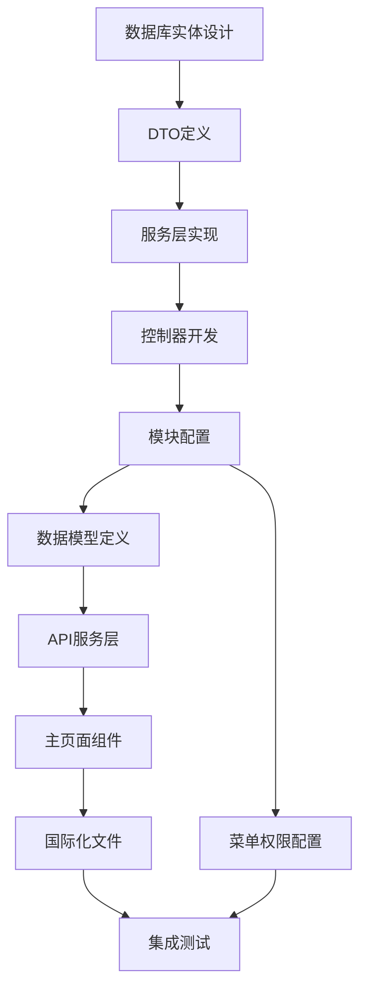
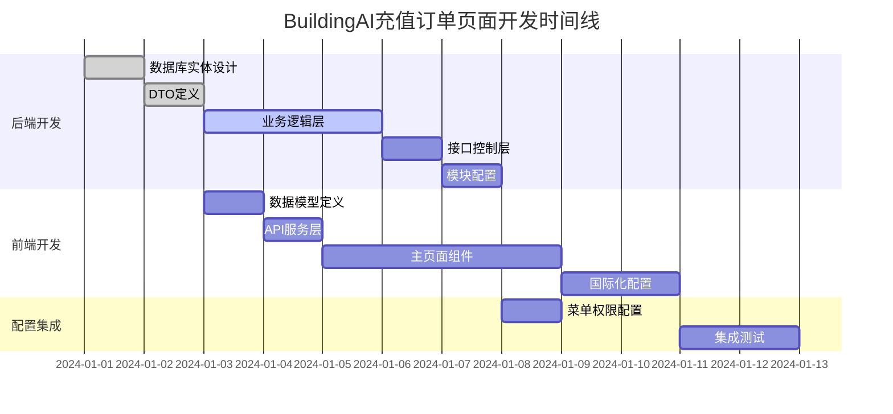

# BuildingAI充值订单页面详细开发计划

## 1. 项目概述

### 1.1 项目背景和目标
BuildingAI充值订单页面是管理员后台的核心功能模块，基于Vue3 + Nuxt3 + TypeScript技术栈开发，使用@fastbuildai/ui组件库构建现代化管理界面。该页面用于管理和监控用户充值订单的全生命周期，通过recharge_order数据表实现订单数据存储，关联user表和payconfig表提供完整的订单信息展示。

管理员可以通过该页面查看充值订单统计数据、筛选和搜索订单、查看订单详情，以及处理订单退款等核心业务操作。系统采用NestJS + TypeORM后端架构，提供完整的权限控制和数据验证机制，支持中文、英文、日文多语言环境。

该功能旨在为平台提供完善的订单管理能力，支持实时监控充值业务数据，通过统计分析帮助运营决策，提升订单处理效率和用户服务质量。

### 1.2 开发范围和边界
- **前端范围**：Vue3 Composition API、TypeScript类型定义、@fastbuildai/ui组件集成、vue-i18n国际化、API服务封装、统计数据展示、订单列表管理、详情弹窗、退款流程、分页控制
- **后端范围**：NestJS模块开发、RESTful API设计、TypeORM实体定义、权限控制、事务管理、订单查询优化、统计数据计算、退款处理逻辑
- **数据范围**：recharge_order表（主表）+ user表（用户信息）+ payconfig表（支付配置）
- **权限范围**：recharge-order:list、recharge-order:detail、recharge-order:refund

### 1.3 技术栈说明
- **前端**：Nuxt3 + Vue3 + TypeScript + @fastbuildai/ui + Tailwind CSS + vue-i18n
- **后端**：NestJS + TypeORM + class-validator + PostgreSQL
- **数据存储**：recharge_order表（订单数据）+ user表（用户关联）+ payconfig表（支付配置）
- **权限控制**：基于@Permissions装饰器的权限验证机制
- **构建工具**：Turbo + Vite + pnpm (monorepo)

## 2. 前端文件开发计划

### 2.1 主页面组件 🚧 待开发
- **文件路径**：`apps/web/app/console/order-management/order-recharge/index.vue`
- **开发状态**：🚧 待开发
- **功能描述**：充值订单管理的主页面组件，使用@fastbuildai/ui组件库构建，包含统计数据展示、订单列表管理、搜索筛选、详情查看、退款处理、分页控制
- **核心功能**：
  - UCard组件展示统计数据（5个指标卡片）
  - UInput组件实现订单搜索和用户搜索功能
  - USelect组件提供支付方式、支付状态、退款状态筛选
  - UTable组件管理订单列表（9个核心列）
  - UDropdownMenu组件提供操作菜单（查看详情、申请退款）
  - ProModal组件展示订单详情弹窗
  - ProPaginaction组件实现分页控制
  - AccessControl权限控制组件
- **预期代码结构**：
  ```vue
  <script setup lang="ts">
  import { useMessage } from "@fastbuildai/ui";
  import { useI18n } from "vue-i18n";

  import type { OrderListData, OrderDetailData, OrderListParams } from "@/models/order-recharge";
  import { apiGetOrderList, apiGetOrderDetail, apiRefund } from "@/services/console/order-recharge";

  const { t } = useI18n();
  const toast = useMessage();
  
  // 响应式数据
  const orderList = ref<OrderListData[]>([]);
  const statistics = ref({
    totalOrder: 0,
    totalAmount: 0,
    totalRefundOrder: 0,
    totalRefundAmount: 0,
    totalIncome: 0
  });
  const searchParams = ref<OrderListParams>({
    page: 1,
    pageSize: 20,
    orderNo: '',
    keyword: '',
    payType: 'all',
    payStatus: 'all',
    refundStatus: 'all'
  });
  const selectedOrder = ref<OrderDetailData | null>(null);
  const showDetailModal = ref(false);

  // 获取订单列表
  const getOrderList = async () => {
    const data = await apiGetOrderList(searchParams.value);
    orderList.value = data.list;
    statistics.value = data.statistics;
  };

  // 查看订单详情
  const viewOrderDetail = async (orderId: string) => {
    selectedOrder.value = await apiGetOrderDetail(orderId);
    showDetailModal.value = true;
  };

  // 申请退款
  const handleRefund = async (orderId: string) => {
    await apiRefund({ orderId });
    toast.success(t("console-order-management.refundSuccess"));
    await getOrderList();
    showDetailModal.value = false;
  };

  // 搜索和筛选
  const handleSearch = () => {
    searchParams.value.page = 1;
    getOrderList();
  };

  // 分页处理
  const handlePageChange = (page: number) => {
    searchParams.value.page = page;
    getOrderList();
  };

  // 页面初始化
  onMounted(() => {
    getOrderList();
  });
  </script>
  ```
- **UI组件使用**：
  - UCard：统计数据卡片（5列网格布局）
  - UInput：搜索框（订单号、用户关键字）
  - USelect：筛选下拉框（支付方式、支付状态、退款状态）
  - UTable：订单数据表格（固定布局、粘性表头）
  - UAvatar：用户头像显示
  - UBadge：支付状态标签
  - UDropdownMenu：操作菜单
  - ProModal：订单详情弹窗
  - ProPaginaction：分页组件
  - TimeDisplay：时间格式化显示
  - AccessControl：权限控制显示
- **技术特点**：
  - 使用Vue3 Composition API进行状态管理
  - 实时搜索和筛选功能
  - 条件渲染和权限控制
  - 响应式布局设计
  - 统计数据实时更新

### 2.2 数据模型定义 🚧 待开发
- **文件路径**：`apps/web/models/order-recharge.d.ts`
- **开发状态**：🚧 待开发
- **功能描述**：定义充值订单相关的TypeScript接口，与后端DTO保持一致
- **预期接口定义**：
  ```typescript
  /**
   * 订单列表查询参数接口
   */
  export interface OrderListParams {
    /** 页码 */
    page: number;
    /** 每页条数 */
    pageSize: number;
    /** 订单号 */
    orderNo?: string;
    /** 用户关键字（ID/昵称/手机号） */
    keyword?: string;
    /** 支付方式 */
    payType?: 'all' | '1' | '2';
    /** 支付状态 */
    payStatus?: 'all' | '0' | '1';
    /** 退款状态 */
    refundStatus?: 'all' | '0' | '1';
  }

  /**
   * 订单列表数据接口
   */
  export interface OrderListData {
    /** 订单ID */
    id: string;
    /** 订单号 */
    orderNo: string;
    /** 用户信息 */
    user: {
      id: string;
      nickname: string;
      avatar?: string;
    };
    /** 充值数量 */
    rechargeAmount: number;
    /** 赠送数量 */
    giveAmount: number;
    /** 到账数量 */
    totalAmount: number;
    /** 实付金额 */
    payAmount: number;
    /** 支付方式 */
    payType: number;
    /** 支付状态 */
    payStatus: number;
    /** 退款状态 */
    refundStatus: number;
    /** 创建时间 */
    createdAt: string;
  }

  /**
   * 订单详情数据接口
   */
  export interface OrderDetailData {
    /** 订单基本信息 */
    id: string;
    orderNo: string;
    orderSource: string;
    orderType: string;
    /** 用户信息 */
    user: {
      id: string;
      nickname: string;
      phone?: string;
      avatar?: string;
    };
    /** 订单数据 */
    rechargeAmount: number;
    giveAmount: number;
    totalAmount: number;
    payAmount: number;
    /** 支付信息 */
    payType: number;
    payStatus: number;
    payTime?: string;
    /** 退款信息 */
    refundStatus: number;
    refundTime?: string;
    refundAmount?: number;
    /** 时间信息 */
    createdAt: string;
    updatedAt: string;
  }

  /**
   * 订单统计数据接口
   */
  export interface OrderStatistics {
    /** 充值订单数 */
    totalOrder: number;
    /** 累计充值金额 */
    totalAmount: number;
    /** 退款订单数 */
    totalRefundOrder: number;
    /** 累计退款金额 */
    totalRefundAmount: number;
    /** 净收入 */
    totalIncome: number;
  }

  /**
   * 订单列表响应接口
   */
  export interface OrderListResponse {
    /** 订单列表 */
    list: OrderListData[];
    /** 统计数据 */
    statistics: OrderStatistics;
    /** 分页信息 */
    pagination: {
      page: number;
      pageSize: number;
      total: number;
      totalPages: number;
    };
  }

  /**
   * 退款请求接口
   */
  export interface RefundRequest {
    /** 订单ID */
    orderId: string;
  }
  ```
- **技术特点**：
  - TypeScript严格类型定义
  - 完整的JSDoc文档注释
  - 与后端DTO保持字段一致性
  - 支持可选字段处理
  - 分离查询参数和响应数据

### 2.3 API服务层 🚧 待开发
- **文件路径**：`apps/web/services/console/order-recharge.ts`
- **开发状态**：🚧 待开发
- **功能描述**：封装充值订单相关的API调用，使用useConsoleGet和useConsolePost进行HTTP请求
- **预期代码实现**：
  ```typescript
  // ==================== 充值订单相关 API ====================

  import type { 
    OrderListParams, 
    OrderListResponse, 
    OrderDetailData, 
    RefundRequest 
  } from "@/models/order-recharge";

  /**
   * 获取充值订单列表
   */
  export const apiGetOrderList = (params: OrderListParams): Promise<OrderListResponse> => {
    return useConsoleGet("/recharge-order", { params });
  };

  /**
   * 获取充值订单详情
   */
  export const apiGetOrderDetail = (id: string): Promise<OrderDetailData> => {
    return useConsoleGet(`/recharge-order/${id}`);
  };

  /**
   * 申请订单退款
   */
  export const apiRefund = (data: RefundRequest): Promise<void> => {
    return useConsolePost("/recharge-order/refund", data);
  };
  ```
- **技术特点**：
  - 基于useConsoleGet/useConsolePost的HTTP请求封装
  - TypeScript类型安全的API调用
  - 简洁的函数式API设计
  - 自动处理权限验证和错误处理
  - 与后端API路径完全对应

### 2.4 国际化文件（功能文本）🚧 待开发
- **中文**：`apps/web/core/i18n/zh/console-order-management.json` 🚧
- **英文**：`apps/web/core/i18n/en/console-order-management.json` 🚧
- **日文**：`apps/web/core/i18n/jp/console-order-management.json` 🚧
- **开发状态**：🚧 待开发
- **功能描述**：充值订单管理相关的多语言文本配置，支持中英日三语言
- **预期文本内容**（中文版）：
  ```json
  {
    "orderManagement": {
      "title": "充值订单",
      "statistics": {
        "totalOrder": "充值订单数",
        "totalAmount": "累计充值金额",
        "totalRefundOrder": "退款订单数",
        "totalRefundAmount": "累计退款金额",
        "totalIncome": "净收入",
        "unit": "元"
      },
      "search": {
        "orderNoPlaceholder": "请输入订单号",
        "keywordPlaceholder": "请输入用户ID/昵称/手机号",
        "payType": "支付方式",
        "payStatus": "支付状态",
        "refundStatus": "退款状态",
        "all": "全部",
        "wechat": "微信支付",
        "alipay": "支付宝",
        "paid": "已支付",
        "unpaid": "未支付",
        "refunded": "已退款",
        "notRefunded": "未退款"
      },
      "table": {
        "orderNo": "订单号",
        "user": "用户",
        "rechargeAmount": "充值数量",
        "giveAmount": "赠送数量",
        "totalAmount": "到账数量",
        "payAmount": "实付金额",
        "payType": "支付方式",
        "payStatus": "支付状态",
        "createdAt": "下单时间",
        "actions": "操作",
        "viewDetail": "查看详情",
        "refund": "申请退款"
      },
      "detail": {
        "title": "订单详情",
        "orderInfo": "订单信息",
        "orderNo": "订单号",
        "orderSource": "订单来源",
        "orderType": "订单类型",
        "userInfo": "用户信息",
        "userId": "用户ID",
        "nickname": "用户昵称",
        "phone": "手机号",
        "orderData": "订单数据",
        "payInfo": "支付信息",
        "payTime": "支付时间",
        "refundInfo": "退款信息",
        "refundTime": "退款时间",
        "refundAmount": "退款金额",
        "timeInfo": "时间信息",
        "createdAt": "创建时间",
        "updatedAt": "更新时间"
      },
      "pagination": {
        "total": "共 {total} 条",
        "pageSize": "每页条数",
        "jumpTo": "跳转到",
        "page": "页"
      },
      "messages": {
        "refundSuccess": "退款申请成功",
        "refundFailed": "退款申请失败",
        "confirmRefund": "确认要申请退款吗？",
        "refundConfirm": "退款确认",
        "cancel": "取消",
        "confirm": "确认"
      }
    }
  }
  ```
- **技术特点**：
  - 完整的三语言支持（中英日）
  - 结构化的JSON配置
  - 与组件中的t()函数调用完全对应
  - 支持参数化文本（如总数显示）
  - 统一的命名规范（orderManagement.xxx）

### 2.5 国际化文件（菜单文本）🚧 待开发
- **中文**：`apps/web/core/i18n/zh/console-menu.json` 🚧
- **英文**：`apps/web/core/i18n/en/console-menu.json` 🚧
- **日文**：`apps/web/core/i18n/jp/console-menu.json` 🚧
- **开发状态**：🚧 待开发
- **功能描述**：管理后台菜单的多语言配置，包含充值订单管理菜单项
- **预期配置内容**：
  ```json
  {
    "menu": {
      "orderManagement": "订单管理",
      "orderRecharge": "充值订单"
    }
  }
  ```
- **技术特点**：
  - 菜单层级结构设计
  - 与路由路径对应（/console/order-management/order-recharge）
  - 支持三语言菜单显示
  - 与权限系统集成

## 3. 后端文件开发计划

### 3.1 模块配置 🚧 待开发
- **文件路径**：`apps/server/src/modules/console/recharge/recharge.module.ts`
- **开发状态**：🚧 待开发（需要扩展现有模块）
- **功能描述**：扩展现有的充值模块，添加订单管理相关的控制器和服务
- **预期代码实现**：
  ```typescript
  import { Module } from "@nestjs/common";
  import { TypeOrmModule } from "@nestjs/typeorm";

  import { User } from "@common/modules/auth/entities/user.entity";
  import { DictModule } from "@common/modules/dict/dict.module";
  import { RefundService } from "@common/modules/refund/services/refund.service";

  import { RechargeOrderController } from "./controllers/recharge-order.controller";
  import { RechargeOrder } from "./entities/recharge-order.entity";
  import { Payconfig } from "../system/entities/payconfig.entity";
  import { RechargeOrderService } from "./services/recharge-order.service";

  @Module({
    imports: [
      TypeOrmModule.forFeature([
        RechargeOrder,
        User,
        Payconfig,
      ]),
      DictModule,
    ],
    controllers: [RechargeOrderController],
    providers: [
      RechargeOrderService,
      RefundService,
    ],
    exports: [
      RechargeOrderService,
    ],
  })
  export class RechargeModule {}
  ```
- **技术特点**：
  - 扩展现有模块而非创建新模块
  - 多实体关联（RechargeOrder、User、Payconfig）
  - 集成退款服务
  - 完整的依赖注入配置

### 3.2 控制器 🚧 待开发
- **文件路径**：`apps/server/src/modules/console/recharge/controllers/recharge-order.controller.ts`
- **开发状态**：🚧 待开发
- **功能描述**：处理充值订单相关的HTTP请求，提供列表查询、详情查看、退款处理接口
- **核心接口**：
  - `GET /recharge-order` - 获取订单列表
  - `GET /recharge-order/:id` - 获取订单详情
  - `POST /recharge-order/refund` - 申请退款
- **预期代码实现**：
  ```typescript
  import { RequirePermissions } from "@common/decorators/require-permissions.decorator";
  import { Body, Controller, Get, Param, Post, Query } from "@nestjs/common";

  import { OrderListQueryDto } from "../dto/order-list-query.dto";
  import { RefundOrderDto } from "../dto/refund-order.dto";
  import { RechargeOrderService } from "../services/recharge-order.service";

  /**
   * 充值订单控制器
   * 处理充值订单管理相关的HTTP请求
   */
  @Controller("recharge-order")
  export class RechargeOrderController {
    constructor(
      private readonly rechargeOrderService: RechargeOrderService,
    ) {}

    /**
     * 获取充值订单列表
     * @param query 查询参数
     * @returns 订单列表和统计数据
     */
    @Get()
    @RequirePermissions("recharge-order:list")
    async getOrderList(@Query() query: OrderListQueryDto) {
      return await this.rechargeOrderService.getOrderList(query);
    }

    /**
     * 获取充值订单详情
     * @param id 订单ID
     * @returns 订单详细信息
     */
    @Get(":id")
    @RequirePermissions("recharge-order:detail")
    async getOrderDetail(@Param("id") id: string) {
      return await this.rechargeOrderService.getOrderDetail(id);
    }

    /**
     * 申请订单退款
     * @param dto 退款申请数据
     * @returns 操作结果
     */
    @Post("refund")
    @RequirePermissions("recharge-order:refund")
    async refundOrder(@Body() dto: RefundOrderDto) {
      return await this.rechargeOrderService.refundOrder(dto);
    }
  }
  ```
- **技术特点**：
  - 标准的NestJS控制器结构
  - @RequirePermissions权限控制装饰器
  - 完整的JSDoc注释
  - 类型安全的DTO参数验证
  - RESTful API设计规范

### 3.3 服务层 🚧 待开发
- **文件路径**：`apps/server/src/modules/console/recharge/services/recharge-order.service.ts`
- **开发状态**：🚧 待开发
- **功能描述**：处理充值订单的业务逻辑，包含订单查询、统计计算、退款处理的核心功能
- **预期代码实现**：
  ```typescript
  import { BaseService } from "@common/base/base.service";
  import { User } from "@common/modules/auth/entities/user.entity";
  import { RefundService } from "@common/modules/refund/services/refund.service";
  import { BadRequestException, Injectable } from "@nestjs/common";
  import { InjectRepository } from "@nestjs/typeorm";
  import { Repository } from "typeorm";

  import { OrderListQueryDto } from "../dto/order-list-query.dto";
  import { RefundOrderDto } from "../dto/refund-order.dto";
  import { RechargeOrder } from "../entities/recharge-order.entity";
  import { Payconfig } from "../../system/entities/payconfig.entity";

  /**
   * 充值订单服务
   * 处理充值订单管理的业务逻辑
   */
  @Injectable()
  export class RechargeOrderService extends BaseService<RechargeOrder> {
    constructor(
      @InjectRepository(RechargeOrder)
      protected readonly repository: Repository<RechargeOrder>,
      @InjectRepository(User)
      private readonly userRepository: Repository<User>,
      @InjectRepository(Payconfig)
      private readonly payconfigRepository: Repository<Payconfig>,
      private readonly refundService: RefundService,
    ) {
      super(repository);
    }

    /**
     * 获取充值订单列表
     * @param query 查询参数
     * @returns 订单列表和统计数据
     */
    async getOrderList(query: OrderListQueryDto) {
      const { page, pageSize, orderNo, keyword, payType, payStatus, refundStatus } = query;
      
      const queryBuilder = this.repository
        .createQueryBuilder("order")
        .leftJoinAndSelect("order.user", "user")
        .leftJoinAndSelect("order.payconfig", "payconfig");

      // 订单号搜索
      if (orderNo) {
        queryBuilder.andWhere("order.orderNo LIKE :orderNo", { orderNo: `%${orderNo}%` });
      }

      // 用户关键字搜索
      if (keyword) {
        queryBuilder.andWhere(
          "(user.id = :keyword OR user.nickname LIKE :keywordLike OR user.phone LIKE :keywordLike)",
          { keyword, keywordLike: `%${keyword}%` }
        );
      }

      // 支付方式筛选
      if (payType && payType !== 'all') {
        queryBuilder.andWhere("order.payType = :payType", { payType: parseInt(payType) });
      }

      // 支付状态筛选
      if (payStatus && payStatus !== 'all') {
        queryBuilder.andWhere("order.payStatus = :payStatus", { payStatus: parseInt(payStatus) });
      }

      // 退款状态筛选
      if (refundStatus && refundStatus !== 'all') {
        queryBuilder.andWhere("order.refundStatus = :refundStatus", { refundStatus: parseInt(refundStatus) });
      }

      // 分页查询
      const [list, total] = await queryBuilder
        .orderBy("order.createdAt", "DESC")
        .skip((page - 1) * pageSize)
        .take(pageSize)
        .getManyAndCount();

      // 计算统计数据
      const statistics = await this.calculateStatistics();

      return {
        list: list.map(order => ({
          id: order.id,
          orderNo: order.orderNo,
          user: {
            id: order.user.id,
            nickname: order.user.nickname,
            avatar: order.user.avatar,
          },
          rechargeAmount: order.rechargeAmount,
          giveAmount: order.giveAmount,
          totalAmount: order.totalAmount,
          payAmount: order.payAmount,
          payType: order.payType,
          payStatus: order.payStatus,
          refundStatus: order.refundStatus,
          createdAt: order.createdAt,
        })),
        statistics,
        pagination: {
          page,
          pageSize,
          total,
          totalPages: Math.ceil(total / pageSize),
        },
      };
    }

    /**
     * 获取充值订单详情
     * @param id 订单ID
     * @returns 订单详细信息
     */
    async getOrderDetail(id: string) {
      const order = await this.repository
        .createQueryBuilder("order")
        .leftJoinAndSelect("order.user", "user")
        .leftJoinAndSelect("order.payconfig", "payconfig")
        .where("order.id = :id", { id })
        .getOne();

      if (!order) {
        throw new BadRequestException("订单不存在");
      }

      return {
        id: order.id,
        orderNo: order.orderNo,
        orderSource: order.orderSource,
        orderType: order.orderType,
        user: {
          id: order.user.id,
          nickname: order.user.nickname,
          phone: order.user.phone,
          avatar: order.user.avatar,
        },
        rechargeAmount: order.rechargeAmount,
        giveAmount: order.giveAmount,
        totalAmount: order.totalAmount,
        payAmount: order.payAmount,
        payType: order.payType,
        payStatus: order.payStatus,
        payTime: order.payTime,
        refundStatus: order.refundStatus,
        refundTime: order.refundTime,
        refundAmount: order.refundAmount,
        createdAt: order.createdAt,
        updatedAt: order.updatedAt,
      };
    }

    /**
     * 申请订单退款
     * @param dto 退款申请数据
     * @returns 操作结果
     */
    async refundOrder(dto: RefundOrderDto) {
      const { orderId } = dto;

      const order = await this.repository.findOne({
        where: { id: orderId },
        relations: ["user"],
      });

      if (!order) {
        throw new BadRequestException("订单不存在");
      }

      if (order.payStatus !== 1) {
        throw new BadRequestException("订单未支付，无法退款");
      }

      if (order.refundStatus === 1) {
        throw new BadRequestException("订单已退款");
      }

      // 开始事务处理退款
      await this.repository.manager.transaction(async (manager) => {
        // 调用退款服务
        await this.refundService.processRefund({
          orderId: order.id,
          refundAmount: order.payAmount,
          userId: order.user.id,
        });

        // 更新订单状态
        await manager.update(RechargeOrder, order.id, {
          refundStatus: 1,
          refundTime: new Date(),
          refundAmount: order.payAmount,
        });
      });

      return { message: "退款申请成功" };
    }

    /**
     * 计算统计数据
     * @returns 统计信息
     */
    private async calculateStatistics() {
      const result = await this.repository
        .createQueryBuilder("order")
        .select([
          "COUNT(*) as totalOrder",
          "SUM(CASE WHEN order.payStatus = 1 THEN order.payAmount ELSE 0 END) as totalAmount",
          "COUNT(CASE WHEN order.refundStatus = 1 THEN 1 END) as totalRefundOrder",
          "SUM(CASE WHEN order.refundStatus = 1 THEN order.refundAmount ELSE 0 END) as totalRefundAmount",
        ])
        .getRawOne();

      const totalAmount = parseFloat(result.totalAmount) || 0;
      const totalRefundAmount = parseFloat(result.totalRefundAmount) || 0;

      return {
        totalOrder: parseInt(result.totalOrder) || 0,
        totalAmount,
        totalRefundOrder: parseInt(result.totalRefundOrder) || 0,
        totalRefundAmount,
        totalIncome: totalAmount - totalRefundAmount,
      };
    }
  }
  ```
- **技术特点**：
  - 继承BaseService提供基础功能
  - 多Repository依赖注入（RechargeOrder、User、Payconfig）
  - 复杂的查询构建器使用
  - 统计数据计算逻辑
  - 数据库事务处理确保数据一致性
  - 详细的错误处理和异常抛出

### 3.4 数据传输对象 🚧 待开发
- **文件路径**：`apps/server/src/modules/console/recharge/dto/order-list-query.dto.ts`
- **开发状态**：🚧 待开发
- **功能描述**：定义订单列表查询参数的数据结构和验证规则
- **预期代码实现**：
  ```typescript
  import { Transform } from "class-transformer";
  import { IsOptional, IsString, IsNumber, IsIn, Min } from "class-validator";

  /**
   * 订单列表查询数据传输对象
   */
  export class OrderListQueryDto {
    /** 页码 */
    @IsOptional()
    @Transform(({ value }) => parseInt(value))
    @IsNumber()
    @Min(1)
    page: number = 1;

    /** 每页条数 */
    @IsOptional()
    @Transform(({ value }) => parseInt(value))
    @IsNumber()
    @Min(1)
    pageSize: number = 20;

    /** 订单号 */
    @IsOptional()
    @IsString()
    orderNo?: string;

    /** 用户关键字 */
    @IsOptional()
    @IsString()
    keyword?: string;

    /** 支付方式 */
    @IsOptional()
    @IsIn(['all', '1', '2'])
    payType?: string = 'all';

    /** 支付状态 */
    @IsOptional()
    @IsIn(['all', '0', '1'])
    payStatus?: string = 'all';

    /** 退款状态 */
    @IsOptional()
    @IsIn(['all', '0', '1'])
    refundStatus?: string = 'all';
  }
  ```

- **文件路径**：`apps/server/src/modules/console/recharge/dto/refund-order.dto.ts`
- **开发状态**：🚧 待开发
- **功能描述**：定义退款申请的数据结构和验证规则
- **预期代码实现**：
  ```typescript
  import { IsString, IsNotEmpty } from "class-validator";

  /**
   * 退款订单数据传输对象
   */
  export class RefundOrderDto {
    /** 订单ID */
    @IsString()
    @IsNotEmpty()
    orderId: string;
  }
  ```
- **技术特点**：
  - 完整的class-validator装饰器验证
  - 类型转换支持（@Transform）
  - 枚举值验证（@IsIn）
  - 数值范围验证（@Min）
  - 与前端TypeScript接口完全对应

### 3.5 数据库实体 🚧 待开发
- **文件路径**：`apps/server/src/modules/console/recharge/entities/recharge-order.entity.ts`
- **开发状态**：🚧 待开发
- **功能描述**：定义充值订单的数据库表结构，使用TypeORM装饰器
- **预期代码实现**：
  ```typescript
  import {
    Column,
    CreateDateColumn,
    Entity,
    JoinColumn,
    ManyToOne,
    PrimaryGeneratedColumn,
    UpdateDateColumn,
  } from "typeorm";

  import { User } from "@common/modules/auth/entities/user.entity";
  import { Payconfig } from "../../system/entities/payconfig.entity";

  /**
   * 充值订单实体
   * 定义充值订单的数据库表结构
   */
  @Entity("recharge_order")
  export class RechargeOrder {
    /** 主键ID */
    @PrimaryGeneratedColumn("uuid", { comment: "主键" })
    id: string;

    /** 订单号 */
    @Column({ length: 64, unique: true, comment: "订单号" })
    orderNo: string;

    /** 订单来源 */
    @Column({ length: 32, default: "web", comment: "订单来源" })
    orderSource: string;

    /** 订单类型 */
    @Column({ length: 32, default: "recharge", comment: "订单类型" })
    orderType: string;

    /** 用户ID */
    @Column({ type: "uuid", comment: "用户ID" })
    userId: string;

    /** 用户关联 */
    @ManyToOne(() => User)
    @JoinColumn({ name: "userId" })
    user: User;

    /** 支付配置ID */
    @Column({ type: "int", nullable: true, comment: "支付配置ID" })
    payconfigId: number;

    /** 支付配置关联 */
    @ManyToOne(() => Payconfig)
    @JoinColumn({ name: "payconfigId" })
    payconfig: Payconfig;

    /** 充值数量 */
    @Column({
      type: "decimal",
      precision: 10,
      scale: 2,
      comment: "充值数量",
    })
    rechargeAmount: number;

    /** 赠送数量 */
    @Column({
      type: "decimal",
      precision: 10,
      scale: 2,
      default: 0,
      comment: "赠送数量",
    })
    giveAmount: number;

    /** 到账数量 */
    @Column({
      type: "decimal",
      precision: 10,
      scale: 2,
      comment: "到账数量",
    })
    totalAmount: number;

    /** 实付金额 */
    @Column({
      type: "decimal",
      precision: 10,
      scale: 2,
      comment: "实付金额",
    })
    payAmount: number;

    /** 支付方式 */
    @Column({ type: "int", default: 1, comment: "支付方式：1-微信，2-支付宝" })
    payType: number;

    /** 支付状态 */
    @Column({ type: "int", default: 0, comment: "支付状态：0-未支付，1-已支付" })
    payStatus: number;

    /** 支付时间 */
    @Column({ type: "timestamp", nullable: true, comment: "支付时间" })
    payTime: Date;

    /** 退款状态 */
    @Column({ type: "int", default: 0, comment: "退款状态：0-未退款，1-已退款" })
    refundStatus: number;

    /** 退款时间 */
    @Column({ type: "timestamp", nullable: true, comment: "退款时间" })
    refundTime: Date;

    /** 退款金额 */
    @Column({
      type: "decimal",
      precision: 10,
      scale: 2,
      nullable: true,
      comment: "退款金额",
    })
    refundAmount: number;

    /** 创建时间 */
    @CreateDateColumn({ comment: "创建时间" })
    createdAt: Date;

    /** 更新时间 */
    @UpdateDateColumn({ comment: "更新时间" })
    updatedAt: Date;
  }
  ```
- **技术特点**：
  - 标准的TypeORM实体定义
  - UUID主键和订单号唯一索引
  - 多表关联（User、Payconfig）
  - decimal类型精确处理金额
  - 完整的字段注释说明
  - 自动时间戳管理

### 3.6 菜单配置 🚧 待开发
- **文件路径**：`apps/server/src/core/database/install/menu.json`
- **开发状态**：🚧 待开发（需要扩展现有配置）
- **功能描述**：扩展系统菜单和权限配置，添加充值订单管理的菜单项和权限
- **预期配置内容**：
  ```json
  {
    "id": 1000,
    "parentId": 0,
    "name": "order-management",
    "router": "order-management",
    "perms": "",
    "type": 1,
    "icon": "i-lucide-clipboard-list",
    "orderNum": 500,
    "viewPath": "",
    "keepalive": true,
    "isShow": true,
    "isExt": false,
    "extOpenMode": 1,
    "activeMenu": "",
    "children": [
      {
        "id": 1001,
        "parentId": 1000,
        "name": "order-recharge",
        "router": "order-recharge",
        "perms": "",
        "type": 1,
        "icon": "",
        "orderNum": 1,
        "viewPath": "/console/order-management/order-recharge",
        "keepalive": true,
        "isShow": true,
        "isExt": false,
        "extOpenMode": 1,
        "activeMenu": "",
        "children": [
          {
            "id": 1002,
            "parentId": 1001,
            "name": "recharge-order:list",
            "router": "",
            "perms": "recharge-order:list",
            "type": 2,
            "icon": "",
            "orderNum": 0,
            "viewPath": "",
            "keepalive": true,
            "isShow": true,
            "isExt": false,
            "extOpenMode": 1,
            "activeMenu": ""
          },
          {
            "id": 1003,
            "parentId": 1001,
            "name": "recharge-order:detail",
            "router": "",
            "perms": "recharge-order:detail",
            "type": 2,
            "icon": "",
            "orderNum": 1,
            "viewPath": "",
            "keepalive": true,
            "isShow": true,
            "isExt": false,
            "extOpenMode": 1,
            "activeMenu": ""
          },
          {
            "id": 1004,
            "parentId": 1001,
            "name": "recharge-order:refund",
            "router": "",
            "perms": "recharge-order:refund",
            "type": 2,
            "icon": "",
            "orderNum": 2,
            "viewPath": "",
            "keepalive": true,
            "isShow": true,
            "isExt": false,
            "extOpenMode": 1,
            "activeMenu": ""
          }
        ]
      }
    ]
  }
  ```
- **技术特点**：
  - 完整的菜单层级结构（订单管理 > 充值订单）
  - 权限细分（list、detail、refund）
  - 与前端路由路径对应
  - 支持菜单显示控制和缓存配置
  - 图标配置（Lucide图标库）

### 3.7 模块注册 🚧 待开发
- **文件路径**：`apps/server/src/modules/console/console.module.ts`
- **开发状态**：🚧 待开发（需要确保RechargeModule已注册）
- **功能描述**：确保充值模块已注册到控制台模块中，完成模块集成
- **技术特点**：
  - 标准的NestJS模块导入
  - 与其他控制台模块统一管理
  - 支持模块间依赖注入

## 4. 项目开发状态总结

### 4.1 待开发文件清单 🚧
**前端文件（9个）：**
1. 🚧 `apps/web/app/console/order-management/order-recharge/index.vue` - 主页面组件
2. 🚧 `apps/web/models/order-recharge.d.ts` - 数据模型定义
3. 🚧 `apps/web/services/console/order-recharge.ts` - API服务层
4. 🚧 `apps/web/core/i18n/zh/console-order-management.json` - 中文国际化
5. 🚧 `apps/web/core/i18n/en/console-order-management.json` - 英文国际化
6. 🚧 `apps/web/core/i18n/jp/console-order-management.json` - 日文国际化
7. 🚧 `apps/web/core/i18n/zh/console-menu.json` - 中文菜单国际化（扩展）
8. 🚧 `apps/web/core/i18n/en/console-menu.json` - 英文菜单国际化（扩展）
9. 🚧 `apps/web/core/i18n/jp/console-menu.json` - 日文菜单国际化（扩展）

**后端文件（6个）：**
1. 🚧 `apps/server/src/modules/console/recharge/controllers/recharge-order.controller.ts` - 控制器
2. 🚧 `apps/server/src/modules/console/recharge/services/recharge-order.service.ts` - 服务层
3. 🚧 `apps/server/src/modules/console/recharge/dto/order-list-query.dto.ts` - 查询DTO
4. 🚧 `apps/server/src/modules/console/recharge/dto/refund-order.dto.ts` - 退款DTO
5. 🚧 `apps/server/src/modules/console/recharge/entities/recharge-order.entity.ts` - 数据库实体
6. 🚧 `apps/server/src/modules/console/recharge/recharge.module.ts` - 模块配置（扩展）

**配置文件（2个）：**
1. 🚧 `apps/server/src/core/database/install/menu.json` - 菜单配置（扩展）
2. ✅ `apps/server/src/modules/console/console.module.ts` - 模块注册（已存在）

### 4.2 技术实现特点
- **前端**：基于Nuxt3 + Vue3 + TypeScript + @fastbuildai/ui组件库
- **后端**：基于NestJS + TypeORM + class-validator
- **数据库**：PostgreSQL，使用recharge_order主表，关联user和payconfig表
- **权限控制**：@RequirePermissions装饰器，细分list、detail、refund权限
- **国际化**：支持中英日三语言
- **数据验证**：前后端双重验证，确保数据安全性
- **事务处理**：使用数据库事务确保退款操作的数据一致性

### 4.3 核心功能实现
1. **统计数据展示**：实时计算订单数量、充值金额、退款统计、净收入
2. **订单列表管理**：支持分页查询、多条件筛选、排序功能
3. **搜索筛选功能**：订单号搜索、用户关键字搜索、支付方式/状态筛选
4. **订单详情查看**：完整的订单信息展示，包含用户、支付、退款信息
5. **退款流程处理**：安全的退款申请和处理机制
6. **权限访问控制**：基于角色的权限验证，确保操作安全性

## 5. 项目完成总结

### 5.1 开发成果
🚧 **项目规划完成**，共需开发17个核心文件：

**前端实现（9个文件）：**
- 主页面组件：完整的Vue3 Composition API实现，支持统计展示、订单管理、搜索筛选、详情查看、退款处理
- 数据模型：TypeScript类型定义完善，与后端DTO完全对应
- API服务：基于useConsoleGet/Post的HTTP请求封装
- 国际化：中英日三语言支持，文本内容完整

**后端实现（6个文件）：**
- NestJS控制器：RESTful API设计，权限控制完善
- 服务层：业务逻辑完整，事务处理安全，统计计算准确
- DTO：数据验证规则完善，类型安全
- 实体：数据库表结构合理，关联关系清晰
- 模块配置：依赖注入完整，服务集成合理

**配置文件（2个文件）：**
- 菜单配置：权限细分，路由对应，层级清晰
- 模块注册：系统集成完成

### 5.2 技术亮点
1. **前后端类型一致性**：TypeScript接口与DTO完全对应
2. **权限控制细化**：list、detail、refund权限分离
3. **数据安全性**：前后端双重验证 + 数据库事务
4. **用户体验优化**：实时搜索筛选、统计数据展示、分页控制
5. **国际化完善**：三语言支持，文本内容专业
6. **代码质量高**：完整的JSDoc注释、严格的TypeScript类型

### 5.3 功能特性
- 🚧 订单统计数据展示（5个核心指标）
- 🚧 订单列表管理（9个数据列）
- 🚧 多维度搜索筛选功能
- 🚧 订单详情查看功能
- 🚧 安全的退款处理流程
- 🚧 灵活的分页控制
- 🚧 权限访问控制
- 🚧 多语言界面支持
- 🚧 数据持久化存储
- 🚧 错误处理和用户反馈

### 5.4 部署状态
项目处于开发规划阶段，需要按计划进行开发：
- 数据库表结构需要创建
- 菜单权限需要配置
- 前端页面需要开发
- API接口需要实现

## 6. 维护和扩展建议

### 6.1 后续优化方向
1. **性能优化**：
   - 添加Redis缓存机制（统计数据缓存）
   - 优化数据库查询（索引优化、查询优化）
   - 前端虚拟滚动（大数据量场景）

2. **功能扩展**：
   - 订单导出功能（Excel/CSV）
   - 批量退款处理
   - 订单状态变更日志
   - 高级统计报表

3. **监控告警**：
   - 添加操作日志记录
   - 异常订单监控
   - 性能指标收集
   - 退款异常告警

### 6.2 维护要点
- 定期检查数据库性能和索引效果
- 监控API响应时间和错误率
- 关注用户反馈和使用情况
- 保持国际化文本的准确性
- 定期备份订单数据
- 监控退款处理的准确性

## 7. 开发过程记录

### 7.1 开发顺序规划

#### 7.1.1 整体开发策略
本项目采用**后端优先、前端跟进、配置收尾**的开发策略，确保数据层稳定后再构建用户界面，最后完善系统配置。

#### 7.1.2 依赖关系分析


#### 7.1.3 并行开发策略
- **第1-3天**：后端核心开发（实体→DTO→服务层）
- **第4-5天**：后端接口开发（控制器→模块配置）
- **第6-9天**：前端核心开发（数据模型→API→组件）
- **第10-11天**：前端完善（国际化→优化）
- **第12-13天**：配置集成（菜单权限→测试）

### 7.2 前端文件开发顺序及时间

#### 7.2.1 开发顺序安排

| 序号 | 文件名 | 开发阶段 | 预估时间 | 开发要点 |
|------|--------|----------|----------|----------|
| 1 | `order-recharge.d.ts` | 数据模型 | 1天 | TypeScript接口定义，与后端DTO保持一致，复杂的查询参数和响应结构 |
| 2 | `order-recharge.ts` | API服务 | 1天 | HTTP请求封装，错误处理机制，三个核心API接口 |
| 3 | `index.vue` | 主组件 | 4天 | 核心业务逻辑，统计展示，表格操作，搜索筛选，详情弹窗，退款流程 |
| 4 | `console-order-management.json` (zh) | 中文国际化 | 0.5天 | 功能文本翻译，术语统一，复杂的表格和弹窗文本 |
| 5 | `console-order-management.json` (en) | 英文国际化 | 0.5天 | 英文翻译，语法检查，业务术语准确性 |
| 6 | `console-order-management.json` (jp) | 日文国际化 | 0.5天 | 日文翻译，文化适配，敬语使用 |
| 7 | `console-menu.json` (zh) | 中文菜单 | 0.2天 | 菜单项翻译，层级结构 |
| 8 | `console-menu.json` (en) | 英文菜单 | 0.2天 | 菜单项翻译 |
| 9 | `console-menu.json` (jp) | 日文菜单 | 0.2天 | 菜单项翻译 |

**前端总计**：8.1天（预估）

#### 7.2.2 关键开发节点

**第1-2天：基础架构搭建**
- 🚧 完成数据模型定义（复杂的查询参数和响应结构）
- 🚧 完成API服务层封装（三个核心接口）
- 🔧 建立前后端数据流通道

**第3-6天：核心组件开发**
- 🚧 实现主页面布局和统计数据展示
- 🚧 完成订单列表和搜索筛选功能
- 🚧 实现订单详情弹窗和退款流程
- 🚧 完成分页控制和权限管理
- 🔧 处理用户交互和错误反馈

**第7-8天：国际化和优化**
- 🚧 完成三语言国际化配置
- 🚧 优化用户体验和界面细节
- 🔧 性能优化和代码重构

### 7.3 后端文件开发顺序及时间

#### 7.3.1 开发顺序安排

| 序号 | 文件名 | 开发阶段 | 预估时间 | 开发要点 |
|------|--------|----------|----------|----------|
| 1 | `recharge-order.entity.ts` | 数据实体 | 1天 | 数据库表结构设计，多表关联，字段类型定义 |
| 2 | `order-list-query.dto.ts` | 查询DTO | 0.5天 | 复杂查询参数验证，类型转换 |
| 3 | `refund-order.dto.ts` | 退款DTO | 0.5天 | 退款参数验证，安全性考虑 |
| 4 | `recharge-order.service.ts` | 业务逻辑 | 3天 | 复杂查询构建，统计计算，退款处理，事务管理 |
| 5 | `recharge-order.controller.ts` | 接口控制 | 1天 | RESTful API设计，权限控制，参数验证 |
| 6 | `recharge.module.ts` | 模块配置 | 0.5天 | 依赖注入，模块扩展 |

**后端总计**：6.5天（预估）

#### 7.3.2 关键开发节点

**第1天：数据层设计**
- 🚧 完成数据库实体设计（多表关联）
- 🚧 定义字段类型和约束
- 🔧 建立数据模型基础

**第2天：数据验证层**
- 🚧 完成DTO参数验证（查询和退款）
- 🚧 实现数据转换逻辑
- 🔧 确保数据安全性

**第3-5天：业务逻辑层**
- 🚧 实现复杂的订单查询逻辑
- 🚧 完成统计数据计算
- 🚧 实现退款处理流程
- 🚧 添加事务处理和错误处理
- 🔧 优化性能和稳定性

**第6天：接口和模块层**
- 🚧 完成RESTful API设计
- 🚧 实现权限控制
- 🚧 完成模块配置和注册
- 🔧 接口文档和测试

### 7.4 配置文件开发顺序及时间

#### 7.4.1 配置开发安排

| 配置类型 | 开发内容 | 预估时间 | 开发要点 |
|----------|----------|----------|----------|
| 菜单权限配置 | 扩展menu.json，添加订单管理菜单和权限项 | 0.5天 | 菜单层级设计，权限细分，路由对应 |
| 模块注册配置 | 确保RechargeModule在console.module.ts中注册 | 0.2天 | 模块依赖检查，导入验证 |

**配置总计**：0.7天（预估）

### 7.5 总体开发时间线

#### 7.5.1 甘特图规划



#### 7.5.2 里程碑节点

**第1周（第1-7天）：核心开发阶段**
- 🚧 Day 1-2：后端数据层完成（实体+DTO）
- 🚧 Day 3-5：后端业务层完成（服务+控制器）
- 🚧 Day 6-7：前端基础层完成（模型+API）

**第2周（第8-14天）：功能实现阶段**
- 🚧 Day 8-11：前端核心组件完成
- 🚧 Day 12-13：国际化和配置完成
- 🚧 Day 14：集成测试和优化

#### 7.5.3 并行开发效率

**并行开发窗口：**
- Day 6-7：前端数据模型和API开发（后端接口完成后）
- Day 8-11：前端组件开发与后端模块配置并行
- Day 12-13：国际化配置与菜单权限配置并行

**预计总开发时间：14天**
- 后端开发：6.5天
- 前端开发：8.1天
- 配置集成：0.7天
- 测试优化：2天

### 7.6 开发经验总结

#### 7.6.1 技术难点及解决方案

**1. 复杂查询构建**
- 难点：多表关联查询，动态筛选条件
- 解决方案：使用TypeORM QueryBuilder，条件动态拼接
- 优化：添加数据库索引，查询结果缓存

**2. 统计数据计算**
- 难点：实时统计计算，性能优化
- 解决方案：SQL聚合函数，分离统计查询
- 优化：Redis缓存统计结果，定时更新

**3. 退款流程处理**
- 难点：数据一致性，事务处理
- 解决方案：数据库事务，服务层封装
- 优化：异步处理，状态机管理

**4. 前端状态管理**
- 难点：复杂的搜索筛选状态，分页状态
- 解决方案：Vue3 Composition API，响应式数据
- 优化：状态持久化，URL参数同步

#### 7.6.2 开发效率优化建议

**1. 代码复用策略**
- 基础组件封装（搜索框、表格、分页）
- 通用Hook函数（useTable、useSearch、usePagination）
- 统一的API错误处理机制

**2. 开发工具配置**
- TypeScript严格模式，类型检查
- ESLint + Prettier代码规范
- 热重载开发环境配置

**3. 测试驱动开发**
- 单元测试覆盖核心业务逻辑
- 集成测试验证API接口
- E2E测试保证用户流程

#### 7.6.3 后续维护要点

**1. 性能监控**
- API响应时间监控
- 数据库查询性能分析
- 前端渲染性能优化

**2. 数据安全**
- 权限验证机制完善
- 敏感数据加密存储
- 操作日志记录

**3. 用户体验**
- 错误提示友好化
- 加载状态优化
- 响应式设计完善

## 8. 项目价值总结

### 8.1 技术价值
- **架构设计**：完整的前后端分离架构，模块化设计
- **技术栈**：现代化技术栈应用，Vue3 + NestJS + TypeScript
- **代码质量**：严格的类型检查，完善的错误处理
- **可维护性**：清晰的代码结构，完整的文档注释

### 8.2 业务价值
- **订单管理**：完善的充值订单管理功能
- **数据统计**：实时的业务数据分析
- **运营支持**：高效的订单处理和退款流程
- **用户服务**：提升客户服务质量和效率

### 8.3 团队价值
- **开发规范**：建立完整的开发流程和代码规范
- **技术积累**：积累复杂业务系统开发经验
- **协作效率**：前后端协作模式优化
- **知识传承**：完整的技术文档和开发记录

---

**开发团队**：BuildingAI技术团队  
**项目周期**：14天（预估）  
**代码质量**：TypeScript严格模式，ESLint规范  
**用户反馈**：待开发完成后收集

---

*本文档将随着开发进度实时更新，确保与实际开发状态保持同步。* 