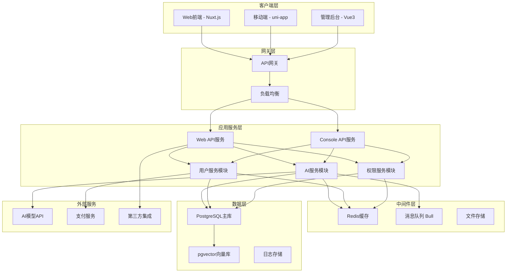
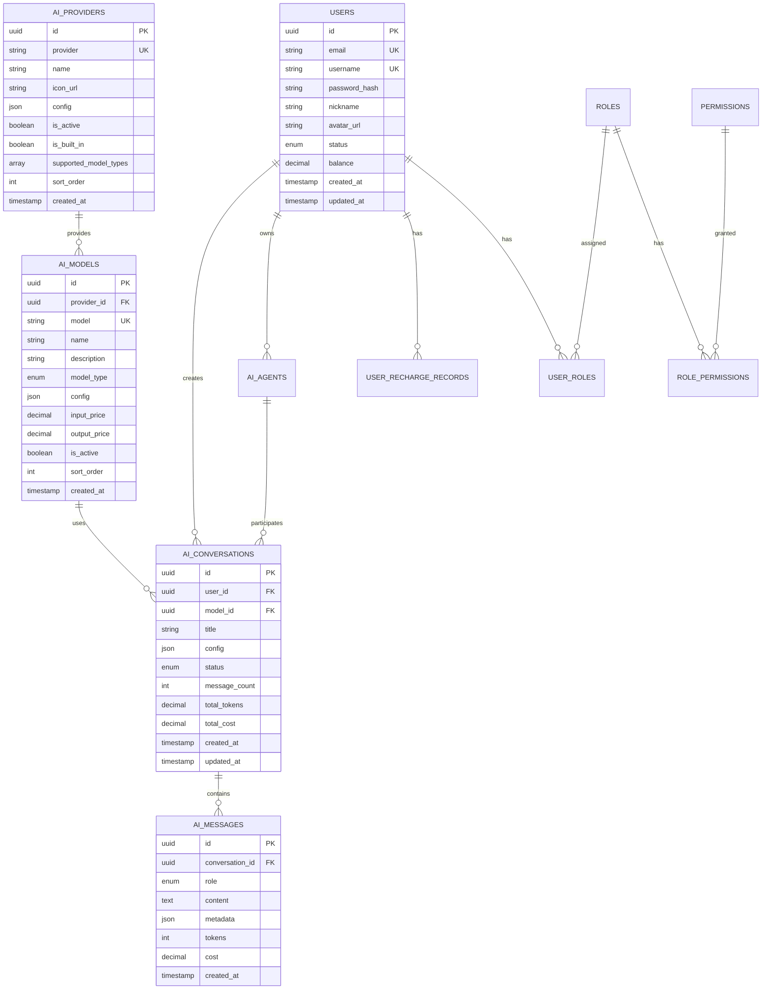

# BuildingAI技术架构文档

## 1. 项目概述

### 1.1 项目基本信息
- **项目名称**: BuildingAI (FastBuildAI)
- **版本**: 1.0.0-beta.8
- **描述**: 下一代AI应用快速开发平台
- **许可证**: Apache-2.0
- **官网**: https://fastbuildai.com
- **仓库**: https://github.com/BidingCC/BuildingAI

### 1.2 项目定位
BuildingAI是一个企业级AI应用开发平台，旨在为开发者提供快速构建AI应用的完整解决方案。平台集成了多种AI模型、知识库管理、智能代理、用户管理等核心功能，支持多端部署和插件扩展。

## 2. 整体架构设计

### 2.1 架构图



### 2.2 架构特点
- **Monorepo架构**: 使用pnpm workspace统一管理多个子项目
- **微服务设计**: 模块化的服务架构，便于扩展和维护
- **前后端分离**: 清晰的前后端职责划分
- **多端支持**: Web、移动端、管理后台多端适配
- **容器化部署**: Docker容器化，支持快速部署和扩展

## 3. 技术栈详解

### 3.1 前端技术栈

#### Web应用 (apps/web)
```json
{
  "核心框架": "Nuxt.js 4.x",
  "UI框架": "Vue.js 3.x",
  "构建工具": "Vite 6.x",
  "样式方案": "Tailwind CSS 4.x + NuxtUI 3.x",
  "状态管理": "Pinia",
  "类型检查": "TypeScript 5.x",
  "国际化": "@nuxtjs/i18n",
  "PWA支持": "@vite-pwa/nuxt",
  "动画库": "@vueuse/motion",
  "图表库": "ECharts 5.x"
}
```

#### 移动端应用 (apps/mobile)
```json
{
  "核心框架": "uni-app 3.x",
  "基础框架": "Vue.js 3.x",
  "构建工具": "Vite 6.x",
  "类型检查": "TypeScript 5.x",
  "支持平台": ["微信小程序", "H5", "App", "支付宝小程序", "百度小程序"]
}
```

### 3.2 后端技术栈

#### 服务端 (apps/server)
```json
{
  "核心框架": "NestJS 11.x",
  "运行时": "Node.js 22.x",
  "ORM框架": "TypeORM 0.3.x",
  "数据库": "PostgreSQL 17.x",
  "缓存": "Redis 8.x",
  "队列": "Bull 4.x",
  "认证": "JWT + bcryptjs",
  "文件处理": "multer + fs-extra",
  "编译器": "SWC",
  "进程管理": "PM2",
  "API文档": "自动生成",
  "日志": "自定义日志系统"
}
```

### 3.3 共享包 (packages)

#### 核心包结构
```
packages/
├── assets/          # 静态资源包
├── config/          # 配置包 (ESLint, TypeScript, UI配置)
├── constants/       # 常量定义包
├── designer/        # 设计器组件包
├── http/           # HTTP客户端包
├── ui/             # UI组件库
└── utils/          # 工具函数包
```

### 3.4 开发工具链
```json
{
  "包管理": "pnpm 10.x",
  "构建工具": "Turbo 2.x",
  "代码规范": "ESLint 9.x + Prettier 3.x",
  "类型检查": "TypeScript 5.x",
  "Git钩子": "husky + lint-staged",
  "容器化": "Docker + Docker Compose"
}
```

## 4. 模块架构

### 4.1 后端模块结构

```
apps/server/src/
├── common/                 # 公共模块
│   ├── base/              # 基础服务类
│   ├── config/            # 配置管理
│   ├── constants/         # 常量定义
│   ├── decorators/        # 装饰器
│   ├── dto/               # 数据传输对象
│   ├── exceptions/        # 异常处理
│   ├── filters/           # 过滤器
│   ├── guards/            # 守卫
│   ├── interceptors/      # 拦截器
│   ├── interfaces/        # 接口定义
│   ├── modules/           # 公共业务模块
│   ├── pipe/              # 管道
│   └── utils/             # 工具函数
├── core/                  # 核心模块
│   ├── cache/             # 缓存模块
│   ├── database/          # 数据库模块
│   ├── logger/            # 日志模块
│   ├── plugins/           # 插件系统
│   ├── queue/             # 队列模块
│   ├── redis/             # Redis模块
│   └── schedule/          # 定时任务
├── modules/               # 业务模块
│   ├── console/           # 管理后台模块
│   │   ├── ai/            # AI管理
│   │   ├── user/          # 用户管理
│   │   ├── permission/    # 权限管理
│   │   └── system/        # 系统管理
│   └── web/               # 前台模块
│       ├── ai/            # AI服务
│       ├── auth/          # 认证服务
│       ├── user/          # 用户服务
│       └── payment/       # 支付服务
├── plugins/               # 插件目录
└── sdk/                   # SDK模块
    ├── ai/                # AI SDK
    └── wechat/            # 微信SDK
```

### 4.2 前端模块结构

```
apps/web/
├── app/                   # 页面路由
│   ├── console/           # 管理后台页面
│   ├── chat/              # 聊天页面
│   ├── profile/           # 用户中心
│   └── public/            # 公开页面
├── common/                # 公共模块
│   ├── components/        # 公共组件
│   ├── composables/       # 组合式函数
│   ├── stores/            # 状态管理
│   └── utils/             # 工具函数
├── core/                  # 核心模块
│   ├── layouts/           # 布局组件
│   ├── middleware/        # 中间件
│   ├── modules/           # 核心模块
│   └── plugins/           # 插件
├── assets/                # 静态资源
├── services/              # API服务
└── types/                 # 类型定义
```

## 5. 数据库设计

### 5.1 数据库架构



### 5.2 核心表说明

#### 用户相关表
- **users**: 用户基础信息表
- **user_roles**: 用户角色关联表
- **user_recharge_records**: 用户充值记录表

#### AI相关表
- **ai_providers**: AI供应商表 (OpenAI, Claude, 等)
- **ai_models**: AI模型表 (GPT-4, Claude-3, 等)
- **ai_conversations**: AI对话会话表
- **ai_messages**: AI消息记录表
- **ai_agents**: AI智能代理表
- **ai_mcp_servers**: MCP服务器配置表

#### 权限相关表
- **roles**: 角色表
- **permissions**: 权限表
- **role_permissions**: 角色权限关联表

#### 系统相关表
- **system_configs**: 系统配置表
- **operation_logs**: 操作日志表
- **file_uploads**: 文件上传记录表

### 5.3 数据库特性
- **PostgreSQL 17.x**: 主数据库，支持JSON、数组等高级数据类型
- **pgvector扩展**: 支持向量存储和相似度搜索
- **UUID主键**: 使用UUID作为主键，避免ID泄露
- **软删除**: 重要数据支持软删除机制
- **审计字段**: 创建时间、更新时间等审计字段
- **索引优化**: 针对查询频繁的字段建立索引

## 6. 部署架构

### 6.1 Docker容器化部署

```yaml
# docker-compose.yml 核心服务
services:
  # Redis缓存服务
  redis:
    image: ccr.ccs.tencentyun.com/buildingai/redis:8.2.2
    ports: ["6379"]
    volumes: ["./data/redis:/data"]
    
  # PostgreSQL数据库服务
  postgres:
    image: ccr.ccs.tencentyun.com/buildingai/postgres:17.6
    ports: ["5432"]
    volumes: ["./data/postgres:/var/lib/postgresql/data"]
    environment:
      POSTGRES_DB: buildingai
      
  # Node.js应用服务
  nodejs:
    image: ccr.ccs.tencentyun.com/buildingai/node:22.20.0
    ports: ["4090:4090"]
    volumes: ["../:/buildingai"]
    depends_on: [redis, postgres]
```

### 6.2 环境配置

#### 开发环境
- **端口**: Web前端(4091), 后端API(4090)
- **数据库**: 本地PostgreSQL或Docker
- **缓存**: 本地Redis或Docker
- **热重载**: 支持代码热重载

#### 生产环境
- **SSR/SSG**: 支持服务端渲染和静态生成
- **CDN**: 静态资源CDN加速
- **负载均衡**: 支持多实例负载均衡
- **监控**: 应用性能监控和日志收集

### 6.3 部署流程

```bash
# 1. 复制配置文件
cp .env.production.local.example .env.production.local

# 2. 启动服务
docker compose -p buildingai --env-file ./.env.production.local -f ./docker/docker-compose.yml up -d

# 3. 访问应用
# Web应用: http://localhost:4090
# 默认管理员: admin / BuildingAI&123456
```

## 7. 开发规范

### 7.1 代码规范
- **ESLint**: 使用统一的ESLint配置
- **Prettier**: 代码格式化规范
- **TypeScript**: 强类型约束
- **命名规范**: 驼峰命名、语义化命名
- **注释规范**: JSDoc注释规范

### 7.2 Git规范
- **分支策略**: GitFlow工作流
- **提交规范**: Conventional Commits
- **代码审查**: Pull Request必须经过审查
- **自动化**: CI/CD自动化构建和部署

### 7.3 API规范
- **RESTful**: 遵循RESTful API设计原则
- **版本控制**: API版本管理
- **错误处理**: 统一的错误响应格式
- **文档**: 自动生成API文档
- **认证**: JWT Token认证机制

### 7.4 数据库规范
- **命名规范**: 下划线命名法
- **索引策略**: 合理的索引设计
- **迁移管理**: TypeORM迁移管理
- **备份策略**: 定期数据备份

## 8. 性能优化策略

### 8.1 前端优化
- **代码分割**: 路由级别的代码分割
- **懒加载**: 组件和图片懒加载
- **缓存策略**: 浏览器缓存和CDN缓存
- **SSR/SSG**: 服务端渲染和静态生成
- **PWA**: 渐进式Web应用优化
- **Tree Shaking**: 无用代码消除

### 8.2 后端优化
- **数据库优化**: 查询优化、索引优化
- **缓存策略**: Redis缓存热点数据
- **连接池**: 数据库连接池管理
- **异步处理**: 队列处理耗时任务
- **API限流**: 接口访问频率限制
- **日志优化**: 结构化日志和日志级别控制

### 8.3 部署优化
- **容器优化**: Docker镜像优化
- **资源限制**: 合理的资源配置
- **健康检查**: 服务健康状态监控
- **自动扩缩**: 基于负载的自动扩缩容
- **CDN加速**: 静态资源CDN分发

## 9. 安全策略

### 9.1 认证授权
- **JWT认证**: 无状态的Token认证
- **角色权限**: 基于RBAC的权限控制
- **密码安全**: bcrypt密码加密
- **会话管理**: 安全的会话管理机制

### 9.2 数据安全
- **SQL注入防护**: 参数化查询
- **XSS防护**: 输入输出过滤
- **CSRF防护**: CSRF Token验证
- **数据加密**: 敏感数据加密存储
- **API安全**: 接口访问控制和限流

### 9.3 运维安全
- **容器安全**: 容器镜像安全扫描
- **网络安全**: 网络隔离和防火墙
- **日志审计**: 操作日志记录和审计
- **备份恢复**: 数据备份和灾难恢复

## 10. 监控与运维

### 10.1 应用监控
- **性能监控**: 应用性能指标监控
- **错误监控**: 错误日志收集和告警
- **业务监控**: 关键业务指标监控
- **用户行为**: 用户行为分析

### 10.2 基础设施监控
- **服务器监控**: CPU、内存、磁盘监控
- **数据库监控**: 数据库性能监控
- **网络监控**: 网络连通性和延迟监控
- **容器监控**: 容器资源使用监控

### 10.3 日志管理
- **日志收集**: 统一的日志收集系统
- **日志分析**: 日志分析和查询
- **日志存储**: 日志长期存储策略
- **告警机制**: 基于日志的告警机制

## 11. 扩展性设计

### 11.1 插件系统
- **插件架构**: 可插拔的插件系统
- **插件API**: 标准化的插件接口
- **插件管理**: 插件的安装、卸载、更新
- **插件市场**: 插件生态系统

### 11.2 微服务架构
- **服务拆分**: 按业务域拆分服务
- **服务通信**: 基于HTTP/gRPC的服务通信
- **服务发现**: 服务注册和发现机制
- **配置管理**: 分布式配置管理

### 11.3 多租户支持
- **租户隔离**: 数据和资源隔离
- **租户管理**: 租户的创建和管理
- **计费系统**: 基于使用量的计费
- **SaaS化**: 支持SaaS模式部署

---
