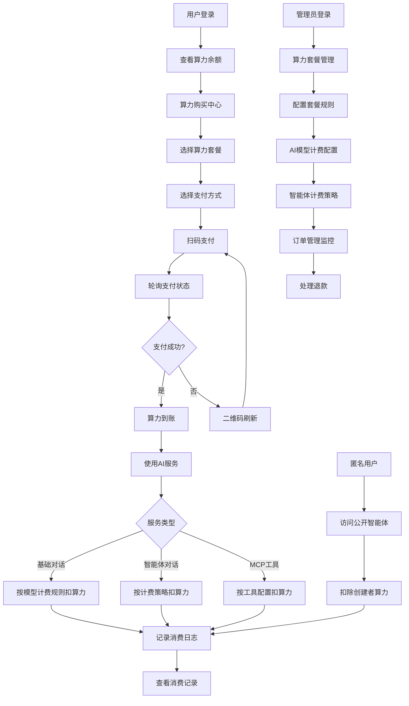

# BuildingAI算力售卖PRD

## 1. 产品概述

BuildingAI算力售卖系统是一个基于现有充值架构的完整商业化解决方案，为用户提供灵活的算力购买和消费服务。系统采用预付费模式，用户通过购买算力套餐获得AI服务使用权限，支持多种支付方式和精确的消费计费。

- 核心价值：为AI服务提供可持续的商业模式，确保用户按需付费，平台稳定运营
- 目标用户：需要使用AI对话、智能代理、MCP工具等服务的个人和企业用户，包括匿名用户和注册用户
- 市场定位：打造业界领先的AI算力交易平台，提供透明、公平、便捷的算力服务，支持多种消费场景和灵活的计费策略

## 2. 核心功能

### 2.1 用户角色

| 角色 | 注册方式 | 核心权限 |
|------|----------|----------|
| 普通用户 | 邮箱注册/第三方登录/OpenID | 购买算力套餐、使用AI服务、查看消费记录、创建智能体 |
| 匿名用户 | 无需注册（临时访问） | 使用公开智能体（消耗创建者算力）、查看公开内容 |
| 智能体创建者 | 注册用户升级 | 创建和管理智能体、设置计费策略、查看智能体使用统计 |
| 管理员 | 系统分配 | 配置算力套餐、管理订单、查看财务数据、用户管理、AI模型配置 |

### 2.2 功能模块

我们的算力售卖系统包含以下主要页面：

1. **算力套餐管理页面**：套餐配置、价格设置、状态管理、充值说明配置
2. **算力订单管理页面**：订单查询、详情查看、退款处理、订单统计
3. **算力购买中心页面**：套餐展示、支付流程、订单创建、二维码支付
4. **用户购买记录页面**：历史订单、支付状态、退款状态、订单详情
5. **用户算力详情页面**：余额显示、消费记录、变动日志、按类型筛选
6. **财务中心统计页面**：经营数据、订单统计、用户分析、账户变动记录
7. **AI模型配置页面**：模型计费规则、算力消费比例、模型管理
8. **智能体计费配置页面**：计费策略设置、价格配置、使用统计

### 2.3 页面详情

| 页面名称 | 模块名称 | 功能描述 |
|---------|---------|----------|
| 算力套餐管理页面 | 套餐配置模块 | 创建、编辑、删除算力套餐，设置算力数量、赠送数量、价格、标签 |
| 算力套餐管理页面 | 状态管理模块 | 启用/禁用充值功能，设置充值说明文案，配置充值规则 |
| 算力订单管理页面 | 订单列表模块 | 显示订单号、用户信息、算力详情、支付状态、退款状态、创建时间 |
| 算力订单管理页面 | 订单操作模块 | 查看订单详情、处理退款申请、订单状态管理、订单快照查看 |
| 算力订单管理页面 | 统计面板模块 | 显示总收入、总订单数、退款金额、净收入等关键指标 |
| 算力购买中心页面 | 套餐展示模块 | 显示可用套餐、价格信息、用户当前算力余额、套餐标签 |
| 算力购买中心页面 | 支付流程模块 | 选择支付方式、生成支付二维码、轮询支付结果、二维码刷新、支付超时处理 |
| 算力购买中心页面 | 用户信息模块 | 显示用户头像、用户名、当前算力余额、充值状态提示 |
| 用户购买记录页面 | 历史记录模块 | 显示用户购买历史、订单详情、支付方式、退款状态、总算力 |
| 用户算力详情页面 | 余额显示模块 | 显示当前剩余算力、累计充值金额、算力变动趋势 |
| 用户算力详情页面 | 消费记录模块 | 显示算力变动记录，支持按消费/获取筛选、按来源筛选（对话、智能体、插件、充值、系统） |
| 财务中心统计页面 | 经营概况模块 | 统计累计收入金额、订单数、退款金额、净收入等核心经营指标 |
| 财务中心统计页面 | 订单概况模块 | 统计充值金额、订单数、退款情况、净收入等订单相关数据 |
| 财务中心统计页面 | 用户概况模块 | 统计用户总数、充值人数、提问次数、消费金额、剩余算力等用户数据 |
| 财务中心统计页面 | 账户变动记录模块 | 查看所有用户的账户变动记录，支持按用户、类型、时间筛选 |
| AI模型配置页面 | 模型管理模块 | 创建、编辑AI模型配置，设置模型名称、提供商、API配置 |
| AI模型配置页面 | 计费规则模块 | 配置模型计费规则，设置power和tokens比例，验证计费参数 |
| 智能体计费配置页面 | 计费策略模块 | 设置智能体计费策略（智能计费、用户计费、创建者计费、无计费） |
| 智能体计费配置页面 | 价格配置模块 | 设置智能体按次收费价格，配置计费说明 |

## 3. 核心流程

### 3.1 管理员流程
1. 管理员登录后台系统
2. 进入算力套餐管理页面
3. 配置算力套餐（算力数量、赠送算力、价格、标签）
4. 设置售卖状态和说明文案
5. 监控订单管理页面，处理退款等异常情况

### 3.2 用户购买流程
1. 用户登录系统，查看当前算力余额
2. 进入算力购买中心
3. 浏览可用算力套餐，选择合适的套餐
4. 选择支付方式（微信支付）
5. 扫码支付或确认支付
6. 系统轮询支付状态，支付成功后自动增加算力
7. 用户可在购买记录页面查看订单详情

### 3.3 算力消费流程

#### 3.3.1 基础AI对话消费流程
1. 用户发起AI对话请求
2. 系统根据选择的AI模型获取计费规则（power/tokens比例）
3. AI模型处理请求并返回响应和token使用量
4. 系统根据计费规则计算需要扣除的算力：`扣除算力 = (总tokens / 计费规则tokens) * 计费规则power`
5. 在数据库事务中扣除用户算力，确保不会扣成负数
6. 记录算力变动日志，包含模型信息、token数量、扣除算力等详细信息

#### 3.3.2 智能体对话消费流程
1. 用户访问智能体进行对话
2. 系统根据智能体的计费策略确定扣费对象：
   - **智能计费策略**：匿名用户扣创建者算力，注册用户扣自己算力
   - **用户计费策略**：始终扣当前用户算力（匿名用户需先登录）
   - **创建者计费策略**：始终扣智能体创建者算力
   - **无计费策略**：不扣除任何算力
3. 根据智能体配置的price参数扣除对应算力
4. 在数据库事务中完成算力扣除和日志记录
5. 更新智能体对话记录的消费算力统计

#### 3.3.3 MCP工具/插件消费流程
1. 用户通过智能体或直接调用MCP工具
2. 系统根据工具的计费配置计算消费算力
3. 扣除用户算力并记录消费日志，标记来源为插件使用
4. 用户可在算力详情页面查看插件消费明细



## 4. 用户界面设计

### 4.1 设计风格
- **主色调**：品牌蓝色 (#3B82F6)，辅助色为灰色系 (#6B7280, #F3F4F6)
- **按钮样式**：圆角按钮，主要操作使用品牌色，次要操作使用灰色
- **字体规范**：系统默认字体，标题16px，正文14px，辅助文字12px
- **布局风格**：卡片式布局，顶部导航，左侧菜单，响应式设计
- **图标风格**：线性图标，统一使用Heroicons图标库

### 4.2 页面设计概览

| 页面名称 | 模块名称 | UI元素 |
|---------|---------|--------|
| 算力套餐管理页面 | 套餐配置表单 | 卡片式布局，表单输入框，开关按钮，操作按钮组 |
| 算力套餐管理页面 | 套餐列表展示 | 表格布局，状态标签，操作按钮 |
| 算力购买中心页面 | 用户信息区域 | 头像组件，用户名显示，算力余额卡片 |
| 算力购买中心页面 | 套餐选择区域 | 网格布局，套餐卡片，价格标签，选择按钮 |
| 算力购买中心页面 | 支付流程区域 | 支付方式选择，二维码展示，状态提示 |
| 算力订单管理页面 | 统计面板 | 数据卡片布局，数字展示，图标装饰 |
| 算力订单管理页面 | 订单列表 | 表格布局，筛选器，分页组件，状态标签 |
| 用户购买记录页面 | 订单历史列表 | 时间线布局，订单卡片，状态图标 |
| 用户算力详情页面 | 余额概览 | 大数字显示，进度条，统计卡片 |
| 用户算力详情页面 | 消费明细 | 列表布局，筛选标签，时间排序 |
| 财务中心统计页面 | 经营概况面板 | 数据卡片网格布局，大数字展示，增长趋势图标，颜色区分（收入绿色，退款红色） |
| 财务中心统计页面 | 订单概况面板 | 统计卡片布局，订单数量展示，金额格式化显示，状态图标 |
| 财务中心统计页面 | 用户概况面板 | 用户数据卡片，算力余额展示，活跃度指标，百分比图表 |
| 算力购买中心 | 用户信息卡片 | 头像组件，用户名显示，算力余额高亮显示，充值状态提示 |
| 算力购买中心 | 套餐选择卡片 | 卡片布局，算力数量大字体显示，价格突出，赠送算力绿色标识，套餐标签 |
| 算力购买中心 | 支付组件 | 支付方式选择器，二维码展示，支付状态提示，倒计时组件，二维码刷新按钮 |
| 算力购买中心 | 支付状态模态框 | 支付二维码展示，轮询状态提示，支付成功提示，支付超时处理 |
| 算力订单管理 | 统计面板 | 数据卡片网格布局，数字大字体显示，趋势图标，收入/退款颜色区分 |
| 算力订单管理 | 订单表格 | 分页表格(ProPaginaction)，筛选器，操作下拉菜单(UDropdownMenu)，退款操作 |
| 算力订单管理 | 订单详情模态框 | 订单完整信息展示，套餐快照，支付详情，用户信息 |
| 购买记录页面 | 订单列表 | 简洁表格布局，时间格式化显示(TimeDisplay)，状态标签，退款标识 |
| 算力余额详情 | 余额卡片 | 大数字显示当前余额，累计充值金额，算力变动趋势 |
| 算力余额详情 | 明细列表 | 标签页切换(UTabs)，时间线布局，操作类型图标，来源筛选 |
| AI模型配置 | 模型列表 | 表格布局，模型信息展示，计费规则显示，状态管理 |
| AI模型配置 | 计费规则表单 | 输入框组件，power/tokens比例设置，参数验证提示 |
| 智能体计费配置 | 计费策略选择器 | 单选按钮组，策略说明文案，计费对象提示 |
| 智能体计费配置 | 价格配置表单 | 数字输入框，价格单位显示，计费说明编辑器 |

### 4.3 响应式设计
- **桌面优先**：主要面向管理员和重度用户的桌面端操作
- **移动适配**：购买中心和余额查看支持移动端响应式布局
- **触控优化**：移动端增大点击区域，优化支付流程体验

## 5. 技术实现

### 5.1 前端技术栈
- **框架**：Nuxt3 + Vue3 + TypeScript
- **UI组件**：@fastbuildai/ui + NuxtUI
- **状态管理**：Pinia + useUserStore
- **国际化**：vue-i18n
- **构建工具**：Vite

### 5.2 后端技术栈
- **框架**：NestJS + TypeScript
- **数据库**：PostgreSQL + TypeORM
- **缓存**：Redis
- **支付集成**：微信支付SDK
- **任务队列**：Bull Queue

### 5.3 核心API设计

#### 算力套餐管理API
```typescript
// 获取算力套餐配置
GET /api/console/recharge/config
Response: {
  rechargeStatus: boolean,
  rechargeExplain: string,
  rechargeRule: RechargeRule[]
}

// 更新算力套餐配置
PUT /api/console/recharge/config
Request: {
  rechargeStatus: boolean,
  rechargeExplain: string,
  rechargeRule: RechargeRule[]
}
```

#### 算力购买API
```typescript
// 获取购买中心信息
GET /api/web/recharge/center
Response: {
  user: UserInfo,
  rechargeStatus: boolean,
  rechargeExplain: string,
  rechargeRule: RechargeRule[],
  payWayList: PayMethod[]
}

// 提交算力购买订单
POST /api/web/recharge/submit
Request: {
  rechargeId: string,
  payType: number
}
Response: {
  orderId: string,
  orderNo: string,
  orderAmount: number
}
```

#### 订单管理API
```typescript
// 获取订单列表（管理员）
GET /api/console/recharge-order/list
Query: {
  page: number,
  limit: number,
  orderNo?: string,
  userId?: string,
  payType?: number,
  payStatus?: number
}

// 获取购买记录（用户）
GET /api/web/recharge/records
Query: {
  page: number,
  limit: number
}
```

#### 财务中心统计API
```typescript
// 获取财务中心统计数据（管理员）
GET /api/console/finance/center
Response: {
  finance: {
    totalIncomeAmount: number,    // 累计收入金额
    totalIncomeNumber: number,    // 累计收入订单数
    totalRefundAmount: number,    // 累计退款金额
    totalRefundNumber: number,    // 累计退款订单数
    totalNetIncome: number        // 累计净收入
  },
  recharge: {
    rechargeAmount: number,       // 累计充值金额
    rechargeNetIncome: number,    // 充值净收入
    rechargeNumber: number,       // 充值订单数
    rechargeRefundAmount: number, // 充值退款金额
    rechargeRefundNumber: number  // 充值退款订单数
  },
  user: {
    totalChatNumber: number,      // 用户累计提问次数
    totalPowerSum: number,        // 用户剩余算力总和
    totalRechargeAmount: number,  // 用户累计消费金额
    totalRechargedNumber: number, // 累计充值人数
    totalUserNumber: number       // 用户总人数
  }
}

// 获取账户变动记录列表（管理员）
GET /api/console/finance/account-logs
Query: {
  page: number,
  limit: number,
  userId?: string,
  type?: number,
  action?: number,
  startDate?: string,
  endDate?: string
}
Response: {
  list: AccountLogItem[],
  total: number,
  page: number,
  limit: number
}
```

### 5.4 数据模型设计

#### 算力套餐实体 (Recharge)
```typescript
interface Recharge {
  id: string;           // 套餐ID
  power: number;        // 算力数量
  givePower: number;    // 赠送算力
  sellPrice: number;    // 售价（decimal类型，精度10，小数位2）
  label: string;        // 套餐标签（最大64字符）
  createdAt: Date;      // 创建时间
  updatedAt: Date;      // 更新时间
}
```

### 5.5 数据库表设计

#### 算力套餐表 (recharge)
```sql
CREATE TABLE recharge (
  id VARCHAR(36) PRIMARY KEY,
  power INT NOT NULL COMMENT '算力数量',
  give_power INT DEFAULT 0 COMMENT '赠送算力',
  sell_price DECIMAL(10,2) NOT NULL COMMENT '售价',
  label VARCHAR(64) NOT NULL COMMENT '套餐标签',
  created_at TIMESTAMP DEFAULT CURRENT_TIMESTAMP COMMENT '创建时间',
  updated_at TIMESTAMP DEFAULT CURRENT_TIMESTAMP ON UPDATE CURRENT_TIMESTAMP COMMENT '更新时间'
);

-- 初始化套餐数据
INSERT INTO recharge (id, power, give_power, sell_price, label) VALUES
('1', 100, 10, 10.00, '基础套餐'),
('2', 500, 100, 45.00, '标准套餐'),
('3', 1000, 300, 80.00, '高级套餐'),
('4', 2000, 800, 150.00, '专业套餐');
```

#### 算力订单表 (recharge_order)
```sql
CREATE TABLE recharge_order (
  id VARCHAR(36) PRIMARY KEY,
  order_no VARCHAR(32) UNIQUE NOT NULL COMMENT '订单号',
  transaction_id VARCHAR(64) COMMENT '交易流水号',
  user_id VARCHAR(36) NOT NULL COMMENT '用户ID',
  terminal VARCHAR(20) COMMENT '终端类型',
  recharge_id VARCHAR(36) NOT NULL COMMENT '套餐ID',
  power INT NOT NULL COMMENT '购买算力',
  give_power INT DEFAULT 0 COMMENT '赠送算力',
  total_amount DECIMAL(10,2) NOT NULL COMMENT '总金额',
  order_amount DECIMAL(10,2) NOT NULL COMMENT '订单金额',
  pay_type TINYINT DEFAULT 1 COMMENT '支付方式（1:微信支付 2:支付宝）',
  pay_status TINYINT DEFAULT 0 COMMENT '支付状态（0:待支付 1:已支付 2:支付失败）',
  pay_time TIMESTAMP NULL COMMENT '支付时间',
  refund_status TINYINT DEFAULT 0 COMMENT '退款状态（0:无退款 1:已退款 2:退款中）',
  refund_time TIMESTAMP NULL COMMENT '退款时间',
  recharge_snap JSON COMMENT '套餐快照',
  created_at TIMESTAMP DEFAULT CURRENT_TIMESTAMP COMMENT '创建时间',
  INDEX idx_user_id (user_id),
  INDEX idx_order_no (order_no),
  INDEX idx_transaction_id (transaction_id),
  INDEX idx_pay_status (pay_status),
  INDEX idx_created_at (created_at)
);
```

#### 算力消费日志表 (account_log)
```sql
CREATE TABLE account_log (
  id VARCHAR(36) PRIMARY KEY,
  user_id VARCHAR(36) NOT NULL COMMENT '用户ID',
  type TINYINT NOT NULL COMMENT '变动类型（1:充值增加 2:充值赠送 3:充值退款 4:系统手动增加 5:系统手动减少 6:对话消费 7:智能体消费 8:插件消费）',
  action TINYINT NOT NULL COMMENT '操作类型（1:增加 2:减少）',
  amount INT NOT NULL COMMENT '变动数量',
  order_no VARCHAR(32) COMMENT '关联订单号',
  related_user_id VARCHAR(36) COMMENT '关联用户ID（如智能体创建者）',
  description VARCHAR(255) COMMENT '描述',
  source_type TINYINT COMMENT '来源类型（1:充值 2:系统 3:对话 4:智能体 5:插件）',
  source VARCHAR(255) COMMENT '来源标识（如模型名称、智能体ID等）',
  created_at TIMESTAMP DEFAULT CURRENT_TIMESTAMP COMMENT '创建时间',
  INDEX idx_user_id (user_id),
  INDEX idx_type (type),
  INDEX idx_source_type (source_type),
  INDEX idx_related_user_id (related_user_id),
  INDEX idx_created_at (created_at)
);
```

#### 支付配置表 (pay_config)
```sql
CREATE TABLE pay_config (
  id VARCHAR(36) PRIMARY KEY,
  pay_type TINYINT NOT NULL COMMENT '支付方式（1:微信支付 2:支付宝）',
  is_enable TINYINT DEFAULT 1 COMMENT '是否启用（0:禁用 1:启用）',
  merchant VARCHAR(50) COMMENT '商户类型',
  version VARCHAR(20) COMMENT '支付版本',
  config JSON COMMENT '支付配置参数',
  created_at TIMESTAMP DEFAULT CURRENT_TIMESTAMP COMMENT '创建时间',
  updated_at TIMESTAMP DEFAULT CURRENT_TIMESTAMP ON UPDATE CURRENT_TIMESTAMP COMMENT '更新时间',
  INDEX idx_pay_type (pay_type),
  INDEX idx_is_enable (is_enable)
);

-- 初始化支付配置
INSERT INTO pay_config (id, pay_type, is_enable, merchant, version, config) VALUES
('1', 1, 1, 'wechat', 'v3', '{"appId":"","mchId":"","apiKey":"","certPath":""}'),
('2', 2, 0, 'alipay', 'v1', '{"appId":"","privateKey":"","publicKey":""}');
```

#### AI模型计费规则实体 (AiModel.billingRule)
```typescript
interface BillingRule {
  power: number;        // 消耗算力数量
  tokens: number;       // 对应的token数量
}

interface AiModel {
  id: string;           // 模型ID
  name: string;         // 模型名称
  provider: string;     // 提供商
  billingRule: BillingRule; // 计费规则
  // ... 其他模型配置
}
```

#### 智能体计费配置实体 (Agent.billingConfig)
```typescript
interface BillingConfig {
  strategy: string;     // 计费策略（smart/user/creator/none）
  price: number;        // 按次收费价格
}

interface Agent {
  id: string;           // 智能体ID
  name: string;         // 智能体名称
  createBy: string;     // 创建者ID
  billingConfig: BillingConfig; // 计费配置
  // ... 其他智能体配置
}
```

#### 支付配置实体 (PayConfig)
```typescript
interface PayConfig {
  id: string;           // 配置ID
  payType: number;      // 支付方式（1:微信支付 2:支付宝）
  isEnable: number;     // 是否启用（0:禁用 1:启用）
  merchant: string;     // 商户类型
  version: string;      // 支付版本
  config: object;       // 支付配置参数
  createdAt: Date;      // 创建时间
  updatedAt: Date;      // 更新时间
}
```

#### 算力订单实体 (RechargeOrder)
```typescript
interface RechargeOrder {
  id: string;           // 订单ID
  orderNo: string;      // 订单号
  transactionId: string; // 交易流水号
  userId: string;       // 用户ID
  terminal: string;     // 终端类型
  rechargeId: string;   // 套餐ID
  power: number;        // 购买算力
  givePower: number;    // 赠送算力
  totalAmount: number;  // 总金额
  orderAmount: number;  // 订单金额
  payType: number;      // 支付方式（1:微信支付 2:支付宝）
  payStatus: number;    // 支付状态（0:待支付 1:已支付 2:支付失败）
  payTime: Date;        // 支付时间
  refundStatus: number; // 退款状态（0:无退款 1:已退款 2:退款中）
  refundTime: Date;     // 退款时间
  rechargeSnap: object; // 套餐快照（保存下单时的套餐信息）
  createdAt: Date;      // 创建时间
  user: User;           // 关联用户信息
}
```

#### 用户实体 (User)
```typescript
interface User {
  id: string;           // 用户ID
  username: string;     // 用户名
  email: string;        // 邮箱
  role: string;         // 角色
  power: number;        // 当前算力余额
  totalRechargeAmount: number; // 累计充值金额
  createdAt: Date;      // 创建时间
  updatedAt: Date;      // 更新时间
}
```

#### 算力消费日志 (AccountLog)
```typescript
interface AccountLog {
  id: string;
  userId: string;       // 用户ID
  type: number;         // 变动类型（1:充值增加 2:充值赠送 3:充值退款 4:系统手动增加 5:系统手动减少 6:对话消费 7:智能体消费 8:插件消费）
  action: number;       // 操作类型（1:增加 2:减少）
  amount: number;       // 变动数量
  orderNo: string;      // 关联订单号
  relatedUserId: string; // 关联用户ID（如智能体创建者）
  description: string;  // 描述
  sourceInfo: {         // 来源信息
    type: number;       // 来源类型（1:充值 2:系统 3:对话 4:智能体 5:插件）
    source: string;     // 来源标识（如模型名称、智能体ID等）
  };
  createdAt: Date;      // 创建时间
}

// 账户日志常量定义
const ACCOUNT_LOG_SOURCE = {
  RECHARGE: 1,          // 充值
  SYSTEM: 2,            // 系统
  CHAT: 3,              // 基础对话
  AGENT_CHAT: 4,        // 智能体对话
  PLUGIN: 5,            // 插件使用
};

const ACCOUNT_LOG_TYPE = {
  RECHARGE_INC: 1,      // 用户充值
  RECHARGE_GIVE_INC: 2, // 用户充值赠送
  RECHARGE_DEC: 3,      // 用户充值退款
  SYSTEM_MANUAL_INC: 4, // 系统手动增加算力
  SYSTEM_MANUAL_DEC: 5, // 系统手动减扣算力
  CHAT_DEC: 6,          // 基础对话消费
  AGENT_CHAT_DEC: 7,    // 智能体对话消费
  PLUGIN_DEC: 8,        // 插件消费
};
```

### 5.5 支付流程设计

#### 支付状态管理
```typescript
enum PayStatus {
  PENDING = 0,    // 待支付
  SUCCESS = 1,    // 支付成功
  FAILED = 2,     // 支付失败
  CANCELLED = 3   // 已取消
}

enum RefundStatus {
  NONE = 0,       // 无退款
  REFUNDED = 1,   // 已退款
  REFUNDING = 2   // 退款中
}
```

#### 支付回调处理
```typescript
// 微信支付回调处理逻辑
async function handleWechatPayCallback(params: WechatPayNotifyParams) {
  // 1. 验证签名
  // 2. 解密回调数据
  // 3. 查找对应订单
  // 4. 更新订单状态
  // 5. 增加用户算力
  // 6. 记录算力变动日志
  // 7. 更新用户累计充值金额
}
```

## 6. 技术实现要点

### 6.1 支付集成
- **微信支付集成**：支持微信支付v3版本，包含Native支付、JSAPI支付
- **支付宝集成**：支持支付宝当面付、手机网站支付
- **支付回调处理**：异步处理支付结果通知，确保订单状态准确更新
- **订单状态管理**：支持待支付、已支付、支付失败、已退款等状态流转
- **支付超时处理**：订单超时自动取消，二维码过期刷新机制

### 6.2 算力扣减机制
- **实时算力余额更新**：基于数据库事务确保余额准确性
- **多场景计费策略**：
  - 基础AI对话：根据模型power/tokens比例计算
  - 智能体对话：支持smart/user/creator/none四种计费策略
  - 插件使用：基于MCP工具配置的计费规则
- **事务安全保证**：使用数据库事务确保扣减操作原子性
- **消费记录追踪**：详细记录每次消费的来源、类型、数量等信息
- **匿名用户处理**：匿名用户使用智能体时扣除创建者算力

### 6.3 数据统计与分析
- **用户充值统计**：按时间维度统计充值金额、订单数量
- **算力消费分析**：分析不同消费场景的算力使用情况
- **收入报表生成**：生成经营概况、订单概况、用户概况报表
- **实时数据监控**：监控系统算力消费趋势和异常情况

### 6.4 权限与安全
- **用户权限控制**：区分普通用户、智能体创建者、管理员权限
- **数据隔离**：确保用户数据安全隔离，防止越权访问
- **API安全**：接口鉴权、参数校验、防重放攻击
- **支付安全**：支付参数加密、签名验证、回调验证

### 6.5 性能优化
- **缓存策略**：对频繁查询的套餐信息、用户余额进行缓存
- **数据库优化**：合理设计索引，优化查询性能
- **异步处理**：支付回调、消费记录等采用异步处理
- **分页查询**：大数据量查询采用分页机制

## 7. 验收标准

### 7.1 功能验收标准
- **充值功能**：用户可以正常选择套餐、生成订单、完成支付
- **支付集成**：微信支付、支付宝支付流程完整可用
- **算力消费**：基础对话、智能体对话、插件使用算力扣减准确
- **订单管理**：订单状态流转正确，支持退款处理
- **数据统计**：财务中心数据准确，支持多维度统计
- **权限控制**：不同角色权限隔离，功能访问控制正确
- **匿名用户**：匿名用户使用智能体正确扣除创建者算力

### 7.2 性能验收标准
- **支付响应时间**：支付接口响应时间 < 3秒
- **算力扣减响应时间**：算力扣减操作响应时间 < 1秒
- **页面加载时间**：前端页面首次加载时间 < 2秒
- **并发处理能力**：支持100个并发用户同时操作
- **数据库查询性能**：复杂查询响应时间 < 2秒

### 7.3 安全验收标准
- **支付安全**：支付数据加密传输，签名验证正确
- **数据隔离**：用户数据安全隔离，防止越权访问
- **防重复扣费**：同一笔消费不会重复扣减算力
- **接口安全**：API接口鉴权、参数校验、防重放攻击
- **敏感信息保护**：支付配置、用户信息等敏感数据加密存储

### 7.4 兼容性验收标准
- **浏览器兼容**：支持Chrome、Firefox、Safari、Edge主流浏览器
- **移动端适配**：支持iOS、Android移动端访问
- **支付兼容**：支持微信、支付宝等主流支付方式
- **数据库兼容**：支持MySQL 5.7+版本

## 7. 项目排期

### 第一阶段：基础功能开发（2周）
- **数据库设计**：完成算力套餐、订单、日志等核心表设计
- **算力套餐管理**：实现套餐的增删改查功能
- **用户充值功能**：实现充值页面和基础充值流程
- **支付集成**：集成微信支付，实现基础支付功能

### 第二阶段：核心功能开发（3周）
- **多场景算力消费**：实现基础对话、智能体对话、插件使用的计费
- **智能体计费策略**：实现smart/user/creator/none四种计费模式
- **订单管理系统**：完善订单状态管理、退款处理
- **支付回调处理**：实现支付结果异步通知处理
- **匿名用户支持**：实现匿名用户使用智能体的计费逻辑

### 第三阶段：管理与统计功能（2周）
- **财务中心**：实现经营概况、订单概况、用户概况统计
- **算力详情页面**：实现消费记录查询和筛选功能
- **管理员功能**：实现AI模型配置、智能体计费配置
- **数据报表**：实现各类统计报表和数据导出

### 第四阶段：测试与优化（1周）
- **功能测试**：全面测试各个功能模块
- **性能优化**：优化数据库查询、接口响应速度
- **安全加固**：加强支付安全、数据安全防护
- **兼容性测试**：测试多浏览器、移动端兼容性

## 8. 风险评估

### 8.1 技术风险
- **支付集成复杂度**：微信支付、支付宝API变更风险
  - *应对措施*：采用官方SDK，及时关注API更新，建立支付测试环境
- **并发处理**：高并发下算力扣减准确性
  - *应对措施*：使用数据库事务，实现分布式锁，进行压力测试
- **数据一致性**：支付回调与订单状态同步
  - *应对措施*：实现幂等性处理，建立补偿机制，增加监控告警

### 8.2 业务风险
- **支付安全**：支付数据泄露、伪造回调风险
  - *应对措施*：加强签名验证，使用HTTPS传输，敏感数据加密
- **算力滥用**：恶意消费算力、刷单风险
  - *应对措施*：实现频率限制，异常检测，用户行为分析
- **计费准确性**：多场景计费逻辑复杂，可能出现计费错误
  - *应对措施*：完善测试用例，建立计费审计机制，支持人工调整

### 8.3 运营风险
- **定价策略**：算力定价是否合理，影响用户付费意愿
  - *应对措施*：进行市场调研，A/B测试不同价格策略
- **用户接受度**：付费模式用户接受程度，可能影响用户留存
  - *应对措施*：提供免费试用额度，优化用户体验，建立用户反馈机制
- **合规风险**：支付业务需要相关资质和合规要求
  - *应对措施*：确保支付渠道合规，建立风控机制，定期合规审查