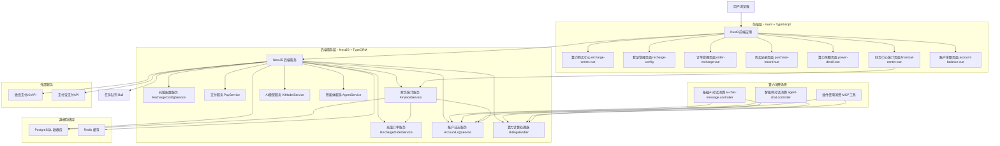
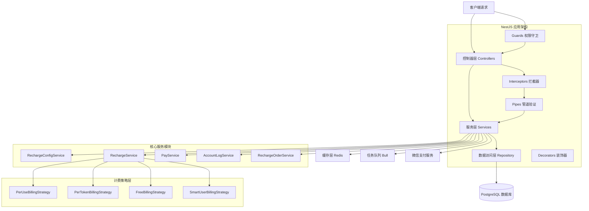
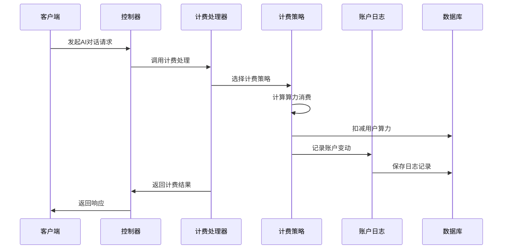
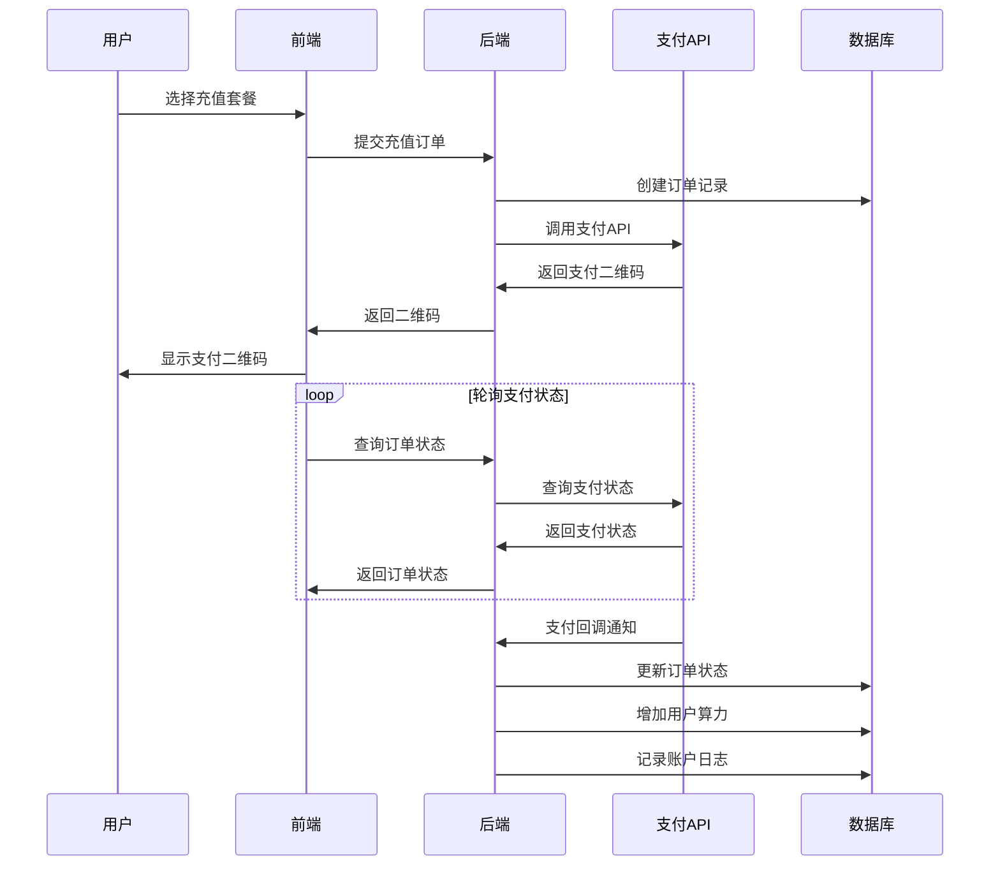
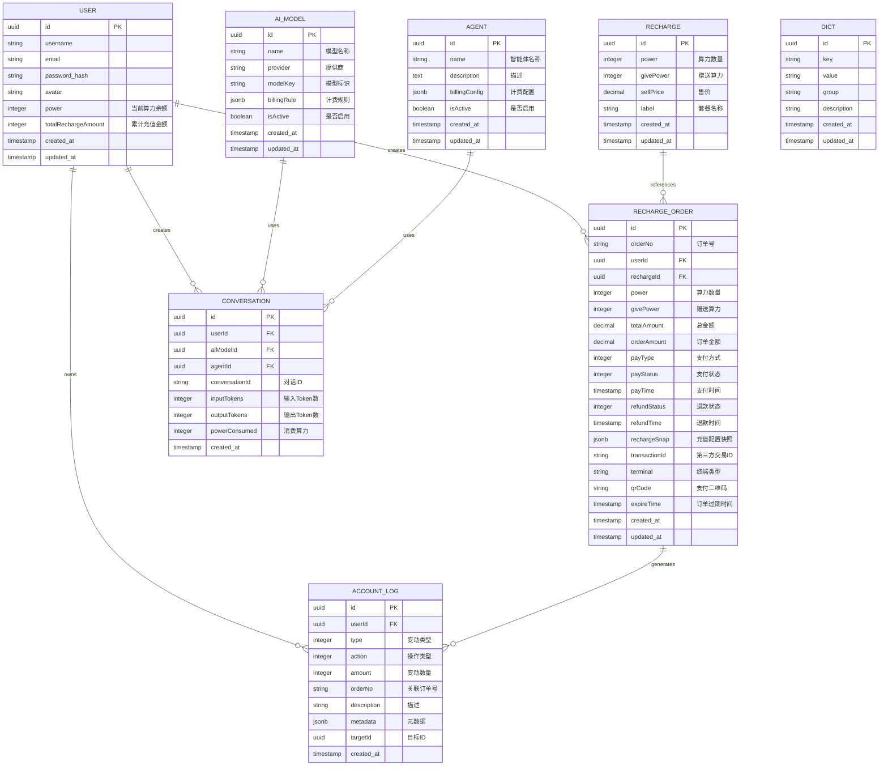

# BuildingAI算力售卖技术架构文档

## 1. 架构设计


## 2. 技术描述

- **前端技术栈**：Nuxt3 + Vue3 + TypeScript + TailwindCSS + Vite + @fastbuildai/ui组件库
- **后端技术栈**：NestJS + TypeScript + TypeORM + PostgreSQL + Redis + Bull队列
- **支付集成**：微信支付v3 API + 支付宝支付API
- **算力计费**：基于Token的计费策略 + 工厂模式计费处理器
- **数据库**：PostgreSQL (主数据库) + Redis (缓存 + 会话存储)
- **部署架构**：Docker容器化 + Nginx反向代理

### 2.1 算力消费场景技术实现

#### 基础AI对话消费
- **控制器**：`ai-chat-message.controller.ts`
- **计费逻辑**：根据AI模型的`billingRule`字段扣除算力
- **计算公式**：`算力消费 = (输入Token + 输出Token) * 模型计费倍率`
- **事务安全**：使用数据库事务确保算力扣减的原子性

#### 智能体对话消费
- **控制器**：`agent-chat.controller.ts`
- **计费处理器**：`billing.handler.ts`
- **四种计费策略**：
  1. **按次计费**：每次对话固定扣除算力
  2. **按Token计费**：根据实际Token消耗计费
  3. **免费使用**：不扣除算力
  4. **智能用户计费**：匿名用户特殊处理策略
- **工厂模式**：通过计费策略工厂动态选择计费方式

#### 插件使用消费
- **MCP工具集成**：支持多种AI工具插件
- **按使用计费**：每次工具调用扣除相应算力
- **异步处理**：通过Bull队列异步处理计费逻辑

## 3. 路由定义

### 3.1 前端路由 (Nuxt3)

| 路由 | 组件文件 | 用途 |
|------|----------|------|
| `/recharge-center` | `recharge-center.vue` | 算力购买中心，展示充值套餐和支付功能 |
| `/recharge-config` | `recharge-config/index.vue` | 充值套餐配置管理（管理员） |
| `/order-recharge` | `order-recharge.vue` | 充值订单管理和状态查询 |
| `/purchase-record` | `purchase-record.vue` | 用户购买记录和历史查询 |
| `/power-detail` | `power-detail.vue` | 算力余额详情和消费记录 |
| `/financial-center` | `financial-center.vue` | 财务中心统计和数据分析 |
| `/account-balance` | `account-balance.vue` | 账户余额管理和充值入口 |

### 3.2 后端API路由 (NestJS)

| 路由前缀 | 控制器 | 用途 |
|----------|--------|------|
| `/api/recharge-config` | `RechargeConfigController` | 充值配置管理API |
| `/api/recharge-order` | `RechargeOrderController` | 充值订单处理API |
| `/api/pay` | `PayController` | 支付相关API |
| `/api/account-log` | `AccountLogController` | 账户日志查询API |
| `/api/finance` | `FinanceController` | 财务统计API |
| `/api/ai-chat-message` | `AiChatMessageController` | AI对话计费API |
| `/api/agent-chat` | `AgentChatController` | 智能体对话API |

## 4. API定义

### 4.1 充值配置相关API

**获取充值配置列表**
```
GET /api/recharge-config
```

Response:
| 参数名 | 参数类型 | 描述 |
|--------|----------|------|
| id | number | 配置ID |
| name | string | 套餐名称 |
| power | number | 算力数量 |
| price | number | 价格（分） |
| originalPrice | number | 原价（分） |
| isActive | boolean | 是否启用 |
| sort | number | 排序权重 |
| description | string | 套餐描述 |

**创建/更新充值配置**
```
POST /api/recharge-config
PUT /api/recharge-config/:id
```

Request:
| 参数名 | 参数类型 | 是否必填 | 描述 |
|--------|----------|----------|------|
| name | string | 是 | 套餐名称 |
| power | number | 是 | 算力数量 |
| price | number | 是 | 价格（分） |
| originalPrice | number | 否 | 原价（分） |
| isActive | boolean | 否 | 是否启用，默认true |
| sort | number | 否 | 排序权重 |
| description | string | 否 | 套餐描述 |

### 4.2 充值订单相关API

**提交充值订单**
```
POST /api/recharge-order/submit
```

Request:
| 参数名 | 参数类型 | 是否必填 | 描述 |
|--------|----------|----------|------|
| rechargeConfigId | number | 是 | 充值配置ID |
| payMethod | string | 是 | 支付方式：wechat/alipay |
| terminal | string | 否 | 终端类型：web/mobile |

Response:
| 参数名 | 参数类型 | 描述 |
|--------|----------|------|
| orderId | string | 订单ID |
| qrCode | string | 支付二维码URL |
| amount | number | 支付金额（分） |
| power | number | 算力数量 |
| expireTime | string | 订单过期时间 |

**查询订单状态（支持轮询）**
```
GET /api/recharge-order/status/:orderId
```

Response:
| 参数名 | 参数类型 | 描述 |
|--------|----------|------|
| status | string | 订单状态：pending/paid/failed/cancelled/expired |
| orderId | string | 订单ID |
| amount | number | 支付金额（分） |
| power | number | 算力数量 |
| transactionId | string | 第三方交易ID |
| paidAt | string | 支付完成时间 |

**刷新支付二维码**
```
POST /api/recharge-order/refresh-qr/:orderId
```

Response:
| 参数名 | 参数类型 | 描述 |
|--------|----------|------|
| qrCode | string | 新的支付二维码URL |
| expireTime | string | 新的过期时间 |

### 4.3 支付回调API

**微信支付回调**
```
POST /api/pay/wechat/callback
```

**支付宝支付回调**
```
POST /api/pay/alipay/callback
```

### 4.4 算力计费相关API

**AI对话计费**
```
POST /api/ai-chat-message/billing
```

Request:
| 参数名 | 参数类型 | 是否必填 | 描述 |
|--------|----------|----------|------|
| modelId | number | 是 | AI模型ID |
| inputTokens | number | 是 | 输入Token数量 |
| outputTokens | number | 是 | 输出Token数量 |
| conversationId | string | 否 | 对话ID |

**智能体对话计费**
```
POST /api/agent-chat/billing
```

Request:
| 参数名 | 参数类型 | 是否必填 | 描述 |
|--------|----------|----------|------|
| agentId | number | 是 | 智能体ID |
| inputTokens | number | 否 | 输入Token数量（按Token计费时必填） |
| outputTokens | number | 否 | 输出Token数量（按Token计费时必填） |
| conversationId | string | 否 | 对话ID |

### 4.5 财务统计API

**获取财务统计数据**
```
GET /api/finance/statistics
```

Query参数:
| 参数名 | 参数类型 | 是否必填 | 描述 |
|--------|----------|----------|------|
| startDate | string | 否 | 统计开始日期 |
| endDate | string | 否 | 统计结束日期 |
| dimension | string | 否 | 统计维度：day/week/month |

Response:
```json
{
  "businessOverview": {
    "totalRevenue": 150000,
    "totalOrders": 1250,
    "refundAmount": 5000,
    "refundOrders": 25,
    "netRevenue": 145000,
    "growthRate": 15.5
  },
  "orderOverview": {
    "totalRechargeAmount": 150000,
    "totalRechargeOrders": 1250,
    "refundAmount": 5000,
    "refundOrders": 25,
    "netRechargeAmount": 145000,
    "avgOrderAmount": 120
  },
  "userOverview": {
    "totalUsers": 5000,
    "rechargeUsers": 1200,
    "totalQuestions": 25000,
    "totalConsumption": 80000,
    "remainingPower": 70000,
    "activeUsers": 800
  },
  "trendData": [
    {
      "date": "2024-01-01",
      "revenue": 5000,
      "orders": 50,
      "users": 100
    }
  ]
}
```

**获取账户变动记录**
```
GET /api/account-log
```

Query参数:
| 参数名 | 参数类型 | 是否必填 | 描述 |
|--------|----------|----------|------|
| page | number | 否 | 页码，默认1 |
| limit | number | 否 | 每页数量，默认10 |
| userId | number | 否 | 用户ID筛选 |
| type | string | 否 | 变动类型：recharge/consume/refund/gift/deduct/transfer/bonus/penalty |
| source | string | 否 | 来源：system/wechat/alipay/admin/agent |
| startDate | string | 否 | 开始日期 |
| endDate | string | 否 | 结束日期 |

Response:
| 参数名 | 参数类型 | 描述 |
|--------|----------|------|
| items | AccountLog[] | 账户变动记录列表 |
| total | number | 总数量 |
| page | number | 当前页码 |
| limit | number | 每页数量 |
| summary | object | 统计汇总信息 |

### 4.6 数据类型定义

#### RechargeConfig 充值配置
```typescript
interface RechargeConfig {
  id: number;
  name: string;
  power: number;
  price: number;
  originalPrice?: number;
  isActive: boolean;
  sort: number;
  description?: string;
  createdAt: string;
  updatedAt: string;
}
```

#### User 用户实体
```typescript
interface User {
  id: number;
  username: string;
  email: string;
  power: number;                    // 当前算力余额
  totalRechargeAmount: number;      // 累计充值金额
  createdAt: string;
  updatedAt: string;
}
```

#### RechargeOrder 充值订单
```typescript
interface RechargeOrder {
  id: number;
  orderNo: string;
  userId: number;
  rechargeConfigId: number;
  amount: number;                   // 支付金额（分）
  power: number;                    // 算力数量
  payMethod: 'wechat' | 'alipay';
  status: 'pending' | 'paid' | 'failed' | 'cancelled' | 'expired';
  transactionId?: string;           // 第三方交易ID
  terminal: 'web' | 'mobile';
  rechargeSnap: string;            // 充值配置快照
  qrCode?: string;                 // 支付二维码
  expireTime?: string;             // 订单过期时间
  paidAt?: string;                 // 支付完成时间
  createdAt: string;
  updatedAt: string;
}
```

#### AccountLog 账户日志
```typescript
interface AccountLog {
  id: number;
  userId: number;
  type: 'recharge' | 'consume' | 'refund' | 'gift' | 'deduct' | 'transfer' | 'bonus' | 'penalty';
  source: 'system' | 'wechat' | 'alipay' | 'admin' | 'agent';
  amount: number;                   // 变动金额
  balance: number;                  // 变动后余额
  description: string;              // 变动描述
  relatedId?: number;              // 关联ID（订单ID、对话ID等）
  relatedType?: string;            // 关联类型
  metadata?: Record<string, any>;   // 扩展元数据
  createdAt: string;
}
```

#### AiModel AI模型实体
```typescript
interface AiModel {
  id: number;
  name: string;
  provider: string;
  modelKey: string;
  billingRule: {                   // 计费规则
    inputTokenPrice: number;       // 输入Token价格
    outputTokenPrice: number;      // 输出Token价格
    multiplier: number;            // 计费倍率
  };
  isActive: boolean;
  createdAt: string;
  updatedAt: string;
}
```

#### Agent 智能体实体
```typescript
interface Agent {
  id: number;
  name: string;
  description: string;
  billingConfig: {                 // 计费配置
    type: 'per_use' | 'per_token' | 'free' | 'smart_user';
    amount?: number;               // 按次计费金额
    tokenPrice?: number;           // Token价格
  };
  isActive: boolean;
  createdAt: string;
  updatedAt: string;
}
```

#### BillingStrategy 计费策略接口
```typescript
interface BillingStrategy {
  calculateCost(params: BillingParams): Promise<number>;
}

interface BillingParams {
  userId: number;
  agentId?: number;
  modelId?: number;
  inputTokens?: number;
  outputTokens?: number;
  conversationId?: string;
}
```

#### FinanceStatistics 财务统计
```typescript
interface FinanceStatistics {
  businessOverview: {
    totalRevenue: number;          // 总收入
    totalOrders: number;           // 总订单数
    refundAmount: number;          // 退款金额
    refundOrders: number;          // 退款订单数
    netRevenue: number;            // 净收入
    growthRate: number;            // 增长率
  };
  orderOverview: {
    totalRechargeAmount: number;   // 总充值金额
    totalRechargeOrders: number;   // 总充值订单数
    refundAmount: number;          // 退款金额
    refundOrders: number;          // 退款订单数
    netRechargeAmount: number;     // 净充值金额
    avgOrderAmount: number;        // 平均订单金额
  };
  userOverview: {
    totalUsers: number;            // 总用户数
    rechargeUsers: number;         // 充值用户数
    totalQuestions: number;        // 总提问次数
    totalConsumption: number;      // 总消费算力
    remainingPower: number;        // 剩余算力
    activeUsers: number;           // 活跃用户数
  };
  trendData: Array<{
    date: string;
    revenue: number;
    orders: number;
    users: number;
  }>;
}
```

## 5. 服务器架构图



### 5.1 核心业务逻辑实现

#### 算力计费处理流程


#### 支付流程处理


## 6. 数据模型

### 6.1 数据模型定义



### 6.2 数据定义语言

#### 用户表 (users)
```sql
-- 创建用户表
CREATE TABLE users (
    id SERIAL PRIMARY KEY,
    username VARCHAR(50) UNIQUE NOT NULL,
    email VARCHAR(255) UNIQUE NOT NULL,
    password_hash VARCHAR(255) NOT NULL,
    avatar VARCHAR(500),
    power INTEGER DEFAULT 0 COMMENT '当前算力余额',
    total_recharge_amount DECIMAL(10,2) DEFAULT 0.00 COMMENT '累计充值金额',
    created_at TIMESTAMP WITH TIME ZONE DEFAULT NOW(),
    updated_at TIMESTAMP WITH TIME ZONE DEFAULT NOW()
);

-- 创建索引
CREATE INDEX idx_users_username ON users(username);
CREATE INDEX idx_users_email ON users(email);
CREATE INDEX idx_users_power ON users(power);
CREATE INDEX idx_users_total_recharge ON users(total_recharge_amount);
```

#### 充值配置表 (recharge_configs)
```sql
-- 创建充值配置表
CREATE TABLE recharge_configs (
    id SERIAL PRIMARY KEY,
    name VARCHAR(100) NOT NULL COMMENT '套餐名称',
    power INTEGER NOT NULL COMMENT '算力数量',
    price INTEGER NOT NULL COMMENT '价格(分)',
    original_price INTEGER COMMENT '原价(分)',
    is_active BOOLEAN DEFAULT true COMMENT '是否启用',
    sort INTEGER DEFAULT 0 COMMENT '排序权重',
    description TEXT COMMENT '套餐描述',
    created_at TIMESTAMP WITH TIME ZONE DEFAULT NOW(),
    updated_at TIMESTAMP WITH TIME ZONE DEFAULT NOW()
);

-- 创建索引
CREATE INDEX idx_recharge_configs_active ON recharge_configs(is_active);
CREATE INDEX idx_recharge_configs_sort ON recharge_configs(sort DESC);
```

#### 充值订单表 (recharge_orders)
```sql
-- 创建充值订单表
CREATE TABLE recharge_orders (
    id SERIAL PRIMARY KEY,
    order_no VARCHAR(50) UNIQUE NOT NULL COMMENT '订单号',
    user_id INTEGER NOT NULL REFERENCES users(id),
    recharge_config_id INTEGER NOT NULL REFERENCES recharge_configs(id),
    amount INTEGER NOT NULL COMMENT '支付金额(分)',
    power INTEGER NOT NULL COMMENT '算力数量',
    pay_method VARCHAR(20) NOT NULL COMMENT '支付方式',
    status VARCHAR(20) DEFAULT 'pending' COMMENT '订单状态',
    transaction_id VARCHAR(100) COMMENT '第三方交易ID',
    terminal VARCHAR(20) DEFAULT 'web' COMMENT '终端类型',
    recharge_snap TEXT COMMENT '充值配置快照',
    qr_code VARCHAR(500) COMMENT '支付二维码',
    expire_time TIMESTAMP WITH TIME ZONE COMMENT '订单过期时间',
    paid_at TIMESTAMP WITH TIME ZONE COMMENT '支付完成时间',
    created_at TIMESTAMP WITH TIME ZONE DEFAULT NOW(),
    updated_at TIMESTAMP WITH TIME ZONE DEFAULT NOW()
);

-- 创建索引
CREATE INDEX idx_recharge_orders_user_id ON recharge_orders(user_id);
CREATE INDEX idx_recharge_orders_order_no ON recharge_orders(order_no);
CREATE INDEX idx_recharge_orders_status ON recharge_orders(status);
CREATE INDEX idx_recharge_orders_created_at ON recharge_orders(created_at DESC);
CREATE INDEX idx_recharge_orders_transaction_id ON recharge_orders(transaction_id);
```

#### 账户日志表 (account_logs)
```sql
-- 创建账户日志表
CREATE TABLE account_logs (
    id SERIAL PRIMARY KEY,
    user_id INTEGER NOT NULL REFERENCES users(id),
    type VARCHAR(20) NOT NULL COMMENT '变动类型',
    source VARCHAR(20) NOT NULL COMMENT '来源',
    amount INTEGER NOT NULL COMMENT '变动金额',
    balance INTEGER NOT NULL COMMENT '变动后余额',
    description VARCHAR(500) COMMENT '变动描述',
    related_id INTEGER COMMENT '关联ID',
    related_type VARCHAR(50) COMMENT '关联类型',
    metadata JSONB COMMENT '扩展元数据',
    created_at TIMESTAMP WITH TIME ZONE DEFAULT NOW()
);

-- 创建索引
CREATE INDEX idx_account_logs_user_id ON account_logs(user_id);
CREATE INDEX idx_account_logs_type ON account_logs(type);
CREATE INDEX idx_account_logs_source ON account_logs(source);
CREATE INDEX idx_account_logs_created_at ON account_logs(created_at DESC);
CREATE INDEX idx_account_logs_related ON account_logs(related_id, related_type);
```

#### AI模型表 (ai_models)
```sql
-- 创建AI模型表
CREATE TABLE ai_models (
    id SERIAL PRIMARY KEY,
    name VARCHAR(100) NOT NULL COMMENT '模型名称',
    provider VARCHAR(50) NOT NULL COMMENT '提供商',
    model_key VARCHAR(100) NOT NULL COMMENT '模型标识',
    billing_rule JSONB NOT NULL COMMENT '计费规则',
    is_active BOOLEAN DEFAULT true COMMENT '是否启用',
    created_at TIMESTAMP WITH TIME ZONE DEFAULT NOW(),
    updated_at TIMESTAMP WITH TIME ZONE DEFAULT NOW()
);

-- 创建索引
CREATE INDEX idx_ai_models_provider ON ai_models(provider);
CREATE INDEX idx_ai_models_model_key ON ai_models(model_key);
CREATE INDEX idx_ai_models_active ON ai_models(is_active);
```

#### 智能体表 (agents)
```sql
-- 创建智能体表
CREATE TABLE agents (
    id SERIAL PRIMARY KEY,
    name VARCHAR(100) NOT NULL COMMENT '智能体名称',
    description TEXT COMMENT '描述',
    billing_config JSONB NOT NULL COMMENT '计费配置',
    is_active BOOLEAN DEFAULT true COMMENT '是否启用',
    created_at TIMESTAMP WITH TIME ZONE DEFAULT NOW(),
    updated_at TIMESTAMP WITH TIME ZONE DEFAULT NOW()
);

-- 创建索引
CREATE INDEX idx_agents_name ON agents(name);
CREATE INDEX idx_agents_active ON agents(is_active);
```

#### 对话记录表 (conversations)
```sql
-- 创建对话记录表
CREATE TABLE conversations (
    id SERIAL PRIMARY KEY,
    user_id INTEGER NOT NULL REFERENCES users(id),
    ai_model_id INTEGER REFERENCES ai_models(id),
    agent_id INTEGER REFERENCES agents(id),
    conversation_id VARCHAR(100) NOT NULL COMMENT '对话ID',
    input_tokens INTEGER DEFAULT 0 COMMENT '输入Token数',
    output_tokens INTEGER DEFAULT 0 COMMENT '输出Token数',
    power_consumed INTEGER DEFAULT 0 COMMENT '消费算力',
    created_at TIMESTAMP WITH TIME ZONE DEFAULT NOW()
);

-- 创建索引
CREATE INDEX idx_conversations_user_id ON conversations(user_id);
CREATE INDEX idx_conversations_conversation_id ON conversations(conversation_id);
CREATE INDEX idx_conversations_created_at ON conversations(created_at DESC);
CREATE INDEX idx_conversations_model_agent ON conversations(ai_model_id, agent_id);
```

#### 初始化数据
```sql
-- 插入默认充值配置
INSERT INTO recharge_configs (name, power, price, original_price, sort) VALUES
('体验套餐', 100, 990, 1200, 1),
('标准套餐', 500, 4900, 6000, 2),
('超值套餐', 1000, 8900, 12000, 3),
('豪华套餐', 2000, 16800, 24000, 4),
('至尊套餐', 5000, 39900, 60000, 5);

-- 插入默认AI模型
INSERT INTO ai_models (name, provider, model_key, billing_rule) VALUES
('GPT-3.5-turbo', 'OpenAI', 'gpt-3.5-turbo', '{"inputTokenPrice": 0.001, "outputTokenPrice": 0.002, "multiplier": 1.0}'),
('GPT-4', 'OpenAI', 'gpt-4', '{"inputTokenPrice": 0.03, "outputTokenPrice": 0.06, "multiplier": 1.0}'),
('Claude-3', 'Anthropic', 'claude-3-sonnet', '{"inputTokenPrice": 0.003, "outputTokenPrice": 0.015, "multiplier": 1.0}');

-- 插入默认智能体
INSERT INTO agents (name, description, billing_config) VALUES
('通用助手', '通用AI助手，支持各种问答', '{"type": "per_token", "tokenPrice": 0.001}'),
('代码助手', '专业代码编写和调试助手', '{"type": "per_use", "amount": 10}'),
('免费助手', '免费使用的基础助手', '{"type": "free"}');
```

## 7. 核心业务逻辑

### 7.1 算力计费策略实现

#### 计费策略工厂模式
```typescript
// 计费策略工厂
class BillingStrategyFactory {
  static create(type: string): BillingStrategy {
    switch (type) {
      case 'per_use':
        return new PerUseBillingStrategy();
      case 'per_token':
        return new PerTokenBillingStrategy();
      case 'free':
        return new FreeBillingStrategy();
      case 'smart_user':
        return new SmartUserBillingStrategy();
      default:
        throw new Error(`Unknown billing type: ${type}`);
    }
  }
}
```

#### 四种计费策略详细实现

**1. 按次计费策略 (PerUseBillingStrategy)**
- 每次对话固定扣除设定的算力数量
- 适用于功能型智能体，如代码生成、文档处理等
- 计费公式：`消费算力 = 固定单价`

**2. 按Token计费策略 (PerTokenBillingStrategy)**
- 根据实际Token消耗动态计费
- 适用于对话型智能体和AI模型
- 计费公式：`消费算力 = (输入Token + 输出Token) * Token单价 * 计费倍率`

**3. 免费使用策略 (FreeBillingStrategy)**
- 不扣除任何算力
- 适用于体验型功能或特殊活动
- 计费公式：`消费算力 = 0`

**4. 智能用户计费策略 (SmartUserBillingStrategy)**
- 针对匿名用户的特殊计费逻辑
- 可设置每日免费额度或特殊计费规则
- 支持用户身份识别和差异化计费

### 7.2 算力扣减事务安全机制

#### 事务处理流程
```typescript
@Transactional()
async deductPower(userId: number, amount: number, description: string) {
  // 1. 检查用户算力余额
  const user = await this.userRepository.findOne(userId);
  if (user.power < amount) {
    throw new InsufficientPowerException();
  }
  
  // 2. 扣减算力（使用乐观锁防止并发问题）
  const result = await this.userRepository.update(
    { id: userId, power: user.power },
    { power: user.power - amount }
  );
  
  if (result.affected === 0) {
    throw new ConcurrentUpdateException();
  }
  
  // 3. 记录账户日志
  await this.accountLogService.create({
    userId,
    type: 'consume',
    source: 'system',
    amount: -amount,
    balance: user.power - amount,
    description,
    relatedType: 'conversation'
  });
}
```

### 7.3 支付流程技术实现

#### 微信支付v3集成
```typescript
// 微信支付订单创建
async createWechatOrder(orderData: CreateOrderDto) {
  const params = {
    appid: this.configService.get('WECHAT_APPID'),
    mchid: this.configService.get('WECHAT_MCHID'),
    description: `算力充值-${orderData.power}算力`,
    out_trade_no: orderData.orderNo,
    amount: {
      total: orderData.amount,
      currency: 'CNY'
    },
    notify_url: `${this.configService.get('BASE_URL')}/api/pay/wechat/callback`
  };
  
  const signature = this.generateSignature(params);
  const response = await this.httpService.post(
    'https://api.mch.weixin.qq.com/v3/pay/transactions/native',
    params,
    { headers: { Authorization: signature } }
  );
  
  return response.data.code_url;
}
```

#### 支付状态轮询机制
- **轮询间隔**：3秒
- **超时时间**：120秒（40次轮询）
- **状态检查**：调用微信支付查询API
- **自动刷新**：二维码过期自动生成新的

#### 支付回调处理
```typescript
@Post('/wechat/callback')
async handleWechatCallback(@Body() callbackData: any) {
  // 1. 验证签名
  const isValid = this.verifySignature(callbackData);
  if (!isValid) {
    throw new UnauthorizedException('Invalid signature');
  }
  
  // 2. 处理支付成功
  if (callbackData.event_type === 'TRANSACTION.SUCCESS') {
    await this.processPaymentSuccess(callbackData.resource);
  }
  
  return { code: 'SUCCESS', message: '成功' };
}
```

### 7.4 财务统计实时计算

#### SQL聚合查询优化
```sql
-- 经营概况统计
SELECT 
  SUM(CASE WHEN status = 'paid' THEN amount ELSE 0 END) as total_revenue,
  COUNT(CASE WHEN status = 'paid' THEN 1 END) as total_orders,
  SUM(CASE WHEN status = 'refunded' THEN amount ELSE 0 END) as refund_amount,
  COUNT(CASE WHEN status = 'refunded' THEN 1 END) as refund_orders
FROM recharge_orders 
WHERE created_at >= ? AND created_at <= ?;

-- 用户概况统计
SELECT 
  COUNT(DISTINCT u.id) as total_users,
  COUNT(DISTINCT ro.user_id) as recharge_users,
  SUM(u.power) as remaining_power,
  SUM(u.total_recharge_amount) as total_consumption
FROM users u
LEFT JOIN recharge_orders ro ON u.id = ro.user_id AND ro.status = 'paid';
```

#### 缓存策略
- **Redis缓存**：统计数据缓存5分钟
- **增量更新**：支付成功时更新相关统计
- **定时刷新**：每小时全量重新计算一次

### 7.5 前端技术架构实现

#### Vue3组件化设计
```vue
<!-- 充值中心组件 -->
<template>
  <div class="recharge-center">
    <RechargePackages 
      :packages="packages" 
      @select="handlePackageSelect" 
    />
    <PaymentModal 
      v-model:visible="showPayment"
      :order="currentOrder"
      @success="handlePaymentSuccess"
    />
  </div>
</template>

<script setup lang="ts">
import { ref, onMounted } from 'vue';
import { useRechargeStore } from '@/stores/recharge';

const rechargeStore = useRechargeStore();
const packages = ref<RechargeConfig[]>([]);
const showPayment = ref(false);
const currentOrder = ref<RechargeOrder | null>(null);

onMounted(async () => {
  packages.value = await rechargeStore.fetchPackages();
});
</script>
```

#### @fastbuildai/ui组件库集成
- **ProPagination**：分页组件，支持自定义页码和每页数量
- **ProModal**：模态框组件，支持拖拽和响应式布局
- **ProTable**：表格组件，支持排序、筛选和导出
- **ProForm**：表单组件，支持验证和自动提交

#### 响应式设计适配
- **断点设置**：sm(640px), md(768px), lg(1024px), xl(1280px)
- **移动端优化**：触摸友好的交互设计
- **自适应布局**：Flexbox和Grid布局结合使用

### 7.6 安全和性能优化

#### 支付安全机制
- **签名验证**：所有支付请求使用RSA签名验证
- **HTTPS传输**：支付数据全程加密传输
- **防重复提交**：订单号唯一性约束
- **金额校验**：前后端双重金额验证

#### 算力扣减防重复机制
```typescript
// 使用Redis分布式锁防止重复扣减
async deductPowerWithLock(userId: number, conversationId: string, amount: number) {
  const lockKey = `billing:${userId}:${conversationId}`;
  const lock = await this.redisService.setNX(lockKey, '1', 30); // 30秒过期
  
  if (!lock) {
    throw new DuplicateBillingException('重复计费请求');
  }
  
  try {
    await this.deductPower(userId, amount, '对话消费');
  } finally {
    await this.redisService.del(lockKey);
  }
}
```

#### 数据库性能优化
- **索引策略**：为高频查询字段创建复合索引
- **分页优化**：使用游标分页替代OFFSET分页
- **连接池**：配置合适的数据库连接池大小
- **查询优化**：避免N+1查询，使用JOIN优化关联查询

## 8. 安全设计

### 8.1 支付安全机制
- **微信支付v3签名验证**：使用RSA-SHA256算法验证所有支付请求
- **HTTPS全程加密**：支付数据传输采用TLS 1.3加密
- **订单防重复提交**：基于订单号唯一性约束和Redis分布式锁
- **金额双重校验**：前端和后端独立验证支付金额
- **支付回调验证**：验证回调来源和数据完整性
- **敏感信息脱敏**：支付相关敏感信息在日志中脱敏处理

### 8.2 数据安全保护
- **用户密码安全**：使用bcrypt加盐哈希存储
- **数据库权限控制**：最小权限原则，分离读写权限
- **SQL注入防护**：使用TypeORM参数化查询
- **XSS防护**：前端输入验证和输出编码
- **CSRF防护**：使用CSRF Token验证
- **API接口鉴权**：JWT Token + 权限装饰器

### 8.3 业务安全控制
- **算力余额校验**：实时检查用户算力余额，防止超额消费
- **并发控制**：使用数据库乐观锁防止并发更新冲突
- **重复计费防护**：基于对话ID的分布式锁机制
- **异常操作监控**：监控异常大额充值和频繁操作
- **审计日志**：记录所有关键业务操作的详细日志
- **权限控制**：基于角色的访问控制(RBAC)

### 8.4 系统安全加固
```typescript
// JWT Token验证装饰器
@UseGuards(JwtAuthGuard, RolesGuard)
@Roles('admin', 'user')
export class RechargeController {
  // 控制器方法
}

// 请求频率限制
@Throttle(10, 60) // 每分钟最多10次请求
@Post('/submit')
async submitOrder() {
  // 提交订单逻辑
}
```

## 9. 性能优化策略

### 9.1 数据库性能优化
- **索引策略优化**：为高频查询字段创建复合索引
- **查询优化**：避免N+1查询，使用JOIN优化关联查询
- **分页优化**：使用游标分页替代OFFSET分页
- **连接池配置**：合理配置数据库连接池大小
- **读写分离**：读操作使用从库，写操作使用主库
- **分区表设计**：对大表按时间分区提升查询性能

```sql
-- 复合索引示例
CREATE INDEX idx_account_logs_user_time ON account_logs(user_id, created_at DESC);
CREATE INDEX idx_recharge_orders_status_time ON recharge_orders(status, created_at DESC);

-- 游标分页查询
SELECT * FROM account_logs 
WHERE user_id = ? AND id > ? 
ORDER BY id ASC 
LIMIT 20;
```

### 9.2 缓存策略设计
- **Redis缓存层级**：
  - L1缓存：用户会话信息（TTL: 30分钟）
  - L2缓存：充值配置信息（TTL: 1小时）
  - L3缓存：统计数据（TTL: 5分钟）
- **缓存更新策略**：写入时更新，定时刷新
- **缓存穿透防护**：空值缓存和布隆过滤器
- **缓存雪崩防护**：随机TTL和熔断机制

```typescript
// 缓存装饰器
@Cacheable('recharge:config', 3600) // 1小时缓存
async getRechargeConfigs() {
  return this.rechargeConfigRepository.find();
}

// 分布式锁缓存更新
async updateStatisticsCache() {
  const lockKey = 'cache:update:statistics';
  const lock = await this.redisService.setNX(lockKey, '1', 300);
  
  if (lock) {
    try {
      const stats = await this.calculateStatistics();
      await this.redisService.setex('statistics', 300, JSON.stringify(stats));
    } finally {
      await this.redisService.del(lockKey);
    }
  }
}
```

### 9.3 前端性能优化
- **代码分割**：路由级别的懒加载
- **组件缓存**：使用keep-alive缓存组件状态
- **图片优化**：WebP格式和懒加载
- **CDN加速**：静态资源CDN分发
- **Gzip压缩**：启用Gzip压缩减少传输大小
- **Service Worker**：离线缓存和后台同步

```typescript
// 路由懒加载
const routes = [
  {
    path: '/recharge-center',
    component: () => import('@/views/RechargeCenter.vue')
  }
];

// 组件级缓存
<keep-alive include="RechargeCenter,OrderList">
  <router-view />
</keep-alive>
```

### 9.4 API接口优化
- **响应时间监控**：设置接口响应时间阈值告警
- **批量操作接口**：减少网络请求次数
- **异步任务处理**：耗时操作使用队列异步处理
- **数据压缩**：API响应数据Gzip压缩
- **接口版本控制**：支持API版本向后兼容

```typescript
// 批量查询接口
@Post('/batch-query')
async batchQuery(@Body() queries: BatchQueryDto[]) {
  const results = await Promise.all(
    queries.map(query => this.processQuery(query))
  );
  return results;
}

// 异步任务处理
@Process('billing')
async processBilling(job: Job<BillingData>) {
  const { userId, amount, description } = job.data;
  await this.billingService.deductPower(userId, amount, description);
}
```

## 10. 监控告警体系

### 10.1 系统监控指标
- **服务器资源监控**：
  - CPU使用率（阈值：80%）
  - 内存使用率（阈值：85%）
  - 磁盘使用率（阈值：90%）
  - 网络I/O监控
- **数据库性能监控**：
  - 连接数监控（阈值：80%最大连接数）
  - 慢查询监控（阈值：>2秒）
  - 锁等待监控
  - 主从延迟监控
- **Redis监控**：
  - 内存使用率（阈值：80%）
  - 连接数监控
  - 命令执行时间
  - 键过期监控

### 10.2 业务监控指标
- **支付业务监控**：
  - 支付成功率（阈值：<95%告警）
  - 支付响应时间（阈值：>5秒）
  - 订单异常率监控
  - 退款率监控
- **算力消费监控**：
  - 算力消费异常检测（单次消费>1000算力）
  - 用户余额异常监控
  - 计费错误率监控
  - 重复计费检测
- **用户行为监控**：
  - 用户注册转化率
  - 充值转化率
  - 用户活跃度监控
  - 异常登录检测

### 10.3 告警机制设计
```typescript
// 告警配置
interface AlertConfig {
  metric: string;
  threshold: number;
  duration: number; // 持续时间
  severity: 'low' | 'medium' | 'high' | 'critical';
  channels: ('email' | 'sms' | 'webhook')[];
}

// 告警处理器
@Injectable()
export class AlertService {
  async sendAlert(alert: AlertConfig, value: number) {
    const message = `${alert.metric} 超过阈值: ${value} > ${alert.threshold}`;
    
    for (const channel of alert.channels) {
      switch (channel) {
        case 'email':
          await this.emailService.send(message);
          break;
        case 'sms':
          await this.smsService.send(message);
          break;
        case 'webhook':
          await this.webhookService.send(message);
          break;
      }
    }
  }
}
```

### 10.4 日志管理策略
- **结构化日志**：使用JSON格式记录日志
- **日志级别**：DEBUG、INFO、WARN、ERROR、FATAL
- **日志轮转**：按大小和时间轮转日志文件
- **日志聚合**：使用ELK Stack聚合分析日志
- **敏感信息脱敏**：自动脱敏支付和用户敏感信息

```typescript
// 结构化日志记录
this.logger.info('Payment processed', {
  orderId: order.id,
  userId: order.userId,
  amount: order.amount,
  payMethod: order.payMethod,
  timestamp: new Date().toISOString(),
  traceId: this.traceService.getTraceId()
});
```

### 10.5 故障恢复机制
- **自动重试机制**：支付失败自动重试3次
- **熔断器模式**：外部服务调用熔断保护
- **降级策略**：核心功能降级保障
- **备份恢复**：数据库定时备份和快速恢复
- **灾难恢复**：跨地域备份和故障切换