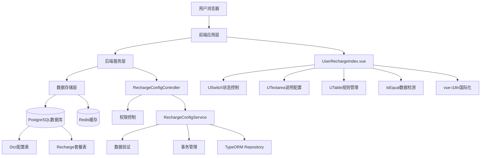
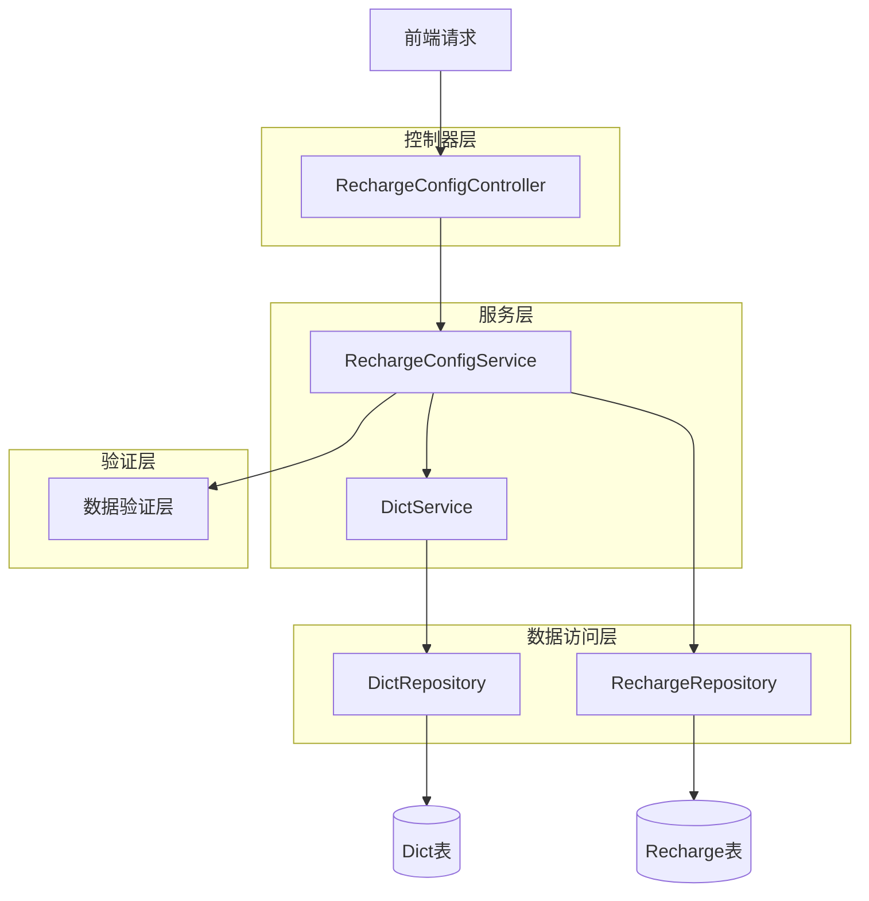
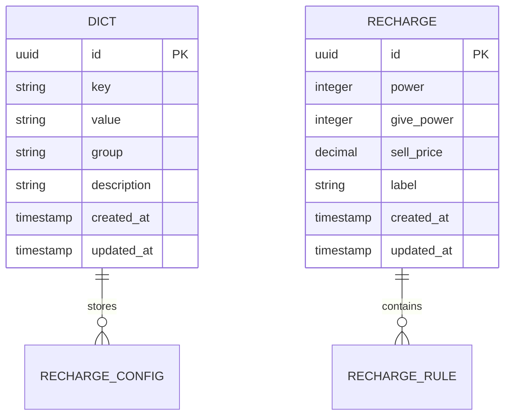

# BuildingAI算力套餐管理技术架构文档

## 1. 架构设计



## 2. 技术栈描述

### 2.1 前端技术栈
- **核心框架**: Nuxt3 + Vue3 + TypeScript
- **UI组件库**: @fastbuildai/ui (USwitch, UTextarea, UTable, UInput, UButton)
- **样式框架**: Tailwind CSS
- **国际化**: vue-i18n (支持中文、英文、日文)
- **状态管理**: Vue3 Composition API (ref, reactive, computed, watch)
- **数据比较**: lodash.isEqual (用于检测数据变更)
- **构建工具**: Vite + Turbo
- **代码规范**: ESLint + Prettier

### 2.2 后端技术栈
- **核心框架**: NestJS + TypeScript
- **ORM框架**: TypeORM
- **数据验证**: class-validator + class-transformer
- **权限控制**: 自定义 @Permissions 装饰器
- **事务管理**: @Transactional 装饰器
- **数据库**: PostgreSQL
- **缓存系统**: Redis
- **构建工具**: Turbo + TypeScript Compiler

### 2.3 开发工具
- **包管理**: pnpm
- **代码格式**: Prettier
- **代码检查**: ESLint
- **类型检查**: TypeScript
- **构建系统**: Turbo (monorepo)

## 3. 路由定义

| 路由                          | 用途                      |
| --------------------------- | ----------------------- |
| /console/user/user-recharge | 算力套餐管理页面，管理员配置充值功能和套餐规则 |

## 4. API定义

### 4.1 核心API

#### 获取套餐配置

```
GET /api/console/recharge-config
```

**权限要求**: `recharge-config:getConfig`

**响应示例**:

```json
{
  "rechargeStatus": true,
  "rechargeExplain": "1.充值成功后不支持退款或反向兑换为人民币；\n2.充值后的电力值不会过期，但无法提现、转赠；",
  "rechargeRule": [
    {
      "id": "uuid-1",
      "power": 1000,
      "givePower": 100,
      "sellPrice": 10.00,
      "label": "基础套餐"
    },
    {
      "id": "uuid-2", 
      "power": 5000,
      "givePower": 1000,
      "sellPrice": 45.00,
      "label": "超值套餐"
    }
  ]
}
```

#### 保存套餐配置

```
POST /api/console/recharge-config
```

**权限要求**: `recharge-config:setConfig`

**请求参数**:

| 参数名称            | 参数类型               | 是否必填  | 描述       |
| --------------- | ------------------ | ----- | -------- |
| rechargeStatus  | boolean            | true  | 充值功能开启状态 |
| rechargeExplain | string             | false | 充值说明文案   |
| rechargeRule    | RechargeRuleDto\[] | true  | 套餐规则列表   |

**RechargeRuleDto结构**:

| 参数名称      | 参数类型   | 是否必填  | 验证规则   | 描述          |
| --------- | ------ | ----- | ------ | ----------- |
| id        | string | false | UUID格式 | 套餐ID（新增时为空） |
| power     | number | true  | 必须大于0  | 充值数量        |
| givePower | number | true  | 不能小于0  | 赠送数量        |
| sellPrice | number | true  | 必须大于0  | 售价          |
| label     | string | true  | 不能为空   | 标签          |

**响应示例**:

```json
{
  "success": true,
  "message": "保存成功"
}
```

## 5. 服务架构图



## 6. 数据模型

### 6.1 数据模型定义



### 6.2 数据定义语言

#### Dict表（配置存储）

```sql
-- 充值功能状态配置
INSERT INTO dict (key, value, "group", description) 
VALUES ('recharge_status', 'true', 'recharge_config', '充值功能状态');

-- 充值说明配置
INSERT INTO dict (key, value, "group", description) 
VALUES ('recharge_explain', '充值说明文案内容', 'recharge_config', '充值说明');
```

#### Recharge表（套餐规则）

```sql
-- 创建充值套餐表
CREATE TABLE recharge (
    id UUID PRIMARY KEY DEFAULT gen_random_uuid(),
    power INTEGER NOT NULL COMMENT '充值的数量',
    give_power INTEGER NOT NULL DEFAULT 0 COMMENT '赠送的数量', 
    sell_price DECIMAL(10,2) NOT NULL COMMENT '售价',
    label VARCHAR(64) NOT NULL COMMENT '标签',
    created_at TIMESTAMP WITH TIME ZONE DEFAULT NOW(),
    updated_at TIMESTAMP WITH TIME ZONE DEFAULT NOW()
);

-- 创建索引
CREATE INDEX idx_recharge_power ON recharge(power);
CREATE INDEX idx_recharge_price ON recharge(sell_price);

-- 初始化数据
INSERT INTO recharge (power, give_power, sell_price, label) VALUES
(1000, 100, 10.00, '基础套餐'),
(3000, 500, 28.00, '进阶套餐'),
(5000, 1000, 45.00, '超值套餐'),
(10000, 2500, 88.00, '豪华套餐');
```

## 7. 前端组件架构

### 7.1 组件层次结构

```
UserRechargeIndex.vue (主页面)
├── StatusControl (功能状态控制)
├── ExplainConfig (充值说明配置)
└── RuleManagement (套餐规则管理)
    ├── RuleTable (规则表格)
    ├── AddButton (新增按钮)
    └── SaveButton (保存按钮)
```

### 7.2 状态管理

```typescript
// 页面状态定义
interface PageState {
  rechargeStatus: boolean;      // 充值功能状态
  rechargeExplain: string;      // 充值说明
  rechargeRules: RechargeRule[]; // 套餐规则列表
  changeValue: boolean;         // 数据变更标识
  oldData: RechargeConfigData;  // 原始数据
}

// 数据变更检测
const detectChanges = () => {
  const statusChanged = rechargeStatus.value !== oldData.value?.rechargeStatus;
  const explainChanged = rechargeExplain.value !== oldData.value?.rechargeExplain;
  const rulesChanged = !isEqual(rechargeRules.value, oldData.value?.rechargeRule);
  
  changeValue.value = statusChanged || explainChanged || rulesChanged;
};
```

### 7.3 数据验证

```typescript
// 前端验证规则
const validateRule = (rule: RechargeRule, index: number) => {
  const errors: string[] = [];
  
  if (!rule.power || rule.power <= 0) {
    errors.push(`第${index + 1}行充值数量必须大于0`);
  }
  
  if (rule.givePower < 0) {
    errors.push(`第${index + 1}行赠送数量不能小于0`);
  }
  
  if (!rule.sellPrice || rule.sellPrice <= 0) {
    errors.push(`第${index + 1}行售价必须大于0`);
  }
  
  if (!rule.label?.trim()) {
    errors.push(`第${index + 1}行标签不能为空`);
  }
  
  return errors;
};
```

## 8. 后端服务实现

### 8.1 控制器实现

```typescript
@ConsoleController("recharge-config", "充值配置")
export class RechargeConfigController extends BaseController {
    constructor(private readonly rechargeConfigService: RechargeConfigService) {
        super();
    }

    @Get()
    @Permissions({
        code: "getConfig",
        name: "获取充值配置",
        description: "获取充值配置",
    })
    async getConfig() {
        return await this.rechargeConfigService.getConfig();
    }

    @Post()
    @Permissions({
        code: "setConfig", 
        name: "设置充值配置",
        description: "设置充值配置",
    })
    async setConfig(@Body() updateRechargeConfigDto: UpdateRechargeConfigDto) {
        return await this.rechargeConfigService.setConfig(updateRechargeConfigDto);
    }
}
```

### 8.2 服务层实现

```typescript
@Injectable()
export class RechargeConfigService extends BaseService<Dict> {
    constructor(
        private readonly dictService: DictService,
        @InjectRepository(Recharge)
        private readonly rechargeRepository: Repository<Recharge>,
    ) {
        super();
    }

    async getConfig() {
        // 获取充值状态
        const rechargeStatus = await this.dictService.get(
            "recharge_status",
            false,
            "recharge_config",
        );
        
        // 获取充值说明
        const rechargeExplain = await this.dictService.get(
            "recharge_explain", 
            "",
            "recharge_config",
        );

        // 获取套餐规则
        const rechargeRule = await this.rechargeRepository.find({
            select: ["id", "power", "givePower", "sellPrice", "label"],
        });

        return {
            rechargeStatus,
            rechargeExplain,
            rechargeRule,
        };
    }

    async setConfig(updateRechargeConfigDto: UpdateRechargeConfigDto) {
        // 数据验证和保存逻辑
        // 使用事务确保数据一致性
    }
}
```

### 8.3 数据传输对象

```typescript
export class UpdateRechargeConfigDto {
    @IsBoolean({ message: "充值状态必须是布尔值" })
    rechargeStatus: boolean;

    @IsOptional()
    @IsString({ message: "充值说明必须是字符串" })
    rechargeExplain?: string;

    @IsArray({ message: "充值必须是数组格式" })
    @Type(() => RechargeRuleDto)
    rechargeRule: RechargeRuleDto[];
}

export class RechargeRuleDto {
    @IsOptional()
    @IsUUID()
    id?: string;
    
    @IsNumber({}, { message: "充值数量必须是数字" })
    @Min(1, { message: "充值数量必须大于0" })
    power: number;
    
    @IsNumber({}, { message: "赠送数量必须是数字" })
    @Min(0, { message: "赠送数量不能小于0" })
    givePower: number;
    
    @IsNumber({}, { message: "售价必须是数字" })
    @Min(0.01, { message: "售价必须大于0" })
    sellPrice: number;
    
    @IsString({ message: "标签必须是字符串" })
    @IsNotEmpty({ message: "标签不能为空" })
    label: string;
}
```

## 9. 安全考虑

### 9.1 权限控制

* 基于角色的访问控制（RBAC）

* API级别的权限验证

* 前端路由守卫

### 9.2 数据验证

* 前后端双重验证

* SQL注入防护

* XSS攻击防护

### 9.3 操作审计

* 配置变更日志记录

* 用户操作追踪

* 异常操作告警

## 10. 性能优化

### 10.1 前端优化

* 组件懒加载

* 数据变更检测优化

* 防抖处理用户输入

### 10.2 后端优化

* 数据库查询优化

* Redis缓存策略

* 事务处理优化

### 10.3 数据库优化

* 合理的索引设计

* 查询语句优化

* 连接池配置

