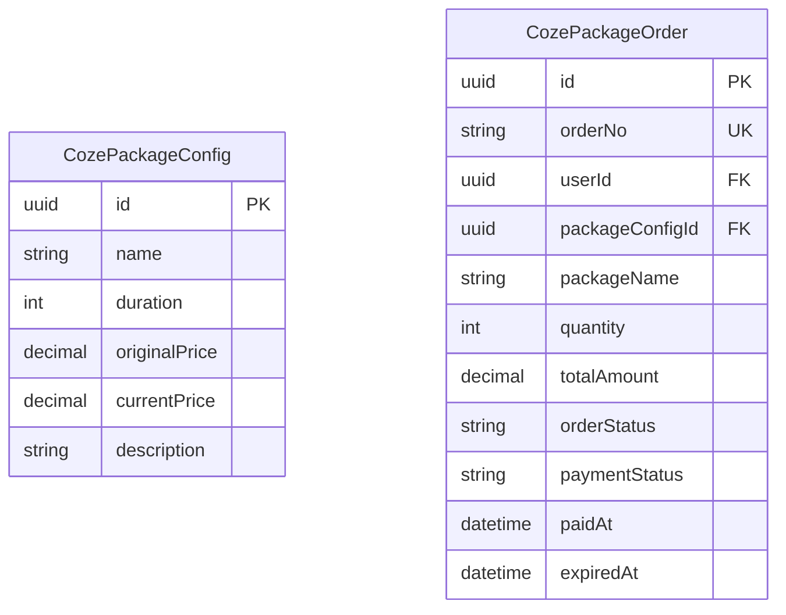

# Coze 套餐中心页面 PRD

## 1. 产品概述
在 BuildingAI 个人中心新增「Coze 套餐中心」页面，用户可浏览套餐、下单、支付并查看结果。后端通过新建 **WebCozePackageModule** 复用 Console 侧 `CozePackageModule` 的完整能力（配置、订单、支付、字典开关），零业务逻辑重复开发。

**目标与背景**
- 目标：为用户提供 Coze 套餐购买入口，功能与“充值中心”一致（选择套餐→选择支付方式→下单→扫码支付→结果轮询→成功提示）。
- 背景：在「个人权益」分组下新增“Coze 套餐中心”菜单，位置在“充值中心”之后，页面布局复用 `setting`，支付链路复用现有网关与后端模块，数据结构改为 Coze 套餐维度。

**范围与非范围**
- 范围
  - 左侧导航新增子菜单“Coze 套餐中心”，路径 `/profile/personal-rights/coze-package-center`。
  - 页面实现与“充值中心”一致：中心信息拉取、套餐选择、支付方式、订单提交、预支付二维码、轮询支付结果、成功提示。
  - 后端提供 Coze 套餐中心数据、下单与支付查询接口；支付端统一使用现有 `prepay`/`getPayResult`，传参 `from='coze'` 区分业务。
  - 国际化覆盖 `zh/en/jp` 三语，沿用现有命名规范与文件结构。
- 非范围
  - 不涉及发票、优惠券与退款。
  - 不新增支付方式（保持与充值中心一致）。
  - 不改动现有充值中心逻辑与数据表结构（除非为复用需要增加枚举值）。

**用户角色与场景**
- 登录用户：购买 Coze 套餐以解锁相应资源或权益。
- 主要场景
  - 进入页面→查看可售套餐与说明→选择套餐与支付方式→下单→扫码支付→轮询成功→权益生效。
  - 支付失败或超时→刷新二维码后重试。

**信息架构与导航**
- 布局：复用 `apps/web/core/layouts/setting.vue`。
- 分组：`common.label.personalRights`（个人权益）。
- 子菜单（顺序：充值中心 → Coze 套餐中心）
  - 充值中心：`common.personalRights.rechargeCenter` → `/profile/personal-rights/recharge-center`
  - Coze 套餐中心：`common.personalRights.cozePackageCenter` → `/profile/personal-rights/coze-package-center`
- 链接选择器：路由 `meta` 设置 `inSystem: true, inLinkSelector: true`，自动出现在链接选择器列表。

## 2. 复用策略（对标 WebRechargeModule）
- **后端**：新建 `WebCozePackageModule`，仅含 Web 侧 Controller/Service/DTO；
  - 实体 Repository 直接注入 Console 侧 `CozePackageConfig` / `CozePackageOrder`，零重复建表；

  - 字典开关复用 `coze_package_status` / `coze_package_explain`（Dict 字典表，全局功能开关与说明文案）

  - 用户当前套餐情况：从UserInfo中的cozePackage变量中获取。如果cozePackage为空，则显示“暂无套餐”，剩余天数显示“0天”。

  - 所有业务逻辑（`coze_package_explain`、套餐rule、订单创建、状态机）通过调用 Console 侧 `CozePackageConfigService` / `CozePackageOrderService` 完成。

- **接口**：统一以 `/web/coze-package/*` 暴露，供前端个人中心调用。
- **前端**：沿用 RechargeCenter.vue 组件结构，仅替换路由、key、文案。

## 3. 范围
### 3.1 用户端（Web）
1. 套餐列表页（/profile/personal-rights/coze-package-center）
2. 支付弹窗（复用 PayDialog）
3. 结果页（/profile/personal-rights/coze-package-result）

**页面功能清单**
- 页面头部：标题 `menu.cozePackageCenter`；返回按钮指向首页 `/`。
- 用户信息卡片：头像、昵称、当前 Coze 权益概览（Coze套餐名称，剩余天数，可以从UserInfo中的cozePackage变量中获取。如果cozePackage为空，则显示“暂无套餐”，剩余天数显示“0天”。）

- 套餐选择区：列表卡片展示套餐标签、权益内容、价格。
- 支付方式区：列出现有支付方式（微信/支付宝），单选绑定。
- 套餐说明：运营文案（支持 HTML），展示购买须知与支付条款链接。
- 操作区：显示合计金额与“立即购买”按钮；弹出二维码支付弹窗；支付成功弹窗提供“继续购买/查看记录”。

**交互与状态**
- 禁用逻辑：未选择套餐或支付方式时“立即购买”置灰。
- 二维码有效期：120s，到期可点击刷新重新获取。
- 轮询：每 3s 查询支付结果，成功即停止并刷新用户权益。
- 高亮：左侧菜单使用 `:variant='soft' :color='primary'` 当 `category.to === route.path`。

**国际化规范**
- common.json
  - `common.label.personalRights`（分组标题）
  - `common.personalRights.cozePackageCenter`（菜单名：Coze 套餐中心）
- menu.json
  - `menu.cozePackageCenter`（页面标题）
- web-personal-rights.json
  - `cozePackageCenter.title`
  - `cozePackageCenter.selectPackage`
  - `cozePackageCenter.paymentMethod`
  - `cozePackageCenter.explain`
  - `cozePackageCenter.buyNow`
  - `cozePackageCenter.qrPay`
  - `cozePackageCenter.qrCode`
  - `cozePackageCenter.qrTip`
  - `cozePackageCenter.refreshQrCode`
  - `cozePackageCenter.paySuccessTitle`
  - `cozePackageCenter.paySuccessDesc`
  - `cozePackageCenter.continueBuy`
  - `cozePackageCenter.viewRecord`
  - `cozePackageCenter.qrExpired`
- 要求：同步 `zh/en/jp` 三语；命名前缀与层级与充值中心一致。

### 3.2 运营端（Console，已存在）
- 套餐配置管理（/console/coze-package-config）
- 订单管理（/console/coze-package-order）

## 4. 数据模型（复用 Console）

## 5. 接口（新增 /web 前缀）
| Method | Path | 说明 |
|--------|------|------|
| GET | /web/coze-package/center | 取套餐配置 |
| POST | /web/coze-package/order | 创建订单 |
| GET | /web/coze-package/order/:id | 订单详情 |
| GET | /web/coze-package/orders | 我的订单分页 |

> 后端实现：Web 侧 Controller 接收请求 → 调用 Console 侧 Service 完成业务 → 返回前端格式。

## 6. 国际化 key（复用）
- common.label.personalRights
- common.personalRights.cozePackageCenter
- web-personal-rights.json：`cozePackageCenter.*`（沿用充值中心命名层级，仅替换为 Coze 套餐中心）

## 7. 核心文件索引
### 7.1 前端（修改）
- 布局：`apps/web/core/layouts/setting.vue`（新增子菜单项，顺序在充值中心之后）

### 7.2 前端（新增）
- 页面：`apps/web/app/profile/personal-rights/coze-package-center.vue`
- 模型：`apps/web/models/coze-package-center.d.ts`
- 接口：`apps/web/services/web/coze-package-center.ts`
- 国际化：`apps/web/core/i18n/{zh,en,jp}/common.json`（新增菜单 key）
- 国际化：`apps/web/core/i18n/{zh,en,jp}/menu.json`（页面标题）
- 国际化：`apps/web/core/i18n/{zh,en,jp}/web-personal-rights.json`（页面静态文案）

### 3.2 后端（新增）
- Module：`apps/server/src/modules/web/coze-package/coze-package.module.ts`
- Controller：`apps/server/src/modules/web/coze-package/controllers/coze-package.controller.ts`
- Service：`apps/server/src/modules/web/coze-package/services/coze-package.service.ts`

### 3.3 后端（修改）
- WebModule：`apps/server/src/modules/web/web.module.ts`（注册 CozePackageModule）
- 支付模块：`apps/server/src/modules/web/pay/pay.module.ts`（注入CozePackageOrder实体）
- 支付服务：`apps/server/src/modules/web/pay/services/pay.service.ts`（支持Coze套餐订单支付）
- 支付接口：`apps/server/src/common/interfaces/pay.interface.ts`（在 `PayFrom` 常量里追加 `COZE: 'coze'`）

### 7.5 复用（Console 侧已存在）
- 实体：`apps/server/src/modules/console/coze-package/entities/*`
- DTO：`apps/server/src/modules/console/coze-package/dto/*`;列表接口直接复用 PaginationDto （已存在）
- Service：`apps/server/src/modules/console/coze-package/services/*`（被 Web 侧 Service 调用）
- 字典：`coze_package_status` / `coze_package_explain`
- 支付、订单状态机、错误码、国际化 key：全部复用

## 8. 验收标准
- [ ] 左侧导航「个人权益」下出现「Coze 套餐中心」子菜单
- [ ] 套餐列表、价格、说明与后台配置一致
- [ ] 可完成完整下单+支付+结果展示
- [ ] 多语言切换正常
- [ ] 异常场景（库存不足、支付失败）toast 提示正确

## 9. 埋点事件（PostHog）
- `coze_package_view`：页面曝光
- `coze_package_select`：选择套餐
- `coze_package_create_order`：创建订单成功
- `coze_package_qr_show`：二维码弹窗展示
- `coze_package_pay_success`：支付成功
