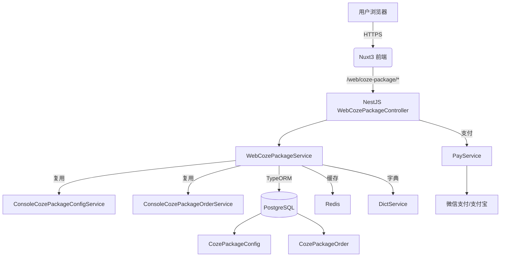
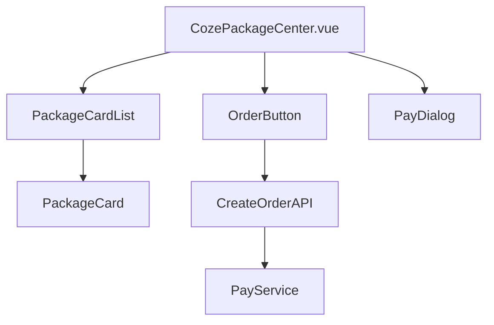
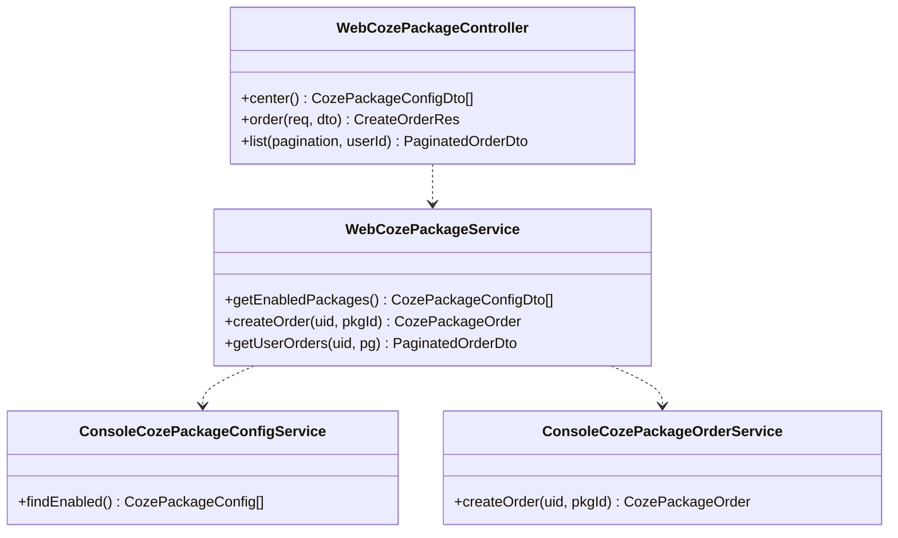
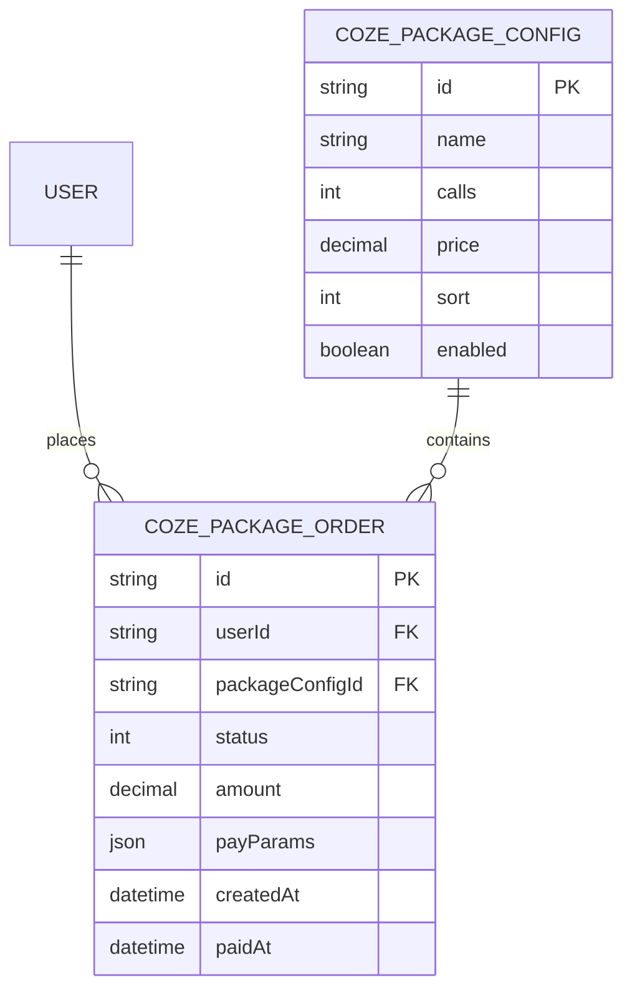
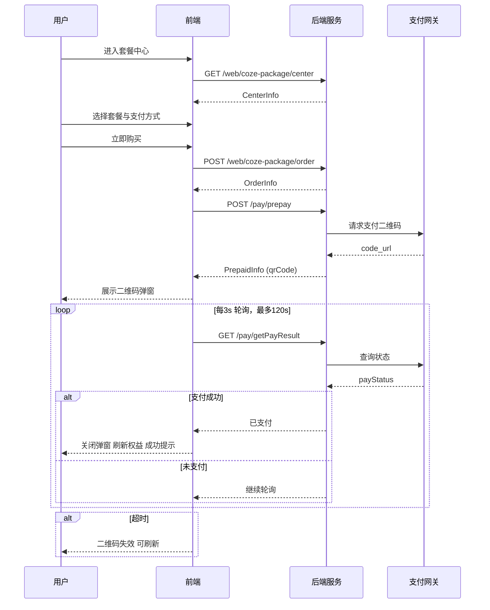

# Coze 套餐中心页面技术架构

> 对应 PRD：`.trae/documents/Coze套餐中心页面PRD.md`

## 1. 架构总览



**说明**：
- 前端：Nuxt3 + TypeScript，页面组件复用 `RechargeCenter.vue` 结构
- 后端：仅新增 `WebCozePackageModule`，通过调用 Console 侧 Service 完成业务，零实体重复
- 支付：复用现有 `PayService`，字典开关 `coze_package_enable` 控制上下架

## 2. 技术栈

| 层级 | 选型 | 版本 | 备注 |
| ---- | ---- | ---- | ---- |
| 前端 | Nuxt3 | 3.8+ | 同充值中心 |
| 语言 | TypeScript | 5.x | 全栈一致 |
| 样式 | TailwindCSS | 3.x | 主题色 `indigo` |
| 后端 | NestJS | 10.x | 仅新增 Web 模块 |
| ORM | TypeORM | 0.3.x | 复用 Console 实体 |
| 数据库 | PostgreSQL | 15+ | 同实例 |
| 缓存 | Redis | 7.x | 复用连接池 |
| 支付 | WechatPay & AliPay | — | 复用 PayService |
| 部署 | Docker | 24.x | 同仓库 CI/CD |

## 3. 前端设计

### 3.1 页面结构

| 页面 | 路由 | 组件 | 备注 |
| ---- | ---- | ---- | ---- |
| 套餐中心 | `/coze-package` | `CozePackageCenter.vue` | 【新增】复用 `RechargeCenter.vue` 布局 |


### 3.2 核心组件



**组件职责**：
- `PackageCardList`：展示 `GET /web/coze-package/center` 返回的套餐卡片
- `OrderButton`：携带 `packageConfigId` 调用 `POST /web/coze-package/order`
- `PayDialog`：复用 `RechargePayDialog`，仅替换文案 key

### 3.3 状态管理

使用 `useState` 局部状态，无全局 Store：
```ts
// 套餐列表
const packages = useState<CozePackageConfigDto[]>('coze-package-list', () => [])
// 当前下单数据
const orderDraft = useState<CreateOrderReq>('coze-order-draft', () => ({}))
```

### 3.4 国际化

复用 `recharge.json` 结构，新增 `coze-package.json`：
```json
{
  "title": "Coze 套餐中心",
  "subtitle": "选择适合你的调用量",
  "buyNow": "立即购买",
  "orderSuccess": "订单提交成功，请完成支付"
}
```

## 4. 后端设计

### 4.1 模块结构

仅新增 `apps/server/src/modules/web/coze-package`，其余均复用：

```
web/coze-package/
├── coze-package.module.ts      【新增】
├── controllers/
│   └── coze-package.controller.ts 【新增】
└── services/
    └── coze-package.service.ts    【新增】
```

### 4.2 类图



### 4.3 接口清单

| 方法 | 路径 | 用途 | 备注 |
| ---- | ---- | ---- | ---- |
| GET | `/web/coze-package/center` | 套餐列表 | 返回启用套餐，字典过滤 |
| POST | `/web/coze-package/order` | 创建订单 | 复用 Console 订单状态机 |
| GET | `/web/coze-package/order/:id` | 订单详情 | 需登录，仅本人可查 |
| GET | `/web/coze-package/orders` | 我的订单分页列表 | 复用 PaginationDto，参数校验阻断穿透 |
| POST | `/web/coze-package/refund` | 申请退款 | 仅未消费订单可退款，`orderId` 作为幂等键 |

**请求/响应**：
```ts
// Request
type CreateOrderReq = { packageConfigId: string }
// Response
type CreateOrderRes = { orderId: string; payParams: PrepayDto }
```

### 4.4 复用策略

| 维度 | 复用点 | 实现 |
| ---- | ---- | ---- |
| 实体 | CozePackageConfig / Order / Dict | 直接 import Console 实体 |
| 支付 | PayService.createPrepayOrder | 同充值，仅 `businessType='coze_package'` |
| 字典 | DictService.value('coze_package_enable') | 控制上下架 |
| 状态机 | OrderStatusEnum | 复用 Console 枚举 |
| 错误码 | `PACKAGE_SOLD_OUT` / `ORDER_NOT_FOUND` | 复用 Console 定义 |

## 5. 数据模型

### 5.1 实体关系



### 5.2 字典配置（与 PRD 保持一致）

| key | value | 说明 |
| --- | --- | --- |
| `coze_package_status` | `true`/`false` | 套餐中心开关，控制前端是否展示入口 |
| `coze_package_explain` | `string` | 套餐说明文案，支持 HTML 展示 |

## 6. 缓存策略

- 套餐配置：Redis `string` 缓存 5 min，key=`coze:pkg:enabled`
- 订单幂等：下单时 Redis `SETNX` 锁 30 s，key=`coze:order:{userId}`

## 7. 安全与风控

| 维度 | 措施 |
| ---- | ---- |
| 鉴权 | 复用 `JwtAuthGuard` |
| 防刷 | 同充值，限制单用户 1 分钟 3 次下单 |
| 支付 | 复用 PayService 签名验证 |
| 敏感字段 | 订单接口不返回 `payParams.key` |

## 8. 监控与日志

- 指标：Prometheus 埋点 `coze_package_order_total{status}`
- 日志：同格式 `WebCozePackageService -> createOrder: userId=xxx, pkgId=xxx`
- 告警：连续 5 单支付失败触发 Webhook

## 9. 部署与 CI/CD

- Dockerfile：复用现有 `server.Dockerfile`，无需新增
- 环境变量：沿用 `PAY_*` 系列，无需扩展
- 数据库迁移：Console 已建表，Web 模块零迁移

## 10. 核心文件索引

### 10.1 前端新增（与 PRD 保持一致）
| 文件 | 路径 | 说明 | 备注 |
| ---- | ---- | ---- | ---- |
| 页面组件 | `apps/web/app/console/profile/personal-rights/coze-package-center/coze-package-center.vue` | 个人权益分组下的 Coze 套餐中心页面 | `definePageMeta({ layout: 'setting', inSystem: true, inLinkSelector: true })` |
| 模型类型 | `apps/web/models/coze-package-center.d.ts` | 页面与服务的 TS 类型定义 | 与后端 DTO 字段对齐 |
| 接口服务 | `apps/web/services/coze-package-center.ts` | 调用 `/web/coze-package/*` 接口 | 传参需带 `from='coze'` 区分业务 |
| 页面文案 | `apps/web/core/i18n/{zh,en,jp}/web-personal-rights.json` | 页面静态文案 | 使用 `cozePackageCenter.*` 前缀 |
| 菜单文案 | `apps/web/core/i18n/{zh,en,jp}/menu.json` | 页面标题 | `menu.cozePackageCenter` |
| 分组文案 | `apps/web/core/i18n/{zh,en,jp}/common.json` | 左侧分组与导航 | `common.label.personalRights` 与 `common.personalRights.cozePackageCenter` |


### 10.2 前端修改（与 PRD 保持一致）
| 文件路径 | 改动性质 | 要点说明 |
| ---- | ---- | ---- |
| `apps/web/app/console/profile/personal-rights/coze-package-center/coze-package-center.vue` | 新增 | 路由 `/profile/personal-rights/coze-package-center`；`definePageMeta` 标题 `menu.cozePackageCenter`，复用充值中心交互与轮询逻辑 |
| `apps/web/models/coze-package-center.d.ts` | 新增 | 对齐 Console DTO，定义 `CenterInfo/OrderParams/OrderInfo/PayResult` 等类型 |
| `apps/web/services/coze-package-center.ts` | 新增 | 接口：`GET /web/coze-package/center`、`POST /web/coze-package/order`、`GET /web/coze-package/orders`；支付复用 `/pay/prepay` 与 `/pay/getPayResult`（传 `from='coze'`） |
| `apps/web/core/i18n/{zh,en,jp}/common.json` | 修改（新增key） | 新增 `common.personalRights.cozePackageCenter` 左侧菜单文案（分组沿用 `common.label.personalRights`） |
| `apps/web/core/i18n/{zh,en,jp}/menu.json` | 修改（新增key） | 新增页面标题 `menu.cozePackageCenter` |
| `apps/web/core/i18n/{zh,en,jp}/web-personal-rights.json` | 修改（新增段） | 新增 `cozePackageCenter.*` 全量文案键（标题/套餐/支付/说明/购买/二维码/刷新/成功提示等） |
| `apps/web/components/RechargePayDialog.vue` | 复用 | 组件复用，仅替换文案 key 为 `cozePackageCenter.*`，交互保持一致 |
| `apps/web/core/layouts/setting.vue` | 修改 | 在侧边栏菜单数组新增 `{ name: 'cozePackageCenter', title: 'Coze套餐', path: '/profile/personal-rights/coze-package-center', icon: 'coze' }`；标题国际化使用 `menu.cozePackageCenter`；权限标识沿用 `personal-rights` 既有逻辑，无需额外判断 |

### 10.3 后端新增（与 PRD 保持一致）
| 文件 | 路径 | 说明 | 备注 |
| ---- | ---- | ---- | ---- |
| Module | `apps/server/src/modules/web/coze-package/coze-package.module.ts` | 注册 Controller/Service | 在 `web.module.ts` 中引入 WebCozePackageModule |
| Controller | `apps/server/src/modules/web/coze-package/controllers/coze-package.controller.ts` | 暴露 `/web/coze-package/*` | 统一使用 REST + JSON，需鉴权 |
| Service | `apps/server/src/modules/web/coze-package/services/coze-package.service.ts` | 调用 Console Service | 复用 Console 侧配置/订单能力 |

### 10.4 后端修改（与 PRD 保持一致）
| 文件路径 | 改动性质 | 要点说明 |
| ---- | ---- | ---- |
| `apps/server/src/modules/web/coze-package/coze-package.module.ts` | 新增 | 新增 WebCozePackageModule，注册 Controller/Service（在 `web.module.ts` 引入） |
| `apps/server/src/modules/web/coze-package/controllers/coze-package.controller.ts` | 新增 | 暴露 `/web/coze-package/*`：中心信息/创建订单/订单详情/订单分页/退款申请，需鉴权；统一 REST+JSON |
| `apps/server/src/modules/web/coze-package/services/coze-package.service.ts` | 新增 | 复用 Console Service（`CozePackageConfigService/CozePackageOrderService`），调用支付网关服务 `PayService` |
| `apps/server/src/modules/web/pay/services/pay.service.ts` | 复用 | 预支付与结果查询；要求 Body/Query 带 `from='coze'` 以区分业务 |
| `apps/server/src/modules/console/coze-package/entities/*` | 复用 | 直接注入为 Repository，无需新建实体或迁移 |
| `apps/server/src/common/dto/pagination.dto.ts` | 复用 | 订单分页统一入参 |
| `apps/server/src/modules/web/dict/dict.service.ts` | 复用 | 读取 `coze_package_status` 与 `coze_package_explain` 字典 |
| `apps/server/src/constants/business-error-coze-package.ts` | 复用 | 错误码统一来源，控制器统一映射与提示 |
| `apps/server/src/modules/web/web.module.ts` | 修改 | 引入 `WebCozePackageModule`，与 `Auth/Pay/User` 等模块并列 |
| `apps/server/src/modules/app.module.ts` | 复用 | AppModule 同时加载 `WebModule` 与 `ConsoleModule`，无需额外注册 WebCozePackage 至 Console |

### 10.5 复用清单（与 PRD 保持一致）
| 维度 | 文件 | 备注 |
| ---- | ---- | ---- |
| 实体 | `apps/server/src/modules/console/coze-package/entities/*.ts` | 零修改 |
| Console Service | `CozePackageConfigService` / `CozePackageOrderService` | 直接 import |
| 支付 Service | `apps/server/src/modules/web/pay/services/pay.service.ts` | 复用 prepay |
| 字典 Service | `apps/server/src/modules/web/dict/dict.service.ts` | 复用 value |
| 分页 DTO | `apps/server/src/common/dto/pagination.dto.ts` | Web 列表入参 |
| 错误码 | `apps/server/src/constants/business-error-coze-package.ts` | 复用定义 |
| 国际化 | `apps/web/components/RechargePayDialog.vue` | 仅替换 key |

---

## 11. 接口细化（与 PRD 路径一致）

- 通用 Headers：`Authorization: Bearer <token>`、`Content-Type: application/json`

| 接口 | 方法 | 路径 | 入参 | 出参（示例） | 备注 |
| ---- | ---- | ---- | ---- | ---- | ---- |
| 获取中心信息 | GET | `/web/coze-package/center` | 无 | `{ user:{id,username,avatar}, status:true, explain:"<html>", packages:[{id,name,duration,currentPrice,description}], payWayList:[{name,payType,logo}] }` | 字段与 Console DTO 对齐 |
| 创建订单 | POST | `/web/coze-package/order` | `{ packageConfigId:string, payType:1|2, quantity?:1 }` | `{ orderId:string, orderNo:string, orderAmount:string }` | 幂等：重复下单返回同一 `orderNo` |
| 订单详情 | GET | `/web/coze-package/order/:id` | 路径 `id` | `{ id:'uuid', orderNo:'CZ202511060001', userId:'uuid', packageName:'Coze Pro 30天', totalAmount:'99.00', payStatus:1, paidAt:'2025-11-06T12:34:56Z' }` | 需登录 |
| 我的订单 | GET | `/web/coze-package/orders` | `page:number, pageSize:number` | `{ items:[{ id:'uuid', orderNo:'CZ2025...', packageName:'Coze Pro 30天', totalAmount:'99.00', payStatus:1, paidAt:'2025-11-06T12:34:56Z' }], total:37, page:1, pageSize:10 }` | 复用 `PaginationDto` |
| 申请退款 | POST | `/web/coze-package/refund` | `{ orderId:string, reason:string }` | `{ refundId:'RF202511060001', status:'pending' }` | 仅未消费订单可退款 |

- 幂等/限流说明
  - 订单详情：GET 接口遵循平台限流策略（如 `Throttle(10,60)`）；仅本人可查。
  - 我的订单：GET 接口使用分页，遵循平台限流策略（如 `Throttle(10,60)`）；参数校验阻断穿透。
  - 申请退款：POST 接口以 `orderId` 作为幂等键，重复提交返回同一个 `refundId`；遵循平台限流策略（如 `Throttle(10,60)`）；仅未消费订单可退款。

- 支付接口（复用现有网关）
  - 预支付：`POST /pay/prepay`，Body：`{ from:"coze", orderId:string, payType:1|2 }` → 返回：`{ qrCode:{ code_url:string } }`
  - 查询结果：`GET /pay/getPayResult?from=coze&orderId=...` → 返回：`{ payStatus:0|1 }`

- 错误码对照

| Code | 说明 | 示例文案 |
| ---- | ---- | ---- |
| 200 | 业务成功 | - |
| 400 | 参数错误 | `参数错误` |
| 401 | 未登录 | `请先登录` |
| 403 | 无权限 | `无访问权限` |
| 404 | 资源不存在 | `订单不存在` |
| 429 | 请求过于频繁 | `操作过于频繁，请稍后再试` |
| 500 | 系统繁忙 | `系统繁忙，请稍后重试` |

## 12. 实体与索引（复用 Console 实体）

- CozePackageConfig（套餐配置）

| 字段 | 类型 | 约束 | 说明 |
| ---- | ---- | ---- | ---- |
| id | `uuid` | PK | 主键 |
| name | `varchar(64)` | - | 套餐名称 |
| duration | `int` | - | 时长（天） |
| originalPrice | `numeric(10,2)` | - | 原价 |
| currentPrice | `numeric(10,2)` | - | 现价 |
| description | `text` | - | 套餐说明 |

- CozePackageOrder（订单）

| 字段 | 类型 | 约束 | 说明 |
| ---- | ---- | ---- | ---- |
| id | `uuid` | PK | 主键 |
| orderNo | `varchar(64)` | UK | 订单号（唯一） |
| userId | `uuid` | IDX | 用户ID（加索引） |
| packageConfigId | `uuid` | IDX | 套餐ID（加索引） |
| packageName | `varchar(64)` | - | 套餐快照名称 |
| quantity | `int` | - | 购买数量 |
| totalAmount | `numeric(10,2)` | - | 订单金额 |
| payStatus | `int` | IDX | 支付状态（0未支付/1已支付） |
| paidAt | `timestamp` | - | 支付时间 |
| expiredAt | `timestamp` | - | 过期时间 |
| createdAt | `timestamp` | IDX | 创建时间（加索引） |

## 13. 支付流程



- 幂等策略：
  - 下单：基于 `orderNo` 唯一约束，重复提交返回同一订单信息。
  - 预支付：`orderId` 相同返回同一 `code_url`。
  - 轮询：支付成功后立即停止；超过 120s 停止并允许刷新。

## 14. 缓存策略细化

| Key 模板 | TTL | 场景 | 说明 |
| ---- | ---- | ---- | ---- |
| `coze:pkg:center:{userId}` | 60s | 中心信息缓存 | 用户快照+套餐列表 |
| `coze:pkg:config` | 300s | 套餐配置 | 字典变更清理缓存 |
| `coze:order:lock:{userId}` | 30s | 下单幂等锁 | 使用 `SETNX` 防刷 |

- 穿透/击穿/雪崩：
  - 穿透：空值缓存 10s；接口层参数校验拦截。
  - 击穿：热点 Key 加互斥锁（Redis 分布式锁）。
  - 雪崩：随机化 TTL（±10%），多级缓存（本地 + Redis）。

## 15. 安全与风控实现点

- 鉴权：复用 `JwtAuthGuard`，所有 `/web/coze-package/*` 需登录。
- 防刷：接口限流（如 `Throttle(10,60)`）；用户级下单频率控制（1 分钟 ≤ 3 次）。
- 防重放：`nonce + timestamp` 校验（可用于关键写操作）。
- 验签：复用 `PayService` 的签名校验流程（微信/支付宝）。
- SQL 注入：TypeORM 参数化查询；禁止字符串拼接。
- XSS：`coze_package_explain` 作为 HTML 展示前进行白名单过滤或转义。

## 16. 监控与告警

- Prometheus 指标：
  - `coze_package_center_requests_total{status}`
  - `coze_package_order_create_total{status}`
  - `coze_package_order_paid_total`
  - `coze_package_api_latency_seconds_bucket`
- 告警阈值（示例）：
  - 5 分钟内 `order_create_total{status="fail"}` 比例 > 20% 触发告警。
  - `prepay` 接口 1 分钟错误数 > 5 触发告警。
- 日志埋点字段：`traceId, userId, orderId, packageId, payType, status, costMs`。

## 17. 灰度与回滚（示例片段）

- Nginx 灰度：
```
upstream web_backend {
    server api-v1:3001 weight=7;
    server api-v2:3001 weight=3;
}
server {
    location /web/coze-package/ {
        proxy_pass http://web_backend;
    }
}
```
- Consul 服务标签：`service:web-coze-package tags:["canary"]`
- 回滚脚本：
```
#!/bin/bash
set -e
# 切回稳定版本
kubectl rollout undo deployment/web-backend
# 验证健康
kubectl get pods | grep web-backend
```

---
