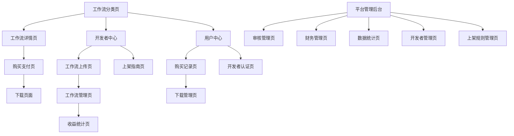

# 多平台工作流变现PRD

## 1. 产品概述

多平台工作流变现系统是基于现有BuildingAI平台的扩展功能，旨在为开发者提供工作流源码销售和变现的综合平台。系统支持Coze、n8n、Zapier、Dify等主流工作流平台的源码交易，通过工作流分商城模式实现开发者与用户的双赢。

- 解决问题：工作流开发者缺乏变现渠道，用户难以找到高质量的工作流模板
- 目标用户：工作流开发者、自动化需求方

## 2. 核心功能

### 2.1 用户角色

| 角色 | 注册方式 | 核心权限 |
|------|----------|----------|
| 普通用户 | 邮箱注册/第三方登录 | 浏览、购买、下载工作流，评价反馈，申请开发者认证 |
| 开发者 | 实名认证升级 | 上传工作流、管理商品、查看收益、提现，查看上架规则 |
| 平台管理员 | 内部分配 | 审核工作流、管理用户、财务管理、数据分析，审核开发者认证，管理上架规则 |

#### 角色权限详细说明

**普通用户权限：**
- 工作流浏览：查看工作流分类页，筛选搜索工作流
- 购买下载：购买工作流，下载已购买的工作流
- 评价反馈：对已购买工作流进行评价和反馈
- 开发者认证申请：提交开发者认证申请，上传资质证明材料

**开发者权限：**
- 工作流管理：上传、编辑、删除自己的工作流
- 商品管理：管理工作流商品信息，设置价格和描述
- 收益管理：查看销售收益，申请提现
- 上架规则查看：查看平台制定的工作流上架规则和标准
- 规则通知接收：接收上架规则更新通知

**平台管理员权限：**
- 工作流审核：审核开发者提交的工作流，确保质量和合规性
- 用户管理：管理平台用户，处理用户问题和投诉
- 开发者认证审核：审核开发者认证申请，验证开发者资质
- 上架规则管理：制定、修改、发布工作流上架规则
- 财务管理：处理平台财务，管理收益分成和提现
- 数据分析：查看平台运营数据，生成分析报告

### 2.2 功能模块

我们的多平台工作流变现系统包含以下主要功能：

1. **工作流分类页**：工作流展示、分类筛选、搜索推荐、热门排行
2. **工作流详情页**：详细介绍、预览演示、用户评价、购买下载
3. **开发者中心**：工作流上传、工作流管理、收益统计、提现申请
4. **用户中心**：工作流购买记录、下载管理、收藏夹、个人设置
5. **平台管理后台**：工作流审核管理、工作流订单管理、财务管理
6. **工作流类型管理**：工作流业务分类管理
7. **工作流平台类型管理**：工作流平台类型
8. **开发者认证申请**：普通用户申请成为开发者的认证流程
9. **开发者认证审核**：平台管理员审核开发者认证申请
10. **上架规则管理**：平台管理员制定和发布工作流上架规则
11. **上架规则查看**：开发者查看当前有效的工作流上架规则

### 2.3 核心功能模块详述

#### 2.3.1 版本管理与升级系统
- **版本控制**：支持工作流多版本管理，版本号规范（语义化版本）
- **增量更新**：支持增量更新包，减少下载流量
- **兼容性检查**：自动检测版本兼容性，提供升级建议
- **回滚机制**：支持版本回滚，保障用户使用稳定性

#### 2.3.2 平台导入与一键部署
- **多平台适配**：支持Coze、n8n、Zapier、Dify、Make等主流平台
- **格式转换**：自动转换不同平台的工作流格式
- **配置生成**：根据目标平台自动生成配置文件
- **部署向导**：提供图形化部署向导，简化部署流程

#### 2.3.3 许可与授权管理
- **许可证类型**：个人版、企业版、开发者版等不同许可
- **设备绑定**：支持设备授权管理，防止盗版
- **使用限制**：根据许可类型限制使用次数、并发数等
- **到期管理**：许可到期提醒、自动续费、宽限期设置

#### 2.3.4 开发者结算与提现
- **收益计算**：实时计算开发者收益，支持多种分成模式
- **税务处理**：自动计算税费，生成税务报表
- **提现管理**：支持多种提现方式，设置提现门槛和周期
- **结算报表**：详细的收益报表，支持导出和打印

#### 2.3.5 风险与合规管理
- **内容审核**：AI+人工双重审核，确保内容合规
- **反作弊系统**：检测刷单、刷评价等作弊行为
- **知识产权保护**：版权检测、侵权举报、DMCA处理
- **数据安全**：用户数据加密、访问日志、安全审计

#### 2.3.6 国际化与多币种
- **多语言支持**：中文、英文、日文等多语言界面
- **多币种结算**：支持人民币、美元、欧元等多种货币
- **地区适配**：根据用户地区显示合规的功能和内容
- **本地化服务**：本地化的客服、支付、物流等服务

#### 2.3.7 观测与反作弊机制
- **行为分析**：用户行为轨迹分析，识别异常模式
- **实时监控**：交易监控、下载监控、评价监控
- **风险评分**：基于多维度数据的风险评分系统
- **自动处理**：自动封禁、限制、预警等处理机制

#### 2.3.8 开发者认证管理系统
- **认证申请流程**：普通用户提交开发者认证申请，包含个人信息、技能证明、作品展示
- **资质审核机制**：平台管理员审核申请材料，验证开发者技能和资质
- **认证等级管理**：支持初级、中级、高级开发者等级认证
- **认证状态跟踪**：申请状态实时更新，审核进度透明化

#### 2.3.9 上架规则管理系统
- **规则制定发布**：平台管理员制定工作流上架标准和审核规则
- **规则版本控制**：支持规则版本管理，历史版本查询
- **规则分类管理**：按平台类型、工作流类型制定不同规则
- **规则通知机制**：规则更新时自动通知相关开发者

#### 2.3.10 工作流订单管理系统
- **订单生命周期管理**：从订单创建到完成的全流程跟踪管理
- **订单状态控制**：待支付、已支付、已发货、已完成、已取消、退款中等状态管理
- **支付集成管理**：支持多种支付方式，支付状态实时同步
- **自动发货系统**：支付成功后自动发放工作流下载权限
- **退款处理机制**：支持全额退款、部分退款，自动化退款流程
- **订单数据分析**：订单统计、销售趋势、用户行为分析
- **异常订单处理**：支付异常、下载失败等问题的自动检测和处理
- **订单通知系统**：订单状态变更的邮件和站内信通知

### 2.4 页面详情

| 页面名称 | 模块名称 | 功能描述 |
|----------|----------|----------|
| 工作流分类页 | 商品展示区 | 展示工作流卡片，包含标题、价格、评分、下载量、平台标识 |
| 工作流分类页 | 分类筛选器 | 按平台类型（Coze/n8n/Zapier等）、工作流类型、应用场景、价格区间筛选 |
| 工作流分类页 | 搜索推荐 | 智能搜索、热门推荐、个性化推荐算法 |
| 工作流详情页 | 详情展示 | 工作流介绍、功能说明、使用教程、技术要求 |
| 工作流详情页 | 预览演示 | 工作流截图、视频演示、在线预览（部分支持） |
| 工作流详情页 | 评价系统 | 用户评分、评论展示、问答互动（仅已购买用户可评价，防刷机制） |
| 工作流详情页 | 购买下载 | 价格展示、立即购买、下载链接、使用授权 |
| 工作流详情页 | 版本管理 | 版本历史、更新日志、版本切换下载、升级提醒 |
| 开发者中心 | 工作流上传 | 文件上传、信息填写、分类标签、价格设定 |
| 开发者中心 | 版本发布 | 版本管理、更新日志编辑、版本发布审核 |
| 开发者中心 | 工作流管理 | 上传工作流，已上传工作流编辑更新、删除和查询 |
| 开发者中心 | 收益统计 | 销售报表、收入明细、提现记录、税务信息、结算管理 |
| 开发者中心 | 上架指南 | 查看当前有效的工作流上架规则，规则版本历史，规则更新通知 |
| 用户中心 | 购买记录 | 历史订单、支付状态、下载权限、售后服务 |
| 用户中心 | 下载管理 | 下载记录回顾 |
| 用户中心 | 许可管理 | 许可证查看、到期提醒 |
| 用户中心 | 开发者认证 | 提交认证申请、上传资质证明、查看认证状态、认证进度跟踪 |
| 平台管理后台 | 审核管理 | 工作流审核、质量检查、违规处理、审核流程、合规检查 |
| 平台管理后台 | 财务管理 | 交易统计、分成结算、提现审批、财务报表 |
| 平台管理后台 | 风险控制 | 反作弊监控、异常检测、黑名单管理、行为分析 |
| 平台管理后台 | 国际化配置 | 多语言管理、多币种设置、地区配置、本地化支持 |
| 平台管理后台 | 开发者管理 | 开发者认证审核、认证状态管理、开发者等级管理、认证统计 |
| 平台管理后台 | 上架规则管理 | 规则内容编辑、规则版本管理、规则发布/下线、规则历史记录 |
| 平台管理后台 | 工作流订单管理 | 订单列表查看、订单详情管理、订单状态更新、批量操作、订单搜索筛选 |
| 平台管理后台 | 订单状态管理 | 订单状态流转控制、异常订单处理、状态变更日志、自动化规则设置 |
| 平台管理后台 | 退款管理 | 退款申请审核、退款处理、退款记录、退款统计分析 |
| 平台管理后台 | 订单数据分析 | 订单统计报表、销售趋势分析、用户购买行为分析、收入分析 |
| 平台管理后台 | 发货管理 | 自动发货配置、发货状态监控、发货失败处理、发货日志查看 |
| 平台管理后台 | 工作流类型管理 | 新增、编辑、删除和查询工作流类型 |
| 平台管理后台 | 工作流平台类型管理 | 新增、编辑、删除和查询工作流平台类型 |

## 3. 核心流程

### 3.1 开发者认证流程
**流程概述：** 普通用户申请认证 → 填写个人信息 → 上传资质证明 → 提交申请 → 平台审核 → 审核通过/拒绝 → 成为开发者/重新申请

**详细步骤：**
1. **申请提交**：普通用户在用户中心点击"申请成为开发者"
2. **信息填写**：填写真实姓名、联系方式、技能描述、开发经验等
3. **资质上传**：上传身份证明、技能证书、作品展示等证明材料
4. **申请提交**：确认信息无误后提交认证申请
5. **平台审核**：管理员审核申请材料，验证开发者资质
6. **审核结果**：
   - 通过：用户角色升级为开发者，获得开发者权限
   - 拒绝：返回拒绝原因，用户可修改后重新申请
7. **状态通知**：通过邮件/站内信通知审核结果

### 3.2 开发者工作流程
**流程概述：** 开发者注册认证 → 查看上架规则 → 上传工作流源码 → 填写商品信息 → 平台审核 → 商城上架 → 用户购买 → 获得收益 → 申请提现

**详细步骤：**
1. **规则查看**：开发者查看当前有效的工作流上架规则和标准
2. **工作流准备**：根据规则要求准备工作流源码和相关文档
3. **商品上传**：上传工作流文件，填写商品信息（标题、描述、价格等）
4. **平台审核**：管理员审核工作流质量、合规性和完整性
5. **商城上架**：审核通过后工作流在商城展示
6. **销售管理**：开发者管理商品信息，查看销售数据
7. **收益结算**：获得销售收益，申请提现

### 3.3 用户购买流程  
**流程概述：** 用户浏览商城 → 筛选搜索工作流 → 查看详情和评价 → 购买支付 → 下载使用 → 评价反馈

**详细步骤：**
1. **商城浏览**：用户访问工作流分类页，浏览推荐工作流
2. **筛选搜索**：根据平台类型、分类、价格等条件筛选
3. **详情查看**：查看工作流详细介绍、演示视频、用户评价
4. **购买决策**：确认购买意向，点击购买按钮
5. **支付完成**：选择支付方式，完成支付流程
6. **下载使用**：获得下载权限，下载工作流文件
7. **评价反馈**：使用后对工作流进行评分和评价

### 3.4 平台管理流程
**流程概述：** 制定上架规则 → 发布规则通知 → 开发者认证审核 → 工作流提交 → 质量审核 → 合规检查 → 上架发布 → 交易监控 → 收益分成 → 数据分析

**详细步骤：**
1. **规则制定**：管理员制定和更新工作流上架规则
2. **规则发布**：发布规则更新，通知相关开发者
3. **认证审核**：审核开发者认证申请，验证资质
4. **内容审核**：审核开发者提交的工作流内容
5. **质量检查**：检查工作流的功能完整性和可用性
6. **合规审查**：确保内容符合平台规范和法律要求
7. **上架管理**：管理工作流的上架、下架状态
8. **交易监控**：监控平台交易数据，识别异常行为
9. **财务管理**：处理收益分成，管理提现申请
10. **数据分析**：分析平台运营数据，优化运营策略

### 3.5 工作流订单管理流程
**流程概述：** 用户下单 → 支付处理 → 自动发货 → 订单完成 → 售后服务 → 数据分析

**详细步骤：**
1. **订单创建**：用户点击购买后系统自动创建订单，生成唯一订单号
2. **支付处理**：
   - 用户选择支付方式（支付宝、微信、银行卡等）
   - 调用支付接口，处理支付请求
   - 实时监控支付状态，处理支付回调
3. **订单状态更新**：
   - 支付成功：订单状态更新为"已支付"
   - 支付失败：订单状态更新为"支付失败"，支持重新支付
4. **自动发货**：
   - 支付成功后自动触发发货流程
   - 为用户开通工作流下载权限
   - 发送下载链接和使用说明
5. **订单完成**：
   - 用户成功下载后订单状态更新为"已完成"
   - 发送订单完成通知和使用指南
6. **售后服务**：
   - 处理用户退款申请
   - 解决下载或使用问题
   - 记录售后服务日志
7. **数据分析**：
   - 统计订单数据和销售趋势
   - 分析用户购买行为
   - 生成运营分析报告

**异常处理流程：**
- **支付异常**：自动重试支付，超时后标记为支付失败
- **发货失败**：自动重试发货，记录失败原因，人工介入处理
- **退款处理**：审核退款申请，执行退款操作，更新订单状态

