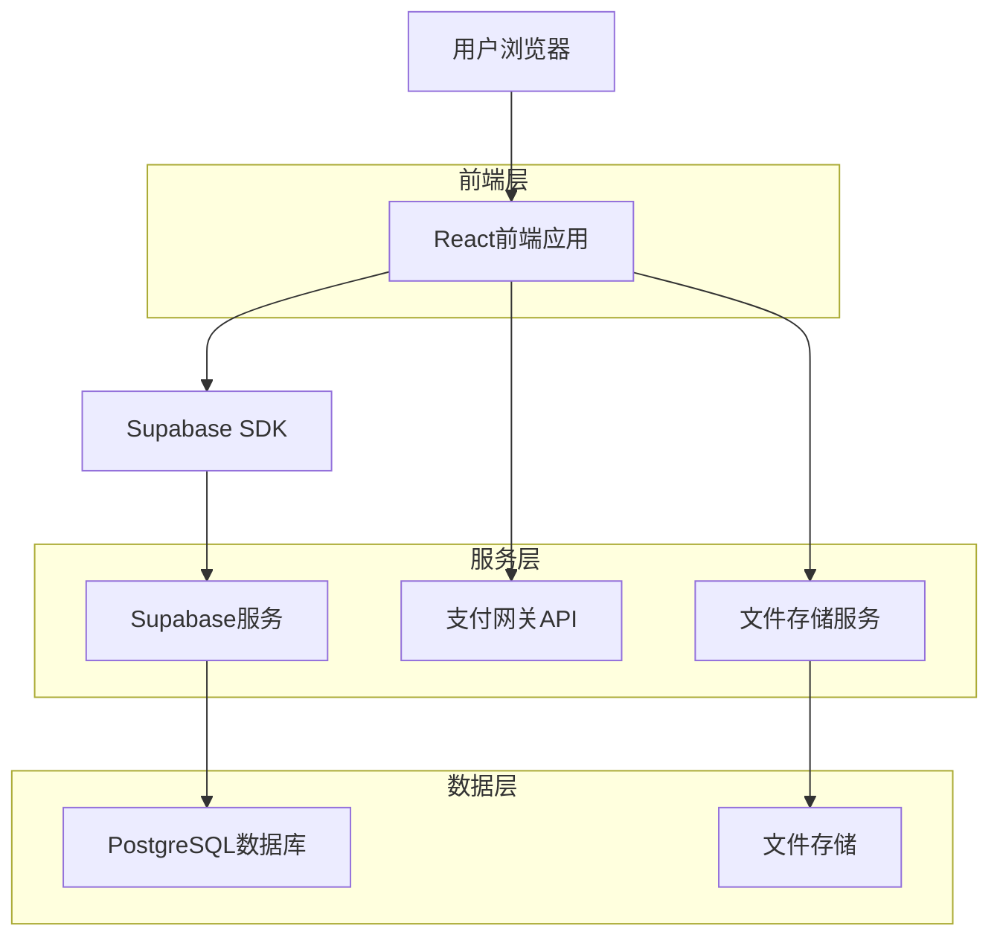
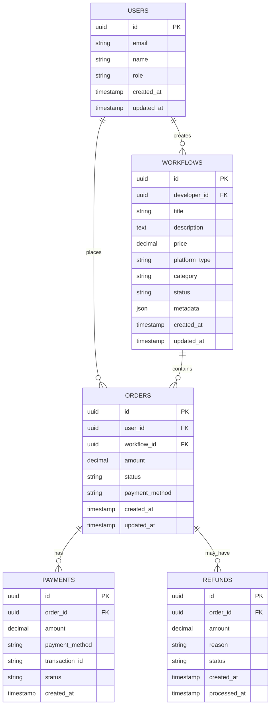

# 多平台工作流变现系统技术架构

## 1. 架构设计



## 2. 技术描述

* **前端**: React\@18 + TypeScript + Tailwind CSS\@3 + Vite

* **后端**: Supabase (PostgreSQL + 实时API + 认证)

* **支付**: 支付宝/微信支付/Stripe集成

* **文件存储**: Supabase Storage

* **状态管理**: Zustand

* **UI组件**: Ant Design / Shadcn UI

## 3. 路由定义

| 路由                | 用途               |
| ----------------- | ---------------- |
| /marketplace      | 工作流分类页，展示所有工作流商品 |
| /workflow/:id     | 工作流详情页，显示具体工作流信息 |
| /developer        | 开发者中心，管理工作流和收益   |
| /developer/upload | 工作流上传页面          |
| /developer/orders | 开发者订单管理          |
| /user/profile     | 用户中心，个人信息和购买记录   |
| /user/orders      | 用户订单列表           |
| /user/downloads   | 用户下载管理           |
| /admin            | 平台管理后台首页         |
| /admin/orders     | 订单管理页面           |
| /admin/refunds    | 退款管理页面           |
| /admin/analytics  | 数据分析页面           |
| /admin/developers | 开发者管理            |
| /admin/workflows  | 工作流审核管理          |

## 4. API定义

### 4.1 订单管理API

**创建订单**

```
POST /api/orders
```

请求参数:

| 参数名             | 参数类型   | 是否必需 | 描述    |
| --------------- | ------ | ---- | ----- |
| workflow\_id    | string | true | 工作流ID |
| user\_id        | string | true | 用户ID  |
| amount          | number | true | 订单金额  |
| payment\_method | string | true | 支付方式  |

响应:

| 参数名          | 参数类型   | 描述   |
| ------------ | ------ | ---- |
| order\_id    | string | 订单ID |
| status       | string | 订单状态 |
| payment\_url | string | 支付链接 |

**查询订单**

```
GET /api/orders/:id
```

**更新订单状态**

```
PUT /api/orders/:id/status
```

**订单列表**

```
GET /api/orders
```

支持查询参数:

* status: 订单状态筛选

* user\_id: 用户ID筛选

* start\_date: 开始时间

* end\_date: 结束时间

* page: 页码

* limit: 每页数量

### 4.2 支付API

**支付回调处理**

```
POST /api/payments/callback
```

**退款处理**

```
POST /api/refunds
```

### 4.3 文件下载API

**获取下载链接**

```
GET /api/downloads/:order_id
```

## 5. 数据模型

### 5.1 数据模型定义



### 5.2 数据定义语言

**用户表 (users)**

```sql
-- 创建用户表
CREATE TABLE users (
    id UUID PRIMARY KEY DEFAULT gen_random_uuid(),
    email VARCHAR(255) UNIQUE NOT NULL,
    name VARCHAR(100) NOT NULL,
    role VARCHAR(20) DEFAULT 'user' CHECK (role IN ('user', 'developer', 'admin')),
    avatar_url TEXT,
    created_at TIMESTAMP WITH TIME ZONE DEFAULT NOW(),
    updated_at TIMESTAMP WITH TIME ZONE DEFAULT NOW()
);

-- 创建索引
CREATE INDEX idx_users_email ON users(email);
CREATE INDEX idx_users_role ON users(role);

-- 权限设置
GRANT SELECT ON users TO anon;
GRANT ALL PRIVILEGES ON users TO authenticated;
```

**工作流表 (workflows)**

```sql
-- 创建工作流表
CREATE TABLE workflows (
    id UUID PRIMARY KEY DEFAULT gen_random_uuid(),
    developer_id UUID REFERENCES users(id) ON DELETE CASCADE,
    title VARCHAR(200) NOT NULL,
    description TEXT,
    price DECIMAL(10,2) NOT NULL DEFAULT 0,
    platform_type VARCHAR(50) NOT NULL,
    category VARCHAR(100),
    status VARCHAR(20) DEFAULT 'draft' CHECK (status IN ('draft', 'pending', 'approved', 'rejected', 'archived')),
    download_count INTEGER DEFAULT 0,
    rating DECIMAL(3,2) DEFAULT 0,
    metadata JSONB,
    file_url TEXT,
    thumbnail_url TEXT,
    created_at TIMESTAMP WITH TIME ZONE DEFAULT NOW(),
    updated_at TIMESTAMP WITH TIME ZONE DEFAULT NOW()
);

-- 创建索引
CREATE INDEX idx_workflows_developer_id ON workflows(developer_id);
CREATE INDEX idx_workflows_platform_type ON workflows(platform_type);
CREATE INDEX idx_workflows_category ON workflows(category);
CREATE INDEX idx_workflows_status ON workflows(status);
CREATE INDEX idx_workflows_created_at ON workflows(created_at DESC);

-- 权限设置
GRANT SELECT ON workflows TO anon;
GRANT ALL PRIVILEGES ON workflows TO authenticated;
```

**订单表 (orders)**

```sql
-- 创建订单表
CREATE TABLE orders (
    id UUID PRIMARY KEY DEFAULT gen_random_uuid(),
    order_number VARCHAR(50) UNIQUE NOT NULL,
    user_id UUID REFERENCES users(id) ON DELETE CASCADE,
    workflow_id UUID REFERENCES workflows(id) ON DELETE CASCADE,
    amount DECIMAL(10,2) NOT NULL,
    status VARCHAR(20) DEFAULT 'pending' CHECK (status IN ('pending', 'paid', 'delivered', 'completed', 'cancelled', 'refunded')),
    payment_method VARCHAR(50),
    payment_id VARCHAR(100),
    transaction_id VARCHAR(100),
    download_url TEXT,
    download_expires_at TIMESTAMP WITH TIME ZONE,
    created_at TIMESTAMP WITH TIME ZONE DEFAULT NOW(),
    updated_at TIMESTAMP WITH TIME ZONE DEFAULT NOW()
);

-- 创建索引
CREATE INDEX idx_orders_user_id ON orders(user_id);
CREATE INDEX idx_orders_workflow_id ON orders(workflow_id);
CREATE INDEX idx_orders_status ON orders(status);
CREATE INDEX idx_orders_created_at ON orders(created_at DESC);
CREATE INDEX idx_orders_order_number ON orders(order_number);

-- 权限设置
GRANT SELECT ON orders TO anon;
GRANT ALL PRIVILEGES ON orders TO authenticated;
```

**支付记录表 (payments)**

```sql
-- 创建支付记录表
CREATE TABLE payments (
    id UUID PRIMARY KEY DEFAULT gen_random_uuid(),
    order_id UUID REFERENCES orders(id) ON DELETE CASCADE,
    amount DECIMAL(10,2) NOT NULL,
    payment_method VARCHAR(50) NOT NULL,
    transaction_id VARCHAR(100) UNIQUE,
    status VARCHAR(20) DEFAULT 'pending' CHECK (status IN ('pending', 'success', 'failed', 'cancelled')),
    gateway_response JSONB,
    created_at TIMESTAMP WITH TIME ZONE DEFAULT NOW(),
    updated_at TIMESTAMP WITH TIME ZONE DEFAULT NOW()
);

-- 创建索引
CREATE INDEX idx_payments_order_id ON payments(order_id);
CREATE INDEX idx_payments_transaction_id ON payments(transaction_id);
CREATE INDEX idx_payments_status ON payments(status);
CREATE INDEX idx_payments_created_at ON payments(created_at DESC);

-- 权限设置
GRANT SELECT ON payments TO anon;
GRANT ALL PRIVILEGES ON payments TO authenticated;
```

**退款记录表 (refunds)**

```sql
-- 创建退款记录表
CREATE TABLE refunds (
    id UUID PRIMARY KEY DEFAULT gen_random_uuid(),
    order_id UUID REFERENCES orders(id) ON DELETE CASCADE,
    amount DECIMAL(10,2) NOT NULL,
    reason TEXT,
    status VARCHAR(20) DEFAULT 'pending' CHECK (status IN ('pending', 'approved', 'rejected', 'processed')),
    admin_notes TEXT,
    refund_transaction_id VARCHAR(100),
    created_at TIMESTAMP WITH TIME ZONE DEFAULT NOW(),
    processed_at TIMESTAMP WITH TIME ZONE,
    updated_at TIMESTAMP WITH TIME ZONE DEFAULT NOW()
);

-- 创建索引
CREATE INDEX idx_refunds_order_id ON refunds(order_id);
CREATE INDEX idx_refunds_status ON refunds(status);
CREATE INDEX idx_refunds_created_at ON refunds(created_at DESC);

-- 权限设置
GRANT SELECT ON refunds TO anon;
GRANT ALL PRIVILEGES ON refunds TO authenticated;
```

**订单状态变更日志表 (order\_status\_logs)**

```sql
-- 创建订单状态变更日志表
CREATE TABLE order_status_logs (
    id UUID PRIMARY KEY DEFAULT gen_random_uuid(),
    order_id UUID REFERENCES orders(id) ON DELETE CASCADE,
    from_status VARCHAR(20),
    to_status VARCHAR(20) NOT NULL,
    reason TEXT,
    operator_id UUID REFERENCES users(id),
    created_at TIMESTAMP WITH TIME ZONE DEFAULT NOW()
);

-- 创建索引
CREATE INDEX idx_order_status_logs_order_id ON order_status_logs(order_id);
CREATE INDEX idx_order_status_logs_created_at ON order_status_logs(created_at DESC);

-- 权限设置
GRANT SELECT ON order_status_logs TO anon;
GRANT ALL PRIVILEGES ON order_status_logs TO authenticated;
```

**初始化数据**

```sql
-- 插入管理员用户
INSERT INTO users (email, name, role) VALUES 
('admin@buildingai.com', '系统管理员', 'admin');

-- 插入工作流分类数据
INSERT INTO workflows (developer_id, title, description, price, platform_type, category, status) VALUES
((SELECT id FROM users WHERE role = 'admin' LIMIT 1), 'AI客服工作流', '智能客服自动回复工作流模板', 99.00, 'coze', 'customer_service', 'approved'),
((SELECT id FROM users WHERE role = 'admin' LIMIT 1), '数据分析工作流', '自动化数据分析和报表生成', 199.00, 'n8n', 'data_analysis', 'approved');
```

## 6. 安全性考虑

### 6.1 数据安全

* 所有敏感数据加密存储

* 支付信息通过HTTPS传输

* 用户密码使用bcrypt加密

* API接口使用JWT认证

### 6.2 访问控制

* 基于角色的权限控制(RBAC)

* API接口权限验证

* 文件下载权限验证

* 订单数据访问权限控制

### 6.3 支付安全

* 支付接口使用官方SDK

* 支付回调验证签名

* 订单金额二次验证

* 防重复支付机制

### 6.4 反作弊机制

* 订单异常检

