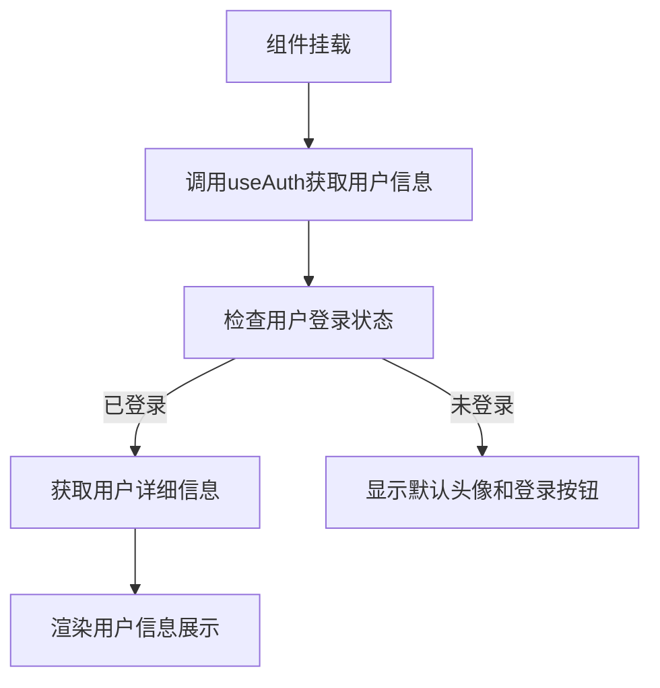

# 用户信息弹出页面技术架构

## 1. 架构概述

用户信息弹出页面采用Nuxt3 + Vue3 + Naive UI技术栈构建，是一个基于组件化的前端架构。整个组件通过UPopover实现弹出交互，内部集成用户信息展示、快捷操作、系统设置等功能模块，采用组合式API和TypeScript确保代码的类型安全和可维护性。

## 2. 前端架构

### 2.1 技术栈
- **框架**: Nuxt3@3.x + Vue3@3.x
- **UI库**: Naive UI@2.x
- **语言**: TypeScript@5.x
- **状态管理**: Pinia@2.x
- **工具库**: VueUse@10.x
- **图标**: 自定义图标系统

### 2.2 组件结构
```
UserProfile (主组件)
├── UPopover (弹出容器)
│   ├── 用户信息区域
│   │   ├── UAvatar (头像)
│   │   ├── 用户基本信息 (昵称、邮箱/电话)
│   │   └── 算力值显示
│   ├── 快捷操作菜单
│   │   ├── UButton (个人中心)
│   │   ├── UButton (账户设置)
│   │   └── UButton (我的订单)
│   ├── 系统功能
│   │   ├── ThemeToggle (主题切换)
│   │   └── UButton (退出登录)
│   └── 充值按钮
```

### 2.3 状态管理
- **用户状态**: 通过`useAuth`组合式函数管理
- **主题状态**: 通过`useTheme`组合式函数管理
- **国际化状态**: 通过`useI18n`组合式函数管理

## 3. 数据流设计

### 3.1 数据获取流程


### 3.2 数据处理流程
1. **用户信息获取**: 通过`useAuth().user`获取当前用户信息
2. **算力值获取**: 通过用户对象的`power`属性获取
3. **头像处理**: 使用`UAvatar`组件自动处理头像显示
4. **邮箱/电话显示**: 根据用户对象的`email`或`phone`字段决定显示内容

## 4. 接口设计

### 4.1 用户认证相关接口
```typescript
// 用户认证服务
interface AuthService {
  user: Ref<User | null>
  isAuthenticated: ComputedRef<boolean>
  logout: () => Promise<void>
}

// 用户数据模型
interface User {
  id: string
  name: string
  email?: string
  phone?: string
  avatar?: string
  power: number // 算力值
  createdAt: Date
}
```

### 4.2 路由接口
```typescript
// 路由定义
interface RoutePaths {
  profile: '/profile'
  settings: '/settings'
  orders: '/orders'
  recharge: '/recharge'
  login: '/login'
}
```

## 5. 组件设计

### 5.1 UserProfile主组件
```vue
<template>
  <UPopover v-if="isAuthenticated" :popper="{ placement: 'bottom-start' }">
    <!-- 触发器 -->
    <UButton variant="ghost" class="w-8 h-8 rounded-full">
      <UAvatar :src="user?.avatar" :alt="user?.name" size="sm" />
    </UButton>
    
    <!-- 弹出内容 -->
    <template #panel>
      <div class="p-4 min-w-[280px]">
        <!-- 用户信息区域 -->
        <div class="flex items-center space-x-3 mb-4">
          <UAvatar :src="user?.avatar" :alt="user?.name" size="md" />
          <div class="flex-1 min-w-0">
            <p class="text-sm font-medium text-gray-900 dark:text-white">
              {{ user?.name }}
            </p>
            <p class="text-xs text-gray-500 dark:text-gray-400 truncate">
              {{ user?.email || user?.phone }}
            </p>
          </div>
        </div>
        
        <!-- 算力值显示 -->
        <div class="mb-4 p-3 bg-gray-50 dark:bg-gray-800 rounded-lg">
          <div class="flex items-center justify-between">
            <span class="text-sm text-gray-600 dark:text-gray-300">
              {{ $t('user.power') }}
            </span>
            <span class="text-sm font-medium text-primary">
              {{ formatPower(user?.power) }}
            </span>
          </div>
        </div>
        
        <!-- 快捷操作 -->
        <div class="space-y-1 mb-4">
          <UButton variant="ghost" class="w-full justify-start" @click="navigateTo('/profile')">
            <UIcon name="i-heroicons-user" class="w-4 h-4 mr-2" />
            {{ $t('user.profile') }}
          </UButton>
          <!-- 其他按钮... -->
        </div>
        
        <!-- 充值按钮 -->
        <UButton color="primary" class="w-full mb-4" @click="navigateTo('/recharge')">
          {{ $t('user.recharge') }}
        </UButton>
        
        <!-- 主题切换和退出 -->
        <div class="flex items-center justify-between pt-4 border-t">
          <ThemeToggle />
          <UButton variant="ghost" @click="handleLogout">
            {{ $t('user.logout') }}
          </UButton>
        </div>
      </div>
    </template>
  </UPopover>
</template>
```

### 5.2 ThemeToggle组件
```vue
<template>
  <ClientOnly>
    <UButton
      :icon="isDark ? 'i-heroicons-moon-20-solid' : 'i-heroicons-sun-20-solid'"
      color="gray"
      variant="ghost"
      aria-label="Theme"
      @click="toggleTheme"
    />
  </ClientOnly>
</template>

<script setup>
const colorMode = useColorMode()
const isDark = computed(() => colorMode.value === 'dark')
const toggleTheme = () => {
  colorMode.preference = colorMode.value === 'dark' ? 'light' : 'dark'
}
</script>
```

## 6. 国际化实现

### 6.1 语言文件结构
```
locales/
├── en.json
└── zh.json
```

### 6.2 用户相关翻译
```json
// en.json
{
  "user": {
    "profile": "Profile",
    "settings": "Settings",
    "orders": "My Orders",
    "recharge": "Recharge",
    "logout": "Logout",
    "power": "Power"
  }
}

// zh.json
{
  "user": {
    "profile": "个人中心",
    "settings": "账户设置",
    "orders": "我的订单",
    "recharge": "充值",
    "logout": "退出登录",
    "power": "算力值"
  }
}
```

### 6.3 实现方式
使用Vue I18n通过`useI18n()`组合式函数实现多语言支持，所有文案都通过`$t()`函数获取翻译。

## 7. 权限控制

### 7.1 认证状态检查
```typescript
const { isAuthenticated, user } = useAuth()

// 组件级别权限控制
const canShowUserMenu = computed(() => isAuthenticated.value)
```

### 7.2 路由权限控制
通过Nuxt3的中间件机制实现路由级别的权限验证：
```typescript
// middleware/auth.ts
export default defineNuxtRouteMiddleware((to, from) => {
  const { isAuthenticated } = useAuth()
  if (!isAuthenticated.value) {
    return navigateTo('/login')
  }
})
```

### 7.3 退出登录处理
```typescript
const handleLogout = async () => {
  try {
    await useAuth().logout()
    await navigateTo('/login')
  } catch (error) {
    console.error('Logout failed:', error)
  }
}
```

## 8. 性能优化

### 8.1 组件懒加载
- 使用动态导入实现组件懒加载
- 通过`ClientOnly`组件确保主题切换只在客户端渲染

### 8.2 数据缓存
- 用户数据通过Pinia状态管理实现全局缓存
- 避免重复获取用户信息

### 8.3 渲染优化
- 使用`v-show`替代`v-if`减少DOM操作
- 合理使用计算属性缓存复杂计算结果

### 8.4 资源优化
- 图标使用SVG格式，支持按需加载
- 组件样式使用Tailwind CSS，支持tree-shaking

## 9. 错误处理

### 9.1 用户数据获取错误
```typescript
const loadUserData = async () => {
  try {
    await useAuth().refreshUser()
  } catch (error) {
    console.error('Failed to load user data:', error)
    // 显示错误提示
    useToast().error(t('user.loadError'))
  }
}
```

### 9.2 退出登录错误
```typescript
const handleLogout = async () => {
  try {
    await useAuth().logout()
  } catch (error) {
    console.error('Logout failed:', error)
    useToast().error(t('user.logoutError'))
  }
}
```

### 9.3 路由跳转错误
```typescript
const navigateToPage = async (path: string) => {
  try {
    await navigateTo(path)
  } catch (error) {
    console.error('Navigation failed:', error)
    useToast().error(t('common.navigationError'))
  }
}
```

## 10. 部署方案

### 10.1 构建配置
```typescript
// nuxt.config.ts
export default defineNuxtConfig({
  ssr: true,
  components: [
    {
      path: '~/components',
      pathPrefix: false
    }
  ],
  modules: [
    '@nuxtjs/i18n',
    '@pinia/nuxt',
    '@nuxtjs/tailwindcss'
  ],
  i18n: {
    locales: ['en', 'zh'],
    defaultLocale: 'zh',
    vueI18n: './i18n.config.ts'
  }
})
```

### 10.2 部署流程
1. **代码构建**: `npm run build`
2. **静态资源**: 自动生成到`.output`目录
3. **服务端渲染**: 支持SSR部署
4. **CDN部署**: 静态资源可部署到CDN

### 10.3 监控方案
- 集成Sentry进行错误监控
- 使用Google Analytics进行用户行为分析
- 通过LogRocket记录用户会话

### 10.4 更新策略
- 支持热更新，无需重启服务
- 组件级别更新，不影响整体应用
- 支持灰度发布和A/B测试